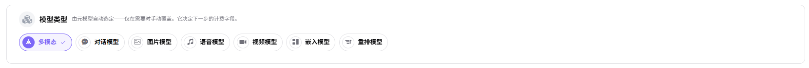
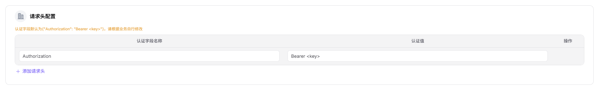
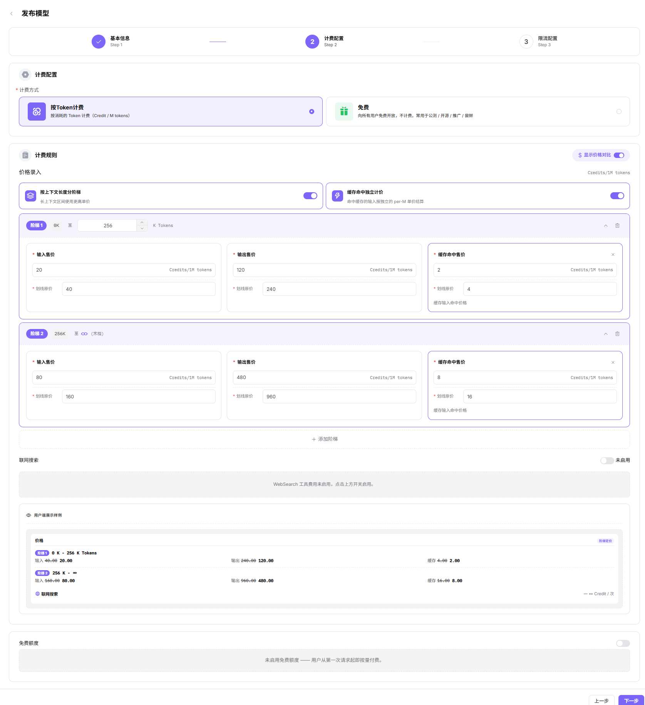

# 发布模型（多模态模型）

## 场景目标

模型能处理所有声明的输入模态，通过协议测试，并以准确能力标签发布。

## 适用角色

- 模型提供方

## 开始前准备

- 准备模型来源、标识、API 凭证、接口和无敏感信息的文本加媒体样例。
- 确认输入组合、大小限制、协议、计费和限流。

## 操作步骤

1. 进入平台首页，点击左侧导航栏的 **"我的模型"** 菜单，进入模型管理页面。
2. 默认进入 **"我的发布"** Tab，可通过页面顶部 **"公共模型 / 私有模型"** 切换查看不同区域的模型；也可切换至 **"概览"** 或 **"我的聚合"** Tab。
3. 点击页面右上角的 **"发布模型"** 按钮，弹出"选择发布区域"对话框。
4. 选择发布区域：
   - **"发布到私有区"**：仅本团队或租户内可见可调用，加入私有库，不进入公开目录，适合内部业务与安全敏感场景；
   - **"发布到公有区"**：上架公有目录，对所有租户的 EU 开放调用，可独立设置定价与限流。
5. 点击  **"发布到公有区"** 进入发布配置流程（Step 1：基本信息）。

### **Step 1：基本信息**
- **模型源/元模型信息**：
    - 选择 **"元模型"**（如 Qwen3.6-plus）；
    - 选择 **"模型源"**（如 阿里巴巴-中国）；
    - 填写 **"请求URL"**（如 `https://dashscope.aliyuncs.com`，区域默认"中国"）；
    - 填写 **"API密钥"**（如 `sk-***`）；
    - 填写 **"模型源ID"**（如 `qwen3.6-plus`，即发往上游厂商的精确模型名称）。

- **模型类型**：在"模型类型"区块默认 **"对话模型"**。

- **请求头配置**：认证字段默认为 `Authorization: Bearer <key>`，可点击 **"添加请求头"** 增加自定义字段。

- **模型参数配置**：
    - 默认 **"输入模态"**（文本 / 图片 / 视频）；
    - 默认 **"输出模态"**（文本）；
    - 开启 **"高级能力"**：函数/工具支持、思考模式。
    - **Token 限制**：设置 **"最大上下文"**（如 1024K）、**"最大输入"**（如 991K）、**"最大输出"**（如 64K）。

- **支持协议与默认参数**：至少选择一个协议（OpenAI-ChatCompletions / OpenAI-Responses / Anthropic-Messages），只有先进行协议连通性测试，连通性测试成功后可执行后续操作；测试通过后填写 **"接口地址"**（如 `https://dashscope.aliyuncs.com/compatible-mode/v1/chat/completions`）并配置 **"输入参数"**（Temperature、Top-P、N、Stream、Max Tokens、Presence Penalty、Frequency Penalty、User、Seed、Parallel Tool Calls 等）。

- **基本信息**：
   - 填写 **"个性化标识"**（如 Qwen3.6-plus）、**"描述"**。

   - **发布方式**：选择 **"立即发布"** 或 **"定时发布"**。

- 点击 **"下一步"** 进入 Step 2：计费配置。

### **Step 2：计费配置**：
- **计费配置**：
    - 选择 **"计费方式"**：
        -  **"按Token计费"**（按消耗的 Token 计费，Credit / M tokens）
        -  **"免费"**（向所有用户免费开放，不计费，常用于公测/开源/推广/尝鲜）；
- **计费规则**：
    - 开启 **"显示价格对比"** 开关后可展示划线原价；
    - 在 **"计费规则 — 价格录入"** 区块设置：
        - 可启用 **"按上下文长度分阶梯"**（长上下文区间使用更高单价）；
        - 开启 **"缓存命中独立计价"**（命中缓存的输入按独立的 per-M 单价结算）；
        - **设置阶梯价格**：为每个阶梯（如阶梯1: 0K – 256K Tokens、阶梯2: 256K – ∞）分别设置 **"输入售价 / 输出售价 / 缓存命中售价"** 与 **"输入划线原价 / 输出划线原价 / 缓存命中划线原价"**（单位均为 Credits/1M tokens），可点击 **"添加阶梯"** 增加更多区间；
    - **联网搜索**：可开启 WebSearch 工具费用；
    - **免费额度**：开启后可设置可领取额度、人数、总量；

- 点击 **"下一步"** 进入 Step 3：限流配置。

### **Step 3：限流配置**：
- 选择 **"是否启用限流"**：**"启用限流"** 或 **"不启用"**；
- 设置 **"默认限流"**：
    - **"RPM（每分钟请求数）"**：输入数值（如 2 次/分钟），可勾选 **"不限制"**；
    - **"TPM（每分钟Token数）"**：输入数值（如 100 Token/分钟），可勾选 **"不限制"**。

- 点击 **"仅保存"** 或 **"提交审核"** 完成发布。

#### 参数说明 - 发布流程配置项

| 字段名称           | 字段类型     | 示例                                                                                                                         | 说明                                             |
| -------------- | -------- | -------------------------------------------------------------------------------------------------------------------------- | ---------------------------------------------- |
| 元模型            | 下拉选择     | `Qwen3.6-plus`（含 text 1024K 标签）                                                                                            | 必填，选择基础元模型                                     |
| 模型源            | 下拉选择     | `阿里巴巴-中国`                                                                                                                  | 必填，模型的来源渠道                                     |
| 请求URL          | URL      | `https://dashscope.aliyuncs.com`                                                                                           | 必填，模型服务的 API 地址（可切换区域）                         |
| API密钥          | 文本       | `sk-***`                                                                                                                   | 必填，调用模型的密钥                                     |
| 模型源ID          | 文本       | `qwen3.6-plus`                                                                                                             | 必填，发往上游厂商的精确模型名称                               |
| 模型类型           | 单选       | `对话模型`                                                                                                                     | 必填，模型的功能类型                                     |
| 请求头            | 键值对      | `Authorization: Bearer <key>`                                                                                              | 选填，认证与自定义请求头                                   |
| 输入模态           | 多选       | `文本 / 图片 / 视频`                                                                                                             | 必填，模型支持的输入数据类型                                 |
| 输出模态           | 多选       | `文本`                                                                                                                       | 必填，模型支持的输出数据类型                                 |
| 高级能力           | 开关       | `函数/工具支持 / 思考模式`                                                                                                           | 选填，模型的扩展能力                                     |
| 最大上下文          | 数值       | `1024K`                                                                                                                    | 必填，Token 上下文上限                                 |
| 最大输入           | 数值       | `991K`                                                                                                                     | 必填，单次输入 Token 上限                               |
| 最大输出           | 数值       | `64K`                                                                                                                      | 必填，单次输出 Token 上限                               |
| 支持协议           | 多选       | `OpenAI-ChatCompletions / OpenAI-Responses / Anthropic-Messages`                                                           | 必填，模型兼容的 API 协议，需先进行连通性测试                      |
| 接口地址       | URL      | `https://dashscope.aliyuncs.com/compatible-mode/v1/chat/completions`                                                       | 必填，协议对应的端点地址                                   |
| 输入参数           | 参数列表     | `Temperature / Top-P / N / Stream / Max Tokens / Presence Penalty / Frequency Penalty / User / Seed / Parallel Tool Calls` | 选填，按协议预设的输入参数                                  |
| 个性化标识          | 文本       | `Qwen3.6-plus`                                                                                                             | 必填，模型对外展示的自定义标识                                |
| 描述             | 文本       | `Qwen3.6原生视觉...`                                                                                                           | 选填，模型的说明描述                                     |
| 发布方式           | 单选       | `立即发布 / 定时发布`                                                                                                              | 必填，模型的上线时机                                     |
| 计费方式           | 单选       | `按Token计费 / 免费`                                                                                                            | 必填，模型的收费方式                                     |
| 按上下文长度分阶梯      | 开关       | `开启 / 关闭`                                                                                                                  | 选填，长上下文区间使用更高单价                                |
| 缓存命中独立计价       | 开关       | `开启 / 关闭`                                                                                                                  | 选填，命中缓存的输入按独立的 per-M 单价结算                      |
| 阶梯价格           | 分组       | `阶梯1 0K–256K：输入20/输出120/缓存2  阶梯2 256K–∞：输入80/输出480/缓存8`                                                                    | 必填，按上下文长度分档的输入/输出/缓存售价与划线原价（Credits/1M tokens） |
| 联网搜索           | 开关       | `开启 / 未启用`                                                                                                                 | 选填，启用 WebSearch 工具费用                           |
| 免费额度           | 开关       | `开启 / 未启用`                                                                                                                 | 选填，配置模型的免费调用额度                                 |
| 是否启用限流         | 单选       | `启用限流 / 不启用`                                                                                                               | 选填，配置模型的调用频率限制                                 |
| RPM（每分钟请求数）    | 数值 / 不限制 | `2 次/分钟`                                                                                                                   | 选填，每分钟请求数上限，可勾选"不限制"                           |
| TPM（每分钟Token数） | 数值 / 不限制 | `100 Token/分钟`                                                                                                             | 选填，每分钟 Token 数上限，可勾选"不限制"                      |

## 完成检查

> **用途：** 以下检查是当前功能任务的退出条件，用于判断操作结果是否可观察、可复核，以及是否可以继续当前场景的下一步。它不是操作步骤的重复；任一项不满足时，请按下方“常见失败分支”继续排查。

| 检查项 | 通过标准 |
| --- | --- |
| 1 | 声明的每种输入模态都通过受控测试。 |
| 2 | 发布或审核状态符合预期，能力标签与实际测试一致。 |
| 3 | 调用结果和调用日志均可定位。 |

## 常见失败分支

| 现象 | 优先检查 |
| --- | --- |
| 文本正常但媒体失败 | 媒体地址可达性、MIME 类型、大小限制和请求结构 |
| 能力标签与实际不符 | 声明模态、已测组合、模型版本和市场描述 |

## 操作手册

[查看“我的模型”完整字段和发布结果校验](/zh-CN/usermanual/model-services/user/studio/my-models/)
