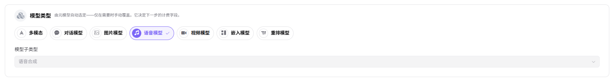
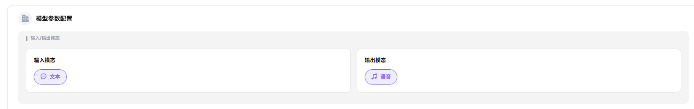
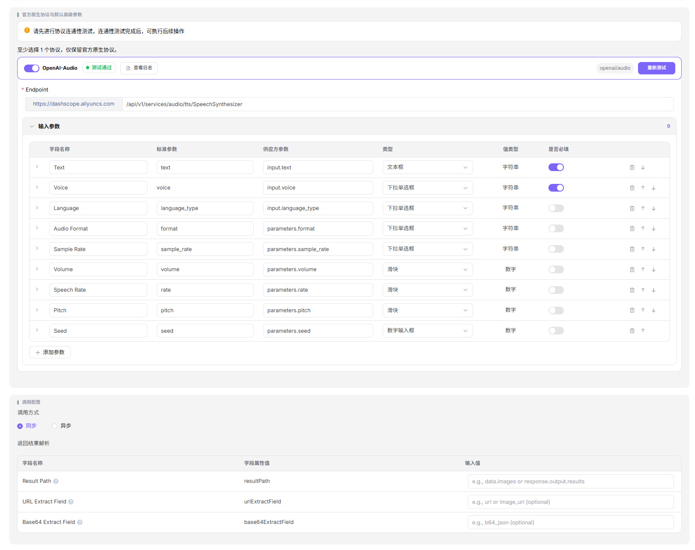
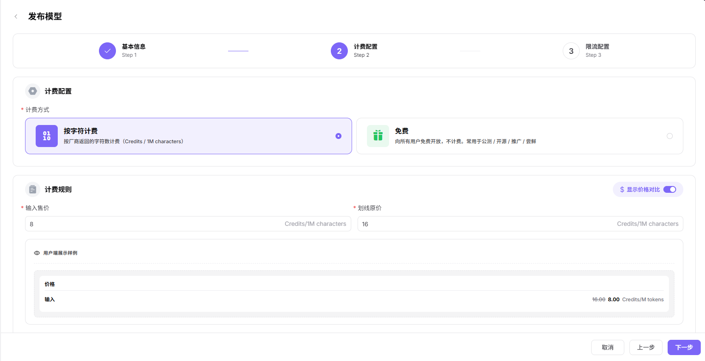

# 发布模型（语音模型）

## 场景目标

语音模型通过协议测试，在目标范围发布，并返回可播放或可解码的音频结果。

## 适用角色

- 模型提供方

## 开始前准备

- 准备模型来源、标识、API 凭证、接口和无敏感信息的音频或文本样例。
- 确认语言、音色、格式、采样率、同步或异步方式、计费和限流。

## 操作步骤

1. 进入平台首页，点击左侧导航栏的 **"我的模型"** 菜单，进入模型管理页面。
2. 默认进入 **"我的发布"** Tab，可通过页面顶部 **"公共模型 / 私有模型"** 切换查看不同区域的模型；也可切换至 **"概览"** 或 **"我的聚合"** Tab。
3. 点击页面右上角的 **"发布模型"** 按钮，弹出"选择发布区域"对话框。
4. 选择发布区域：
   - **"发布到私有区"**：仅本团队或租户内可见可调用，加入私有库，不进入公开目录，适合内部业务与安全敏感场景；
   - **"发布到公有区"**：上架公有目录，对所有租户的 EU 开放调用，可独立设置定价与限流。
5. 点击  **"发布到公有区"** 进入发布配置流程（Step 1：基本信息）。

### **Step 1：基本信息**：
- **模型源/元模型信息**：
    - 选择 **"元模型"**（如 qwen3-tts-flash）；
    - 选择 **"模型源"**（如 阿里巴巴-中国）；
    - 填写 **"请求URL"**（如 `https://dashscope.aliyuncs.com`，区域默认"中国"）；
    - 填写 **"API密钥"**（如 `sk-***`）；
    - 填写 **"模型源ID"**（如 `qwen3-tts-flash`，即发往上游厂商的精确模型名称）。

- **模型类型**：在"模型类型"区块默认 **"语音模型"**，默认选择 **"模型子类型"**（如 语音合成）。

- **请求头配置**：认证字段默认为 `Authorization: Bearer <key>`，可点击 **"添加请求头"** 增加自定义字段。

- **模型参数配置**：
    - 默认 **"输入模态"**（文本）；
    - 默认 **"输出模态"**（语音）；

- **支持协议与默认参数**：至少选择一个协议（语音模型仅 OpenAI-Audio 可选），只有先进行协议连通性测试，连通性测试成功后可执行后续操作；测试通过后填写 **"接口地址"**（如 `https://dashscope.aliyuncs.com/api/v1/services/audio/tts/SpeechSynthesizer`）并配置 **"输入参数"**（Text、Voice、Language、Audio Format、Sample Rate、Volume、Speech Rate、Pitch、Seed 等，可设置"是否必填"）。
- **调用配置**：
    - 选择 **"调用方式"**：**"同步"** 或 **"异步"**；
    - 配置 **"返回结果解析"**：
      - **Result Path**：字段属性 resultPath，输入值如 `data.audio` 或 `response.output.results`；
      - **URL Extract Field**：字段属性 urlExtractField，输入值如 `url` 或 `audio_url`；
      - **Base64 Extract Field**：字段属性 base64ExtractField，输入值如 `b64_audio`。

- **基本信息**：
   - 填写 **"个性化标识"**（如 qwen3-tts-flash）、**"描述"**。

   - **发布方式**：选择 **"立即发布"** 或 **"定时发布"**。

- 点击 **"下一步"** 进入 Step 2：计费配置。

### **Step 2：计费配置**：
- **计费配置**：
    - 选择 **"计费方式"**：
        -  **"按字符计费"**（按厂商返回的字符数计费，Credits / 1M characters）
        -  **"免费"**（向所有用户免费开放）；
- **计费规则**：
    - 开启 **"显示价格对比"** 开关后可展示划线原价；
    - 在 **"计费规则 — 价格录入"** 区块设置：
        - **"输入售价"**（如 8 Credits/1M characters）与 **"划线原价"**（如 16 Credits/1M characters）；
    - **免费额度**：开启后可设置可领取额度、人数、总量；

- 点击 **"下一步"** 进入 Step 3：限流配置。

### **Step 3：限流配置**：
- 选择 **"是否启用限流"**：**"启用限流"** 或 **"不启用"**；
- 设置 **"默认限流"**：
    - **"RPM（每分钟请求数）"**：输入数值（如 2 次/分钟），可勾选 **"不限制"**；
    - **"TPM（每分钟Token数）"**：输入数值（如 100 Token/分钟），可勾选 **"不限制"**。

- 点击 **"仅保存"** 或 **"提交审核"** 完成发布。

#### 参数说明 - 发布流程配置项（语音模型）

| 字段名称                 | 字段类型     | 示例                                                                                           | 说明                          |
| -------------------- | -------- | -------------------------------------------------------------------------------------------- | --------------------------- |
| 元模型                  | 下拉选择     | `qwen3-tts-flash`（含 audio 规格标签）                                                              | 必填，选择基础元模型                  |
| 模型源                  | 下拉选择     | `阿里巴巴-中国`                                                                                    | 必填，模型的来源渠道                  |
| 请求URL                | URL      | `https://dashscope.aliyuncs.com`                                                             | 必填，模型服务的 API 地址（可切换区域）      |
| API密钥                | 文本       | `sk-***`                                                                                     | 必填，调用模型的密钥                  |
| 模型源ID                | 文本       | `qwen3-tts-flash`                                                                            | 必填，发往上游厂商的精确模型名称            |
| 模型类型                 | 单选       | `语音模型`                                                                                       | 必填，模型的功能类型                  |
| 模型子类型                | 下拉选择     | `语音合成`                                                                                       | 必填，语音模型的具体子类型               |
| 请求头                  | 键值对      | `Authorization: Bearer <key>`                                                                | 选填，认证与自定义请求头                |
| 输入模态                 | 多选       | `文本`                                                                                         | 必填，模型支持的输入数据类型              |
| 输出模态                 | 多选       | `语音`                                                                                         | 必填，模型支持的输出数据类型              |
| 支持协议                 | 多选       | `OpenAI-Audio`                                                                               | 必填，语音模型兼容的 API 协议，需先进行连通性测试 |
| 接口地址             | URL      | `https://dashscope.aliyuncs.com/api/v1/services/audio/tts/SpeechSynthesizer`                 | 必填，协议对应的端点地址                |
| 输入参数                 | 参数列表     | `Text / Voice / Language / Audio Format / Sample Rate / Volume / Speech Rate / Pitch / Seed` | 选填，按协议预设的输入参数（可设置是否必填）      |
| 调用方式                 | 单选       | `同步 / 异步`                                                                                    | 必填，模型的调用方式                  |
| Result Path          | 文本       | `data.audio` 或 `response.output.results`                                                      | 选填，异步调用时返回结果的解析路径           |
| URL Extract Field    | 文本       | `url` 或 `audio_url`                                                                          | 选填，从结果中提取 URL 的字段名          |
| Base64 Extract Field | 文本       | `b64_audio`                                                                                   | 选填，从结果中提取 Base64 音频数据的字段名   |
| 个性化标识                | 文本       | `qwen3-tts-flash`                                                                            | 必填，模型对外展示的自定义标识             |
| 描述                   | 文本       | `语音合成...`                                                                                    | 选填，模型的说明描述                  |
| 发布方式                 | 单选       | `立即发布 / 定时发布`                                                                                | 必填，模型的上线时机                  |
| 计费方式                 | 单选       | `按字符计费 / 免费`                                                                                 | 必填，模型的收费方式                  |
| 显示价格对比               | 开关       | `开启 / 关闭`                                                                                    | 选填，是否展示划线原价                 |
| 输入售价                 | 数值       | `8 Credits/1M characters`                                                                    | 必填，字符的实际售价                  |
| 划线原价                 | 数值       | `16 Credits/1M characters`                                                                   | 选填，字符的参考价                   |
| 免费额度                 | 开关       | `开启 / 未启用`                                                                                   | 选填，配置模型的免费调用额度              |
| 是否启用限流               | 单选       | `启用限流 / 不启用`                                                                                 | 选填，配置模型的调用频率限制              |
| RPM（每分钟请求数）          | 数值 / 不限制 | `2 次/分钟`                                                                                     | 选填，每分钟请求数上限，可勾选"不限制"        |
| TPM（每分钟Token数）       | 数值 / 不限制 | `100 Token/分钟`                                                                               | 选填，每分钟 Token 数上限，可勾选"不限制"   |

## 完成检查

> **用途：** 以下检查是当前功能任务的退出条件，用于判断操作结果是否可观察、可复核，以及是否可以继续当前场景的下一步。它不是操作步骤的重复；任一项不满足时，请按下方“常见失败分支”继续排查。

| 检查项 | 通过标准 |
| --- | --- |
| 1 | 协议连通性测试通过，语言、音色和格式配置准确。 |
| 2 | 发布或审核状态符合预期。 |
| 3 | 受控调用返回可播放音频，调用日志可定位。 |

## 常见失败分支

| 现象 | 优先检查 |
| --- | --- |
| 协议测试失败 | 接口地址、凭证、模型标识、音频编码和请求体 |
| 音频无法播放 | 返回映射、Content-Type、采样率、格式和结果地址 |

## 操作手册

[查看“我的模型”完整字段和发布结果校验](/zh-CN/usermanual/model-services/user/studio/my-models/)
