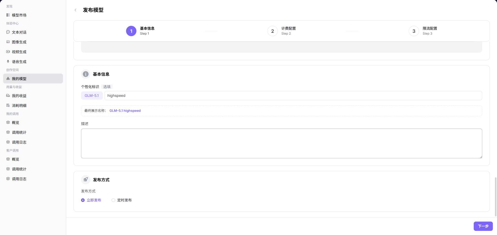

# 发布文本 / 对话模型

本页说明文本或对话模型发布时需要重点验证的配置。完整通用流程见 [发布公有模型](../provider-quick-guide)。

## 场景目标

文本或对话模型通过协议测试，在目标范围发布，并能对受控提示词返回有效响应。

## 适用角色

- 模型提供方（Provider）

## 开始前准备

- 运营方已准备元模型、模型来源、模板、标签和币种。
- 已确认上游模型 ID、协议地址、认证方式和默认参数。
- 已明确上下文、输入输出 Token 限制、计费和限流策略。

## 操作要点

1. 进入**我的模型 > 我的发布**，选择公有区或私有区，并填写文本或对话模型的基本标识。

2. 选择文本或对话元模型和模型来源，配置上游模型 ID、请求 URL 和认证请求头。

3. 选择 Chat Completions、Responses 或其他兼容协议并通过连通性测试。
4. 配置上下文、输入输出 Token 限制、高级能力和默认参数。
5. 配置 Token 计费、阶梯价格、缓存价格和免费额度。
6. 配置 RPM 和 TPM 限流，再保存或提交审核。

详细字段和按钮请查看[我的模型](../../../../usermanual/model-services/user/studio/my-models/)和[从发布到调用模型](../../../../usermanual/model-services/end-to-end/publish-and-call-model/)。

## 完成检查

> **用途：** 以下检查是当前功能任务的退出条件，用于判断操作结果是否可观察、可复核，以及是否可以继续当前场景的下一步。它不是操作步骤的重复；任一项不满足时，请按下方“常见失败分支”继续排查。

| 检查项 | 通过标准 |
| --- | --- |
| 1 | 协议测试通过，流式与非流式响应符合预期。 |
| 2 | 上下文和 Token 限制与上游模型能力一致。 |
| 3 | 计费和限流配置符合发布计划。 |
| 4 | 提交审核后能查看状态，发布后能在目标范围调用。 |

## 常见失败分支

| 现象 | 优先检查 |
| --- | --- |
| 协议测试失败 | 接口地址、凭证、模型标识、请求头和请求体 |
| 发布后调用失败 | 发布状态、API Key、协议、限流、配额和调用日志 |
