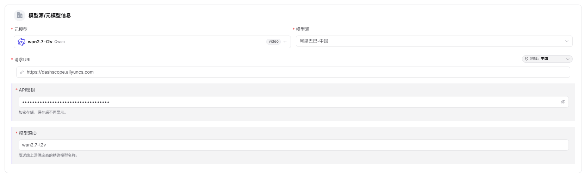
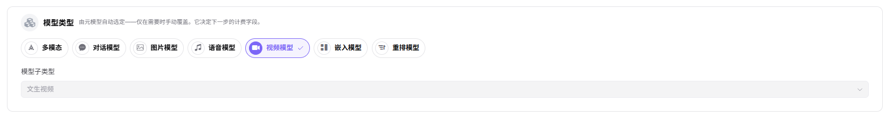
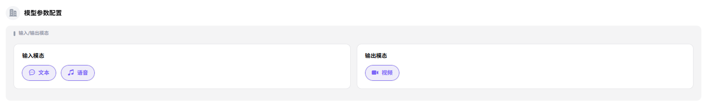
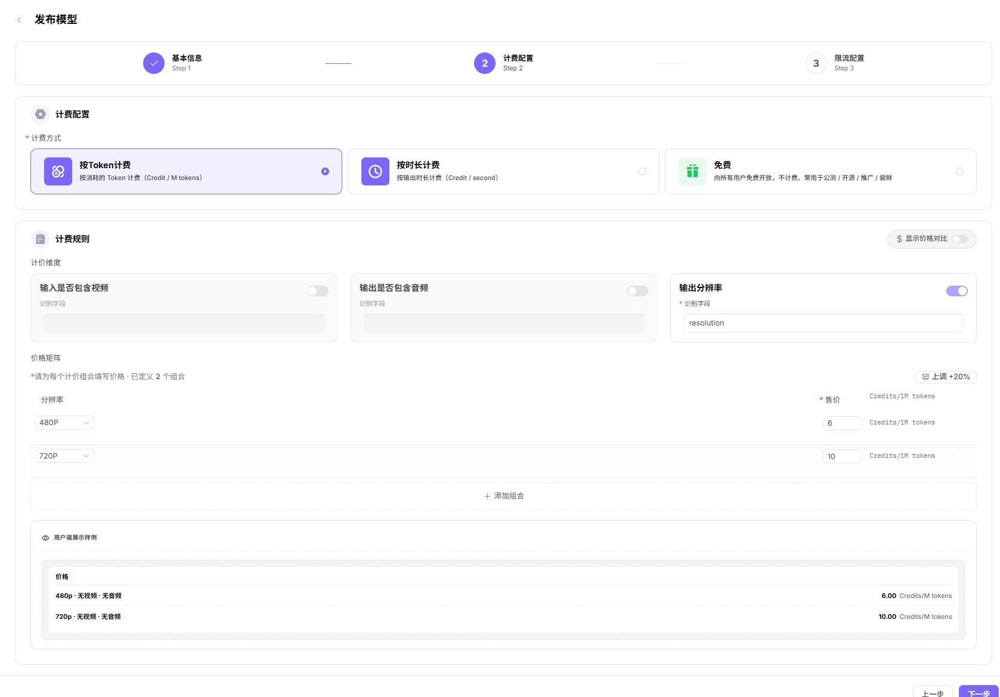
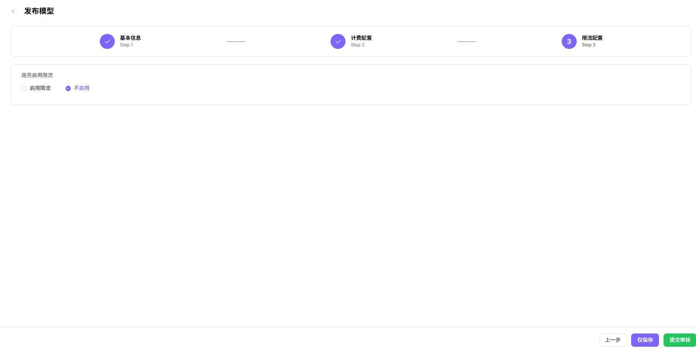

# 发布模型（视频模型）

## 场景目标

视频模型能创建异步任务、正确返回进度，并在发布后得到可播放结果。

## 适用角色

- 模型提供方

## 开始前准备

- 准备模型来源、标识、API 凭证、任务接口、状态接口或回调地址和测试提示词。
- 确认时长、分辨率、轮询方式、结果有效期、计费、超时和限流。

## 操作步骤

1. 进入平台首页，点击左侧导航栏的 **"我的模型"** 菜单，进入模型管理页面。
2. 默认进入 **"我的发布"** Tab，可通过页面顶部 **"公共模型 / 私有模型"** 切换查看不同区域的模型；也可切换至 **"概览"** 或 **"我的聚合"** Tab。
3. 点击页面右上角的 **"发布模型"** 按钮，弹出"选择发布区域"对话框。
4. 选择发布区域：
   - **"发布到私有区"**：仅本团队或租户内可见可调用，加入私有库，不进入公开目录，适合内部业务与安全敏感场景；
   - **"发布到公有区"**：上架公有目录，对所有租户的 EU 开放调用，可独立设置定价与限流。
5. 点击  **"发布到公有区"** 进入发布配置流程（Step 1：基本信息）。

### **Step 1：基本信息**：
- **模型源/元模型信息**：
    - 选择 **"元模型"**（如 wan2.7-t2v）；
    - 选择 **"模型源"**（如 阿里巴巴-中国）；
    - 填写 **"请求URL"**（如 `https://dashscope.aliyuncs.com`，区域默认"中国"）；
    - 填写 **"API密钥"**（如 `sk-***`）；
    - 填写 **"模型源ID"**（如 `wan2.7-t2v`，即发往上游厂商的精确模型名称）。

- **模型类型**：在"模型类型"区块默认 **"视频模型"**，默认并选择 **"模型子类型"**（如 文生视频）。

- **请求头配置**：认证字段默认为 `Authorization: Bearer <key>`，可点击 **"添加请求头"** 增加自定义字段。

- **模型参数配置**：
    - 默认 **"输入模态"**（文本 / 语音）；
    - 默认 **"输出模态"**（视频）；

- **支持协议与默认参数**：至少选择一个协议（视频模型仅 OpenAI-Video 可选），只有先进行协议连通性测试，连通性测试成功后可执行后续操作；测试通过后填写 **"接口地址"**（如 `https://dashscope.aliyuncs.com/api/v1/services/aigc/video-generation/video-synthesis`）并配置 **"输入参数"**（Prompt、Negative Prompt、Audio URL、Resolution、Ratio、Prompt Extend、Watermark、Duration、Seed 等，可设置"是否必填"）。
- **调用配置**：
    - 选择 **"调用方式"**：**"异步"**（视频模型通常为异步）；
    - 填写 **"回调地址"**（如 `https://dashscope.aliyuncs.com/api/v1/tasks/{task_id}`，选择厂商模板一键填充参数映射，请选择「自定义」手动填写）；
      - 厂商模板：**"火山引擎"** / **"阿里巴巴-国际"** / **"自定义"**；
    - 配置 **"返回结果解析"**（6 项）：
      - **状态字段路径**：statusPath，默认 `status`；
      - **结果字段路径**：resultPath，默认 `content`；
      - **任务 ID 路径**：taskIdPath，默认 `id`；
      - **成功值**：successValue，默认 `succeeded`；
      - **失败值**：failValue，默认 `failed`；
      - **URL 提取字段**：urlExtractField，默认 `video_url`。

- **基本信息**：
   - 填写 **"个性化标识"**（如 wan2.7-t2v）、**"描述"**。

- **发布方式**：选择 **"立即发布"** 或 **"定时发布"**。

- 点击 **"下一步"** 进入 Step 2：计费配置。

### **Step 2：计费配置**：
- **计费配置**：
    - 选择 **"计费方式"**：**"按Token计费"**（按消耗的 Token 计费，Credit / M tokens）、**"按时长计费"**（按输出时长计费，Credit / second）
    - **"免费"**（向所有用户免费开放）；
- **计费规则**：
    - 开启 **"显示价格对比"** 开关后可展示划线原价；
    - 在 **"计费规则 — 价格录入"** 区块：
        - 可启用 **"输入是否包含视频"**（识别字段）；
        - 可启用 **"输出是否包含音频"**（识别字段）；
        - 可启用 **"输出分辨率"**（识别字段 `resolution`）；
        - **价格矩阵**：必须为每个计价组合填写价格，可点击 **"添加组合"** 新增，按分辨率（480P / 720P 等）分别设置 **"售价"**（Credits/second），右侧有 **"上调 +20%"** 按钮用于快速调整价格；
    - **免费额度**：开启后可设置可领取额度、人数、总量；

- 点击 **"下一步"** 进入 Step 3：限流配置。

### **Step 3：限流配置**：
- 选择 **"是否启用限流"**：**"启用限流"** 或 **"不启用"**；
- 设置 **"默认限流"**：
    - **"RPM（每分钟请求数）"**：输入数值（如 2 次/分钟），可勾选 **"不限制"**；
    - **"TPM（每分钟Token数）"**：输入数值（如 100 Token/分钟），可勾选 **"不限制"**。

- 点击 **"仅保存"** 或 **"提交审核"** 完成发布。

#### 参数说明 - 发布流程配置项（视频模型）

| 字段名称           | 字段类型     | 示例                                                                                                        | 说明                                  |
| -------------- | -------- | --------------------------------------------------------------------------------------------------------- | ----------------------------------- |
| 元模型            | 下拉选择     | `wan2.7-t2v`（含 video 规格标签）                                                                                | 必填，选择基础元模型                          |
| 模型源            | 下拉选择     | `阿里巴巴-中国`                                                                                                 | 必填，模型的来源渠道                          |
| 请求URL          | URL      | `https://dashscope.aliyuncs.com`                                                                          | 必填，模型服务的 API 地址（可切换区域）              |
| API密钥          | 文本       | `sk-***`                                                                                                  | 必填，调用模型的密钥                          |
| 模型源ID          | 文本       | `wan2.7-t2v`                                                                                              | 必填，发往上游厂商的精确模型名称                    |
| 模型类型           | 单选       | `视频模型`                                                                                                    | 必填，模型的功能类型                          |
| 模型子类型          | 下拉选择     | `文生视频`                                                                                                    | 必填，视频模型的具体子类型                       |
| 请求头            | 键值对      | `Authorization: Bearer <key>`                                                                             | 选填，认证与自定义请求头                        |
| 输入模态           | 多选       | `文本 / 语音`                                                                                                 | 必填，模型支持的输入数据类型                      |
| 输出模态           | 多选       | `视频`                                                                                                      | 必填，模型支持的输出数据类型                      |
| 支持协议           | 多选       | `OpenAI-Video`                                                                                            | 必填，视频模型兼容的 API 协议，需先进行连通性测试         |
| 接口地址       | URL      | `https://dashscope.aliyuncs.com/api/v1/services/aigc/video-generation/video-synthesis`                    | 必填，协议对应的端点地址                        |
| 输入参数           | 参数列表     | `Prompt / Negative Prompt / Audio URL / Resolution / Ratio / Prompt Extend / Watermark / Duration / Seed` | 选填，按协议预设的输入参数（可设置是否必填）              |
| 调用方式           | 单选       | `异步`                                                                                                      | 必填，视频模型通常为异步调用                      |
| 回调地址           | URL      | `https://dashscope.aliyuncs.com/api/v1/tasks/{task_id}`                                                   | 必填，异步任务完成后的回调地址                     |
| 厂商模板           | 单选       | `火山引擎 / 阿里巴巴-国际 / 自定义`                                                                                    | 必填，调用厂商模板可一键填充参数映射                  |
| 状态字段路径         | 文本       | `status`                                                                                                  | 选填，从返回结果中解析任务状态的字段路径                |
| 结果字段路径         | 文本       | `content`                                                                                                 | 选填，从返回结果中解析任务产物的字段路径                |
| 任务 ID 路径       | 文本       | `id`                                                                                                      | 选填，从返回结果中解析任务唯一 ID 的字段路径            |
| 成功值            | 文本       | `succeeded`                                                                                               | 选填，任务成功的标识值                         |
| 失败值            | 文本       | `failed`                                                                                                  | 选填，任务失败的标识值                         |
| URL 提取字段       | 文本       | `video_url`                                                                                               | 选填，从结果中提取视频 URL 的字段名                |
| 个性化标识          | 文本       | `wan2.7-t2v`                                                                                              | 必填，模型对外展示的自定义标识                     |
| 描述             | 文本       | `文生视频...`                                                                                                 | 选填，模型的说明描述                          |
| 发布方式           | 单选       | `立即发布 / 定时发布`                                                                                             | 必填，模型的上线时机                          |
| 计费方式           | 单选       | `按Token计费 / 按时长计费 / 免费`                                                                                   | 必填，模型的收费方式                          |
| 输入是否包含视频       | 开关       | `开启 / 关闭`                                                                                                 | 选填，识别字段，按输入是否含视频差异化定价               |
| 输出是否包含音频       | 开关       | `开启 / 关闭`                                                                                                 | 选填，识别字段，按输出是否含音频差异化定价               |
| 输出分辨率          | 开关       | `开启 / 关闭`                                                                                                 | 选填，识别字段 `resolution`，按分辨率差异化定价      |
| 价格矩阵           | 分组       | `480P：6 Credits/second  720P：10 Credits/second`                                                           | 必填，为每个计价组合分别设置按时长计费的售价（Credits/second） |
| 免费额度           | 开关       | `开启 / 未启用`                                                                                                | 选填，配置模型的免费调用额度                      |
| 是否启用限流         | 单选       | `启用限流 / 不启用`                                                                                              | 选填，配置模型的调用频率限制                      |
| RPM（每分钟请求数）    | 数值 / 不限制 | `2 次/分钟`                                                                                                  | 选填，每分钟请求数上限，可勾选"不限制"                |
| TPM（每分钟Token数） | 数值 / 不限制 | `100 Token/分钟`                                                                                            | 选填，每分钟 Token 数上限，可勾选"不限制"           |

## 完成检查

> **用途：** 以下检查是当前功能任务的退出条件，用于判断操作结果是否可观察、可复核，以及是否可以继续当前场景的下一步。它不是操作步骤的重复；任一项不满足时，请按下方“常见失败分支”继续排查。

| 检查项 | 通过标准 |
| --- | --- |
| 1 | 任务创建、状态查询或回调以及结果解析均通过测试。 |
| 2 | 发布或审核状态符合预期。 |
| 3 | 受控调用返回可播放视频，调用日志可定位。 |

## 常见失败分支

| 现象 | 优先检查 |
| --- | --- |
| 任务创建后不结束 | 状态接口、任务 ID 映射、轮询间隔、回调和超时 |
| 结果地址不可用 | 返回映射、地址有效期、存储权限和内容策略 |

## 操作手册

[查看“我的模型”完整字段和发布结果校验](/zh-CN/usermanual/model-services/user/studio/my-models/)
