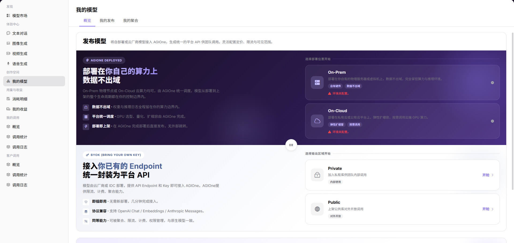
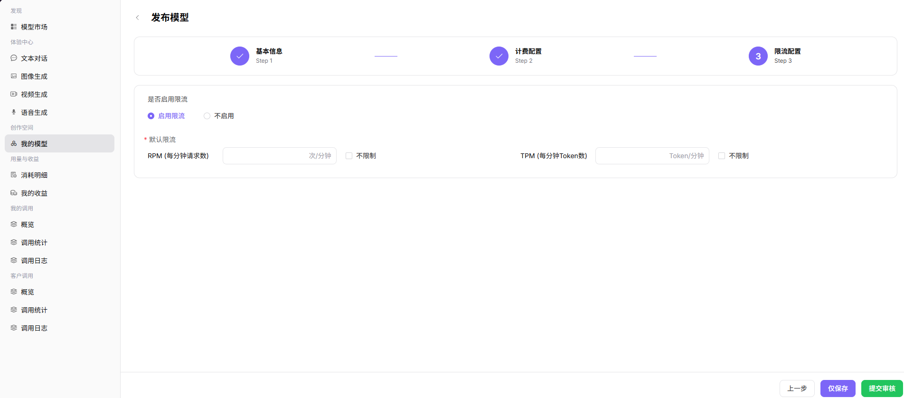

# 发布公有模型

本文说明模型提供方如何将模型发布到公有区，包括登录平台、进入我的模型、填写模型信息、完成协议测试、配置计费与限流，并提交审核。

## 场景目标

模型通过协议测试，提交到正确发布范围，并能在审核通过后被目标用户找到。

## 适用角色

- 模型提供方
- 需要处理审核的平台运营方

## 开始前准备

- 平台运营方已准备元模型、模型来源、模板、标签和币种。
- 已准备模型标识、接口、凭证、协议、计费方案、限流和无敏感信息的测试数据。

## 1. 登录 AGIOne

1. 打开 AGIOne 登录页面（`https://agione.cc/user/login`）。
2. 选择 **"密码"** 登录方式。
3. 输入您的 **"用户名或邮箱"** 和 **"密码"**。
4. 勾选 **"我同意隐私政策和服务条款"**。
5. 点击 **"登录"**。

## 2. 打开发布模型页面

1. 登录后，打开 **"模型及AI服务"**。
2. 在左侧菜单中，进入 **"创作空间" > "我的模型"**。
3. 点击右上角的 **"发布模型"** 按钮。
4. 在弹窗中选择部署方式：
   - **本地算力平台 / 多云调度平台**：AGIOne 托管部署（适用于私有云或本地部署）
   - **BYOK（Bring Your Own Key）**：接入已有的第三方 API 接口地址
5. 选择输出区域：
   - **Private・私有区**：仅供内部团队使用
   - **Public・公有区**：在公共市场展示
6. 点击 **"开始"** 进入配置流程。

## 3. 填写基本信息

1. 在**选择模型类型**中选择与上游服务一致的模型类型和子类型。
2. 核对基本信息区域，确认页面显示的能力字段与模型类型一致。

3. 在**模型来源/元模型信息**中选择真实的模型来源、地域和目标元模型。
4. 填写模型服务 URL、厂商 Key 和准确的模型来源 ID。

## 4. 测试协议

1. 找到**官方原生协议与默认高级参数**。
2. 选择需要支持的协议，例如 **OpenAI-ChatCompletions**，并展开协议卡片。
3. 核对 接口地址 路径和必需输入参数。
4. 点击**开始测试**，等待结果显示**测试通过**。

5. 填写便于识别的个性化标识，核对最终展示名称，再点击**下一步**。

## 5. 配置计费

1. 进入 **"计费配置"**。
2. 如果模型免费使用，选择 **"免费"**。
3. 如果模型收费，选择 **"收费"** 并填写页面显示的价格字段。
4. 点击 **"下一步"**。

## 6. 配置限流并提交

1. 进入 **"限流配置"**。
2. 选择是否启用限流。
3. 如果启用限流，填写：
   - **"RPM"**：每分钟最大请求数
   - **"TPM"**：每分钟最大 Token 数
4. 如果不想立即提交，点击 **"仅保存"**。
5. 如果准备就绪，点击 **"提交审核"**。
6. 等待审批。模型必须通过审批后才能正式发布。

## 7. 在模型市场中查看模型

1. 在左侧菜单中，进入 **"发现" > "模型市场"**。
2. 如果发布了公共模型，使用 **"全部模型"**。
3. 如果发布了私有模型，使用 **"私有模型"**。
4. 按最终展示名称搜索，如 **"Qwen3.5-27b highspeed"**。
5. 在列表中找到您的模型。
6. 点击 **"查看"** 打开详情页面，确认模型信息。

## 牢记这 2 点

- **不要分享您的 API Key 或将其放入公共文档。**
- **必须通过协议测试后才能继续。**

## 完成检查

> **用途：** 以下检查是当前功能任务的退出条件，用于判断操作结果是否可观察、可复核，以及是否可以继续当前场景的下一步。它不是操作步骤的重复；任一项不满足时，请按下方“常见失败分支”继续排查。

| 检查项 | 通过标准 |
| --- | --- |
| 1 | 最终模型标识和接口的协议测试通过。 |
| 2 | 计费、免费额度和限流与发布目标一致。 |
| 3 | 模型已保存或提交，并能在“我的模型”定位状态。 |
| 4 | 审核通过后，目标用户能找到并调用模型。 |

## 常见失败分支

| 现象 | 优先检查 |
| --- | --- |
| 缺少模板或模型来源 | 运营方预配置、地域、模型类型和账号范围 |
| 协议测试失败 | 接口、凭证、模型标识、请求头、请求体和网络 |
| 提交后模型不可见 | 审核状态、发布时间、公有/私有范围和市场筛选 |

## 操作手册

- [从发布到调用模型](../../../usermanual/model-services/end-to-end/publish-and-call-model/)
- [我的模型](../../../usermanual/model-services/user/studio/my-models/)
