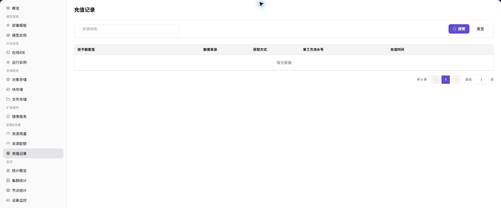

# 充值 & 计费

本场景帮助用户区分账户充值、资源配额、资源用量和模型计费，并按正确入口核对“是否到账、是否可用、消耗多少、为什么扣减”。

## 先区分四个概念

| 概念 | 回答的问题 | 参考入口 |
| --- | --- | --- |
| 充值记录 | 账户是否获得了新的可消费额度 | [充值记录](../../../usermanual/ai-infra-on-prem/user/quotas-usage/top-up-records/) |
| 资源配额 | 当前租户最多可申请多少算力或存储 | [资源配额](../../../usermanual/ai-infra-on-prem/user/quotas-usage/quotas/) |
| 资源用量 | 实例或作业实际用了多少资源 | [资源用量](../../../usermanual/ai-infra-on-prem/user/quotas-usage/usage/) |
| 模型用量与收益 | 模型调用产生多少 Token、次数、时长、消费或收益 | [模型用量](../../../usermanual/model-services/user/usage-revenue/model-usage/)、[模型收益](../../../usermanual/model-services/user/usage-revenue/model-revenue/) |

## 场景目标

- 用户能确认充值记录和账户可用额度是否更新。
- 用户能区分“配额不足”和“余额或额度不足”。
- 资源或模型消耗能回溯到实例、作业或调用记录。
- 运营方能用明细和账期汇总解释扣减结果。

## 开始前准备

1. 明确当前核对的是模型调用还是 On-Prem 资源使用。
2. 确认租户、账号、时间范围、账期和计费单位。
3. 准备脱敏后的充值记录、实例、作业或调用标识。

## 操作流程

1. 查看充值记录，确认时间、类型和额度变化。
2. 查看资源配额或账户额度，确认当前可用上限和剩余量。
3. 对资源使用，查看实例状态、资源用量和运营方计量明细。
4. 对模型调用，查看调用日志、模型用量和模型收益。
5. 按相同账期核对币种、计费单位、价格和扣减记录。
6. 如需运营方协助，提供租户、时间、对象编号和脱敏证据。

运营方参考：[租户配额](../../../usermanual/ai-infra-on-prem/operator/quotas-metering/tenant-quotas/)、[租户额度](../../../usermanual/ai-infra-on-prem/operator/quotas-metering/tenant-credits/)、[计量明细](../../../usermanual/ai-infra-on-prem/operator/quotas-metering/metering-details/)、[月度计量](../../../usermanual/ai-infra-on-prem/operator/quotas-metering/monthly-usage/)。

## 完成检查

- [ ] 充值记录、账户额度和发生时间相互对应。
- [ ] 资源配额足以覆盖目标规格，账户额度足以覆盖预计消耗。
- [ ] 扣减记录能对应到具体实例、作业或模型调用。
- [ ] 计费单位、价格、币种和账期一致。
- [ ] 异常说明包含可复核的时间范围和对象编号。

## 常见失败分支

| 现象 | 优先检查 |
| --- | --- |
| 有充值记录但仍不可创建 | 资源配额、规格容量、模板范围和账户额度 |
| 余额充足但模型不能调用 | 模型授权、Personal Key、限流和模型状态 |
| 实例已停止仍有消耗 | 计量结束时间、残留作业和状态同步 |
| 金额与预期不一致 | 计费模式、单位、价格生效时间、币种和账期 |
| 用户与运营方看到的数据不同 | 租户、时间范围、汇总层级和数据同步延迟 |

## 功能截图

