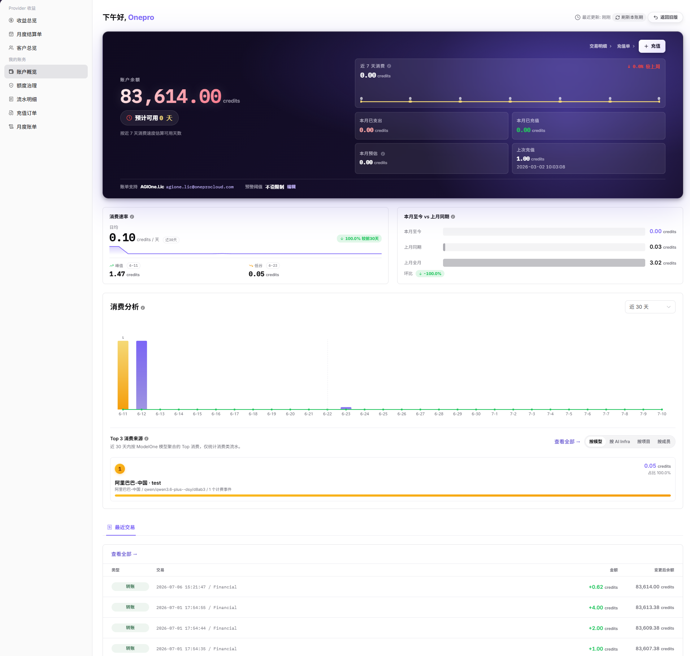
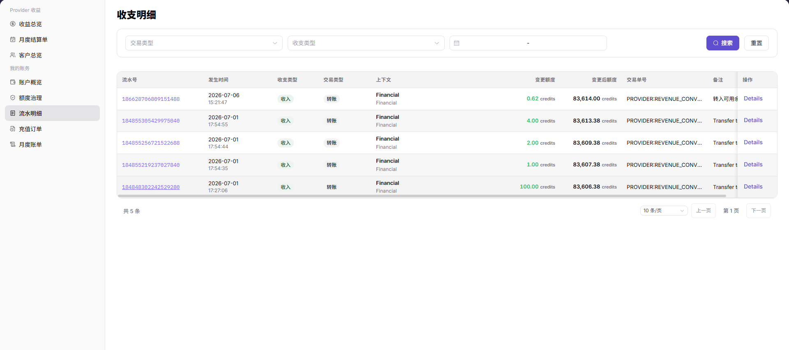
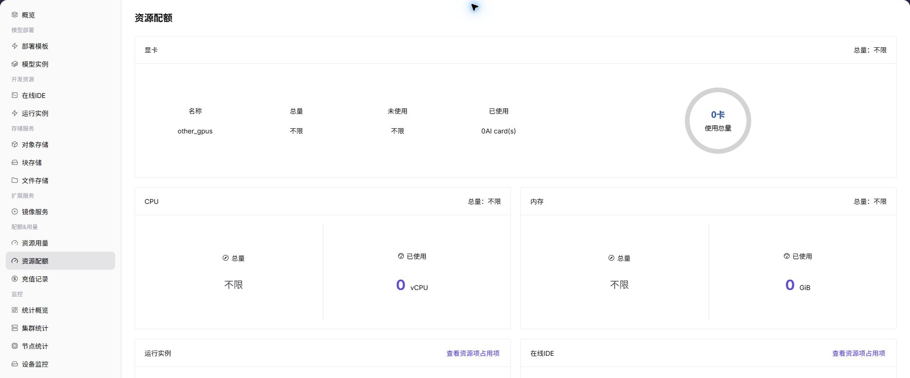
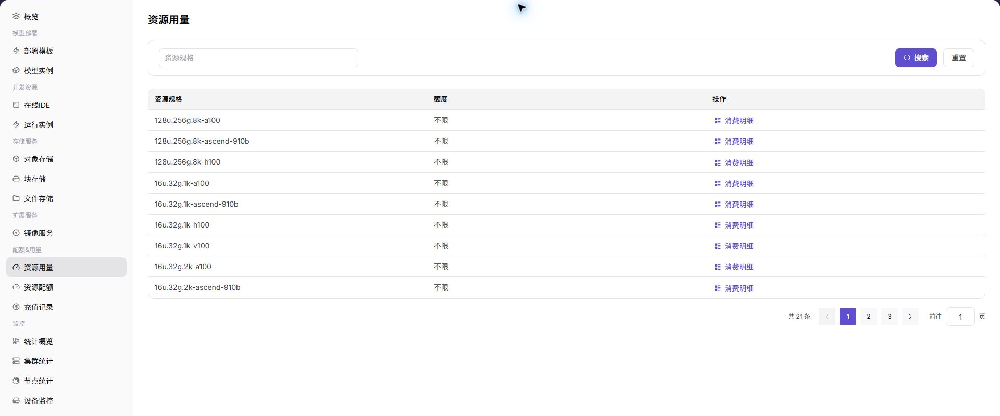

# 充值 & 计费

本场景帮助用户区分账户充值、资源配额、资源用量和模型计费，并按正确入口核对“是否到账、是否可用、消耗多少、为什么扣减”。

## 适用角色

- 查看充值、配额、用量和扣费的平台用户
- 查看模型用量和收益的模型提供方
- 核对额度、计量和账期的平台运营方

## 先区分四个概念

| 概念 | 回答的问题 | 参考入口 |
| --- | --- | --- |
| 充值订单 | 账户是否获得了新的可消费额度 | [充值订单](../../../usermanual/billing/user/billing/top-up-orders/) |
| 交易流水 | 余额为什么增加或扣减 | [交易流水](../../../usermanual/billing/user/billing/transactions/) |
| 资源配额 | 当前租户最多可申请多少算力或存储 | [资源配额](../../../usermanual/ai-infra-on-prem/user/quotas-usage/quotas/) |
| 资源用量 | 实例或作业实际用了多少资源 | [资源用量](../../../usermanual/ai-infra-on-prem/user/quotas-usage/usage/) |
| 模型用量与收益 | 模型调用产生多少 Token、次数、时长、消费或收益 | [模型用量](../../../usermanual/model-services/user/usage-revenue/model-usage/)、[模型收益](../../../usermanual/model-services/user/usage-revenue/model-revenue/) |
| 月度账单 | 同一账期的汇总消费是否可以复核 | [月度账单](../../../usermanual/billing/user/billing/monthly-bill/) |

## 场景目标

- 用户能确认充值记录和账户可用额度是否更新。
- 用户能区分“配额不足”和“余额或额度不足”。
- 资源或模型消耗能回溯到实例、作业或调用记录。
- 运营方能用明细和账期汇总解释扣减结果。

## 开始前准备

1. 明确当前核对的是模型调用还是 本地算力平台资源使用。
2. 确认租户、账号、时间范围、账期和计费单位。
3. 准备脱敏后的充值记录、实例、作业或调用标识。

## 操作流程

1. 进入[账务概览](../../../usermanual/billing/user/billing/overview/)，先确认可用额度、账期和预警信息，再查看**充值订单**，核对发生时间、支付状态和到账额度。

2. 进入[交易流水](../../../usermanual/billing/user/billing/transactions/)，按相同账号和时间范围解释余额增加、扣减或调整。

3. 查看**资源配额**或[额度治理](../../../usermanual/billing/user/billing/quota-governance/)，确认上限和剩余值能够覆盖目标任务。

4. 对 本地算力平台资源，对照实例状态、**资源用量**和运营侧计量明细。

5. 对模型调用，对照调用日志、模型用量和模型收益。
6. 进入[月度账单](../../../usermanual/billing/user/billing/monthly-bill/)，在同一账期核对币种、计费单位、价格、交易和汇总扣减。

7. 需要运营方协助时，提供租户、账期、对象编号和脱敏证据；运营侧按[账期对账与结算](../billing-cycle-reconciliation-settlement/)继续核对。

运营方可继续查看：[租户配额](../../../usermanual/ai-infra-on-prem/operator/quotas-metering/tenant-quotas/)、[租户额度](../../../usermanual/ai-infra-on-prem/operator/quotas-metering/tenant-credits/)、[计量明细](../../../usermanual/ai-infra-on-prem/operator/quotas-metering/metering-details/)和[月度用量](../../../usermanual/ai-infra-on-prem/operator/quotas-metering/monthly-usage/)。

## 完成检查

> **用途：** 以下检查是当前功能任务的退出条件，用于判断操作结果是否可观察、可复核，以及是否可以继续当前场景的下一步。它不是操作步骤的重复；任一项不满足时，请按下方“常见失败分支”继续排查。

| 检查项 | 通过标准 |
| --- | --- |
| 1 | 充值订单、交易流水、账户额度和发生时间相互对应。 |
| 2 | 资源配额足以覆盖目标规格，账户额度足以覆盖预计消耗。 |
| 3 | 扣减记录能对应到具体实例、作业或模型调用。 |
| 4 | 计费单位、价格、币种、交易流水和月度账单一致。 |
| 5 | 异常说明包含可复核的时间范围和对象编号。 |

## 常见失败分支

| 现象 | 优先检查 |
| --- | --- |
| 有充值记录但仍不可创建 | 资源配额、规格容量、模板范围和账户额度 |
| 余额充足但模型不能调用 | 模型授权、Personal Key、限流和模型状态 |
| 实例已停止仍有消耗 | 计量结束时间、残留作业和状态同步 |
| 金额与预期不一致 | 计费模式、单位、价格生效时间、币种和账期 |
| 用户与运营方看到的数据不同 | 租户、时间范围、汇总层级和数据同步延迟 |
