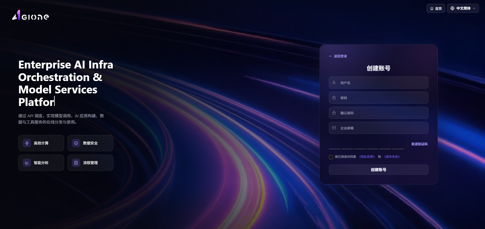
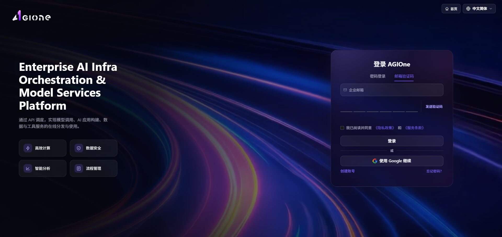
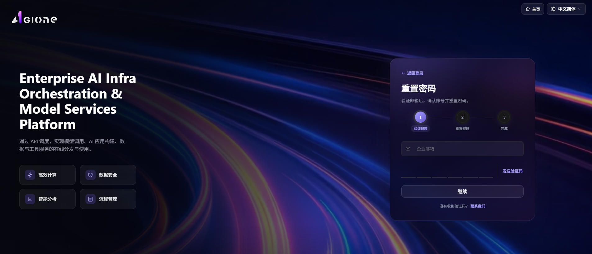

# 登录 / 注册 / 找回密码

## 场景目标

新平台用户完成注册和邮箱验证；所有角色都能登录正确工作台，并在忘记密码时恢复访问。

## 适用角色

- 注册账号的平台用户（End User）
- 登录或恢复访问的模型提供方和平台运营方

## 开始前准备

- 准备可接收验证码的邮箱和符合要求的密码。
- 从组织管理员处确认平台地址、所属租户和预期角色。

## 操作步骤

### 创建账号

1. 打开组织提供的 AGIOne 登录地址（例如 `https://agione.cc/user/login`）。
2. 在登录卡片底部，点击 **"创建账号"** 链接，进入账号注册页面。
3. 填写注册表单：
   - **"用户名"**：设置账号用户名；
   - **"密码"**：设置账号登录密码；
   - **"确认密码"**：再次输入相同密码以确认；
   - **"企业邮箱"**：填写企业邮箱用于接收验证码。
4. 点击 **"发送验证码"** 按钮，系统将验证码发送至该邮箱。
5. 填写邮箱收到的 **"验证码"**（6 位数字）。
6. 阅读并勾选 **"我已阅读并同意 《隐私政策》 和 《服务条款》"** 复选框。
7. 点击 **"创建账号"** 按钮完成注册，注册成功后可使用新账号登录。
8. 点击顶部 **"返回登录"** 可返回登录页。

#### 参数说明

| 字段名称 | 字段类型 | 示例 | 说明 |
|----------|----------|------|------|
| 用户名 | 文本 | `dushuangyan001` | 必填，新账号的用户名 |
| 密码 | 密码 | `********` | 必填，新账号的登录密码 |
| 确认密码 | 密码 | `********` | 必填，需与"密码"字段一致 |
| 企业邮箱 | 文本 | `dushuangyan@onepro.cloud` | 必填，用于接收验证码 |
| 发送验证码 | 按钮 | — | 必填，向邮箱发送 6 位数字验证码 |
| 验证码 | 文本 | `4 4 2 5 6 8` | 必填，邮箱收到的 6 位验证码 |
| 我已阅读并同意 《隐私政策》 和 《服务条款》 | 复选框 | 勾选 | 必填，用户协议确认 |
| 创建账号 | 按钮 | — | 必填，提交注册表单 |
| 返回登录 | 链接 | — | 选填，返回登录页 |

### 登录 AGIOne（密码登录）

1. 打开组织提供的 AGIOne 登录地址（例如 `https://agione.cc/user/login`）。
2. 在登录卡片顶部选择 **"密码登录"** 标签（默认选中）。
3. 填写登录表单：
   - **"用户名或邮箱"**：填写账号用户名或企业邮箱；
   - **"密码"**：填写账号密码。
4. 阅读并勾选 **"我已阅读并同意 《隐私政策》 和 《服务条款》"** 复选框。
5. 点击 **"登录"** 按钮完成登录，跳转至平台首页。
6. 登录失败时，页面会显示错误提示（如"登录失败，请稍后再试"），请检查账号密码或网络配置后重试。
7. 登录成功后可通过顶部 **"首页"** 链接返回主页，或通过 **"创建账号"** 注册新账号，或通过 **"忘记密码？"** 重置密码。

#### 参数说明

| 字段名称 | 字段类型 | 示例 | 说明 |
|----------|----------|------|------|
| 用户名或邮箱 | 文本 | `provider_onepro` | 必填，账号用户名或已注册的企业邮箱 |
| 密码 | 密码 | `AGIOne@OneProCloud.2025_wh` | 必填，账号登录密码 |
| 我已阅读并同意 《隐私政策》 和 《服务条款》 | 复选框 | 勾选 | 必填，用户协议确认 |
| 登录 | 按钮 | — | 必填，提交登录表单 |
| 首页 | 链接 | — | 选填，返回平台首页 |
| 创建账号 | 链接 | — | 选填，进入账号注册流程 |
| 忘记密码？ | 链接 | — | 选填，进入密码找回流程 |

### 登录 AGIOne（邮箱验证码）

1. 打开组织提供的 AGIOne 登录地址（例如 `https://agione.cc/user/login`）。
2. 在登录卡片顶部选择 **"邮箱验证码"** 标签。
3. 填写登录表单：
   - **"企业邮箱"**：填写已注册的企业邮箱；
4. 点击 **"发送验证码"** 按钮，系统将验证码发送至该邮箱。
5. 填写收到的 **"验证码"**（6 位数字，60 秒内有效）。
6. 阅读并勾选 **"我已阅读并同意 《隐私政策》 和 《服务条款》"** 复选框。
7. 点击 **"登录"** 按钮完成登录，跳转至平台首页。
8. 可点击 **"使用 Google 继续"** 通过 Google 账号快捷登录。

#### 参数说明

| 字段名称 | 字段类型 | 示例 | 说明 |
|----------|----------|------|------|
| 企业邮箱 | 文本 | `dushuangyan@onepro.cloud` | 必填，已注册的企业邮箱 |
| 发送验证码 | 按钮 | — | 必填，向邮箱发送 6 位数字验证码 |
| 验证码 | 文本 | `4 4 2 5 6 8` | 必填，邮箱收到的 6 位验证码（60 秒内有效） |
| 我已阅读并同意 《隐私政策》 和 《服务条款》 | 复选框 | 勾选 | 必填，用户协议确认 |
| 登录 | 按钮 | — | 必填，提交邮箱验证码登录 |
| 使用 Google 继续 | 按钮 | — | 选填，通过 Google 账号登录 |

### 找回密码（重置密码）

找回密码流程为 3 步：验证邮箱 → 重置密码 → 完成。

#### Step 1：验证邮箱

1. 打开组织提供的 AGIOne 登录地址（例如 `https://agione.cc/user/login`）。
2. 在登录卡片底部，点击 **"忘记密码？"** 链接，进入密码重置页面。
3. 在 **"验证邮箱"** 步骤中，填写 **"企业邮箱"**（已注册的企业邮箱）。
4. 点击 **"发送验证码"** 按钮，系统将 6 位数字验证码发送至该邮箱（**61 秒后可重新发送**）。
5. 填写邮箱收到的 **"验证码"**（6 位数字）。
6. 点击 **"继续"** 按钮进入下一步。
7. 如未收到验证码，可点击 **"联系我们"** 寻求帮助。
8. 点击顶部 **"返回登录"** 可返回登录页。

#### Step 2：重置密码

1. 验证邮箱通过后自动进入 **"重置密码"** 步骤，页面显示当前账号信息（用户名 + 邮箱）。
2. 填写新密码表单：
   - **"新密码"**：输入新密码；
   - **"确认密码"**：再次输入相同密码以确认。
3. 页面会实时校验：
   - 若"新密码"为空，提示 **"新密码不能为空"**；
   - 若两次密码不一致，提示 **"两次密码不一致"**。
4. 点击 **"重置密码"** 按钮提交新密码。
5. 若需返回上一步，可点击 **"上一步"** 返回验证邮箱步骤。

#### Step 3：完成

1. 密码提交成功后，流程进入 **"完成"** 步骤，页面提示密码重置成功。
2. 点击 **"返回登录"** 返回登录页，使用新密码登录。

#### 参数说明

| 字段名称  | 字段类型 | 示例            | 说明                             |
| ----- | ---- | ------------- | ------------------------------ |
| 企业邮箱  | 文本   | `dushuangyan@onepro.cloud` | 必填，已注册的企业邮箱                    |
| 发送验证码 | 按钮   | —             | 必填，向邮箱发送 6 位数字验证码（61 秒倒计时后可重发） |
| 验证码   | 文本   | `4 4 2 5 6 8` | 必填，邮箱收到的 6 位验证码                |
| 继续    | 按钮   | —             | 必填，提交验证邮箱步骤                    |
| 联系我们  | 链接   | —             | 选填，未收到验证码时寻求帮助                 |
| 返回登录  | 链接   | —             | 选填，返回登录页                       |
| 新密码   | 密码   | `********`    | 必填，账号新密码                       |
| 确认密码  | 密码   | `********`    | 必填，需与"新密码"字段一致                 |
| 上一步   | 按钮   | —             | 选填，返回验证邮箱步骤                    |
| 重置密码  | 按钮   | —             | 必填，提交新密码                       |

## 完成检查

> **用途：** 以下检查是当前功能任务的退出条件，用于判断操作结果是否可观察、可复核，以及是否可以继续当前场景的下一步。它不是操作步骤的重复；任一项不满足时，请按下方“常见失败分支”继续排查。

| 检查项 | 通过标准 |
| --- | --- |
| 1 | 新账号能够完成邮箱验证并登录。 |
| 2 | 密码登录和邮箱验证码登录进入正确租户与工作台。 |
| 3 | 找回密码后旧密码失效，新密码可以登录。 |
| 4 | 登录失败时页面给出明确错误，未泄露账号是否存在等敏感信息。 |

## 常见问题

| 现象 | 优先检查 |
| --- | --- |
| 收不到验证码 | 邮箱地址、垃圾邮件、发送倒计时和邮件服务状态 |
| 创建账号失败 | 用户名是否重复、密码规则、验证码有效期和协议勾选 |
| 登录后进入错误工作台 | 账号所属租户、绑定角色和默认入口 |
| 重置后仍无法登录 | 是否使用新密码、账号状态、键盘输入和登录方式 |

## 操作手册

[登录后按角色选择对应子系统操作手册](/zh-CN/usermanual/)
