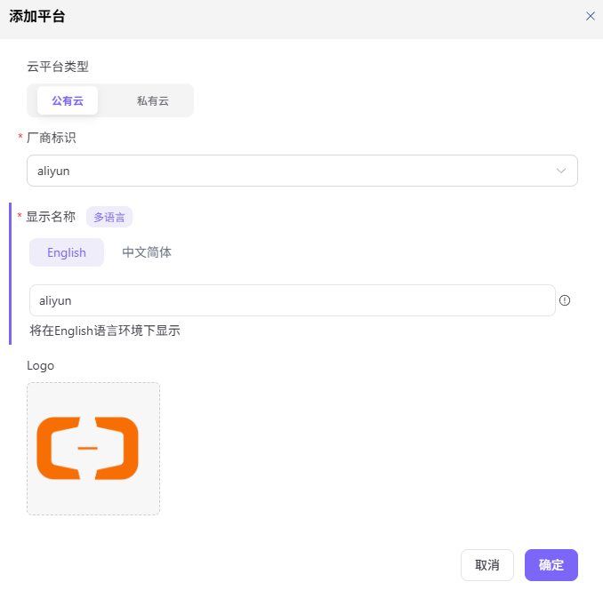

# 接入云平台

::: info 文档信息
版本：v1.0
更新日期：2026-07-08
:::

## 功能概述

`接入云平台` 用于维护云平台类型、私有云地址、启用状态和接入说明，用于统一管理可接入的公有云、私有云和混合云类型。

| 项目 | 内容 |
| --- | --- |
| 适用角色 | 运营方 |
| 导航路径 | 接入管理 > 接入云平台 |
| 页面路由 | /operator/access-management/access-cloudtype |
| 管理对象 | 云平台类型、私有云地址、启用状态和接入说明 |
| 典型用途 | 维护可接入的公有云或私有云平台 |

### 新手理解

接入云平台像给平台登记“可使用的云资源类型”。只有先确认是公有云、私有云还是专属云，并维护好启用状态，后续云账号、资源池和部署资产才知道应该接到哪里。

### 术语速查

| 术语 | 说明 |
| --- | --- |
| 公有云 | 由云厂商提供的标准云资源平台。 |
| 私有云 | 企业内部或专属部署的云资源平台。 |
| 平台地址 | 私有云访问入口，示例统一使用 `https://cloud.example.com`。 |
| 启用状态 | 控制云平台是否可被接入账号和资源池选择。 |

## 前提条件

1. 当前账号具备云平台类型维护权限。
2. 待接入云平台的类型、访问方式和维护边界已确认。
3. 私有云或专属云的真实连接信息只在安全配置中维护。
## 页面说明

页面用于维护可接入的云平台类型、访问入口和启用状态。运营方需要先确认云平台归属、网络连通方式和维护边界，再决定是否启用给接入账号和资源池使用。

页面截图：

用于确认已接入的云平台类型、状态和操作入口。

## 主要操作

### 管理接入云平台

1. 进入 `接入管理 > 接入云平台`。
2. 查看已有云平台类型、启用状态和维护说明。
3. 新增私有云或专属云时填写平台名称、类型和占位访问地址。
4. 确认接入账号、网络连通和资源同步方案已准备。
5. 保存后到接入账号页面验证该云平台可被选择。

关键步骤截图：

新增前确认云厂商类型、地域映射和 API 能力范围。

## 参数说明

| 字段名称 | 是否必填 | 字段类型 | 示例 | 说明 |
| --- | --- | --- | --- | --- |
| 云平台名称 | 必填 | 文本 | `AGIOne Private Cloud` | 面向运营方展示的云平台名称，避免内部代号。 |
| 云平台类型 | 必填 | 枚举 | `私有云` | 区分公有云、私有云或专属云。 |
| 访问地址 | 条件必填 | URL | `https://cloud.example.com` | 私有云入口示例，文档中只写占位符。 |
| 启用状态 | 必填 | 枚举 | `启用` | 控制后续接入账号和资源池是否可选择。 |
| 维护说明 | 否 | 多行文本 | `生产资源入口` | 记录云平台用途、维护人和限制。 |

## 踩坑提示

- 私有云访问地址不要写真实内网域名、IP 或内部 Endpoint。
- 停用云平台前先确认是否存在接入账号、资源池或部署资产引用。
- 云平台名称变更后要同步检查操作手册、工单模板和下游筛选项。

## 结果校验

| 检查项 | 成功表现 | 异常时处理 |
| --- | --- | --- |
| 接入云平台列表能看到新增或更新后 | 接入云平台列表能看到新增或更新后的记录。 | 未达到时回到对应页面核对权限、筛选条件和配置状态 |
| 启用状态与预期一致 | 启用状态与预期一致。 | 未达到时回到对应页面核对权限、筛选条件和配置状态 |
| 接入账号页面可以选择该云平台 | 接入账号页面可以选择该云平台。 | 未达到时回到对应页面核对权限、筛选条件和配置状态 |

## 常见问题

### 接入账号页面没有目标云平台

**问题现象：**

新增接入账号时，云平台下拉框中没有刚维护的平台。

**可能原因：**

- 云平台未启用。
- 云平台类型配置错误。
- 当前账号没有该云平台的管理权限。

**处理方式：**

1. 回到接入云平台页面确认启用状态。
2. 核对云平台类型和名称。
3. 检查当前账号菜单和数据权限。

### 私有云地址保存后不可用

**问题现象：**

平台已保存，但后续账号接入或资源同步失败。

**可能原因：**

- 访问地址写成了示例地址但未在系统安全配置中维护真实连接信息。
- 网络连通、证书或代理未准备。
- 云平台类型与接入插件不匹配。

**处理方式：**

1. 在安全配置或接入账号页面录入真实连接信息。
2. 联系网络或云平台管理员确认连通性。
3. 核对平台类型和接入插件。

## 后续操作

1. 维护云账号接入信息。
2. 创建或同步资源池。
3. 为租户或业务地域配置授权。

## 注意事项

- 云平台类型是接入入口，启用后仍需要配置云账号、资源池和授权链路。
- 停用云平台类型可能连带影响账号校验、资产同步和用户部署入口，应先检查依赖关系。
- 私有云地址、内部域名和连接参数只在系统中维护，文档和工单统一使用占位符。