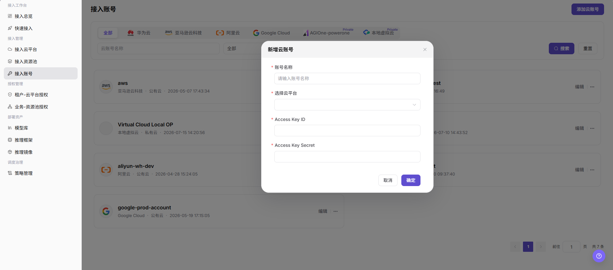

# 接入账号

::: info 文档信息
版本：v1.0
更新日期：2026-07-08
:::

## 功能概述

`接入账号` 用于查看和维护云平台账号接入信息，支持按云平台筛选账号，并通过新增入口录入账号名称、云平台和访问凭据。

| 项目 | 内容 |
| --- | --- |
| 适用角色 | 运营方 |
| 导航路径 | AI基础设施 > On-Cloud > 接入管理 > 接入账号 |
| 页面路由 | `/infrahub/op/access/account` |
| 管理对象 | 云账号、云平台、云平台类型、访问凭据和操作入口 |
| 典型途径 | 新增云账号并为资源池发现、资源同步和授权配置提供认证基础 |

#### 新手理解

接入账号像给平台登记访问云厂商资源的钥匙。新增账号时必须核对账号名称、所属云平台和凭据来源；真实凭据只应在平台安全输入框中录入，不应写进文档、截图或工单。

#### 术语速查

| 术语 | 说明 |
| --- | --- |
| 云账号名称 | 新增弹窗中的账号展示名称，也是列表和搜索使用的名称。 |
| 云平台 | 账号所属的云厂商或私有云平台。 |
| Access Key ID | 云侧访问凭据标识，用于识别访问身份。 |
| Access Key Secret | 与 Access Key ID 配套的敏感凭据，只能在安全输入框中维护。 |
| 云平台类型 | 列表卡片展示的公有云、私有云等类型。 |

## 前提条件

1. 当前账号具备 `接入管理 > 接入账号` 页面访问权限和新增云账号权限。
2. 待新增账号所属云平台已存在，且账号用途、权限范围和凭据来源已确认。
3. 如新增后需要资源同步或状态检查，相关云侧权限和网络连通性已准备。

## 页面说明

页面标题为 `接入账号`。页面上方提供云平台筛选项、`云账号名称` 搜索框、类型下拉筛选、`搜索` 和 `重置` 按钮，右上角提供 `添加云账号` 入口。账号以卡片形式展示，卡片中可见账号名称、云平台、云平台类型、更新时间，以及 `编辑` 和更多操作入口。

页面截图：

## 主要操作

### 新增云账号

1. 进入 `AI Infra > On-Cloud > 接入管理 > 接入账号`。
2. 在 `接入账号` 页面点击右上角 `添加云账号`。
3. 在 `新增云账号` 弹窗中填写必填的 `账号名称`。
4. 在 `选择云平台` 下拉框中选择账号所属云平台。
5. 填写 `Access Key ID` 和 `Access Key Secret`，并确认凭据来源、权限范围和后续资源同步影响。
6. 点击最终 `确定` 前再次核对账号信息、云平台和访问凭据；如仅学习或验证页面，请点击 `取消` 或关闭弹窗，不提交真实账号配置。

## 参数说明

| 字段名称 | 是否必填 | 字段类型 | 示例 | 说明 |
| --- | --- | --- | --- | --- |
| 云账号名称 | 否 | 文本 / 搜索条件 | 按页面输入 | 列表筛选使用的账号名称。 |
| 账号名称 | 必填 | 文本 | 按页面输入 | 新增云账号时填写的账号展示名称。 |
| 云平台 | 必填 | 筛选项 / 下拉选择 | 按页面选项为准 | 账号所属云平台；新增时通过 `选择云平台` 选择。 |
| 云平台类型 | 系统生成 | 文本 | `公有云` | 列表卡片展示的云平台类型。 |
| Access Key ID | 必填 | 安全输入 | 不在文档中展示 | 云侧访问凭据标识。 |
| Access Key Secret | 必填 | 安全输入 | 不在文档中展示 | 云侧敏感凭据，禁止写入文档或截图。 |
| 搜索 | 否 | 操作按钮 | `搜索` | 按筛选条件查询云账号列表。 |
| 重置 | 否 | 操作按钮 | `重置` | 清空筛选条件并恢复默认列表。 |
| 添加云账号 | 否 | 操作按钮 | `添加云账号` | 打开新增云账号弹窗。 |
| 编辑 | 否 | 操作入口 | `编辑` | 进入已有云账号配置。 |
| 取消 | 否 | 操作按钮 | `取消` | 关闭新增弹窗，不提交配置。 |
| 确定 | 否 | 高风险操作 | `确定` | 提交新增云账号配置，可能保存真实凭据并触发后续校验或同步。 |

## 踩坑提示

- 截图中的新增弹窗只确认了 `账号名称`、`选择云平台`、`Access Key ID` 和 `Access Key Secret` 字段；账号类型、地域、授权范围或同步配置如在后续页面出现，应按真实页面继续核对。
- 不要把真实账号、访问凭据、接口地址或内部测试参数写入文档、截图和工单。
- 新增或编辑云账号前，应确认云侧权限遵循最小权限原则，避免过度授权。

## 结果校验

| 检查项 | 成功表现 | 异常时处理 |
| --- | --- | --- |
| 页面可进入 | `接入账号` 页面正常打开，左侧 `接入管理 > 接入账号` 菜单高亮。 | 检查账号权限、导航路径和页面加载状态。 |
| 云账号列表正常加载 | 账号卡片正常展示账号名称、云平台、云平台类型和操作入口。 | 刷新页面或检查数据权限。 |
| 新增入口可见 | 页面右上角显示 `添加云账号`。 | 检查当前账号是否具备新增权限。 |
| 新增弹窗可打开 | 点击 `添加云账号` 后出现 `新增云账号` 弹窗。 | 检查浏览器状态、页面接口和权限配置。 |
| 必填字段正常显示 | `账号名称`、`选择云平台`、`Access Key ID`、`Access Key Secret` 均显示必填标识。 | 核对页面版本或重新打开弹窗。 |
| 学习验证不提交 | 仅查看字段和弹窗，没有点击最终 `确定`。 | 如误触最终动作，应按变更审计流程核查影响范围。 |
| 真实提交后可追踪 | 如执行真实提交，新云账号应出现在列表中，后续校验、同步或编辑入口可追踪。 | 检查必填项、凭据有效性、云平台选择和接口返回。 |

## 排障路径

| 问题类型 | 先检查 | 下一步 |
| --- | --- | --- |
| 新增弹窗打不开 | 新增权限、页面加载状态和浏览器控制台错误 | 刷新页面或联系管理员检查权限 |
| 提交失败 | 必填字段、云平台选择和凭据有效性 | 按接口错误信息修正配置 |
| 新账号列表不可见 | 筛选条件、分页和同步延迟 | 点击 `重置` 后刷新列表 |

## 常见问题

#### 新增云账号后列表没有显示怎么办？

**问题现象：**

点击 `确定` 后，返回列表没有看到新增账号。

**可能原因：**

- 当前筛选条件未清空。
- 新增请求未成功提交。
- 列表数据存在刷新延迟。

**处理方式：**

1. 点击 `重置` 清空筛选条件。
2. 刷新页面后重新查看账号列表。
3. 如仍不存在，重新打开新增弹窗并检查必填字段和提交结果。

#### 访问凭据填写后无法通过校验怎么办？

**问题现象：**

云账号已新增，但后续资源同步、状态检查或编辑校验失败。

**可能原因：**

- Access Key ID 或 Access Key Secret 无效、过期或不匹配。
- 云侧授权范围不足。
- 云平台选择错误，或云侧接口、网络、代理不可达。

**处理方式：**

1. 在安全凭据来源中核对并更新凭据。
2. 检查云侧授权策略和最小权限范围。
3. 核对云平台选择、网络连通性和接口返回信息。

## 后续操作

1. 进入接入资源池页面，查看该账号可同步或可使用的资源池。
2. 进入租户-云平台授权或业务-资源池授权页面，配置资源可见范围。
3. 进入接入总览复核账号、资源池和授权链路状态。

## 注意事项

- 新增云账号可能保存真实云侧认证信息，并触发资源同步、状态检查或授权范围变更。
- `确定 / Confirm`、`保存 / Save`、`提交 / Submit` 属于高风险最终动作，学习或截图时不要点击。
- 文档只描述查看字段和配置前核对，不引导在测试学习时提交真实账号配置。
- 不在文档中写入真实账号、密码、密钥、Token、AK/SK、接口地址、云资源 ID 或内部测试参数。
