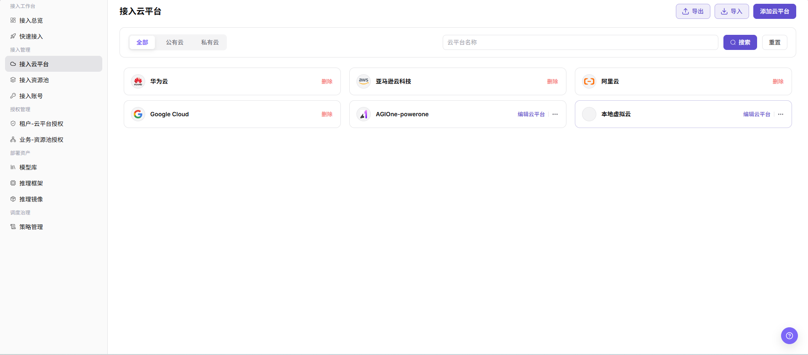
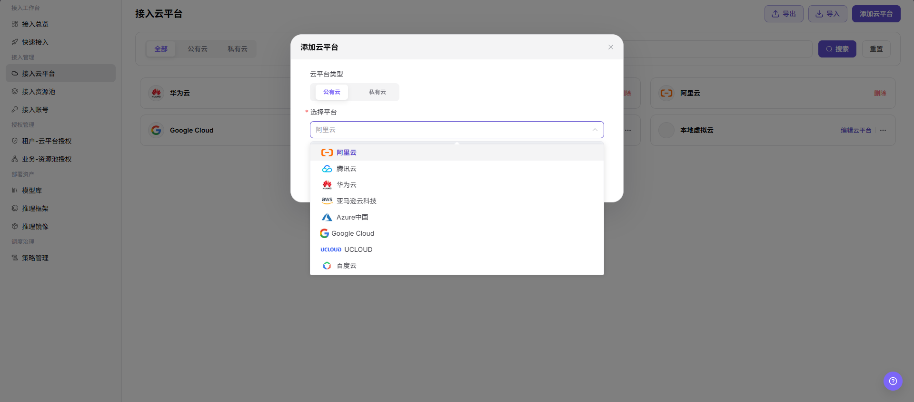

# 接入云平台

::: info 文档信息
版本：v1.0
更新日期：2026-07-08
:::

## 功能概述

`接入云平台` 用于查看和维护可接入的云平台清单，支持按公有云、私有云分类筛选，并通过添加入口登记新的云平台类型。

| 项目 | 内容 |
| --- | --- |
| 适用角色 | 运营方 |
| 导航路径 | AI基础设施 > On-Cloud > 接入管理 > 接入云平台 |
| 页面路由 | `/infrahub/op/access/platform` |
| 管理对象 | 云平台名称、云平台类型、平台来源和操作入口 |
| 典型途径 | 添加云平台并维护可接入的云平台清单 |

#### 新手理解

接入云平台像给系统登记“可以接入哪些云”。先在这里选择公有云或私有云，并选择具体平台，后续接入账号、资源池和授权配置才有可选的云平台基础信息。

#### 术语速查

| 术语 | 说明 |
| --- | --- |
| 云平台类型 | 页面中的分类字段，当前截图展示 `公有云` 和 `私有云`。 |
| 选择平台 | 添加云平台弹窗中的必填下拉字段，用于选择具体云厂商或云平台。 |
| 云平台名称 | 列表和搜索框中的云平台展示名称。 |
| 编辑云平台 | 列表中的操作入口，用于进入已有云平台配置。 |
| 删除 | 列表中的高风险操作，可能移除云平台接入配置。 |

## 前提条件

1. 当前账号具备 `接入管理 > 接入云平台` 页面访问权限。
2. 待添加云平台的类型、公有云或私有云归属和接入范围已确认。
3. 如后续需要配置认证、接口地址或资源同步参数，应提前准备并通过安全配置方式维护。

## 页面说明

页面标题为 `接入云平台`。页面上方提供 `全部`、`公有云`、`私有云` 分类筛选，支持按 `云平台名称` 搜索，并提供 `导出`、`导入`、`添加云平台` 入口。云平台以卡片形式展示，卡片中可见云平台名称以及 `删除`、`编辑云平台` 等操作入口。

页面截图：

## 主要操作

### 添加云平台

1. 进入 `AI Infra > On-Cloud > 接入管理 > 接入云平台`。
2. 在 `接入云平台` 页面点击 `添加云平台`。
3. 在 `添加云平台` 弹窗中选择 `云平台类型`，当前可见选项包括 `公有云` 和 `私有云`。
4. 在必填的 `选择平台` 下拉框中选择目标平台，例如 `阿里云`、`腾讯云`、`华为云`、`亚马逊云科技`、`Azure中国`、`Google Cloud`、`UCLOUD` 或 `百度云`。
5. 如页面后续出现认证信息、接口地址、资源同步或状态检查等配置项，提交前再次核对云平台信息、接入范围和影响对象。
6. 如仅学习或验证页面，只查看字段和弹窗，点击关闭或返回；不要执行最终 `保存`、`提交` 或 `确定`。

## 参数说明

| 字段名称 | 是否必填 | 字段类型 | 示例 | 说明 |
| --- | --- | --- | --- | --- |
| 云平台名称 | 否 | 文本 / 搜索条件 | `华为云` | 列表展示和搜索使用的云平台名称。 |
| 云平台类型 | 必填 | 分段选择 | `公有云` | 添加云平台时选择平台分类，当前截图可见 `公有云`、`私有云`。 |
| 选择平台 | 必填 | 下拉选择 | `阿里云` | 添加云平台时选择具体云厂商或云平台。 |
| 添加云平台 | 否 | 操作按钮 | `添加云平台` | 打开新增云平台弹窗。 |
| 搜索 | 否 | 操作按钮 | `搜索` | 按云平台名称等条件筛选列表。 |
| 重置 | 否 | 操作按钮 | `重置` | 清空筛选条件并恢复默认列表。 |
| 导入 | 否 | 操作按钮 | `导入` | 导入云平台配置，可能影响真实配置，需谨慎使用。 |
| 导出 | 否 | 操作按钮 | `导出` | 导出云平台配置或列表数据，需注意敏感信息。 |
| 编辑云平台 | 否 | 操作入口 | `编辑云平台` | 进入已有云平台配置页面或弹窗。 |
| 删除 | 否 | 高风险操作 | `删除` | 删除云平台记录前需确认依赖的账号、资源池和授权关系。 |

## 踩坑提示

- 当前截图中的添加弹窗只确认了 `云平台类型` 和 `选择平台` 字段，认证信息、接口地址、区域或资源同步参数应以后续实际页面为准。
- `导入`、`导出`、`编辑云平台`、`删除` 可能涉及真实配置或敏感数据，学习或截图时不要执行。
- 截图或对外沟通前，应遮挡真实账号、密钥、Token、AK/SK、接口地址、云资源 ID 和内部测试参数。

## 结果校验

| 检查项 | 成功表现 | 异常时处理 |
| --- | --- | --- |
| 页面可进入 | `接入云平台` 页面正常打开，左侧 `接入管理 > 接入云平台` 菜单高亮。 | 检查账号权限、导航路径和页面加载状态。 |
| 云平台列表正常加载 | 列表卡片展示云平台名称和操作入口。 | 刷新页面或检查数据权限。 |
| 添加入口可见 | 页面右上角显示 `添加云平台`。 | 检查当前账号是否具备新增权限。 |
| 添加弹窗可打开 | 点击 `添加云平台` 后出现同名弹窗。 | 检查浏览器拦截、页面状态和权限配置。 |
| 必填字段正常显示 | `云平台类型` 和 `选择平台` 字段正常显示，`选择平台` 带必填标识。 | 核对页面版本或重新打开弹窗。 |
| 学习验证不提交 | 仅查看字段和弹窗，没有执行真实保存、提交或确定。 | 如误触最终动作，应按变更审计流程核查影响范围。 |
| 真实提交后可追踪 | 如执行真实提交，新云平台应出现在列表中，并可继续编辑或删除。 | 检查必填项、接口返回、同步任务和权限。 |

## 常见问题

#### 添加弹窗里找不到目标平台

**问题现象：**

打开 `添加云平台` 后，`选择平台` 下拉框中没有目标云平台。

**可能原因：**

- 当前平台类型选择不正确，例如应选择 `私有云` 但停留在 `公有云`。
- 目标平台尚未被系统预置或开放。
- 当前账号没有该平台的接入权限。

**处理方式：**

1. 切换 `公有云` / `私有云` 后重新查看下拉选项。
2. 确认目标平台是否已在系统中开放。
3. 联系平台管理员核对账号权限和平台接入范围。

#### 添加后列表没有显示新平台

**问题现象：**

已完成添加动作，但 `接入云平台` 列表中没有看到新云平台。

**可能原因：**

- 当前列表筛选条件未清空。
- 新增配置仍在同步或刷新中。
- 最终保存、提交或确定未成功完成。

**处理方式：**

1. 点击 `重置` 清空筛选条件。
2. 刷新页面或等待同步完成后复核。
3. 重新打开添加弹窗，检查必填字段和提交结果。

## 后续操作

1. 进入接入账号页面，为已添加云平台配置账号接入。
2. 进入接入资源池页面，创建或同步对应资源池。
3. 进入租户-云平台授权或业务-资源池授权页面，配置可用范围。

## 注意事项

- 添加云平台可能创建真实接入配置、触发资源同步、暴露或使用云侧认证信息。
- `保存 / Save`、`提交 / Submit`、`确定 / OK` 属于高风险最终动作，学习或截图时不要点击。
- 文档只描述查看字段和配置前核对，不引导在测试学习时提交真实配置。
- 不在文档中写入真实账号、密钥、Token、AK/SK、接口地址、云资源 ID 或内部测试参数。
