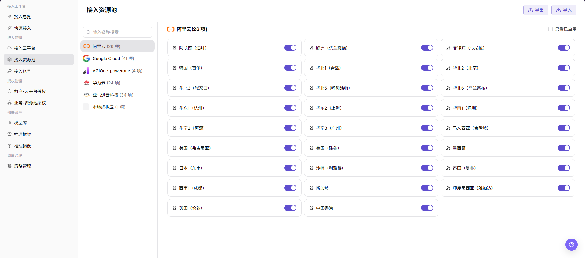
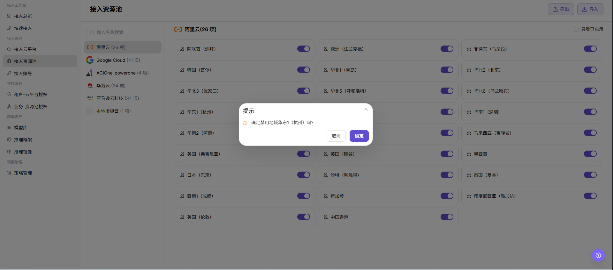

# 接入资源池

::: info 文档信息
版本：v1.0
更新日期：2026-07-08
:::

## 功能概述

`接入资源池` 用于按云平台查看和维护可接入的地域资源池，并通过状态开关控制资源池是否启用，帮助运营方管理云上资源可见性和后续调度范围。

| 项目 | 内容 |
| --- | --- |
| 适用角色 | 运营方 |
| 导航路径 | AI Infra > On-Cloud > 接入管理 > 接入资源池 |
| 页面路由 | /infrahub/op/access/region |
| 管理对象 | 云平台、地域资源池、启用状态、导入导出入口 |
| 典型用途 | 启用或禁用指定云平台下的地域资源池 |

#### 新手理解

接入资源池像给不同云平台的地域资源设置“是否可用”的开关。开启后资源池可能进入授权和调度范围；关闭后相关部署、授权或容量展示可能受到影响。

#### 术语速查

| 术语 | 说明 |
| --- | --- |
| 云平台 | 左侧列表中的资源池归属平台，例如 `阿里云`、`Google Cloud`、`华为云`。 |
| 资源池 | 当前页面中按地域展示的资源池条目，例如 `华东1（杭州）`。 |
| 资源池数量 | 云平台名称后的数量，例如 `26 项`。 |
| 启用状态 | 每个资源池右侧的状态开关。 |
| 只看已启用 | 仅展示当前启用资源池的筛选项。 |
| 确认提示 | 启用或禁用前弹出的二次确认弹窗。 |

## 前提条件

1. 当前账号具备 `接入管理 > 接入资源池` 页面访问权限。
2. 目标云平台已接入，资源池列表可正常加载。
3. 执行启用或禁用前，已确认该资源池的授权范围、调度依赖和业务影响。

## 页面说明

页面标题为 `接入资源池`。左侧支持按名称搜索云平台，并展示云平台及资源池数量；右侧展示所选云平台下的地域资源池卡片，每个卡片右侧提供状态开关。页面右上角提供 `导出`、`导入` 入口，并可勾选 `只看已启用` 过滤资源池。

页面截图：

## 主要操作

### 启用/禁用资源池

1. 进入 `AI Infra > On-Cloud > 接入管理 > 接入资源池`。
2. 在左侧云平台列表中选择目标云平台，例如 `阿里云`。
3. 在右侧资源池列表中找到目标资源池，查看资源池地域名称和右侧启用状态开关。
4. 如需筛选当前已启用资源池，可勾选 `只看已启用`。
5. 点击目标资源池右侧的状态开关，发起启用或禁用操作。
6. 如页面弹出 `提示` 确认框，核对资源池名称、当前动作和影响范围；截图示例为 `确定禁用地域华东1（杭州）吗?`。
7. 点击最终 `确定` 前再次确认；如仅学习或验证页面，请点击 `取消` 或关闭弹窗，不执行真实变更。

## 参数说明

| 字段名称 | 是否必填 | 字段类型 | 示例 | 说明 |
| --- | --- | --- | --- | --- |
| 云平台 | 是 | 列表项 | `阿里云` | 资源池所属云平台。 |
| 资源池数量 | 系统生成 | 数值 | `26 项` | 当前云平台下的资源池数量。 |
| 资源池名称 | 系统生成 | 文本 | `华东1（杭州）` | 当前页面按地域展示的资源池名称。 |
| 启用状态 | 是 | 开关 | 开启 / 关闭 | 控制资源池是否可继续用于授权、展示或调度。 |
| 只看已启用 | 否 | 复选框 | 勾选 / 不勾选 | 过滤列表，仅查看已启用资源池。 |
| 名称搜索 | 否 | 输入框 | 按页面输入 | 按名称搜索云平台或资源池相关条目。 |
| 导入 | 否 | 操作按钮 | `导入` | 导入资源池相关配置，可能影响真实配置，需谨慎使用。 |
| 导出 | 否 | 操作按钮 | `导出` | 导出资源池列表或配置数据，需注意敏感信息。 |
| 确认提示 | 系统生成 | 弹窗 | `确定禁用地域华东1（杭州）吗?` | 启用或禁用前的二次确认提示。 |
| 取消 | 否 | 操作按钮 | `取消` | 关闭确认弹窗，不应用变更。 |
| 确定 | 否 | 高风险操作 | `确定` | 确认启用或禁用资源池，会应用真实状态变更。 |

## 踩坑提示

- 截图未展示容量、同步状态或可用区字段；如实际页面进入详情后出现这些字段，应按真实页面继续核对。
- 启用状态开关会影响资源池可见性和后续调度边界，不能只按列表数量判断可用。
- `导入`、`导出` 和状态切换可能涉及真实配置或敏感数据，学习或截图时不要执行。

## 结果校验

| 检查项 | 成功表现 | 异常时处理 |
| --- | --- | --- |
| 页面可进入 | `接入资源池` 页面正常打开，左侧 `接入管理 > 接入资源池` 菜单高亮。 | 检查账号权限、导航路径和页面加载状态。 |
| 资源池列表正常加载 | 左侧云平台列表和右侧地域资源池卡片正常展示。 | 刷新页面或检查云平台、资源池同步状态。 |
| 目标资源池状态可见 | 每个资源池右侧显示启用状态开关。 | 检查列表筛选条件和页面权限。 |
| 启用/禁用入口可见 | 目标资源池右侧状态开关可见。 | 确认账号是否具备资源池状态变更权限。 |
| 确认弹窗正常显示 | 切换状态后显示 `提示` 弹窗，并展示资源池名称和启用或禁用动作。 | 检查浏览器状态、接口返回和权限配置。 |
| 学习验证不提交 | 仅查看列表、开关和确认弹窗，没有点击最终 `确定`。 | 如误触最终动作，应按变更审计流程核查影响范围。 |
| 真实执行后状态更新 | 如执行真实启用或禁用，列表开关状态应更新，并与调度和授权范围一致。 | 刷新页面，检查授权页面、调度策略和相关部署状态。 |

## 排障路径

| 问题类型 | 先检查 | 下一步 |
| --- | --- | --- |
| 资源池不可用 | 资源池开关状态、云平台选择和 `只看已启用` 筛选 | 核对授权页面和调度策略 |
| 用户看不到资源池 | 租户授权和业务地域授权 | 进入授权页面核对可见范围 |
| 禁用后业务异常 | 是否存在运行中部署、调度策略或授权依赖 | 恢复状态或按变更流程回滚 |

## 常见问题

#### 资源池禁用后还能被用户选择怎么办？

**问题现象：**

资源池已在页面中关闭，但用户侧仍能看到或选择该资源池。

**可能原因：**

- 授权或调度数据存在同步延迟。
- 用户侧页面缓存尚未刷新。
- 仍存在其他可用资源池或同名地域映射。

**处理方式：**

1. 刷新接入资源池页面，确认开关状态。
2. 检查租户-云平台授权和业务-资源池授权。
3. 等待同步完成后，在用户侧部署页面复核。

#### 切换开关没有出现确认提示怎么办？

**问题现象：**

点击资源池状态开关后，没有出现 `提示` 确认框。

**可能原因：**

- 当前账号没有状态变更权限。
- 页面请求失败或弹窗被异常关闭。
- 当前资源池状态不允许切换。

**处理方式：**

1. 检查当前账号权限和页面接口返回。
2. 刷新页面后重新选择目标云平台和资源池。
3. 如仍无法操作，联系平台管理员确认资源池状态和变更限制。

## 后续操作

1. 进入租户-云平台授权或业务-资源池授权页面，核对资源池可见范围。
2. 进入调度策略页面，确认启用或禁用后的调度规则。
3. 进入接入总览，复核资源池状态和资源清单展示。

## 注意事项

- 启用资源池可能让真实业务开始调度到该资源池。
- 禁用资源池可能影响已有部署、调度、容量展示和业务可用性。
- `确定 / OK`、`保存 / Save`、`提交 / Submit` 属于高风险最终动作，学习或截图时不要点击。
- 不在文档中写入真实账号、密钥、Token、AK/SK、内网地址、云资源 ID、资源池内部编码或测试参数。
