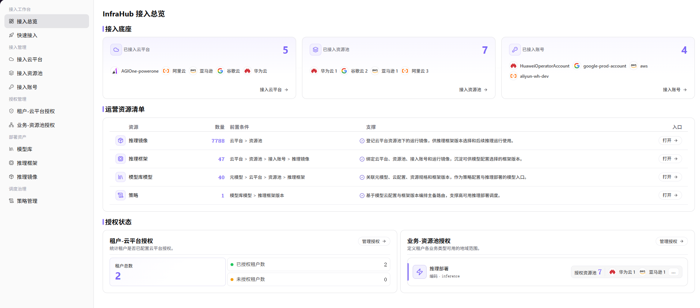

# 接入总览

::: info 文档信息
版本：v1.0
更新日期：2026-07-08
:::

## 功能概述

`接入总览` 用于查看 InfraHub 接入底座、运营资源清单和授权状态，帮助运营方快速确认云平台、资源池、账号、推理镜像、推理框架、模型库模型、策略和授权配置是否完整。

| 项目 | 内容 |
| --- | --- |
| 适用角色 | 运营方 |
| 导航路径 | AI Infra > On-Cloud > 接入工作台 > 接入总览 |
| 页面路由 | /infrahub/op/workbanch/overview |
| 管理对象 | 已接入云平台、已接入资源池、已接入账号、运营资源清单、租户授权和业务资源池授权 |
| 典型用途 | 查看云上基础设施接入完整度和授权状态 |

#### 新手理解

接入总览像云上基础设施接入的仪表盘。它不替代具体配置页，而是把云平台、资源池、账号、运营资源和授权状态放在一个页面，帮助运营方判断接入链路是否完整。

#### 术语速查

| 术语 | 说明 |
| --- | --- |
| 接入底座 | 展示已接入云平台、资源池和账号的基础接入状态。 |
| 运营资源清单 | 展示推理镜像、推理框架、模型库模型和策略等运营资源的数量、前置条件和入口。 |
| 授权状态 | 展示租户与云平台、业务与资源池的授权配置情况。 |
| 前置条件 | 使用某类运营资源前需要先完成的接入配置。 |
| 入口 | 跳转到对应资源管理页面的操作入口。 |

## 前提条件

1. 当前账号具备 `接入工作台 > 接入总览` 页面访问权限。
2. 至少已配置云平台、资源池或接入账号中的一种接入对象。
3. 查看授权状态前，租户、业务类型和资源池授权规则已按实际运营需求配置。

## 页面说明

页面展示 `InfraHub 接入总览`。上方 `接入底座` 展示已接入云平台、已接入资源池和已接入账号；中部 `运营资源清单` 展示资源、数量、前置条件、支撑说明和入口；下方 `授权状态` 展示租户-云平台授权和业务-资源池授权。

页面截图：

## 主要操作

### 查看接入总览

1. 进入 `AI Infra > On-Cloud > 接入工作台 > 接入总览`。
2. 在 `接入底座` 区域查看 `已接入云平台`、`已接入资源池` 和 `已接入账号` 的数量及名称。
3. 点击 `接入云平台`、`接入资源池` 或 `接入账号` 入口，可跳转到对应接入管理页面查看详情。
4. 在 `运营资源清单` 中查看资源、数量、前置条件、支撑说明和入口，确认推理镜像、推理框架、模型库模型和策略是否已准备完成。
5. 点击资源行中的 `打开`，可进入对应资源管理页面查看或处理配置。
6. 在 `授权状态` 区域查看 `租户-云平台授权`、`业务-资源池授权`、租户总数、已授权租户数、未授权租户数和授权资源池数量。
7. 如需调整授权，点击 `管理授权` 进入授权管理页面；学习或验证页面时只查看信息，不执行真实授权或配置变更。

## 参数说明

| 字段名称 | 是否必填 | 字段类型 | 示例 | 说明 |
| --- | --- | --- | --- | --- |
| 已接入云平台 | 系统生成 | 数值 / 列表 | 按页面展示 | 展示已完成接入的云平台数量和名称。 |
| 已接入资源池 | 系统生成 | 数值 / 列表 | 按页面展示 | 展示已完成接入的资源池数量和名称。 |
| 已接入账号 | 系统生成 | 数值 / 列表 | 按页面展示 | 展示已接入账号数量和账号名称。 |
| 资源 | 系统生成 | 文本 | `推理镜像` | 运营资源清单中的资源类型。 |
| 数量 | 系统生成 | 数值 | 按页面展示 | 当前资源类型下已登记或已配置的数量。 |
| 前置条件 | 系统生成 | 文本 | 按页面展示 | 使用该资源前需要完成的接入配置。 |
| 支撑 | 系统生成 | 文本 | 按页面展示 | 说明该资源在推理部署或调度链路中的作用。 |
| 入口 | 否 | 操作入口 | `打开` | 跳转到对应资源管理页面。 |
| 租户总数 | 系统生成 | 数值 | 按页面展示 | 当前统计范围内租户数量。 |
| 已授权租户数 | 系统生成 | 数值 | 按页面展示 | 已配置云平台授权的租户数量。 |
| 未授权租户数 | 系统生成 | 数值 | 按页面展示 | 尚未配置云平台授权的租户数量。 |
| 授权资源池 | 系统生成 | 数值 / 标签 | 按页面展示 | 业务类型可使用的资源池数量及资源池名称。 |

## 踩坑提示

- 接入总览是聚合视图，排障时仍需进入云平台、资源池、账号、资源或授权页面核对。
- 页面中 `打开`、`管理授权`、接入入口可能跳转到配置页面，学习或截图时不要执行真实配置变更。
- 截图或对外沟通前，应遮挡云账号、资源池名称、内部资源标识、接入地址、Key、Token、AK/SK 和内部测试参数。

## 结果校验

| 检查项 | 成功表现 | 异常时处理 |
| --- | --- | --- |
| 页面可进入 | `InfraHub 接入总览` 页面正常打开，左侧 `接入工作台 > 接入总览` 菜单高亮。 | 确认账号权限、导航路径和页面加载状态。 |
| 接入底座正常展示 | 已接入云平台、已接入资源池和已接入账号卡片正常显示数量和名称。 | 返回云平台、资源池或接入账号页面核对接入状态。 |
| 运营资源清单正常加载 | 推理镜像、推理框架、模型库模型和策略等资源行正常显示。 | 检查前置接入条件和资源同步状态。 |
| 授权状态正常展示 | 租户-云平台授权和业务-资源池授权区域正常展示授权数量。 | 进入授权管理页面核对授权配置。 |
| 入口可打开 | 点击 `打开`、`接入云平台`、`接入资源池`、`接入账号` 或 `管理授权` 可进入对应页面。 | 检查目标页面权限和路由配置。 |
| 数据与配置一致 | 卡片数量、资源数量和授权数量与对应管理页面一致。 | 刷新页面或等待同步任务完成后复核。 |

## 常见问题

#### 接入总览数量与详情页不一致

**问题现象：**

接入总览卡片数量或资源数量与详情页看到的数据不一致。

**可能原因：**

- 总览聚合数据存在刷新延迟。
- 资源或授权同步任务尚未完成。
- 当前账号在详情页和总览页的数据权限不同。

**处理方式：**

1. 刷新接入总览并确认最新数据。
2. 进入对应云平台、资源池、账号或授权页面核对状态。
3. 等待同步任务完成后再次复核。

#### 授权状态显示未授权怎么办？

**问题现象：**

`未授权租户数` 大于 0，或业务-资源池授权中缺少目标资源池。

**可能原因：**

- 租户尚未配置云平台授权。
- 业务类型尚未绑定可用资源池。
- 授权配置已调整但总览尚未刷新。

**处理方式：**

1. 点击 `管理授权` 进入对应授权页面。
2. 核对租户、业务类型和资源池授权范围。
3. 完成授权后返回总览确认数量变化。

## 后续操作

1. 进入云平台、资源池或接入账号页面补齐接入配置。
2. 进入推理镜像、推理框架、模型库模型或策略页面查看运营资源准备情况。
3. 进入授权管理页面核对租户和业务资源池授权。

## 注意事项

- 接入总览通常以查看为主，配置变更应在对应管理页面完成。
- 同步、导出、配置、刷新接入数据或修改资源映射等入口属于需谨慎操作的入口，文档不引导执行真实配置变更。
- 不在文档中写入真实供应方敏感信息、内部资源标识、接入地址、Key、Token、AK/SK 或内部测试参数。
