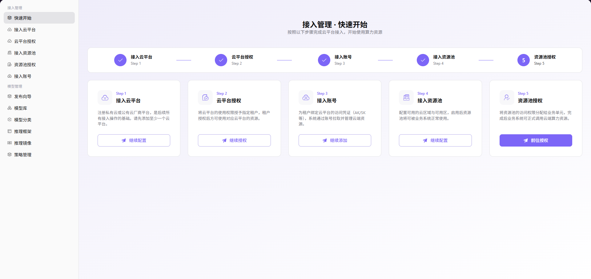

# 快速接入

## 功能概述

`快速接入` 用于维护云平台、云账号、资源池、租户授权和部署资产，支撑多云调度、资源授权和模型部署流程。

| 项目 | 内容 |
| --- | --- |
| 适用角色 | 运营方 |
| 导航路径 | 接入工作台 > 快速接入 |
| 页面路由 | /operator/access-workbench/quick-start |
| 管理对象 | 云平台、云账号、资源池、租户授权和部署资产 |
| 典型用途 | 按向导完成多云资源接入 |

### 新手理解

快速开始像接入流程清单，把“先接云、再同步资源、再授权、最后部署验证”串起来。它适合新环境上线前逐项勾验，不适合替代每个功能页的详细配置。

### 术语速查

| 术语 | 说明 |
| --- | --- |
| 接入步骤 | 快速开始向导中的云平台、账号、资源池和授权步骤。 |
| 完成状态 | 每个步骤是否已经完成或需要处理。 |
| 验证动作 | 用于确认接入闭环的测试部署或同步检查。 |
| 异常提示 | 向导中展示的失败原因和跳转入口。 |
## 前提条件

1. 当前账号具备快速接入向导访问权限。
2. 云平台、云账号、资源池和授权所需信息已准备。
3. 用于验证的测试租户和业务地域已确认。
## 页面说明

页面用于引导运营方按顺序完成云平台接入、云账号校验、资源池同步、授权配置和部署验证。每一步都应回到对应功能页完成真实配置和结果确认。

页面截图：

按云平台、云账号、资源池和授权顺序完成接入。

## 主要操作

### 操作步骤

1. 进入 `接入工作台 > 快速开始`。
2. 按向导确认云平台类型和接入账号准备情况。
3. 完成云账号接入并通过凭据校验。
4. 同步资源池并确认地域、规格和容量。
5. 配置租户或业务地域授权后创建一次测试部署验证。

### 参数说明

| 字段名称 | 是否必填 | 字段类型 | 示例 | 说明 |
| --- | --- | --- | --- | --- |
| 步骤名称 | 系统生成 | 文本 | `接入云账号` | 向导中的接入环节。 |
| 完成状态 | 系统生成 | 枚举 | `已完成` | 用于判断是否可进入下一步。 |
| 目标云平台 | 条件必填 | 下拉选择 | `阿里云` | 当前向导处理的云平台。 |
| 验证动作 | 系统生成 | 文本 | `创建测试部署` | 用于确认流程闭环。 |
| 异常提示 | 系统生成 | 文本 | `账号校验失败` | 引导跳转到具体处理页。 |

### 踩坑提示

- 快速开始只做流程引导，关键配置仍要在云账号、资源池和授权页核对。
- 不要跳过测试部署，授权和调度问题通常在部署阶段暴露。
- 截图时遮挡云账号、租户和内部资源标识。

### 结果校验

1. 向导关键步骤均显示完成。
2. 资源池和授权页能看到对应配置。
3. 测试部署能创建并进入运行或可诊断状态。

## 常见问题

### 向导停在账号接入步骤

**问题现象：**

云账号已创建，但快速开始仍提示未完成。

**可能原因：**

- 账号校验未通过。
- 向导统计存在同步延迟。
- 账号所属云平台与当前向导筛选不一致。

**处理方式：**

1. 进入云账号页面检查校验状态。
2. 确认当前云平台筛选。
3. 刷新或等待同步后再次查看。

### 测试部署无法创建

**问题现象：**

前置步骤显示完成，但创建测试部署失败。

**可能原因：**

- 资源池未授权给当前租户。
- 业务地域和资源池地域不匹配。
- 部署资产或运行镜像未准备。

**处理方式：**

1. 检查租户云授权和业务地域授权。
2. 核对资源池地域和容量。
3. 确认模型资产、运行框架和镜像已启用。

## 后续操作

1. 固化接入检查清单。
2. 为正式租户配置授权。
3. 进入我的部署或部署页验证服务可用。

## 注意事项

- 快速开始是流程引导，不替代各功能页的详细配置。
- 不要跳过测试部署验证。
- 失败步骤应回到对应功能页处理。
