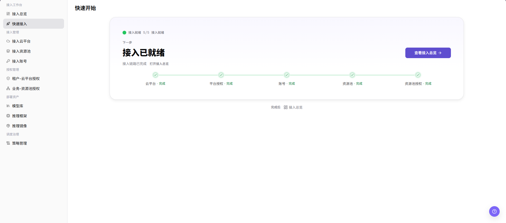

# 快速接入

::: info 文档信息
版本：v1.0
更新日期：2026-07-08
:::

## 功能概述

`快速接入` 用于在接入工作台中查看云平台、平台授权、账号、资源池和资源池授权的接入进度，帮助运营方确认云上基础设施接入链路是否已经完成，并跳转到接入总览继续检查。

| 项目 | 内容 |
| --- | --- |
| 适用角色 | 运营方 |
| 导航路径 | AI基础设施 > On-Cloud > 接入工作台 > 快速接入 |
| 页面路由 | `/infrahub/op/workbanch/quick` |
| 管理对象 | 云平台、平台授权、账号、资源池和资源池授权 |
| 典型途径 | 按流程确认接入链路是否完成 |

#### 新手理解

快速接入像接入流程清单，把“云平台、授权、账号、资源池、资源池授权”串起来。它适合新环境上线前逐项勾验，不替代每个接入管理页面的详细配置。

#### 术语速查

| 术语 | 说明 |
| --- | --- |
| 接入状态 | 当前接入链路是否已经完成，例如 `接入就绪`。 |
| 完成进度 | 已完成步骤与总步骤的数量，例如 `5/5`。 |
| 接入步骤 | 云平台、平台授权、账号、资源池和资源池授权等流程节点。 |
| 下一步 | 页面根据当前状态给出的后续入口或提示。 |
| 接入总览 | 汇总展示接入底座、运营资源清单和授权状态的页面。 |

## 前提条件

1. 当前账号具备 `接入工作台 > 快速接入` 页面访问权限。
2. 需要查看的云平台、平台授权、账号、资源池和资源池授权配置已准备或可访问。
3. 如需继续补齐配置，已确认测试租户、业务地域和资源边界。

## 页面说明

页面标题显示为 `快速开始`，左侧菜单入口为 `快速接入`。页面展示 `接入就绪` 状态、完成进度、下一步提示和接入链路状态，包括 `云平台`、`平台授权`、`账号`、`资源池`、`资源池授权`。页面提供 `查看接入总览` 入口，完成后也可进入 `接入总览`。

页面截图：

## 主要操作

### 使用快速接入

1. 进入 `AI Infra > On-Cloud > 接入工作台 > 快速接入`。
2. 在 `快速开始` 页面查看 `接入就绪` 状态和 `5/5` 完成进度。
3. 按流程条核对 `云平台`、`平台授权`、`账号`、`资源池`、`资源池授权` 是否显示 `完成`。
4. 如某一步未完成，进入左侧对应页面，例如 `接入云平台`、`接入资源池`、`接入账号`、`租户-云平台授权` 或 `业务-资源池授权` 补齐配置。
5. 完成后点击 `查看接入总览` 或页面下方 `接入总览` 入口，查看接入详情和后续检查项。
6. 如仅学习或验证页面，只查看状态、步骤和跳转入口；不要在跳转后的配置页执行 `创建`、`接入`、`提交` 或 `保存` 等最终动作。

## 参数说明

| 字段名称 | 是否必填 | 字段类型 | 示例 | 说明 |
| --- | --- | --- | --- | --- |
| 页面标题 | 系统生成 | 文本 | `快速开始` | 快速接入页面显示的页面标题。 |
| 接入状态 | 系统生成 | 状态 | `接入就绪` | 当前接入链路的总体状态。 |
| 完成进度 | 系统生成 | 数值 | `5/5` | 已完成接入步骤与总步骤数量。 |
| 下一步 | 系统生成 | 文本 / 入口 | `接入已就绪` | 页面根据当前接入状态给出的下一步提示。 |
| 云平台 | 系统生成 | 步骤状态 | `完成` | 云平台接入步骤的完成状态。 |
| 平台授权 | 系统生成 | 步骤状态 | `完成` | 平台授权步骤的完成状态。 |
| 账号 | 系统生成 | 步骤状态 | `完成` | 接入账号步骤的完成状态。 |
| 资源池 | 系统生成 | 步骤状态 | `完成` | 资源池接入步骤的完成状态。 |
| 资源池授权 | 系统生成 | 步骤状态 | `完成` | 资源池授权步骤的完成状态。 |
| 查看接入总览 | 否 | 操作按钮 | `查看接入总览` | 打开接入总览页面继续查看接入底座、运营资源和授权状态。 |

## 踩坑提示

- 快速接入页当前展示流程状态和跳转入口，具体的云账号、授权、网络、规格或参数配置仍需在对应管理页面核对。
- `查看接入总览` 只进入总览页；如从总览页或左侧菜单继续配置接入对象，执行最终确认前必须再次核对影响范围。
- 截图或对外沟通前，应遮挡云账号、租户、内部资源标识、接入地址、Key、Token、AK/SK 和内部测试参数。

## 结果校验

| 检查项 | 成功表现 | 异常时处理 |
| --- | --- | --- |
| 页面可进入 | `快速开始` 页面正常打开，左侧 `接入工作台 > 快速接入` 菜单高亮。 | 确认账号权限、导航路径和页面加载状态。 |
| 接入状态正常展示 | 页面显示 `接入就绪`，完成进度显示为 `5/5` 或与实际步骤状态一致。 | 刷新页面或进入未完成步骤对应的管理页面核对配置。 |
| 流程步骤正常展示 | `云平台`、`平台授权`、`账号`、`资源池`、`资源池授权` 均能显示状态。 | 检查接入对象、授权关系和资源同步状态。 |
| 总览入口可打开 | 点击 `查看接入总览` 或 `接入总览` 可进入接入总览页面。 | 检查目标页面权限和路由配置。 |
| 数据与配置一致 | 快速接入步骤状态与云平台、账号、资源池和授权页面的配置状态一致。 | 等待同步完成后复核，或进入对应页面排查未完成项。 |
| 学习验证不提交 | 仅查看页面字段和流程，没有执行真实创建、接入、提交或保存。 | 如误触最终动作，应按变更审计流程核查影响范围。 |

## 常见问题

#### 接入状态不是接入就绪怎么办？

**问题现象：**

页面未显示 `接入就绪`，或完成进度不是 `5/5`。

**可能原因：**

- 云平台、账号或资源池尚未完成接入。
- 平台授权或资源池授权未配置完成。
- 接入状态存在同步延迟。

**处理方式：**

1. 根据未完成步骤进入对应管理页面。
2. 核对云平台、账号、资源池和授权配置状态。
3. 等待同步完成后返回快速接入页复核。

#### 点击查看接入总览后看不到数据怎么办？

**问题现象：**

可以打开接入总览，但接入底座、资源清单或授权状态为空。

**可能原因：**

- 当前账号缺少对应数据权限。
- 接入对象刚完成配置，统计数据尚未同步。
- 接入对象配置在其他租户、地域或资源范围下。

**处理方式：**

1. 确认当前账号权限和数据范围。
2. 进入云平台、账号、资源池或授权页面核对配置。
3. 刷新接入总览或等待同步后再次查看。

## 后续操作

1. 进入接入总览查看接入底座、运营资源清单和授权状态。
2. 对未完成步骤，进入云平台、资源池、账号或授权页面补齐配置。
3. 接入链路确认后，再进入模型库、推理框架、推理镜像或策略页面检查部署资产。

## 注意事项

- 快速接入可能引导到真实云上资源、授权关系或接入任务配置页面。
- `创建 / Create`、`接入 / Access`、`提交 / Submit`、`保存 / Save` 属于高风险最终动作，学习或截图时不要执行。
- 文档只描述查看状态、核对流程和进入详情，不引导执行真实配置变更。
- 不在文档中写入真实账号、密钥、Token、AK/SK、内部接入地址、云资源 ID 或内部测试参数。
