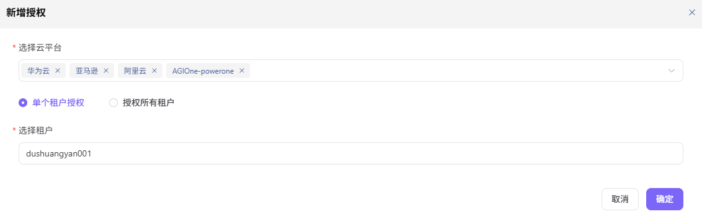

# 租户云授权

:::: info 文档信息
版本：v1.0
更新日期：2026-07-08
::::

## 功能概述

`租户云授权` 用于维护租户、云账号、资源池、地域和可用权限，支撑多云调度、资源授权和模型部署流程。

| 项目 | 内容 |
| --- | --- |
| 适用角色 | 运营方 |
| 导航路径 | 授权管理 > 租户云授权 |
| 页面路由 | /operator/auth-management/tenant-cloud-auth |
| 管理对象 | 租户、云账号、资源池、地域和可用权限 |
| 典型用途 | 把云资源能力授权给指定租户 |

### 新手理解

租户云授权像把资源货架分配给租户。资源池存在只是“仓库有货”，授权完成后租户才有资格在部署时使用这些云资源。

### 术语速查

| 术语 | 说明 |
| --- | --- |
| 租户 | 被授权使用云资源的组织或账号范围。 |
| 授权范围 | 允许租户使用的云平台、账号、资源池和地域。 |
| 资源池 | 按云账号、地域和资源类型汇总的资源集合。 |
| 有效期 | 授权生效和失效的时间边界。 |
## 前提条件

1. 目标租户已创建。
2. 可授权云平台、云账号和资源池已接入。
3. 授权范围、有效期和回收策略已确认。
## 页面说明

页面用于按租户维度配置可使用的云平台、云账号、资源池和资源范围。运营方应确认租户归属、权限边界和资源配额，避免授权过宽或授权到错误地域。

页面截图：

用于查看租户、云账号、资源池和有效期。

## 主要操作

### 操作步骤

1. 进入 `授权管理 > 租户云授权`。
2. 选择目标租户并查看已有授权范围。
3. 按云平台、云账号、资源池和地域勾选可用资源。
4. 设置启用状态、有效期或备注。
5. 保存后使用租户视角验证部署页是否可选择对应资源。

关键步骤截图：

新增授权时遵循最小权限原则。

### 参数说明

| 字段名称 | 是否必填 | 字段类型 | 示例 | 说明 |
| --- | --- | --- | --- | --- |
| 租户 | 是 | 下拉选择 | `tenant-a` | 被授权使用云资源的租户。 |
| 云平台 | 是 | 下拉选择 | `阿里云` | 授权覆盖的云平台。 |
| 资源池 | 是 | 多选 | `gpu-cn-shanghai-prod` | 租户可使用的资源集合。 |
| 有效期 | 否 | 日期范围 | `2026-07-01 至 2026-12-31` | 控制临时授权边界。 |
| 授权状态 | 是 | 枚举 | `启用` | 控制授权是否生效。 |

### 踩坑提示

- 授权给租户不等于业务地域已可用，必要时还要配置业务地域授权。
- 授权范围不要跨租户复用客户专属资源。
- 回收授权前确认租户是否有运行中部署。

### 结果校验

1. 租户授权列表显示目标云平台和资源池。
2. 普通用户部署页可看到授权资源。
3. 未授权租户无法选择该资源池。

## 常见问题

### 租户部署页看不到资源

**问题现象：**

授权后用户创建部署时仍无法选择目标资源池。

**可能原因：**

- 业务地域授权未配置。
- 资源池未启用或容量为 0。
- 用户账号不属于目标租户或权限不足。

**处理方式：**

1. 检查业务地域授权。
2. 确认资源池状态和容量。
3. 核对用户所属租户和菜单权限。

### 授权保存后不生效

**问题现象：**

授权记录存在，但下游页面仍按旧范围展示。

**可能原因：**

- 授权缓存或同步任务未刷新。
- 授权状态为停用。
- 授权对象选择了错误租户。

**处理方式：**

1. 确认授权状态和目标租户。
2. 等待或触发授权同步。
3. 使用用户视角重新登录验证。

## 后续操作

1. 配置业务地域授权。
2. 为租户设置配额或调度策略。
3. 指导用户创建云模型部署。

## 注意事项

- 租户授权不等于业务地域授权。
- 授权范围按最小必要原则配置。
- 回收授权前确认运行中部署影响。
