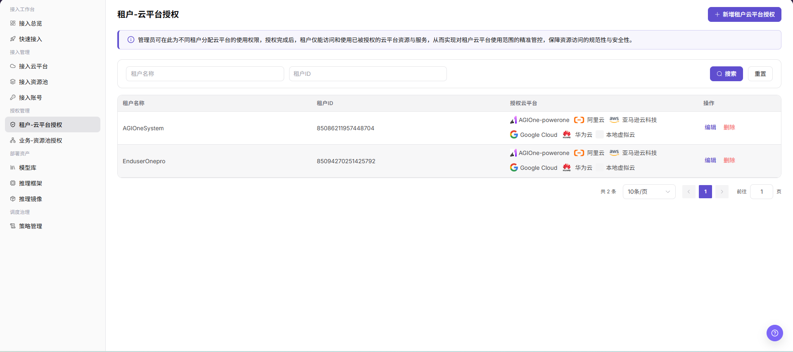
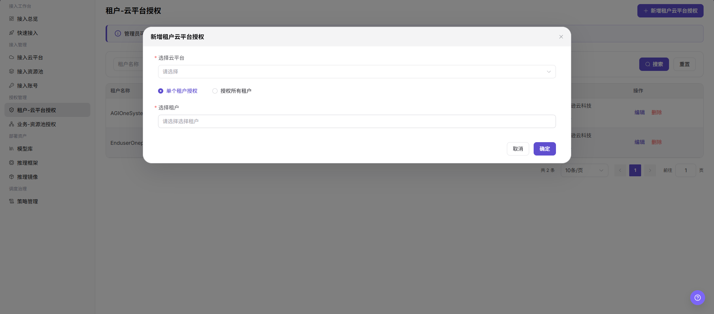

# 租户-云平台授权

::: info 文档信息
版本：v1.0
更新日期：2026-07-20
:::

## 功能概述

`租户-云平台授权` 用于为不同租户分配云平台使用权限。授权完成后，租户只能访问和使用已授权的云平台资源与服务，从而控制租户可用的云平台范围。

| 项目 | 内容 |
| --- | --- |
| 适用角色 | 运营方 |
| 导航路径 | AI Infra > On-Cloud > 授权管理 > 租户-云平台授权 |
| 页面路由 | /infrahub/op/auth/platform-auth |
| 管理对象 | 租户、租户 ID、授权云平台和授权操作 |
| 典型用途 | 将指定云平台授权给单个租户或所有租户 |

#### 新手理解

租户云平台授权像给租户发放可使用云平台的通行证。云平台接入后并不代表所有租户都能使用，只有完成授权的租户才能访问对应云平台资源与服务。

#### 术语速查

| 术语 | 说明 |
| --- | --- |
| 租户 | 被授权使用云平台资源与服务的组织或账号范围。 |
| 租户 ID | 页面中用于区分租户的唯一标识。 |
| 授权云平台 | 已分配给租户使用的云平台范围。 |
| 单个租户授权 | 只为选中的一个租户新增授权。 |
| 授权所有租户 | 将所选云平台授权给所有租户，影响范围更大。 |

## 前提条件

1. 目标租户已创建，并可在租户列表中选择。
2. 需要授权的云平台已接入并可用。
3. 已确认授权对象、授权云平台和影响范围。

## 页面说明

页面用于查看和维护租户与云平台之间的授权关系。列表支持按 `租户名称` 和 `租户ID` 筛选，展示 `租户名称`、`租户ID`、`授权云平台` 和 `操作`，并提供 `编辑`、`删除` 等入口。

页面截图：

## 主要操作

### 新增租户云平台授权

1. 进入 `AI Infra > On-Cloud > 授权管理 > 租户-云平台授权`。
2. 点击 `新增租户云平台授权`。
3. 在弹窗中按页面要求选择 `选择云平台`。
4. 选择 `单个租户授权` 或 `授权所有租户`；如选择单个租户授权，继续填写 `选择租户`。
5. 点击最终 `确定` 前，再次核对云平台、授权对象和影响范围。
6. 如仅学习或验证页面，请点击 `取消` 或关闭弹窗，不提交真实授权配置。

关键步骤截图：

## 参数说明

| 字段名称 | 是否必填 | 字段类型 | 示例 | 说明 |
| --- | --- | --- | --- | --- |
| 租户名称 | 否 | 文本 | `示例租户` | 用于按租户名称筛选授权记录，请勿写入真实客户名称。 |
| 租户ID | 否 | 文本/数字 | `1000000000000000` | 用于按租户唯一标识筛选授权记录，示例值仅用于说明。 |
| 授权云平台 | 是 | 列表/多值 | `阿里云` | 展示或选择租户可访问的云平台范围。 |
| 选择云平台 | 是 | 下拉选择 | `阿里云` | 新增授权时选择要授权的云平台。 |
| 授权方式 | 是 | 单选 | `单个租户授权` | 选择只授权单个租户或授权所有租户。 |
| 选择租户 | 条件必填 | 下拉选择 | `示例租户` | 选择 `单个租户授权` 时填写目标租户。 |
| 搜索 | 否 | 按钮 | `搜索` | 按当前筛选条件查询授权记录。 |
| 重置 | 否 | 按钮 | `重置` | 清空筛选条件并恢复列表展示。 |
| 编辑 | 否 | 操作入口 | `编辑` | 修改已有授权前需确认影响范围。 |
| 删除 | 否 | 操作入口 | `删除` | 删除授权可能影响租户可用资源，需谨慎操作。 |
| 取消 | 否 | 按钮 | `取消` | 关闭弹窗且不保存本次配置。 |
| 确定 | 是 | 按钮 | `确定` | 最终提交授权配置，点击前需完成复核。 |

## 踩坑提示

- `授权所有租户` 会扩大云平台可用范围，执行前必须确认是否符合授权边界。
- `确定` 是提交授权的最终动作；仅学习或验证页面时应取消或关闭弹窗。
- `编辑`、`删除` 可能影响租户真实部署、资源调度、费用归属和业务可用性。

## 结果校验

| 检查项 | 成功表现 | 异常时处理 |
| --- | --- | --- |
| 页面可进入 | 正常显示 `租户-云平台授权` 页面和授权列表。 | 检查菜单权限、路由和登录状态。 |
| 授权列表正常加载 | 列表展示租户名称、租户 ID、授权云平台和操作入口。 | 检查筛选条件、数据权限和接口状态。 |
| 新增入口可见 | 页面右上角显示 `新增租户云平台授权`。 | 检查运营方权限和页面配置。 |
| 新增弹窗可打开 | 弹窗显示 `选择云平台`、授权方式、`选择租户`、`取消` 和 `确定`。 | 刷新页面后重试，仍异常时联系管理员。 |
| 筛选项可用 | 输入租户名称或租户 ID 后点击 `搜索` 可刷新列表，`重置` 可清空筛选。 | 核对筛选条件和返回数据。 |
| 授权状态可追踪 | 如真实提交，新授权记录应出现在列表中，授权云平台与选择一致。 | 回到列表核对租户、云平台和授权范围。 |

## 排障路径

| 问题类型 | 先检查 | 下一步 |
| --- | --- | --- |
| 找不到目标租户 | 租户是否已创建、租户名称或租户 ID 是否正确。 | 返回租户管理页面确认租户状态。 |
| 找不到云平台 | 云平台是否已接入并处于可用状态。 | 返回接入云平台页面检查接入状态。 |
| 授权后仍不可使用 | 授权对象、授权云平台和下游业务地域配置是否一致。 | 使用租户视角重新进入部署流程验证。 |
| 授权范围过大 | 是否误选 `授权所有租户`。 | 取消提交或通过编辑收敛授权范围。 |

## 常见问题

#### 租户部署页看不到资源

**问题现象：**

授权后用户创建部署时仍无法选择目标云平台资源。

**可能原因：**

- 授权对象选择错误。
- 目标云平台未接入或状态异常。
- 下游业务地域、资源池或部署资产配置尚未同步。

**处理方式：**

1. 检查租户名称、租户 ID 和授权云平台。
2. 确认云平台接入状态和资源配置。
3. 使用租户视角重新登录并验证部署页面。

#### 授权保存后不生效

**问题现象：**

授权记录存在，但下游页面仍按旧范围展示。

**可能原因：**

- 授权缓存或同步任务未刷新。
- 授权对象选择了错误租户。
- 下游页面仍受业务地域、资源池或权限策略限制。

**处理方式：**

1. 回到列表确认授权云平台和目标租户。
2. 等待或触发授权相关同步。
3. 检查业务地域授权、资源池状态和用户权限。

## 后续操作

1. 在业务地域授权页面继续确认租户可用地域。
2. 使用租户视角检查模型部署或资源选择页面。
3. 定期复核 `授权所有租户` 类配置，避免授权范围过大。

## 注意事项

- 新增租户云平台授权可能改变租户可访问的云平台、云账号、资源池和地域范围。
- 授权变更可能影响真实部署、资源调度、费用归属和业务可用性。
- `确定`、`保存`、`提交` 属于高风险最终动作，文档只描述字段查看和提交前核对，不引导测试学习时提交。
- 不写入真实租户名称、账号、密码、密钥、Token、AK/SK、接口地址、云资源 ID 或内部测试参数。
