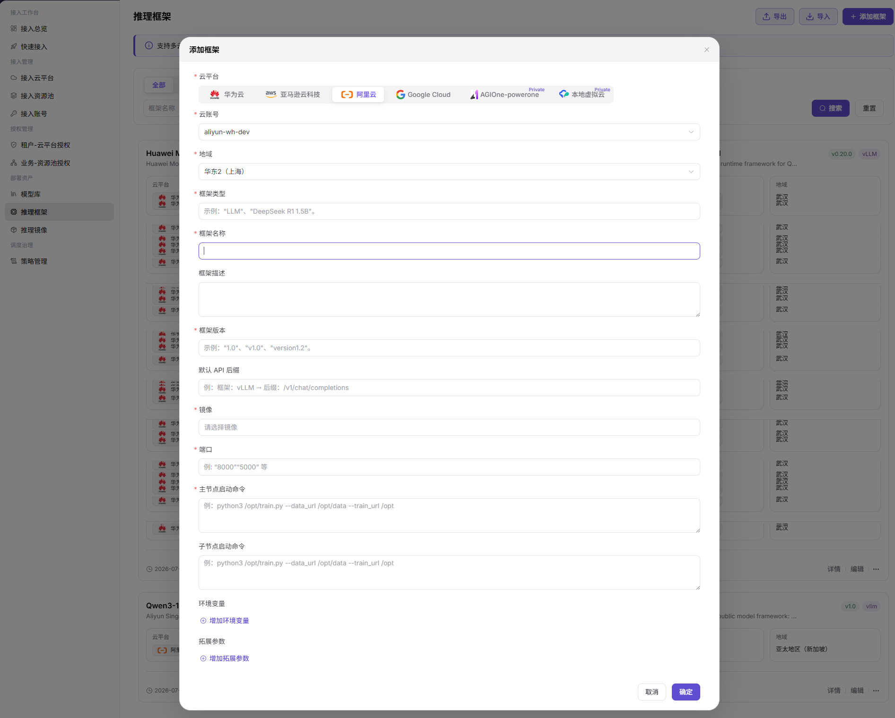

# 推理框架

::: info 文档信息
版本：v1.0
更新日期：2026-07-20
:::

## 功能概述

`推理框架` 用于维护模型部署时可选的运行框架。运营方可在该页面按云平台和地域新增框架，配置框架版本、镜像、端口、主节点启动命令、子节点启动命令、环境变量和拓展参数。

| 项目 | 内容 |
| --- | --- |
| 适用角色 | 运营方 |
| 导航路径 | AI Infra > On-Cloud > 部署资产 > 推理框架 |
| 页面路由 | /infrahub/op/model/framework |
| 管理对象 | 云平台、云账号、地域、框架类型、框架名称、版本、镜像和启动命令 |
| 典型用途 | 新增或维护模型库添加模型时可选择的推理框架 |

#### 新手理解

推理框架像模型部署时的运行说明书。它告诉平台使用哪个云平台和地域、拉取哪个镜像、监听哪个端口，以及主节点和子节点分别如何启动。

#### 术语速查

| 术语 | 说明 |
| --- | --- |
| 云平台 | 框架所属的云平台。 |
| 云账号 | 当前云平台下用于管理框架资源的账号。 |
| 地域 | 框架可用的云平台地域。 |
| 框架类型 | 框架能力或运行类型，例如 LLM、vLLM 等。 |
| 镜像 | 运行框架所需的容器镜像。 |
| 主节点启动命令 | 主节点容器启动框架服务时执行的命令。 |
| 子节点启动命令 | 子节点容器启动框架服务时执行的命令。 |

## 前提条件

1. 目标云平台、云账号和地域已接入并可用。
2. 需要使用的推理镜像已准备，并可在页面中选择。
3. 框架类型、版本、端口和启动命令已确认。
4. 环境变量和拓展参数已完成脱敏，不包含真实凭据或内部敏感参数。

## 页面说明

页面用于查看和新增推理框架。列表支持按云平台页签、`框架名称`、`框架类型` 筛选，提供 `搜索`、`重置`、`导出`、`导入` 和 `添加框架` 入口；框架卡片展示框架名称、描述、版本、框架类型、云平台、地域、更新时间，并提供 `详情`、`编辑` 和更多操作入口。

页面截图：

## 主要操作

### 添加框架

1. 进入 `AI Infra > On-Cloud > 部署资产 > 推理框架`。
2. 点击 `添加框架`，打开添加框架弹窗。
3. 选择 `云平台`，并按页面要求选择 `云账号` 和 `地域`。
4. 填写 `框架类型`、`框架名称`、`框架描述`、`框架版本` 和 `默认 API 后缀`。
5. 选择 `镜像`，填写 `端口`、`主节点启动命令` 和 `子节点启动命令`。
6. 如页面需要，点击 `增加环境变量` 或 `增加拓展参数` 补充运行参数。
7. 点击最终 `确定` 前，再次核对云平台、地域、框架版本、镜像、端口和启动命令。
8. 如仅学习或验证页面，请点击 `取消` 或关闭弹窗，不提交真实框架配置。

关键步骤截图：

## 参数说明

| 字段名称 | 是否必填 | 字段类型 | 示例 | 说明 |
| --- | --- | --- | --- | --- |
| 云平台 | 是 | 页签/单选 | `阿里云` | 选择框架所属云平台。 |
| 云账号 | 是 | 下拉选择 | `示例云账号` | 选择当前云平台下的云账号。 |
| 地域 | 是 | 下拉选择 | `华东2（上海）` | 选择框架可用地域。 |
| 框架类型 | 是 | 文本 | `LLM` | 填写框架类型，页面示例包含 `LLM` 等。 |
| 框架名称 | 是 | 文本 | `示例推理框架` | 框架在列表和模型配置中的展示名称。 |
| 框架描述 | 否 | 多行文本 | `示例说明` | 描述框架用途或适配场景，避免写入内部敏感信息。 |
| 框架版本 | 是 | 文本 | `v1.0` | 框架版本号。 |
| 默认 API 后缀 | 否 | 文本 | `/v1/chat/completions` | 模型服务默认 API 路径后缀。 |
| 镜像 | 是 | 下拉选择 | `示例镜像` | 选择运行框架使用的镜像。 |
| 端口 | 是 | 数字/文本 | `8000` | 框架服务监听端口。 |
| 主节点启动命令 | 是 | 多行文本 | `python3 /opt/start.py` | 主节点启动命令，示例需脱敏。 |
| 子节点启动命令 | 否 | 多行文本 | `python3 /opt/worker.py` | 子节点启动命令，按框架需要填写。 |
| 环境变量 | 否 | 键值配置 | `ENV_NAME=value` | 通过 `增加环境变量` 添加，禁止写入真实密钥。 |
| 拓展参数 | 否 | 键值配置 | `PARAM=value` | 通过 `增加拓展参数` 添加，禁止写入内部敏感参数。 |
| 导出 | 否 | 按钮 | `导出` | 导出框架配置，可能包含敏感运营信息。 |
| 导入 | 否 | 按钮 | `导入` | 批量导入框架配置，可能改变多条记录。 |
| 取消 | 否 | 按钮 | `取消` | 关闭弹窗且不保存本次配置。 |
| 确定 | 是 | 按钮 | `确定` | 最终提交框架配置，点击前需完成复核。 |

## 踩坑提示

- 框架版本、镜像和启动命令不匹配，可能导致部署后服务无法启动。
- 端口应与镜像和服务监听端口保持一致，否则可能出现部署成功但访问失败。
- 环境变量、拓展参数和启动命令禁止写入真实密钥、Token、内网地址或内部下载路径。
- `导入` 可能批量改变框架配置，学习或验证页面时不要执行真实导入。

## 结果校验

| 检查项 | 成功表现 | 异常时处理 |
| --- | --- | --- |
| 页面可进入 | 正常显示 `推理框架` 页面和框架列表。 | 检查菜单权限、路由和登录状态。 |
| 框架列表正常加载 | 框架卡片展示名称、版本、框架类型、云平台、地域和操作入口。 | 检查筛选条件、数据权限和接口状态。 |
| 添加入口可见 | 页面右上角显示 `添加框架`。 | 检查运营方权限和页面配置。 |
| 添加弹窗可打开 | 弹窗显示云平台、云账号、地域、框架类型、框架名称、版本、镜像、端口和启动命令等字段。 | 刷新页面后重试，仍异常时联系管理员。 |
| 必填字段和校验提示正常 | 必填字段缺失时页面显示校验提示，补齐后可继续。 | 按提示补齐字段，并核对云平台、云账号、地域和镜像状态。 |
| 仅学习时不提交 | 未点击最终 `确定`，未写入真实框架配置。 | 如误提交，立即检查框架列表和模型库可选项。 |
| 真实提交后可追踪 | 新框架出现在列表中，版本、云平台、地域和可用性可查看。 | 回到列表或详情页核对配置，并使用测试模型验证。 |

## 常见问题

#### 框架启动失败

**问题现象：**

部署实例创建后进入失败、反复重启或服务不可访问。

**可能原因：**

- 主节点或子节点启动命令参数错误。
- 镜像缺少框架依赖或版本不匹配。
- 端口、环境变量或拓展参数配置错误。

**处理方式：**

1. 查看部署事件和容器日志。
2. 核对框架版本、镜像、端口和启动命令。
3. 使用脱敏测试参数重新验证框架可用性。

#### 框架在模型配置中不可选

**问题现象：**

框架已添加，但在模型库添加模型或调整算力方案时不可选。

**可能原因：**

- 框架所属云平台、地域与模型部署点不一致。
- 框架类型或版本与模型要求不匹配。
- 镜像、云账号或地域状态异常。

**处理方式：**

1. 检查框架云平台、云账号和地域。
2. 核对模型部署点、模型类型和框架类型。
3. 确认镜像和相关授权配置可用。

## 后续操作

1. 在模型库添加模型时选择该框架并验证算力方案。
2. 使用测试模型创建部署，确认服务启动和健康检查结果。
3. 定期复核框架镜像、启动命令和环境变量，避免配置过期。

## 注意事项

- 添加框架可能影响模型部署可选运行环境和推理任务启动方式。
- 错误的框架版本、镜像或启动命令可能导致部署失败、资源浪费或服务异常。
- `确定`、`保存`、`提交` 属于高风险最终动作，文档只描述字段查看和提交前核对，不引导测试学习时提交。
- 不写入真实镜像仓库凭证、Token、AK/SK、内部启动参数、内网地址、云资源 ID 或内部测试参数。
