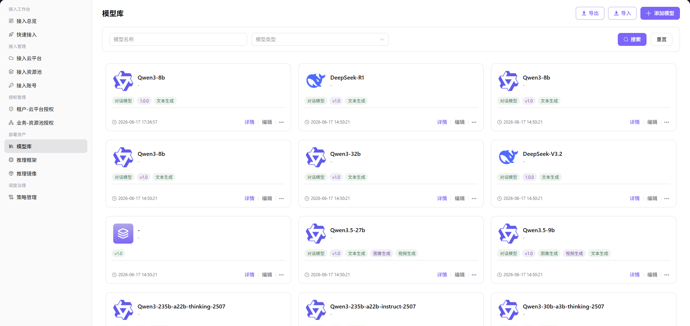

# 模型资产

## 功能概述

`模型资产` 用于维护可部署模型、元模型、输出配置、请求参数和代码示例，支撑多云调度、资源授权和模型部署流程。

| 项目 | 内容 |
| --- | --- |
| 适用角色 | 运营方 |
| 导航路径 | 部署资产 > 模型 |
| 页面路由 | /operator/deploy-assets/models |
| 管理对象 | 可部署模型、元模型、输出配置、请求参数和代码示例 |
| 典型用途 | 维护云上可部署模型资产 |

### 新手理解

模型资产像部署菜单里的菜品说明，告诉用户可部署哪些模型、模型属于哪个元模型、调用参数是什么，以及部署后如何生成调用示例。

### 术语速查

| 术语 | 说明 |
| --- | --- |
| 元模型 | 描述模型基础能力和协议的抽象模型。 |
| 输出配置 | 部署后生成调用地址、请求方法、请求头和参数的配置。 |
| 模型参数 | 传递给模型服务的默认请求参数。 |
| 代码示例 | 面向调用方生成的 SDK、curl 或 HTTP 示例。 |

## 前提条件

1. 元模型、供应方和部署框架已准备。
2. 请求 URL、默认参数和输出配置已确认。
3. 模型资产授权范围和业务地域已确认。
## 页面说明

页面用于维护可部署模型资产，包括模型名称、元模型、供应方、请求参数、输出配置和代码示例。运营方应确保模型资产与部署框架、运行镜像和授权资源保持一致。

页面截图：

用于查看可部署模型、元模型和部署配置。

## 主要操作

### 操作步骤

1. 进入 `部署资产 > 模型`。
2. 按模型名称、元模型、供应方或启用状态筛选。
3. 新增模型资产时填写模型名称、元模型和供应方信息。
4. 配置请求 URL 占位示例、请求参数、输出字段和代码示例。
5. 保存后在快速部署页面确认用户可选择该模型。

关键步骤截图：

先确认模型能力和元模型匹配。

部署点决定模型可部署到哪些云资源。

计算方案需与资源池容量和调度策略一致。

提交前确认配置中没有真实密钥和内部 Endpoint。

### 参数说明

| 字段名称 | 是否必填 | 字段类型 | 示例 | 说明 |
| --- | --- | --- | --- | --- |
| 模型名称 | 是 | 文本 | `qwen-cloud-7b` | 云部署资产展示名称。 |
| 元模型 | 是 | 下拉选择 | `Qwen Text` | 关联模型能力、协议和模态。 |
| 供应方 | 条件必填 | 下拉选择 | `provider-a` | 模型来源或云厂商供应方。 |
| 请求 URL | 条件必填 | URL | `https://api.example.com/v1/chat/completions` | 仅使用占位符，禁止写真实内部地址。 |
| 默认参数 | 否 | JSON | `{"max_tokens":1024}` | 部署调用时的默认请求参数。 |

### 踩坑提示

- 模型资产启用前要确认框架、镜像和资源规格均可用。
- 请求 URL、请求头和代码示例只能使用占位符。
- 下架模型资产前先检查是否已有用户部署依赖。

### 结果校验

1. 模型资产在列表中可见且状态为启用。
2. 快速部署页能选择该模型。
3. 生成的调用示例不包含真实凭据或内部地址。

## 常见问题

### 用户部署页看不到模型

**问题现象：**

模型资产已创建，但用户快速部署时不可选。

**可能原因：**

- 模型资产未启用。
- 未绑定可用框架或运行镜像。
- 模型未授权到用户所在业务地域。

**处理方式：**

1. 确认模型资产启用状态。
2. 核对框架、镜像和资源规格关联。
3. 检查租户和业务地域授权。

### 部署后调用示例错误

**问题现象：**

服务创建成功，但调用示例中的路径或参数不可用。

**可能原因：**

- 输出配置字段映射错误。
- 元模型协议与请求参数不匹配。
- 代码示例仍使用旧版本参数。

**处理方式：**

1. 检查输出配置和协议路径。
2. 核对元模型默认参数。
3. 重新生成或更新代码示例。

## 后续操作

1. 维护部署框架和运行镜像。
2. 配置业务地域授权。
3. 使用普通用户视角创建一次快速部署。

## 注意事项

- 请求 URL 和请求头只能使用占位符。
- 模型下架前检查已有部署依赖。
- 调用示例不要包含真实凭据。
