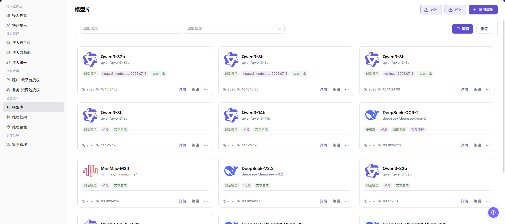
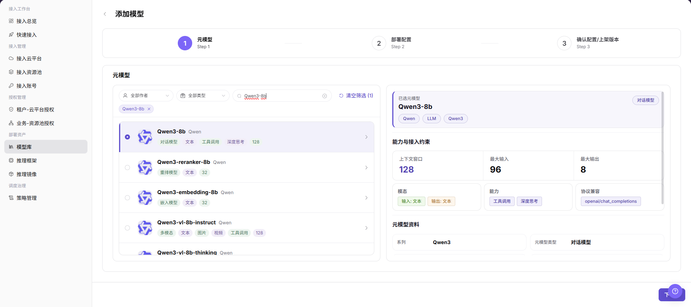
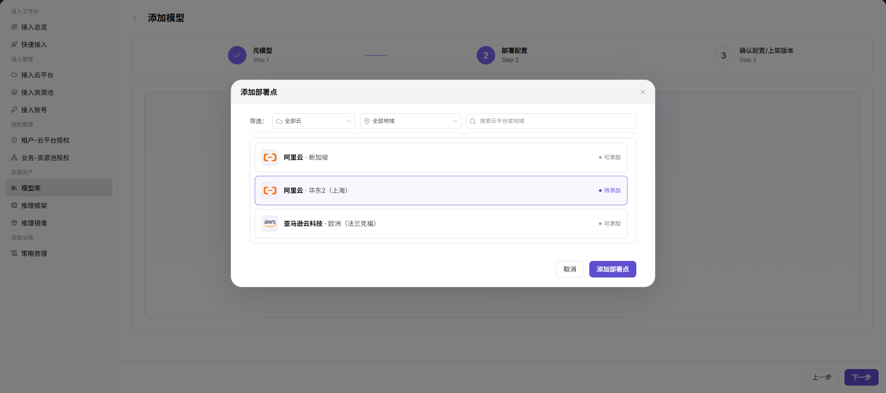
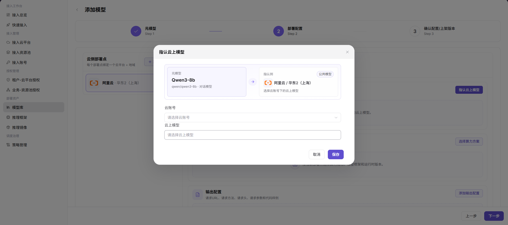
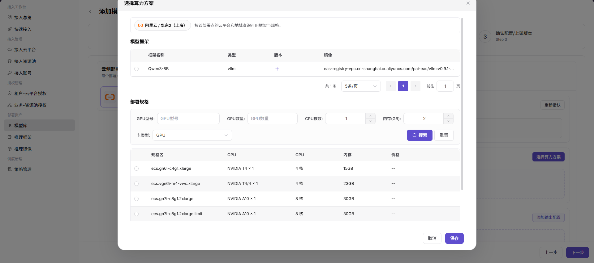
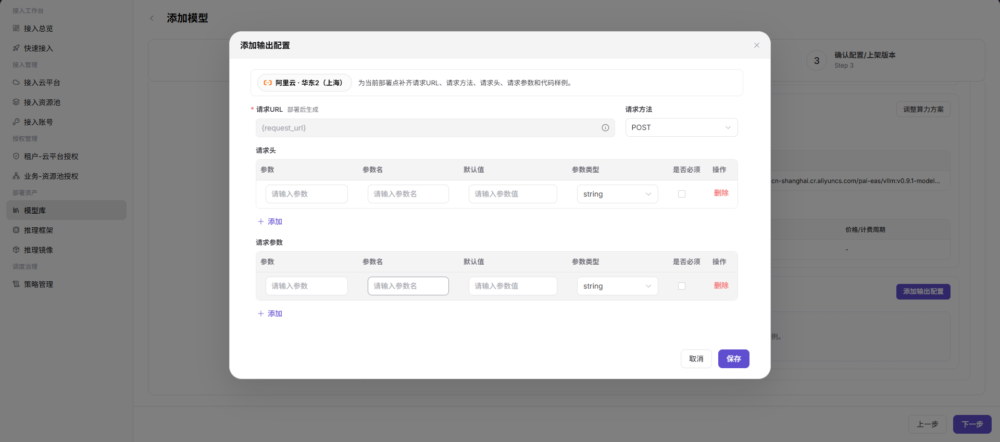
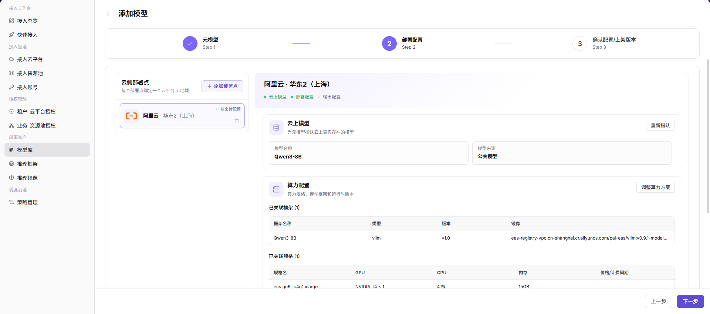

# 模型库

::: info 文档信息
版本：v1.0
更新日期：2026-07-20
:::

## 功能概述

`模型库` 用于维护可在云上部署的模型资产。运营方可在该页面查看模型列表，并通过 `添加模型` 流程选择元模型、配置云侧部署点、指认云上模型、选择算力方案并补充输出配置。

| 项目 | 内容 |
| --- | --- |
| 适用角色 | 运营方 |
| 导航路径 | AI基础设施 > On-Cloud > 部署资产 > 模型库 |
| 页面路由 | `/infrahub/op/model/model` |
| 管理对象 | 模型、元模型、云侧部署点、云上模型、算力配置和输出配置 |
| 典型途径 | 新增可部署模型资产，并供后续快速接入或部署流程选择 |

#### 新手理解

模型库像部署流程里的模型货架。`添加模型` 会先选择模型能力定义，再把它绑定到具体云平台、地域、云上模型和算力配置，最后补充部署后的请求地址、方法、参数和代码示例。

#### 术语速查

| 术语 | 说明 |
| --- | --- |
| 元模型 | 描述模型能力、模态、协议兼容性和上下文窗口的基础模型定义。 |
| 云侧部署点 | 由云平台和地域组成的部署目标。 |
| 云上模型 | 云账号下真实存在或可引用的云侧模型。 |
| 算力方案 | 模型框架、镜像、CPU、内存、GPU 和规格等运行配置。 |
| 输出配置 | 部署后用于生成请求 URL、请求方法、请求头、请求参数和代码样例的配置。 |

## 前提条件

1. 目标元模型已在平台中配置，并可在 `元模型` 步骤中选择。
2. 需要使用的云平台、地域、云账号和云上模型已接入。
3. 模型框架、推理镜像和可用规格已准备。
4. 已确认模型来源、运行配置、输出配置和授权范围。

## 页面说明

页面用于查看和新增模型资产。列表支持按 `模型名称`、`模型类型` 筛选，提供 `搜索`、`重置`、`导出`、`导入`、`添加模型` 入口；模型卡片展示模型名称、模型标识、模型类型、版本、能力标签、更新时间，并提供 `详情`、`编辑` 和更多操作入口。

页面截图：

## 主要操作

### 添加模型

1. 进入 `AI Infra > On-Cloud > 部署资产 > 模型库`。
2. 点击 `添加模型`，进入添加模型页面。
3. 在 `元模型` 步骤中按作者、类型或关键词筛选，选择目标元模型，并核对已选元模型、能力与接入约束、模态、能力、协议兼容和元模型资料。
4. 点击 `下一步` 进入 `部署配置`。
5. 点击 `添加部署点`，按页面筛选项选择云平台和地域后保存部署点。
6. 在部署点中点击 `指认云上模型`，选择 `云账号` 和 `云上模型` 后点击 `保存`。
7. 点击 `选择算力方案` 或 `调整算力方案`，选择模型框架、镜像和部署规格，核对 GPU、CPU、内存和价格/计费周期后点击 `保存`。
8. 点击 `添加输出配置`，配置请求 URL、请求方法、请求头、请求参数、参数类型、是否必填等信息后点击 `保存`。
9. 点击 `下一步` 进入 `确认配置/上架版本` 前，再次核对模型来源、云侧部署点、云上模型、算力方案和输出配置。
10. 如仅学习或验证页面，请停留在查看和字段核对阶段，不提交真实模型配置或上架版本。

关键步骤截图：

## 参数说明

| 字段名称 | 是否必填 | 字段类型 | 示例 | 说明 |
| --- | --- | --- | --- | --- |
| 模型名称 | 是 | 文本 | `示例模型` | 模型库列表和详情中展示的模型名称。 |
| 模型类型 | 否 | 下拉选择/标签 | `对话模型` | 用于筛选或标识模型能力类型。 |
| 元模型 | 是 | 单选 | `示例元模型` | 添加模型第一步选择的基础模型定义。 |
| 云侧部署点 | 是 | 列表/选择 | `示例云平台 - 示例地域` | 每个部署点绑定一个云平台和地域。 |
| 云账号 | 条件必填 | 下拉选择 | `示例云账号` | 指认云上模型时选择的云账号。 |
| 云上模型 | 条件必填 | 下拉选择 | `示例云上模型` | 云账号下可被当前模型绑定的云侧模型。 |
| 模型框架 | 是 | 单选/表格 | `示例框架` | 选择可运行该模型的框架。 |
| 类型 | 否 | 文本 | `vllm` | 模型框架类型。 |
| 版本 | 否 | 文本 | `v1.0` | 框架或模型版本。 |
| 镜像 | 是 | 文本 | `registry.example.com/runtime:tag` | 运行镜像地址，文档中仅使用占位符。 |
| GPU型号 | 否 | 文本 | `示例 GPU` | 筛选部署规格时使用。 |
| GPU数量 | 否 | 数字 | `1` | 筛选部署规格时使用。 |
| CPU核数 | 否 | 数字 | `4` | 部署规格中的 CPU 配置。 |
| 内存(GB) | 否 | 数字 | `16` | 部署规格中的内存配置。 |
| 卡类型 | 否 | 下拉选择 | `GPU` | 筛选规格时选择的卡类型。 |
| 规格名 | 是 | 单选 | `example.spec` | 实际部署规格名称。 |
| 价格/计费周期 | 否 | 文本 | `--` | 页面展示的价格或计费周期，配置前需确认成本影响。 |
| 请求URL | 是 | 文本 | `{request_url}` | 部署后生成，请勿写入真实内部地址。 |
| 请求方法 | 是 | 下拉选择 | `POST` | 输出配置中的请求方法。 |
| 请求头 | 否 | 表格 | `Authorization` | 请求头配置，禁止写入真实凭据。 |
| 请求参数 | 否 | 表格 | `temperature` | 请求参数配置。 |
| 参数类型 | 否 | 下拉选择 | `string` | 请求头或请求参数的类型。 |
| 是否必须 | 否 | 复选框 | `是` | 标记参数是否必填。 |
| 保存 | 是 | 按钮 | `保存` | 保存当前弹窗或配置块。 |
| 下一步 | 是 | 按钮 | `下一步` | 进入下一阶段配置。 |

## 踩坑提示

- 添加模型是多步骤配置，元模型、云上模型、框架、镜像和规格不一致会导致后续部署失败。
- 镜像地址、请求 URL、请求头、参数默认值和代码样例只能使用占位符或脱敏内容。
- `导入` 可能批量改变模型资产，`导出` 可能包含敏感运营配置，学习验证时不要执行真实导入或导出。
- 截图未展示单独的存储路径字段，本文不将存储路径写成已确认 UI 字段。

## 结果校验

| 检查项 | 成功表现 | 异常时处理 |
| --- | --- | --- |
| 页面可进入 | 正常显示 `模型库` 页面和模型卡片列表。 | 检查菜单权限、路由和登录状态。 |
| 模型列表正常加载 | 列表展示模型名称、模型类型、版本、标签和操作入口。 | 检查筛选条件、数据权限和接口状态。 |
| 添加入口可见 | 页面右上角显示 `添加模型`。 | 检查运营方权限和页面配置。 |
| 添加流程可打开 | 进入 `元模型`、`部署配置`、`确认配置/上架版本` 三步流程。 | 刷新页面后重试，仍异常时联系管理员。 |
| 必填字段和校验提示正常 | 元模型、部署点、云账号、云上模型、算力方案和输出配置能按页面提示配置。 | 按提示补齐字段，并核对云平台、账号和资源状态。 |
| 仅学习时不提交 | 未执行真实保存、提交或上架动作。 | 如误提交，立即检查模型资产、部署点和输出配置影响范围。 |
| 真实提交后可追踪 | 新模型出现在列表中，状态、部署点、框架和输出配置可查看。 | 回到模型详情页核对配置并检查下游部署流程。 |

## 常见问题

#### 用户部署页看不到模型

**问题现象：**

模型资产已创建，但用户在快速接入或部署流程中不可选。

**可能原因：**

- 模型配置未完成或未上架。
- 云侧部署点、云上模型、算力方案或输出配置缺失。
- 租户-云平台授权或业务-资源池授权不完整。

**处理方式：**

1. 检查模型详情中的部署点、云上模型、算力方案和输出配置。
2. 确认模型是否已完成确认配置或上架流程。
3. 核对租户和业务地域相关授权。

#### 部署后调用示例错误

**问题现象：**

服务创建成功，但调用示例中的 URL、请求方法、请求头或参数不可用。

**可能原因：**

- 输出配置字段映射错误。
- 请求头或请求参数缺少必要字段。
- 代码样例仍使用旧版本参数或未脱敏内容。

**处理方式：**

1. 检查输出配置中的请求 URL、请求方法、请求头和请求参数。
2. 核对参数类型、默认值和是否必填。
3. 重新保存输出配置并重新生成调用示例。

## 后续操作

1. 在模型详情页复核部署点、算力方案和输出配置。
2. 配置或检查租户-云平台授权、业务-资源池授权。
3. 使用用户视角验证快速接入或部署流程是否可选择该模型。

## 注意事项

- 添加模型可能登记真实模型文件、镜像地址、云上模型和运行配置。
- 错误的模型来源、镜像、文件路径或运行框架可能导致部署失败、资源浪费或暴露敏感模型资产。
- `保存`、`提交`、`确定`、`上架` 属于高风险最终动作，文档只描述字段查看和提交前核对，不引导测试学习时提交。
- 不写入真实模型仓库地址、密钥、Token、AK/SK、内部存储路径、云资源 ID、内部 Endpoint 或内部测试参数。
