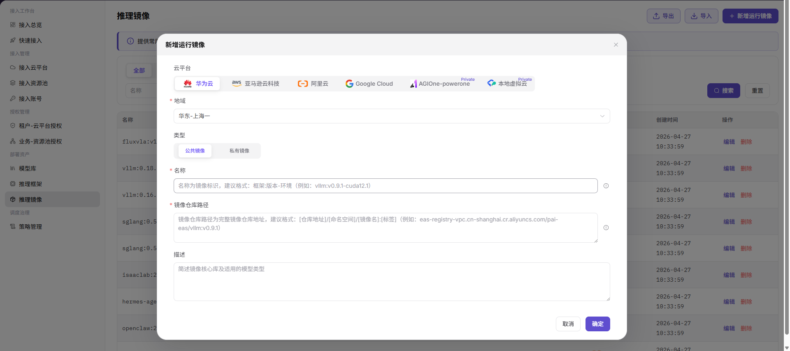

# 推理镜像

::: info 文档信息
版本：v1.0
更新日期：2026-07-20
:::

## 功能概述

`推理镜像` 用于维护多云、多地域可用的原生容器镜像资源。运营方可在该页面按云平台和地域新增运行镜像，供推理框架或模型部署流程选择使用。

| 项目 | 内容 |
| --- | --- |
| 适用角色 | 运营方 |
| 导航路径 | AI Infra > On-Cloud > 部署资产 > 推理镜像 |
| 页面路由 | /infrahub/op/model/image |
| 管理对象 | 云平台、地域、镜像名称、镜像类型、镜像大小、镜像仓库路径和操作入口 |
| 典型用途 | 新增可用于推理框架和模型部署的运行镜像 |

#### 新手理解

推理镜像像模型服务的运行环境包。镜像里通常包含框架依赖、驱动、服务程序和基础工具；镜像路径或版本不匹配时，后续部署可能无法拉取镜像或启动服务。

#### 术语速查

| 术语 | 说明 |
| --- | --- |
| 云平台 | 镜像所属或可使用的云平台。 |
| 地域 | 镜像所在或可拉取的云平台地域。 |
| 类型 | 镜像可见范围，页面支持 `公共镜像` 和 `私有镜像`。 |
| 名称 | 镜像标识名称，建议体现框架、版本和环境。 |
| 镜像仓库路径 | 完整镜像仓库地址，通常包含仓库地址、命名空间、镜像名和标签。 |

## 前提条件

1. 目标云平台和地域已接入并可用。
2. 需要登记的镜像已构建完成，并确认可被目标资源环境拉取。
3. 镜像名称、镜像仓库路径、镜像类型和描述信息已完成脱敏。
4. 如镜像仓库需要凭据，凭据应在平台安全配置中维护，不写入文档。

## 页面说明

页面用于查看和新增推理镜像。列表支持按云平台页签、`名称`、`类型` 筛选，提供 `搜索`、`重置`、`导出`、`导入` 和 `新增运行镜像` 入口；表格展示 `名称`、`类型`、`大小`、`镜像仓库路径`、`云平台`、`创建时间` 和 `操作`，并提供 `编辑`、`删除` 等入口。

页面截图：

## 主要操作

### 新增运行镜像

1. 进入 `AI Infra > On-Cloud > 部署资产 > 推理镜像`。
2. 点击 `新增运行镜像`，打开新增运行镜像弹窗。
3. 选择 `云平台`，并按页面要求选择 `地域`。
4. 在 `类型` 中选择 `公共镜像` 或 `私有镜像`。
5. 填写 `名称`、`镜像仓库路径` 和 `描述`。
6. 点击最终 `确定` 前，再次核对云平台、地域、镜像类型、名称和镜像仓库路径。
7. 如仅学习或验证页面，请点击 `取消` 或关闭弹窗，不提交真实镜像配置。

关键步骤截图：

## 参数说明

| 字段名称 | 是否必填 | 字段类型 | 示例 | 说明 |
| --- | --- | --- | --- | --- |
| 云平台 | 是 | 页签/单选 | `阿里云` | 选择镜像所属或可使用的云平台。 |
| 地域 | 是 | 下拉选择 | `华东-上海一` | 选择镜像所在或可用地域。 |
| 类型 | 是 | 分段选择 | `公共镜像` | 选择公共镜像或私有镜像。 |
| 名称 | 是 | 文本 | `framework:v1.0-runtime` | 镜像标识名称，建议体现框架、版本和环境。 |
| 镜像仓库路径 | 是 | 多行文本 | `registry.example.com/namespace/image:tag` | 完整镜像仓库路径，文档中仅使用占位地址。 |
| 描述 | 否 | 多行文本 | `示例运行镜像说明` | 简要描述镜像核心依赖和适用模型类型，避免写入内部敏感信息。 |
| 大小 | 否 | 文本 | `16 GB` | 列表中展示的镜像大小。 |
| 创建时间 | 否 | 日期时间 | `2026-07-20 10:00:00` | 列表中展示的镜像创建时间。 |
| 搜索 | 否 | 按钮 | `搜索` | 按当前筛选条件查询镜像记录。 |
| 重置 | 否 | 按钮 | `重置` | 清空筛选条件并恢复列表展示。 |
| 导出 | 否 | 按钮 | `导出` | 导出镜像记录，可能包含敏感运营配置。 |
| 导入 | 否 | 按钮 | `导入` | 批量导入镜像记录，可能改变多条配置。 |
| 编辑 | 否 | 操作入口 | `编辑` | 修改已有镜像配置前需确认影响范围。 |
| 删除 | 否 | 操作入口 | `删除` | 删除镜像记录可能影响后续部署选择。 |
| 取消 | 否 | 按钮 | `取消` | 关闭弹窗且不保存本次配置。 |
| 确定 | 是 | 按钮 | `确定` | 最终提交运行镜像配置，点击前需完成复核。 |

## 踩坑提示

- 镜像仓库路径应使用固定标签，避免长期依赖 `latest` 这类不稳定标签。
- 镜像仓库凭据、拉取密钥、Token、内网地址不应写入文档、截图或工单。
- 错误的云平台、地域或镜像路径会导致后续部署镜像拉取失败。
- 截图未展示启动命令、运行参数、适用框架或拉取凭据字段，本文不将这些内容写成已确认 UI 字段。

## 结果校验

| 检查项 | 成功表现 | 异常时处理 |
| --- | --- | --- |
| 页面可进入 | 正常显示 `推理镜像` 页面和镜像列表。 | 检查菜单权限、路由和登录状态。 |
| 运行镜像列表正常加载 | 表格展示名称、类型、大小、镜像仓库路径、云平台、创建时间和操作入口。 | 检查筛选条件、数据权限和接口状态。 |
| 新增入口可见 | 页面右上角显示 `新增运行镜像`。 | 检查运营方权限和页面配置。 |
| 新增弹窗可打开 | 弹窗显示云平台、地域、类型、名称、镜像仓库路径、描述、取消和确定。 | 刷新页面后重试，仍异常时联系管理员。 |
| 必填字段和校验提示正常 | 必填字段缺失时页面显示校验提示，补齐后可继续。 | 按提示补齐云平台、地域、类型、名称和镜像仓库路径。 |
| 仅学习时不提交 | 未点击最终 `确定`，未写入真实镜像配置。 | 如误提交，立即检查镜像列表和后续框架引用。 |
| 真实提交后可追踪 | 新运行镜像出现在列表中，类型、云平台、仓库路径和创建时间可查看。 | 回到列表或详情页核对配置，并用测试部署验证拉取。 |

## 排障路径

| 问题类型 | 先检查 | 下一步 |
| --- | --- | --- |
| 镜像拉取失败 | 云平台、地域、镜像仓库路径和镜像标签是否正确。 | 使用测试部署验证拉取，并检查仓库访问权限。 |
| 镜像记录不可见 | 筛选条件、云平台页签和数据权限。 | 点击 `重置` 后重新搜索，仍异常时联系管理员。 |
| 服务启动失败 | 镜像内容、框架依赖、驱动版本和启动配置。 | 回到推理框架或模型库核对运行配置。 |
| 镜像误删或误改 | 操作记录和受影响模型部署范围。 | 暂停相关部署变更，并恢复或重新新增正确镜像。 |

## 常见问题

#### 镜像拉取失败

**问题现象：**

部署事件显示 image pull 或认证失败。

**可能原因：**

- 镜像仓库路径或标签错误。
- 镜像仓库凭据无效或未配置。
- 目标资源环境无法访问镜像仓库。

**处理方式：**

1. 核对云平台、地域和镜像仓库路径。
2. 在平台安全配置中更新仓库凭据或拉取权限。
3. 检查资源环境到镜像仓库的网络连通性。

#### 镜像可拉取但服务启动失败

**问题现象：**

镜像拉取成功后容器退出、反复重启或健康检查失败。

**可能原因：**

- 镜像缺少框架依赖。
- 驱动或运行时版本不匹配。
- 推理框架中的启动命令与镜像目录结构不一致。

**处理方式：**

1. 查看部署事件和容器日志。
2. 核对镜像依赖、驱动版本和运行环境。
3. 调整推理框架配置或更换兼容镜像。

## 后续操作

1. 在推理框架中选择或引用该运行镜像。
2. 在模型库添加模型时验证该镜像是否可用于算力方案。
3. 使用测试部署验证镜像拉取、服务启动和健康检查结果。

## 注意事项

- 新增运行镜像可能影响模型部署可选镜像和推理任务运行环境。
- 错误的镜像仓库路径、标签、启动命令或运行参数可能导致部署失败、资源浪费或服务异常。
- 镜像仓库凭据可能包含敏感信息，不能写入文档。
- `确定`、`保存`、`提交` 属于高风险最终动作，文档只描述字段查看和提交前核对，不引导测试学习时提交。
- 不写入真实镜像仓库凭据、Token、AK/SK、内网镜像地址、云资源 ID 或内部测试参数。
