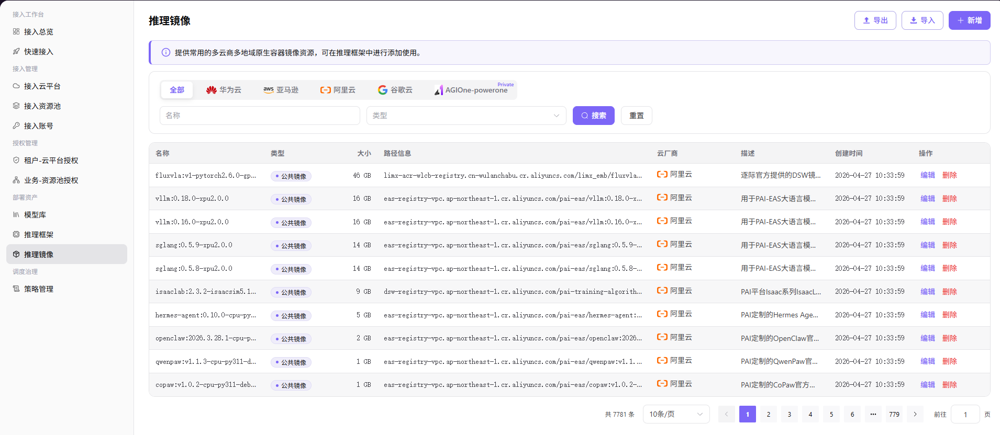

# 运行镜像

::: info 文档信息
版本：v1.0
更新日期：2026-07-06
:::

::: warning 安全提示
运行镜像页面涉及镜像仓库地址、tag、拉取凭据和运行依赖。不要暴露私有仓库地址、robot 凭据、Image Pull Secret 或内部镜像命名规则。
:::

## 功能概述

`运行镜像` 用于维护容器镜像、镜像标签、框架依赖和适用资源类型，支撑多云调度、资源授权和模型部署流程。

| 项目 | 内容 |
| --- | --- |
| 适用角色 | 运营方 |
| 导航路径 | 部署资产 > 运行镜像 |
| 页面路由 | /operator/deploy-assets/runtime-images |
| 管理对象 | 容器镜像、镜像标签、框架依赖和适用资源类型 |
| 典型用途 | 维护云部署使用的运行环境镜像 |

### 新手理解

运行镜像像模型服务的运行环境包，里面包含框架依赖、驱动、推理服务和基础工具。镜像不匹配时，资源再充足也可能启动失败。

### 术语速查

| 术语 | 说明 |
| --- | --- |
| 运行镜像 | 模型部署使用的容器环境。 |
| 镜像标签 | 镜像版本标识，例如 `v1.0.0`。 |
| 拉取权限 | 云端实例拉取镜像所需的仓库授权。 |
| 依赖版本 | 框架、驱动和 Python 包等运行依赖版本。 |

## 前提条件

1. 镜像仓库地址、tag 和拉取凭据已准备。
2. 镜像与框架、驱动和加速卡类型兼容。
3. 资源池到镜像仓库网络可达。
## 页面说明

页面用于维护云模型部署可使用的运行镜像，包括镜像地址、版本标签、框架兼容性、驱动要求和启用状态。运营方应按框架和加速卡类型维护镜像矩阵。

页面截图：

用于查看镜像名称、标签、状态和适用框架。

## 主要操作

### 操作步骤

1. 进入 `部署资产 > 运行镜像`。
2. 按框架、镜像标签、状态或关键字筛选。
3. 新增镜像时填写镜像仓库地址、tag、兼容框架和驱动要求。
4. 确认镜像仓库凭据或拉取权限已配置。
5. 保存后用对应框架创建测试部署验证镜像可拉取。

关键步骤截图：

新增前确认镜像来源可信且不含敏感凭据。

### 参数说明

| 字段名称 | 是否必填 | 字段类型 | 示例 | 说明 |
| --- | --- | --- | --- | --- |
| 镜像名称 | 是 | 文本 | `vllm-runtime` | 部署页展示名称。 |
| 镜像地址 | 是 | 文本 | `registry.example.com/ai/vllm:latest` | 使用占位仓库地址，避免真实内网地址。 |
| 兼容框架 | 是 | 多选 | `vLLM` | 可搭配的部署框架。 |
| 驱动要求 | 否 | 文本 | `CUDA 12.x` | 加速卡和运行时要求。 |
| 启用状态 | 是 | 枚举 | `启用` | 控制部署页是否可选择。 |

### 踩坑提示

- 镜像 tag 不要长期依赖 `latest`，生产建议使用固定版本。
- 镜像仓库凭据不要写入文档或截图。
- 驱动、CUDA 或 NPU 运行时不匹配会导致实例启动失败。

### 结果校验

1. 镜像记录处于启用状态。
2. 部署框架能关联该镜像。
3. 测试部署事件显示镜像拉取和服务启动成功。

## 常见问题

### 镜像拉取失败

**问题现象：**

部署事件显示 image pull 或认证失败。

**可能原因：**

- 镜像地址或 tag 错误。
- 镜像仓库凭据无效。
- 资源池网络无法访问仓库。

**处理方式：**

1. 核对镜像地址和 tag。
2. 更新仓库凭据或拉取密钥。
3. 检查资源池到仓库的网络连通性。

### 镜像可拉取但服务启动失败

**问题现象：**

镜像拉取成功后容器退出或健康检查失败。

**可能原因：**

- 镜像缺少框架依赖。
- 驱动或运行时版本不匹配。
- 启动命令与镜像目录结构不一致。

**处理方式：**

1. 查看容器日志。
2. 核对框架依赖和驱动版本。
3. 调整启动命令或更换兼容镜像。

## 后续操作

1. 关联部署框架。
2. 维护模型资产。
3. 用目标资源池创建测试部署。

## 注意事项

- 生产镜像建议使用固定 tag。
- 仓库凭据不要写入文档或截图。
- 镜像更新后用测试部署验证拉取和启动。
