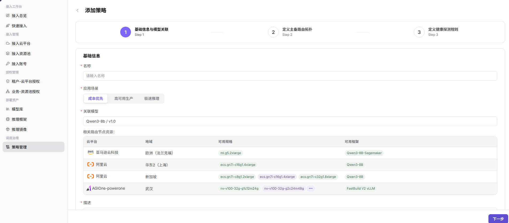
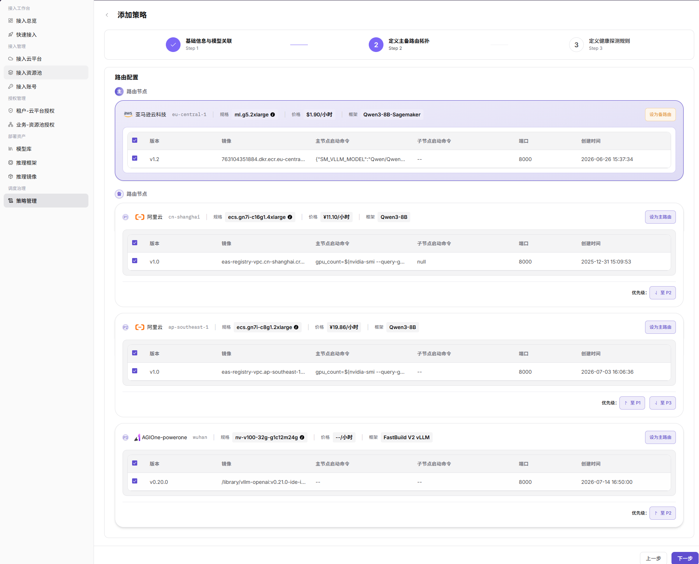

# 策略管理

::: info 文档信息
版本：v1.0
更新日期：2026-07-21
:::

## 功能概述

`策略管理` 用于为模型配置高可用策略，通过主备路由、优先级和健康探测规则，实现多云部署场景下的智能路由和故障转移。

| 项目 | 内容 |
| --- | --- |
| 适用角色 | 运营方 |
| 导航路径 | AI基础设施 > On-Cloud > 调度治理 > 策略管理 |
| 页面路由 | `/infrahub/op/schedule/policy` |
| 管理对象 | 策略名称、标签 ID、应用场景、关联模型、路由拓扑、健康探测规则和操作入口 |
| 典型途径 | 新增模型高可用策略，并配置主备路由、优先级和健康探测规则 |

#### 新手理解

策略管理像模型部署的路由和健康检查规则。它决定模型服务优先使用哪个路由节点，哪些节点作为备路由，以及服务异常时如何通过健康探测识别并触发切换。

#### 术语速查

| 术语 | 说明 |
| --- | --- |
| 策略 | 面向模型的高可用路由配置，包含基础信息、模型关联、主备路由和健康探测规则。 |
| 应用场景 | 策略适用的调度目标，页面支持 `成本优先`、`高可用生产` 和 `极速推理`。 |
| 关联模型 | 策略绑定的模型及版本，决定后续可选择的路由节点资源。 |
| 主路由 | 策略优先使用的路由节点。 |
| 备路由 | 主路由不可用或需要切换时的备用路由节点。 |
| 健康探测 | 用于判断服务是否可用的检测方式和阈值规则。 |

## 前提条件

1. 云平台、资源池、模型库、推理框架和推理镜像已完成接入并可用。
2. 需要关联的模型、版本、可用规格、可用框架、镜像和启动命令已完成核对。
3. 策略名称、标签 ID 和描述已完成脱敏，不包含真实客户、租户、业务或内部测试信息。
4. 主备路由、优先级和健康探测阈值已结合业务可用性、成本和延迟要求完成评估。

## 页面说明

页面用于查看和新增模型高可用策略。列表支持按 `名称`、`标签ID` 筛选，提供 `搜索`、`重置`、`导出`、`导入`、`批量删除` 和 `新建策略` 入口；无数据时显示 `暂无数据`。

页面截图：

新增策略流程包含 `基础信息与模型关联`、`定义主备路由拓扑` 和 `定义健康探测规则` 三个步骤。

## 主要操作

### 新增策略

1. 进入 `AI Infra > On-Cloud > 调度治理 > 策略管理`。
2. 在策略管理列表中点击 `新建策略`，进入 `添加策略` 页面。
3. 在 `基础信息与模型关联` 步骤中填写 `名称`，选择 `应用场景`，并选择 `关联模型`。
4. 查看 `相关路由节点资源`，核对 `云平台`、`地域`、`可用规格` 和 `可用框架`，再填写 `描述`。

5. 点击 `下一步`，进入 `定义主备路由拓扑`。
6. 在 `路由配置` 中选择路由节点，使用 `设为备路由`、`设为主路由` 或优先级入口调整主备关系和排序。
7. 核对每个路由节点的 `规格`、`价格`、`框架`、`版本`、`镜像`、`主节点启动命令`、`子节点启动命令`、`端口` 和 `创建时间`。

8. 点击 `下一步`，进入 `定义健康探测规则`。
9. 选择 `探测方式`，页面支持 `HTTP心跳`、`性能指标(GPU)` 和 `服务状态`。
10. 填写或核对 `检测路径`、`检测频率`、`失败阈值`、`恢复逻辑` 和 `宕机判定超时时间`。

11. 点击最终 `提交` 前，再次核对策略规则、主备路由、优先级、健康探测和影响范围。
12. 如仅学习或验证页面，请点击 `上一步` 或关闭页面，不提交真实策略配置。

## 参数说明

| 字段名称 | 是否必填 | 字段类型 | 示例 | 说明 |
| --- | --- | --- | --- | --- |
| 名称 | 是 | 文本 | `policy-cost-priority-demo` | 策略展示名称，应使用脱敏示例或业务可识别的非敏感名称。 |
| 标签ID | 否 | 文本 | `label-demo` | 列表筛选字段，用于按标签标识检索策略。 |
| 应用场景 | 是 | 分段选择 | `成本优先` | 选择策略目标，页面支持成本优先、高可用生产和极速推理。 |
| 关联模型 | 是 | 选择框 | `示例模型 / v1.0` | 选择策略绑定的模型及版本。 |
| 云平台 | 否 | 表格字段 | `示例云平台` | 相关路由节点资源所属云平台。 |
| 地域 | 否 | 表格字段 | `示例地域` | 相关路由节点资源所在地域。 |
| 可用规格 | 否 | 表格字段 | `gpu.example` | 当前模型可使用的资源规格。 |
| 可用框架 | 否 | 表格字段 | `示例框架` | 当前模型可使用的推理框架。 |
| 描述 | 是 | 多行文本 | `示例策略说明` | 描述策略用途，避免写入真实客户、租户、业务或内部测试参数。 |
| 路由节点 | 是 | 选择项 | `主路由节点` | 在路由配置中选择参与策略的节点。 |
| 主路由 | 是 | 操作状态 | `主` | 策略优先使用的路由节点。 |
| 备路由 | 否 | 操作状态 | `备` | 主路由不可用时的备用路由节点。 |
| 优先级 | 否 | 排序控件 | `P1` | 调整备路由或候选节点的优先顺序。 |
| 规格 | 否 | 展示字段 | `gpu.example` | 路由节点使用的资源规格。 |
| 价格 | 否 | 展示字段 | `示例价格/小时` | 路由节点的费用参考，文档中不展示真实金额明细。 |
| 框架 | 否 | 展示字段 | `示例框架` | 路由节点使用的推理框架。 |
| 版本 | 否 | 表格字段 | `v1.0` | 镜像或运行配置版本。 |
| 镜像 | 否 | 表格字段 | `registry.example.com/namespace/image:tag` | 镜像地址示例仅使用占位信息，不写真实仓库地址。 |
| 主节点启动命令 | 否 | 表格字段 | `--model-path /models/example` | 主节点启动命令，文档中仅使用占位示例。 |
| 子节点启动命令 | 否 | 表格字段 | `--worker` | 子节点启动命令，避免写入内部启动参数。 |
| 端口 | 否 | 数字 | `8000` | 服务监听端口。 |
| 创建时间 | 否 | 日期时间 | `2026-07-21 10:00:00` | 路由节点或版本配置创建时间。 |
| 探测方式 | 是 | 分段选择 | `HTTP心跳` | 健康探测类型，页面支持 HTTP 心跳、GPU 性能指标和服务状态。 |
| 检测路径 | 否 | 文本 | `/health` | HTTP 心跳检测路径。 |
| 检测频率 | 否 | 数字 | `10` | 健康探测执行频率。 |
| 失败阈值 | 否 | 数字 | `3` | 连续失败达到阈值后触发异常判断。 |
| 恢复逻辑 | 否 | 数字/规则 | `2` | 服务恢复判断规则或恢复阈值。 |
| 宕机判定超时时间 | 否 | 数字 | `30` | 判定服务宕机前的超时时间。 |
| 搜索 | 否 | 按钮 | `搜索` | 按当前筛选条件查询策略记录。 |
| 重置 | 否 | 按钮 | `重置` | 清空筛选条件并恢复列表展示。 |
| 导出 | 否 | 按钮 | `导出` | 导出策略记录，可能包含敏感运营配置。 |
| 导入 | 否 | 按钮 | `导入` | 批量导入策略记录，可能改变多条策略配置。 |
| 批量删除 | 否 | 按钮 | `批量删除` | 批量删除策略，执行前需确认影响范围。 |
| 上一步 | 否 | 按钮 | `上一步` | 返回上一配置步骤。 |
| 下一步 | 否 | 按钮 | `下一步` | 校验当前步骤并进入下一步骤。 |
| 提交 | 是 | 按钮 | `提交` | 最终提交策略配置，点击前必须完成复核。 |

## 踩坑提示

- 截图未展示租户范围、业务范围、资源池范围或启用状态字段，本文不将这些内容写成已确认 UI 字段。
- 主备路由、优先级和健康探测阈值会共同影响真实流量路由和故障转移结果。
- 健康探测过于严格可能导致误判故障，过于宽松可能延迟故障切换。
- `导入` 和 `批量删除` 会影响多条策略记录，学习或页面验证时不要执行。
- 镜像地址、启动命令、客户信息、租户信息、业务名称、Token、AK/SK 和内部测试参数不应写入文档、截图或工单。

## 结果校验

| 检查项 | 成功表现 | 异常时处理 |
| --- | --- | --- |
| 页面可进入 | 正常显示 `策略管理` 页面和策略列表。 | 检查菜单权限、路由和登录状态。 |
| 策略列表正常加载 | 页面显示名称、标签 ID 筛选项，以及搜索、重置和新增入口。 | 检查筛选条件、数据权限和接口状态。 |
| 新增入口可见 | 页面右上角显示 `新建策略`。 | 检查运营方权限和页面配置。 |
| 添加页面可打开 | 点击新增入口后进入 `添加策略` 页面，并显示三步配置流程。 | 刷新页面后重试，仍异常时联系管理员。 |
| 基础信息可填写 | `名称`、`应用场景`、`关联模型`、相关路由节点资源和 `描述` 正常展示。 | 按页面提示补齐必填项，并确认关联模型可用。 |
| 路由拓扑可配置 | 路由节点、主备关系、优先级和版本配置正常展示。 | 核对关联模型、云平台、地域、规格、框架和镜像配置。 |
| 健康探测可配置 | 探测方式、检测路径、检测频率、失败阈值、恢复逻辑和超时时间正常展示。 | 检查探测方式和阈值是否符合服务实际能力。 |
| 仅学习时不提交 | 未点击最终 `提交`，未写入真实策略配置。 | 如误提交，立即检查策略列表、部署配置和路由影响范围。 |
| 真实提交后可追踪 | 新策略出现在列表中，后续部署可观察路由命中和故障转移效果。 | 回到列表或部署事件中核对策略配置和实际调度结果。 |

## 排障路径

| 问题类型 | 先检查 | 下一步 |
| --- | --- | --- |
| 无法新增策略 | 用户权限、菜单入口和 `新建策略` 按钮状态。 | 使用有权限的运营方账号重试，仍异常时联系管理员。 |
| 关联模型不可选 | 模型库、版本、推理框架和推理镜像是否可用。 | 回到模型库或推理框架页面补齐前置资产。 |
| 路由节点资源为空 | 云平台、地域、规格、框架和模型关联关系。 | 核对接入资源池、部署资产和授权配置。 |
| 下一步或提交不可用 | 当前步骤必填字段、校验提示和选择项。 | 按页面提示补齐字段后重新点击。 |
| 策略未按预期路由 | 主备关系、优先级、健康探测状态和后续部署时间。 | 用测试部署验证命中结果，并查看部署事件。 |
| 故障切换异常 | 探测方式、检测路径、失败阈值、恢复逻辑和超时时间。 | 调整健康探测规则后重新验证。 |

## 常见问题

#### 新增策略后为什么部署没有按预期路由？

**问题现象：**

后续部署没有命中预期主路由，或直接使用了备路由节点。

**可能原因：**

- 主路由节点未选中或优先级配置不符合预期。
- 关联模型、规格、框架或镜像与部署要求不一致。
- 健康探测判定主路由不可用。
- 策略新增后，仅对后续部署或重新触发的调度流程生效。

**处理方式：**

1. 回到策略详情或编辑页面核对主备路由和优先级。
2. 核对关联模型、云平台、地域、规格、框架和镜像。
3. 查看部署事件和健康探测结果。

#### 为什么下一步或提交不可用？

**问题现象：**

配置过程中 `下一步` 或 `提交` 无法继续。

**可能原因：**

- 必填字段未填写。
- 未选择关联模型或路由节点。
- 健康探测配置不符合页面校验规则。
- 当前账号没有新增或提交策略的权限。

**处理方式：**

1. 按页面提示补齐必填字段。
2. 确认关联模型和路由节点资源可用。
3. 核对健康探测参数范围。
4. 如权限不足，联系管理员确认运营方权限。

## 后续操作

1. 使用测试部署验证策略命中、主备路由和故障转移结果。
2. 监控策略影响的模型服务状态、延迟、成本和可用性。
3. 定期复核健康探测阈值、路由优先级和关联模型版本。

## 注意事项

- 新增策略可能影响真实调度结果、路由选择、故障转移和业务可用性。
- 错误的主备路由、优先级、健康探测阈值或镜像配置可能导致流量路由异常、误切换、部署失败或资源浪费。
- `提交`、`保存`、`确定` 属于高风险最终动作，文档只描述字段查看和提交前核对，不引导测试学习时提交。
- `导出` 可能包含敏感运营配置，`导入` 和 `批量删除` 可能批量改变策略记录，执行前需确认权限和影响范围。
- 不写入真实租户名称、业务名称、客户信息、账号、密钥、Token、AK/SK、资源池内部编码、云资源 ID、镜像仓库地址或内部测试参数。
