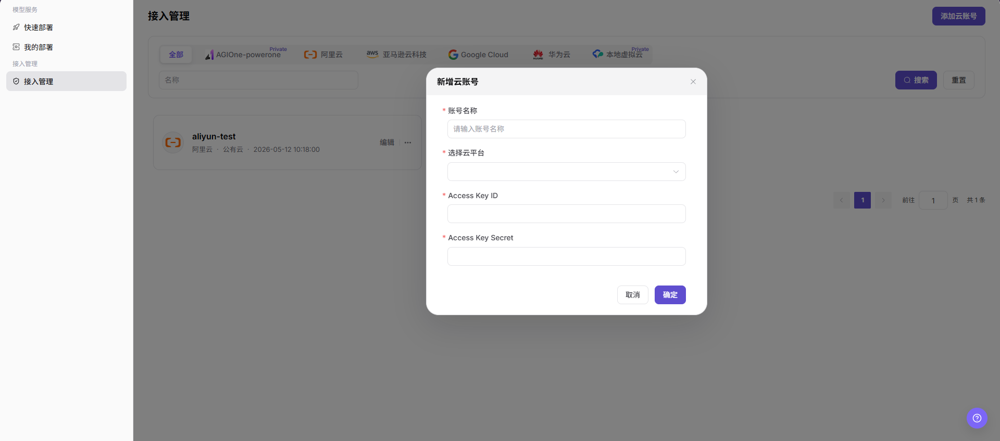

# 接入管理

::: info 文档信息
版本：v1.0
更新日期：2026-07-21
:::

## 功能概述

`接入管理` 用于普通用户查看和新增可用于模型部署的云账号。用户可按云平台筛选账号，查看账号名称、云平台、公有云类型、创建时间和操作入口，并在具备权限时新增云账号。

| 项目 | 内容 |
| --- | --- |
| 适用角色 | 普通用户 |
| 导航路径 | AI基础设施 > On-Cloud > 接入管理 > 接入管理 |
| 页面路由 | `/infrahub/user/access/account` |
| 管理对象 | 云账号、云平台、Access Key ID、Access Key Secret、创建时间和操作入口 |
| 典型途径 | 新增可用于快速部署的云账号，并查看已接入账号 |

#### 新手理解

接入账号像用户侧连接云资源的凭据入口。账号新增后，平台才能基于对应云平台和凭据识别可用资源，并在后续快速部署或模型服务创建时使用授权范围内的云资源。

#### 术语速查

| 术语 | 说明 |
| --- | --- |
| 云账号 | 用户在平台中登记的云侧访问账号。 |
| 云平台 | 云账号所属的平台，截图中可见 AGIOne-powerone、阿里云、亚马逊云科技、Google Cloud、华为云和本地虚拟云。 |
| Access Key ID | 云侧访问凭据标识，属于敏感信息。 |
| Access Key Secret | 云侧访问凭据密钥，属于高敏感信息，文档中禁止填写真实值。 |
| 编辑 | 修改已有云账号配置的入口。 |

## 前提条件

1. 当前账号具备 `接入管理` 页面访问权限和新增云账号权限。
2. 准备接入的云平台已在页面中可选。
3. 需要使用的 Access Key ID 和 Access Key Secret 已由安全渠道获取并确认有效。
4. 已确认新增账号的授权范围、资源可见性和费用归属，不在文档中记录真实凭据。

## 页面说明

页面用于查看和新增云账号。列表顶部提供云平台页签、`名称` 搜索框、`搜索` 和 `重置`；右上角提供 `添加云账号` 入口。账号卡片展示账号名称、云平台、公有云类型、创建时间、`编辑` 和更多操作入口。

页面截图：

点击 `添加云账号` 后，页面打开 `新增云账号` 弹窗，填写账号名称、选择云平台，并输入 Access Key ID 和 Access Key Secret。

## 主要操作

### 新增云账号

1. 进入 `AI Infra > On-Cloud > 接入管理 > 接入账号`。
2. 在 `接入管理` 页面右上角点击 `添加云账号`。
3. 在 `新增云账号` 弹窗中填写 `账号名称`。
4. 在 `选择云平台` 中选择目标云平台。
5. 填写 `Access Key ID` 和 `Access Key Secret`。
6. 点击最终 `确定` 前，再次核对账号名称、云平台、凭据来源和授权范围。
7. 如仅学习或验证页面，请点击 `取消` 或关闭弹窗，不提交真实账号配置。

## 参数说明

| 字段名称 | 是否必填 | 字段类型 | 示例 | 说明 |
| --- | --- | --- | --- | --- |
| 云平台页签 | 否 | 页签 | `全部` | 按云平台筛选账号列表。 |
| 名称 | 否 | 输入框 | `demo-cloud-account` | 按账号名称搜索记录，文档仅使用脱敏示例。 |
| 搜索 | 否 | 按钮 | `搜索` | 按当前筛选条件查询账号记录。 |
| 重置 | 否 | 按钮 | `重置` | 清空筛选条件并恢复列表展示。 |
| 添加云账号 | 是 | 按钮 | `添加云账号` | 打开新增云账号弹窗。 |
| 账号名称 | 是 | 文本 | `demo-cloud-account` | 云账号在平台中的展示名称，避免包含真实客户、业务或内部环境信息。 |
| 选择云平台 | 是 | 下拉选择 | `示例云平台` | 选择账号所属云平台。 |
| Access Key ID | 是 | 文本 | `AKIDEXAMPLE` | 云侧访问凭据标识，文档中仅使用占位示例。 |
| Access Key Secret | 是 | 密钥文本 | `SECRET_EXAMPLE` | 云侧访问密钥，禁止写入真实值。 |
| 编辑 | 否 | 操作入口 | `编辑` | 修改已有云账号配置，操作前需确认影响范围。 |
| 更多操作 | 否 | 操作入口 | `...` | 打开页面提供的更多操作入口。 |
| 取消 | 否 | 按钮 | `取消` | 关闭弹窗且不保存本次配置。 |
| 确定 | 是 | 按钮 | `确定` | 最终提交新增云账号配置，点击前必须完成复核。 |

## 踩坑提示

- 截图未展示账号类型、认证方式、授权范围、地域、资源同步或同步状态字段，本文不将这些内容写成已确认 UI 字段。
- Access Key ID 和 Access Key Secret 属于敏感凭据，不应出现在文档、截图、工单或聊天记录中。
- 新增账号不代表所有云资源都可用于部署，实际可见范围仍受云平台、授权范围、资源池和配额影响。
- 修改或删除云账号可能影响快速部署、已有部署的扩缩容、重建和资源同步。

## 结果校验

| 检查项 | 成功表现 | 异常时处理 |
| --- | --- | --- |
| 页面可进入 | 正常显示 `接入管理` 页面和账号列表。 | 检查菜单权限、路由和登录状态。 |
| 云账号列表正常加载 | 页面显示云平台页签、名称筛选、搜索、重置和账号卡片。 | 检查筛选条件、数据权限和接口状态。 |
| 新增入口可见 | 页面右上角显示 `添加云账号`。 | 检查当前用户是否具备新增权限。 |
| 新增弹窗可打开 | 点击新增入口后显示 `新增云账号` 弹窗。 | 刷新页面后重试，仍异常时联系管理员。 |
| 必填字段正常显示 | 弹窗显示账号名称、选择云平台、Access Key ID 和 Access Key Secret。 | 检查页面加载状态和浏览器控制台错误。 |
| 校验提示正常显示 | 未填写必填字段时页面显示校验提示，补齐后可继续。 | 按提示补齐账号名称、云平台和访问凭据。 |
| 仅学习时不提交 | 未点击最终 `确定`，未保存真实云账号配置。 | 如误提交，立即检查账号列表并联系运营方处理。 |
| 真实提交后可追踪 | 新云账号出现在列表中，账号名称、云平台和创建时间可查看。 | 回到列表核对账号记录，并在快速部署中验证资源是否可见。 |

## 排障路径

| 问题类型 | 先检查 | 下一步 |
| --- | --- | --- |
| 新增入口不可见 | 用户权限、菜单入口和页面配置。 | 使用具备权限的账号重试，仍异常时联系管理员。 |
| 云平台不可选 | 云平台是否已接入、当前用户是否有权限。 | 联系运营方核对云平台接入和授权范围。 |
| 凭据校验失败 | Access Key ID、Access Key Secret、云平台选择和凭据有效期。 | 使用安全渠道重新获取凭据，并确认云侧权限。 |
| 列表看不到新增账号 | 筛选条件、云平台页签和提交结果。 | 点击 `重置` 后重新搜索，仍异常时联系管理员。 |
| 快速部署看不到资源 | 云账号授权范围、资源池、地域和配额。 | 联系运营方核对资源可见性和部署权限。 |

## 常见问题

#### 新增后为什么快速部署看不到账号资源？

**问题现象：**

云账号已出现在列表中，但快速部署页面没有对应资源。

**可能原因：**

- 云账号凭据仅完成保存，资源授权或同步尚未完成。
- 云账号授权范围不包含目标地域或资源类型。
- 资源池、配额或部署权限未向当前用户开放。

**处理方式：**

1. 回到接入管理页面确认账号所属云平台和创建时间。
2. 点击 `重置` 清空筛选后重新查看账号。
3. 联系运营方核对授权范围、资源池、地域和配额。

#### 凭据应该如何填写才安全？

**问题现象：**

新增云账号时需要填写 Access Key ID 和 Access Key Secret，但不确定如何处理敏感信息。

**可能原因：**

- 凭据来源未通过安全渠道确认。
- 在文档、截图或工单中粘贴了真实密钥。
- 凭据权限过大或有效期不符合要求。

**处理方式：**

1. 仅在平台弹窗中填写凭据，不在文档或沟通记录中保留真实值。
2. 使用最小权限凭据，并按组织安全要求设置有效期和轮换策略。
3. 如凭据已经泄露，立即停止使用并按安全流程轮换。

## 后续操作

1. 回到 `快速部署` 页面确认对应云平台和地域资源是否可见。
2. 进入 `我的部署` 查看后续部署任务是否能使用该账号。
3. 定期检查云账号权限、凭据有效期和资源可见性。

## 注意事项

- 新增云账号可能保存真实云侧认证信息，并影响资源可见性、部署调度和费用归属。
- 错误凭据或授权范围可能导致资源不可见、部署失败、费用归属错误或安全风险。
- `确定`、`保存`、`提交` 属于高风险最终动作，文档只描述字段查看和提交前核对，不引导测试学习时提交。
- 不写入真实账号、密码、密钥、Token、AK/SK、接口地址、云资源 ID、内网地址或内部测试参数。
