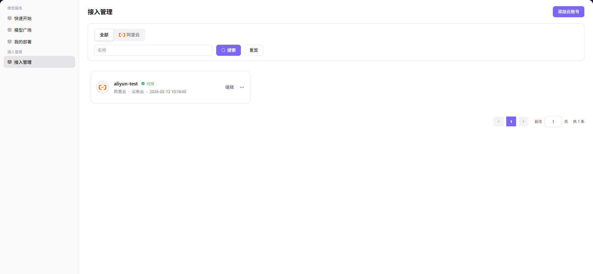

# 我的接入账号

:::: info 文档信息
版本：v1.0
更新日期：2026-07-06
::::

## 功能概述

`我的接入账号` 用于维护用户侧云账号、访问密钥、授权状态和可用资源范围，支撑多云调度、资源授权和模型部署流程。

| 项目 | 内容 |
| --- | --- |
| 适用角色 | 普通用户 |
| 导航路径 | 接入管理 > 我的接入账号 |
| 页面路由 | /user/access-management/access-accounts |
| 管理对象 | 用户侧云账号、访问密钥、授权状态和可用资源范围 |
| 典型用途 | 用户维护自有云账号或查看被授权账号 |

### 新手理解

我的接入账号像用户侧的云资源通行证，用来查看哪些云账号、地域和资源范围已经授权给自己，后续部署模型服务时才能选择对应资源。

### 术语速查

| 术语 | 说明 |
| --- | --- |
| 接入账号 | 用户可查看或维护的云账号入口。 |
| 授权状态 | 账号是否已被允许用于部署。 |
| 可用地域 | 当前账号可使用的云资源地域。 |
| 资源范围 | 账号可使用的 CPU、GPU、存储或其他资源类型。 |
## 前提条件

1. 当前账号具备我的接入账号查看或维护权限。
2. 需要使用的云账号已被授权或允许自助接入。
3. 目标业务地域和可用地域已确认。
## 页面说明

页面面向普通用户展示可用接入账号、授权状态、云平台、可用地域和资源范围。用户应先确认账号是否已授权、地域是否匹配，再进入部署流程；如需新增或修改账号，按页面权限操作。

页面截图：

用于确认当前账号可用的云账号、地域和授权状态。

## 主要操作

### 操作步骤

1. 进入 `接入管理 > 我的接入账号`。
2. 查看账号所属云平台、授权状态和可用地域。
3. 需要新增自有云账号时，按页面入口填写账号名称、云平台和授权方式。
4. 提交后等待校验或运营方审核。
5. 回到快速部署页确认可选择对应云资源。

关键步骤截图：

添加后在快速部署前确认授权状态可用。

### 参数说明

| 字段名称 | 是否必填 | 字段类型 | 示例 | 说明 |
| --- | --- | --- | --- | --- |
| 账号名称 | 是 | 文本 | `my-cloud-account` | 用户侧展示名称。 |
| 云平台 | 是 | 下拉选择 | `阿里云` | 账号所属云平台。 |
| 授权状态 | 系统生成 | 枚举 | `已授权` | 决定是否可用于部署。 |
| 可用地域 | 系统生成 | 多选 | `cn-shanghai` | 账号可使用的云地域。 |
| 资源范围 | 系统生成 | 文本 | `GPU / CPU` | 当前账号可用资源类型。 |

### 踩坑提示

- 普通用户不要在截图或工单中暴露云账号 ID、AK/SK 或授权策略。
- 账号已授权不代表所有地域都可用，部署前要核对业务地域。
- 删除或停用账号可能影响已有部署的扩缩容或重建。

### 结果校验

1. 账号列表显示授权状态和可用地域。
2. 快速部署页能看到与账号匹配的云资源。
3. 无权限或未授权账号不会出现在可选资源中。

## 常见问题

### 账号显示未授权

**问题现象：**

账号在列表中可见，但状态为未授权或不可用。

**可能原因：**

- 运营方尚未完成授权。
- 账号校验失败。
- 账号可用地域与当前业务地域不匹配。

**处理方式：**

1. 查看账号详情中的状态和提示。
2. 确认部署选择的业务地域。
3. 联系运营方处理授权或校验问题。

### 部署页看不到账号资源

**问题现象：**

账号状态正常，但快速部署时没有对应资源。

**可能原因：**

- 资源池未开放给当前租户。
- 业务地域授权缺失。
- 当前账号没有部署权限。

**处理方式：**

1. 确认业务地域和部署权限。
2. 联系运营方核对资源池和授权范围。
3. 刷新页面后重新进入部署流程。

## 后续操作

1. 进入快速部署创建模型服务。
2. 查看我的部署确认服务状态。
3. 按需联系运营方调整授权范围。

## 注意事项

- 不要在截图中暴露云账号 ID、AK/SK 或授权策略。
- 账号已授权不代表所有地域可用。
- 账号删除或停用可能影响已有部署。
