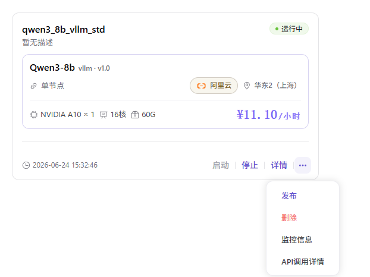
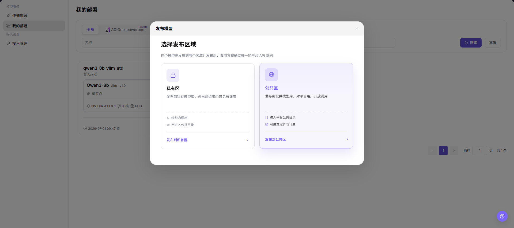
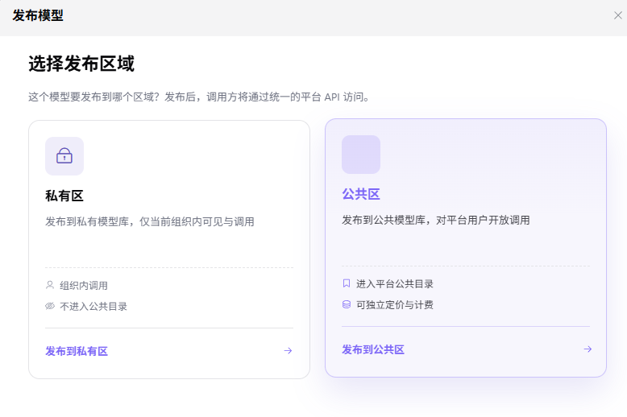

# 我的部署

::: info 文档信息
版本：v1.0
更新日期：2026-07-21
:::

## 功能概述

`我的部署` 用于普通用户查看已创建的云模型服务，并从符合条件的部署记录发起模型发布。发布流程会先选择发布区域，再跳转到 `模型及AI服务 > 创作空间 > 我的模型` 的发布模型页面继续配置。

| 项目 | 内容 |
| --- | --- |
| 适用角色 | 普通用户 |
| 导航路径 | AI基础设施 > On-Cloud > 模型服务 > 我的部署 |
| 页面路由 | `/infrahub/user/model/deployment` |
| 管理对象 | 部署名称、模型名称、部署状态、云平台、地域、资源规格、发布区域和操作入口 |
| 典型途径 | 从已有部署发布模型，并继续配置模型基础信息、计费和限流 |

#### 新手理解

我的部署像已运行模型服务的列表。用户可以先确认部署是否运行正常、模型和资源是否符合预期，再从更多操作中选择 `发布`，决定模型发布到私有区或公共区。

#### 术语速查

| 术语 | 说明 |
| --- | --- |
| 部署记录 | 一次云上模型服务部署任务在列表中的记录。 |
| 发布 | 将部署产物转入模型发布流程，使其进入私有或公共模型目录。 |
| 发布区域 | 模型发布目标范围，截图中可见 `私有区` 和 `公共区`。 |
| 私有区 | 发布到私有模型库，仅当前组织内可见与调用。 |
| 公共区 | 发布到公共模型库，对平台用户开放调用，并可独立定价和计费。 |
| 发布模型页面 | 选择发布区域后跳转到 `创作空间 > 我的模型` 下的发布模型配置页面。 |

## 前提条件

1. 当前账号具备 `我的部署` 查看权限和模型发布权限。
2. 目标部署记录已创建完成，并确认部署状态、模型、云平台、地域和资源规格。
3. 已确认模型可发布范围、调用方式、计费配置和后续用户访问边界。
4. 发布前已完成敏感信息脱敏，不在文档中记录真实 Endpoint、API Key、价格策略或内部资源标识。

## 页面说明

页面用于查看部署列表并进入发布流程。列表支持按云平台页签、`名称`、`状态`、`模型名称` 筛选，提供 `搜索` 和 `重置`；部署卡片展示部署名称、描述、运行状态、模型名称、推理引擎、版本、部署模式、云平台、地域、GPU、CPU、内存、费用、创建时间和操作入口。

页面截图：

更多操作中可见 `发布`、`删除`、`监控信息` 和 `API调用详情` 等入口。

## 主要操作

### 发布模型

1. 进入 `AI Infra > On-Cloud > 模型服务 > 我的部署`。
2. 在部署列表中找到目标部署，确认部署名称、运行状态、模型名称、云平台、地域、GPU、CPU、内存和费用信息。
3. 点击目标部署右下角更多操作入口，选择 `发布`。

4. 在 `发布模型` 弹窗中查看 `选择发布区域`。
5. 根据发布目标选择 `私有区` 或 `公共区`。
6. 点击 `发布到私有区` 或 `发布到公共区` 后，页面跳转到 `模型及AI服务 > 创作空间 > 我的模型` 的 `发布模型` 页面。

7. 在 `发布模型` 页面继续核对 `基础信息`、`计费配置` 和 `限流配置`。
8. 在 `模型源/元模型信息` 中核对 `元模型`、`模型源`、`请求URL`、`API密钥`、`模型源ID` 和 `地域`。
9. 如仅学习或验证页面，请停留在查看和核对阶段，不执行最终 `发布`、`提交`、`保存` 或下一步高风险配置。

## 参数说明

| 字段名称 | 是否必填 | 字段类型 | 示例 | 说明 |
| --- | --- | --- | --- | --- |
| 名称 | 否 | 输入框 | `demo-deployment` | 按部署名称筛选记录，文档仅使用脱敏示例。 |
| 状态 | 否 | 下拉选择 | `运行中` | 按部署状态筛选记录。 |
| 模型名称 | 否 | 输入框 | `demo-model` | 按模型名称筛选部署记录。 |
| 部署名称 | 否 | 卡片字段 | `demo_deployment` | 部署记录展示名称，避免写入真实业务或客户信息。 |
| 部署状态 | 否 | 状态标签 | `运行中` | 展示部署是否可用。 |
| 模型名称 | 否 | 卡片字段 | `示例模型` | 部署记录绑定的模型。 |
| 部署模式 | 否 | 卡片字段 | `单节点` | 当前部署使用的部署模式。 |
| 云平台 | 否 | 卡片字段 | `示例云平台` | 部署所在云平台。 |
| 地域 | 否 | 卡片字段 | `示例地域` | 部署所在地域。 |
| 资源规格 | 否 | 卡片字段 | `示例 GPU / CPU / 内存` | 部署使用的资源规格。 |
| 费用 | 否 | 展示字段 | `示例费用/小时` | 部署费用参考，文档中不记录真实金额明细。 |
| 发布入口 | 是 | 操作入口 | `发布` | 打开发布区域选择弹窗。 |
| 发布区域 | 是 | 单选卡片 | `私有区` | 选择模型发布到私有区或公共区。 |
| 私有区 | 否 | 发布区域 | `发布到私有区` | 发布到私有模型库，仅当前组织内可见与调用。 |
| 公共区 | 否 | 发布区域 | `发布到公共区` | 发布到公共模型库，对平台用户开放调用。 |
| 跳转目标 | 是 | 页面跳转 | `创作空间 > 我的模型 > 发布模型` | 选择发布区域后的目标页面。 |
| 元模型 | 是 | 选择框 | `示例模型` | 发布模型页面中的元模型信息。 |
| 模型源 | 是 | 下拉选择 | `AGIOne` | 发布模型来源。 |
| 请求URL | 是 | URL | `https://api.example.com/predict/demo` | 上游请求地址，文档仅使用占位地址。 |
| API密钥 | 是 | 密钥文本 | `<redacted>` | API 密钥为敏感信息，文档中必须脱敏。 |
| 模型源ID | 是 | 文本 | `demo-model-id` | 发送给上游供应商的模型名称或标识。 |
| 地域 | 否 | 下拉选择 | `示例地域` | 发布模型页面中的区域字段。 |

## 踩坑提示

- 只有符合条件的部署才可能显示 `发布` 入口；如果入口不可见，先检查部署状态、权限和页面菜单。
- 选择错误发布区域可能导致模型发布到错误站点、区域或业务范围。
- 公共区发布可能影响模型对外可见范围、调用方式、计费配置和后续用户访问。
- 截图中可见请求 URL 和 API 密钥字段，文档、截图和工单中必须脱敏处理。
- `删除`、停止部署、最终发布、提交或保存都可能影响真实服务或模型可见性，学习验证时不要执行。

## 结果校验

| 检查项 | 成功表现 | 异常时处理 |
| --- | --- | --- |
| 页面可进入 | 正常显示 `我的部署` 页面和部署列表。 | 检查菜单权限、路由和登录状态。 |
| 部署列表正常加载 | 页面显示云平台页签、名称、状态、模型名称筛选项，以及部署卡片。 | 检查筛选条件、数据权限和接口状态。 |
| 目标部署状态可见 | 目标部署显示运行状态、模型名称、云平台、地域和资源规格。 | 清空筛选条件后重新搜索，仍不可见时联系运营方。 |
| 发布入口可见 | 更多操作中显示 `发布`。 | 检查部署状态、模型权限和发布权限。 |
| 发布区域可选择 | `发布模型` 弹窗显示私有区和公共区。 | 刷新页面后重试，仍异常时联系管理员。 |
| 跳转目标正确 | 选择发布区域后进入 `创作空间 > 我的模型` 的 `发布模型` 页面。 | 检查路由、权限和发布区域配置。 |
| 发布模型页面字段可见 | 页面显示基础信息、计费配置、限流配置和模型源信息。 | 检查页面加载状态和模型发布权限。 |
| 仅学习时不提交 | 未执行最终发布、提交或保存，不改变模型可见范围。 | 如误操作，立即检查模型发布状态并联系运营方处理。 |

## 排障路径

| 问题类型 | 先检查 | 下一步 |
| --- | --- | --- |
| 找不到部署记录 | 云平台页签、名称、状态、模型名称筛选项。 | 点击 `重置` 后重新搜索。 |
| 发布入口不可见 | 部署状态、当前账号权限和模型是否可发布。 | 联系运营方核对发布权限和部署状态。 |
| 区域选择弹窗打不开 | 浏览器状态、页面接口和目标部署记录。 | 刷新页面后重试，仍异常时联系管理员。 |
| 跳转后页面无权限 | 创作空间、我的模型和发布模型权限。 | 联系管理员补齐模型发布权限。 |
| 发布模型字段异常 | 元模型、模型源、请求 URL、API 密钥和模型源 ID。 | 回到部署记录核对来源配置，并避免暴露真实凭据。 |

## 常见问题

#### 为什么更多操作里没有发布？

**问题现象：**

部署卡片中可以看到部署记录，但更多操作里没有 `发布`。

**可能原因：**

- 当前部署状态不满足发布条件。
- 当前账号没有模型发布权限。
- 模型或部署来源不支持发布。

**处理方式：**

1. 核对部署状态、模型名称和部署区域。
2. 确认当前账号是否具备发布模型权限。
3. 联系运营方核对部署来源和发布策略。

#### 选择发布区域后为什么跳转失败？

**问题现象：**

点击 `发布到私有区` 或 `发布到公共区` 后，没有进入发布模型页面。

**可能原因：**

- 创作空间或我的模型页面权限不足。
- 发布区域配置不可用。
- 页面路由或接口异常。

**处理方式：**

1. 刷新页面后重新选择发布区域。
2. 检查是否能直接进入 `创作空间 > 我的模型`。
3. 联系管理员核对发布区域、页面权限和接口状态。

## 后续操作

1. 在 `发布模型` 页面继续完成基础信息、计费配置和限流配置。
2. 发布前再次确认发布区域、可见范围、调用方式和计费策略。
3. 发布后回到 `我的模型` 或模型市场查看模型状态和可见范围。

## 注意事项

- 发布模型可能影响模型对外可见范围、调用方式、计费配置和后续用户访问。
- 选择错误发布区域可能导致模型发布到错误站点、区域或业务范围。
- 跳转后的 `发布`、`提交`、`保存` 属于高风险最终动作，文档只描述查看和跳转流程，不引导测试学习时执行。
- 不写入真实账号、密钥、Token、AK/SK、Endpoint、API Key、客户名称、价格策略、云资源 ID、请求 URL 或内部测试参数。
