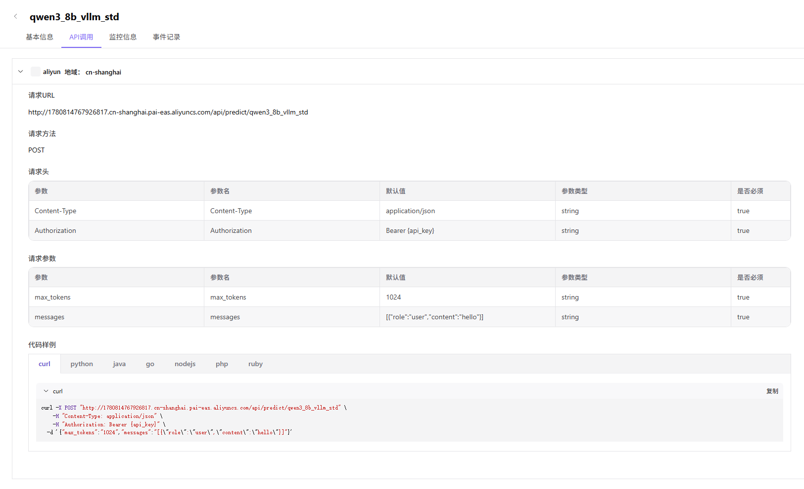
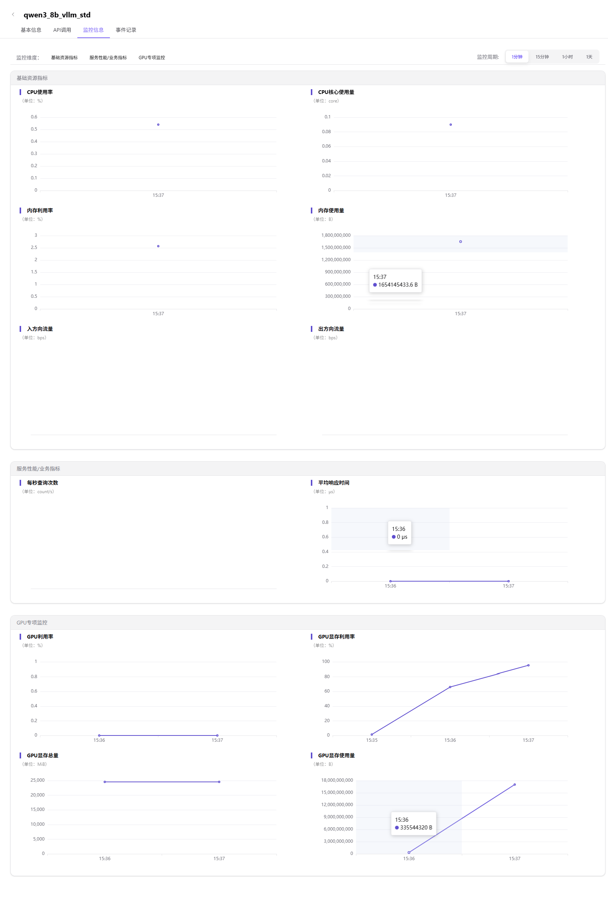
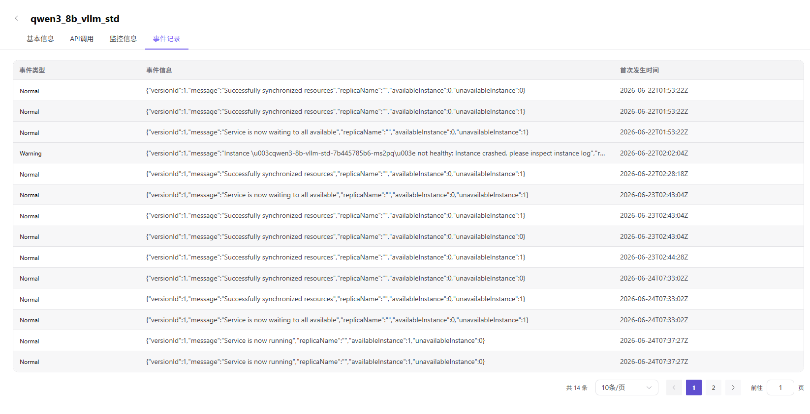

# 我的部署

:::: info 文档信息
版本：v1.0
更新日期：2026-07-08
::::

## 功能概述

`我的部署` 用于维护部署实例、服务状态、Endpoint、API Key、监控、事件和调用示例，支撑多云调度、资源授权和模型部署流程。

| 项目 | 内容 |
| --- | --- |
| 适用角色 | 普通用户 |
| 导航路径 | 模型服务 > 我的部署 |
| 页面路由 | /user/model-services/my-deployments |
| 管理对象 | 部署实例、服务状态、Endpoint、API Key、监控、事件和调用示例 |
| 典型用途 | 查看和管理已创建的云模型服务 |

### 新手理解

我的部署像模型服务的运行控制台，用来查看每个云上模型服务的状态、调用信息、事件和监控，判断服务是否真的可用。

### 术语速查

| 术语 | 说明 |
| --- | --- |
| 部署实例 | 一次云上模型服务部署记录。 |
| 访问方式 | 服务 Endpoint、API Key 和请求方法等调用信息。 |
| 事件 | 部署、扩缩容、失败和恢复等生命周期记录。 |
| 监控 | 服务资源和调用表现的指标数据。 |

## 前提条件

1. 当前账号已有部署记录或具备部署查看权限。
2. 已准备部署名称、业务地域、模型或状态筛选条件。
3. 调用测试前已确认 Endpoint 和 API Key 使用方式。
## 页面说明

页面面向普通用户管理已创建的云模型服务。用户可以查看部署状态、复制脱敏后的调用信息、查看事件和监控，并根据状态决定重试、扩缩容、停止或联系运营方。

页面截图：

用于查看部署状态、模型、地域和操作入口。

## 主要操作

### 操作步骤

1. 进入 `模型服务 > 我的部署`。
2. 按部署名称、业务地域、模型或状态筛选记录。
3. 打开部署详情查看状态、事件、监控和调用信息。
4. 服务运行后复制 Endpoint、API Key 占位说明或调用示例。
5. 发现失败时根据事件时间、错误提示和请求 ID 排查。

关键步骤截图：

复制调用信息前遮挡 Endpoint 和 API Key。

部署异常时结合监控、事件和调用结果排查。

事件记录用于定位创建失败、资源不足或运行异常。

### 参数说明

| 字段名称 | 是否必填 | 字段类型 | 示例 | 说明 |
| --- | --- | --- | --- | --- |
| 部署名称 | 是 | 文本 | `qwen-prod-001` | 部署实例展示名称。 |
| 服务状态 | 系统生成 | 枚举 | `运行中` | 展示实例是否可调用。 |
| 业务地域 | 系统生成 | 文本 | `华东生产` | 部署请求所在业务地域。 |
| Endpoint | 系统生成 | URL | `https://api.example.com/predict/model` | 调用地址，截图必须脱敏。 |
| 事件时间 | 系统生成 | 日期时间 | `2026-07-06 10:00` | 用于定位部署生命周期问题。 |

### 踩坑提示

- 复制调用信息前确认展示的是脱敏内容，不要把真实 API Key 发到工单或群聊。
- 状态为运行中不代表业务调用一定成功，还要看模型协议和请求参数。
- 停止或删除部署前确认没有业务流量正在使用。

### 结果校验

1. 列表中能看到部署记录、模型和状态。
2. 详情页展示事件、监控和调用信息。
3. 测试调用返回符合模型协议的响应。

## 常见问题

### 部署一直处于创建中

**问题现象：**

提交部署后长时间未进入运行中。

**可能原因：**

- 资源池排队或容量不足。
- 镜像拉取、框架启动或健康检查耗时。
- 云账号或调度策略出现异常。

**处理方式：**

1. 打开部署事件查看当前阶段。
2. 等待队列或调整规格后重试。
3. 携带部署名称、业务地域和事件截图联系运营方。

### 服务运行但调用失败

**问题现象：**

部署状态为运行中，但 API 调用返回错误。

**可能原因：**

- Endpoint 或 API Key 使用错误。
- 请求参数不符合模型协议。
- 模型服务限流、超时或上游异常。

**处理方式：**

1. 复制最新调用示例重新测试。
2. 核对请求路径、请求头和参数。
3. 查看监控、事件和调用错误码。

## 后续操作

1. 验证业务调用。
2. 查看用量、费用和监控。
3. 按需要扩缩容、停止或删除部署。

## 注意事项

- 复制调用信息前确认凭据不会外泄。
- 运行中不代表业务请求一定成功。
- 停止或删除部署前确认没有业务流量。
