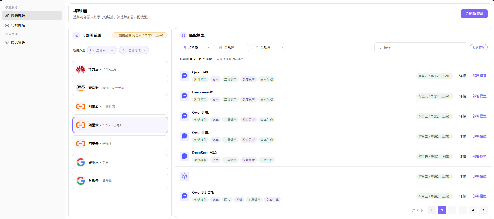
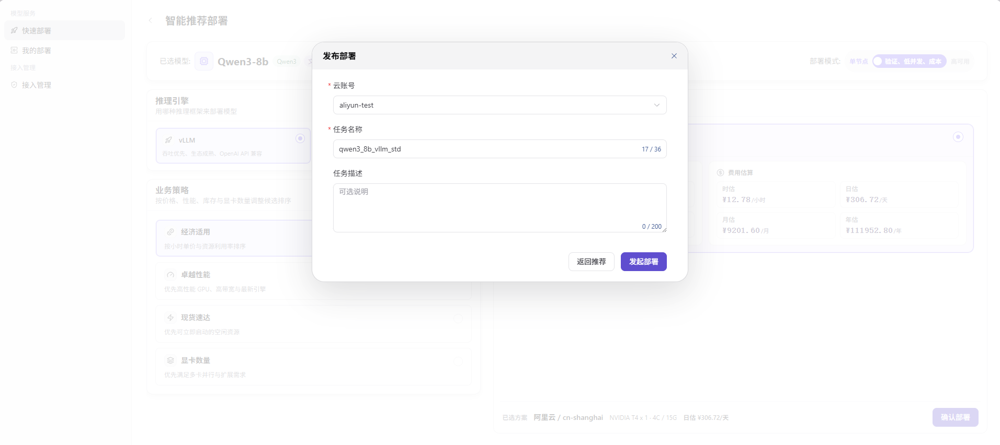

# 快速部署

:::: info 文档信息
版本：v1.0
更新日期：2026-07-08
::::

## 功能概述

`快速部署` 用于按向导选择模型、云资源、部署规格和访问配置，并创建云端模型服务。

| 项目 | 内容 |
| --- | --- |
| 适用角色 | 普通用户 |
| 导航路径 | 模型服务 > 快速部署 |
| 页面路由 | /infrahub/user/model-services/quick-deployment |
| 管理对象 | 模型、云账号授权、部署区域、规格、镜像、Endpoint 和 API Key |
| 典型用途 | 基于已授权云资源快速创建云上模型服务 |

### 新手理解

快速部署像点一份标准套餐：选择模型、业务地域、规格和访问方式，平台会根据授权和调度策略创建云上模型服务。

### 术语速查

| 术语 | 说明 |
| --- | --- |
| Endpoint | 部署完成后生成的服务访问地址，属于敏感信息。 |
| API Key | 调用部署服务的认证密钥，应脱敏展示。 |
| 部署区域 | 云厂商地域或业务地域，影响资源可用性和访问延迟。 |
| 部署规格 | 模型服务使用的 CPU、GPU、内存或实例规格。 |

## 前提条件

1. 当前账号具备快速部署权限。
2. 目标模型、业务地域和资源规格可选。
3. 已确认部署费用、实例数量和调用凭据展示方式。
## 页面说明

页面面向普通用户创建云模型服务。用户需要选择模型、业务地域、部署规格、实例数量和访问方式，并在提交前确认费用、授权账号和凭据展示不会泄露。

## 主要操作

### 操作步骤

1. 进入 `模型服务 > 快速部署`。
2. 选择要部署的模型和业务地域。
3. 选择资源规格、实例数量和运行参数。
4. 确认访问方式、调用凭据展示方式和费用预估。
5. 提交后跳转到我的部署查看状态、事件和监控。

关键步骤截图：

第一步确认模型、地域和云资源可见。

推荐方案需要同时满足授权、容量和模型配置。

提交前再次确认费用、规格和访问方式。

### 参数说明

| 字段名称 | 是否必填 | 字段类型 | 示例 | 说明 |
| --- | --- | --- | --- | --- |
| 模型 | 是 | 下拉选择 | `qwen-cloud-7b` | 要部署的模型资产。 |
| 业务地域 | 是 | 下拉选择 | `华东生产` | 决定可用资源和调度范围。 |
| 资源规格 | 是 | 下拉选择 | `1GPU-16C-64G` | 部署实例使用的算力规格。 |
| 实例数量 | 是 | 数字 | `1` | 服务副本数量。 |
| 访问凭据 | 系统生成 | 密文 | `<api-key>` | 部署完成后生成或关联的调用凭据。 |

### 踩坑提示

- 业务地域、模型资产和资源规格任一不匹配都会导致可选项为空。
- 提交前确认费用和实例数量，避免误创建高成本服务。
- 不要在截图中暴露 Endpoint、API Key、授权账号或内部资源名称。

### 结果校验

1. 提交后生成部署记录。
2. 我的部署页面显示部署状态和事件。
3. 服务运行后可以复制脱敏调用信息并完成测试调用。

## 常见问题

### 模型或规格不可选

**问题现象：**

进入快速部署后，模型、业务地域或资源规格下拉为空。

**可能原因：**

- 模型资产未授权给当前用户。
- 业务地域没有绑定可用资源池。
- 当前租户配额或资源容量不足。

**处理方式：**

1. 切换业务地域后重新查看。
2. 检查我的接入账号和资源授权状态。
3. 联系运营方核对模型资产、资源池和配额。

### 部署创建失败

**问题现象：**

点击提交后部署失败，或我的部署中显示创建失败。

**可能原因：**

- 资源池容量不足或调度策略无可用回退。
- 运行镜像、框架或模型资产配置不匹配。
- 云账号凭据或授权账号不可用。

**处理方式：**

1. 查看我的部署事件和错误信息。
2. 调整规格或实例数量后重试。
3. 携带部署名称、时间、业务地域和错误提示联系运营方。

## 后续操作

1. 进入我的部署查看状态。
2. 复制调用信息并进行测试调用。
3. 查看事件、监控和费用用量。

## 注意事项

- 提交前确认费用和实例数量。
- Endpoint、API Key 和授权账号截图必须脱敏。
- 部署失败时优先查看我的部署事件。
