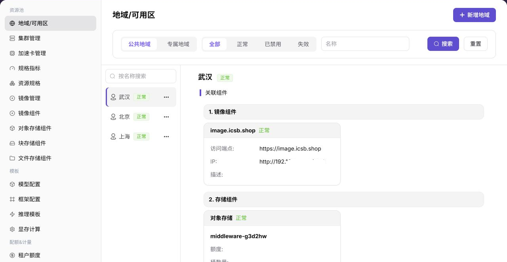
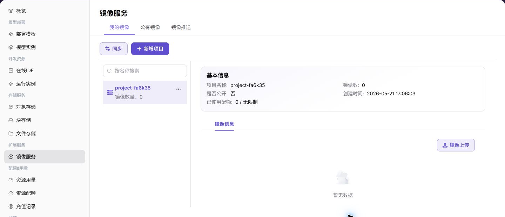
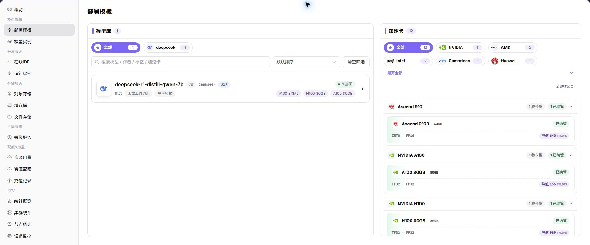

# 从零开始部署一个模型服务

:::: info 文档信息
版本：v1.0
更新日期：2026-07-06
::::

## 功能概述

本文把运营方和普通用户的 On-Prem 操作串成一条端到端路径：运营方先准备地域、可用区、集群、规格、镜像、存储、模板和配额，普通用户再选择模板或镜像创建模型服务，并通过日志、用量和监控确认服务状态。

| 项目 | 内容 |
| --- | --- |
| 适用角色 | 运营方、普通用户 |
| 推荐前置阅读 | [平台入门](../../getting-started/)、[地域/可用区](../../operator/resource-pools/regions-zones/)、[集群管理](../../operator/resource-pools/clusters/) |
| 输出结果 | 一个可检查状态、日志、用量和监控的模型服务或运行实例 |
| 典型用途 | 新环境首次联调、培训演示、上线前验收和问题定位 |

## 新手理解

On-Prem 端到端部署像把自建机房资源送到用户手里：运营方先准备地域、集群、规格、模板和配额，用户再选择镜像、数据和启动参数创建模型服务。

## 端到端流程图

| 阶段 | 操作方 | 目标 |
| --- | --- | --- |
| 资源边界 | 运营方 | 创建地域和可用区。 |
| 算力接入 | 运营方 | 注册 Kubernetes 集群并确认节点可见。 |
| 能力开放 | 运营方 | 关联规格、镜像、存储、模板和配额。 |
| 资产准备 | 普通用户 | 选择公共镜像或推送自定义镜像，准备模型文件和输入数据。 |
| 服务创建 | 普通用户 | 创建在线推理、在线 IDE 或运行实例。 |
| 状态验证 | 普通用户 | 查看状态、日志、端口、事件、用量和监控。 |
| 排障闭环 | 双方 | 根据失败路径检查资源、权限、配额、镜像、存储和集群。 |

## 术语速查

| 术语 | 说明 |
| --- | --- |
| 集群注册 | 运营方把 Kubernetes 集群接入平台并完成状态校验。 |
| 资源规格 | 用户创建实例时选择的 CPU、内存和 GPU/NPU 组合。 |
| 推理模板 | 将模型、框架、镜像、规格和参数组合为可部署方案。 |
| 实例事件 | 定位创建失败、镜像拉取失败或调度失败的关键记录。 |

## 前提条件

1. 运营方具备资源池、模板、配额和监控管理权限。
2. 普通用户具备创建模型实例、运行实例、对象存储和镜像项目的权限。
3. Kubernetes API Server、镜像仓库、对象存储或共享存储可从平台侧访问。
4. 租户配额和额度足以支撑本次验证。
5. 镜像、启动命令、模型文件和输入输出路径已规划。

## 步骤 1：运营方创建地域 / 可用区

1. 进入 `资源池 > 地域/可用区`。
2. 点击 `新增地域`，填写地域 ID、显示名称、可见性策略，并绑定镜像服务和必要存储组件。
3. 在目标地域下点击 `新增可用区`，填写可用区 ID、显示名称和描述。
4. 提交后确认地域和可用区状态正常。



结果校验：

1. 地域列表中能看到目标地域。
2. 地域详情中能看到镜像组件和必要存储组件。
3. 可用区列表中能看到目标可用区。

## 步骤 2：运营方注册集群

1. 进入 `资源池 > 集群管理`。
2. 点击 `集群注册`。
3. 粘贴或填写 kubeconfig 相关连接信息，核对地域、可用区、API Server、认证方式、CIDR、NodePort 和监控端口。
4. 提交后回到集群列表，查看集群状态、节点数量和资源用量。


结果校验：

1. 集群状态进入接入中、可用或符合预期状态。
2. 集群节点页能看到节点信息。
3. 节点状态、CPU、内存、磁盘和加速卡资源可见。

## 步骤 3：运营方配置资源规格

1. 进入 `资源池 > 规格指标`，确认 CPU、内存、加速卡、显存等指标口径。
2. 进入 `资源池 > 资源规格`，创建面向用户的资源套餐。
3. 回到 `集群管理`，在集群详情中关联可用规格。

结果校验：

1. 目标规格处于可用状态。
2. 集群详情中的已关联规格包含目标规格。
3. 用户创建实例时能选择对应规格。

## 步骤 4：运营方配置模板或开放资源

1. 进入 `模板 > 模型配置`，维护可部署模型和模型版本。
2. 进入 `模板 > 框架配置`，维护推理框架和运行镜像关系。
3. 进入 `模板 > 推理模板`，绑定模型、框架、规格、端口、变量和默认参数。
4. 进入 `模板 > 显存测算`，维护 KV Token、动态表达式、因子表单和显存推荐规则。
5. 进入 `配额&计量`，为租户设置资源配额和额度。


结果校验：

1. 推理模板已发布或处于用户可选择状态。
2. 模板关联的模型、框架、镜像、规格和显存规则一致。
3. 目标租户有足够配额和额度。

## 步骤 5：用户准备镜像和数据

1. 如使用平台公共镜像，进入 `扩展服务 > 镜像服务 > 公共镜像（Public Images）` 确认镜像可见。
2. 如使用自定义镜像，先在 `我的镜像（My Images）` 创建镜像项目，再按页面提供的仓库地址推送镜像。
3. 进入 `存储服务 > 对象存储` 创建桶，上传模型文件、数据集或运行产物。
4. 记录镜像地址、对象路径和启动命令，避免记录真实凭据。



## 步骤 6：用户创建在线推理 / 开发环境 / 运行实例

### 方式 A：使用部署模板创建模型服务

1. 进入 `模型部署 > 部署模板`。
2. 选择目标模板。
3. 按模板填写实例名称、模型参数、规格、端口、存储和环境变量。
4. 提交后进入模型实例列表查看状态。



### 方式 B：创建运行实例

1. 进入 `开发资源 > 运行实例`。
2. 点击 `创建实例（Create Instance）`。
3. 选择 `单节点（Single Node）` 或 `集群（Cluster）` 形态。
4. 填写镜像、规格、启动命令和挂载路径。
5. 提交后查看实例状态和日志。

启动命令示例：

```bash
python train.py --model /mnt/models/base --data /mnt/data/train.jsonl --output /mnt/output
bash run.sh --config /mnt/config/config.yaml
python app.py --host 0.0.0.0 --port 8000
```


## 步骤 7：验证服务状态

1. 在实例列表确认状态进入运行中、成功或符合当前任务类型的状态。
2. 打开实例详情，查看日志、事件、端口和资源使用。
3. 如服务暴露访问地址，使用平台提供的入口进行连通性验证。
4. 检查对象存储或挂载目录中是否产生预期输出。

## 步骤 8：查看用量、配额和监控

1. 进入 `配额&用量 > 资源用量`，查看实例资源消耗。
2. 进入 `配额&用量 > 资源配额`，确认剩余配额。
3. 进入 `监控` 查看统计概览、集群、节点、设备和作业数据；如果用户侧监控未开放，优先使用实例日志和事件排障。


## 常见失败路径排查

### 失败分支：集群注册失败

下一跳：[集群管理](../../operator/resource-pools/clusters/)

**问题现象：**运营方注册集群后状态异常，后续地域或规格无法绑定该集群。

**排查路径：**

1. 检查 kubeconfig、CA、token 和 API Server 连通性是否正确。
2. 确认集群版本、网络和监控采集组件满足接入要求。
3. 注册成功后再进入资源规格和监控页面验证集群可见。

### 失败分支：规格不可选

下一跳：[资源规格](../../operator/resource-pools/resource-specs/)

**问题现象：**用户创建实例时看不到目标 CPU、内存或 GPU 规格。

**排查路径：**

1. 确认运营方已创建资源规格并关联目标集群。
2. 核对租户配额、地域可见范围和模板规格限制。
3. 进入集群、节点和设备监控确认目标资源仍有容量。

### 失败分支：实例创建失败

下一跳：[作业监控](../../operator/monitoring/jobs/)

**问题现象：**实例提交后进入失败、排队或启动异常状态。

**排查路径：**

1. 先查看实例事件和日志，区分镜像、启动命令、挂载或资源问题。
2. 核对镜像地址、存储路径、环境变量和启动参数。
3. 若事件指向资源不足，回到配额、规格和集群容量继续排查。

## 完成后检查

| 检查项 | 成功表现 | 下一步 |
| --- | --- | --- |
| 资源可见 | 创建页能选择目标地域、规格、镜像或模板 | 继续创建实例或部署 |
| 状态正常 | 实例、作业或模型服务进入运行中或可用状态 | 进入调用、日志或监控 |
| 排障入口可用 | 事件、日志或监控能定位错误 | 按失败分支继续排查 |

## 后续操作

1. 将通过验证的镜像、启动命令、端口、对象路径和参数整理成团队规范。
2. 为常用场景沉淀推理模板或运行实例模板。
3. 按业务周期清理无用对象、镜像标签和已结束实例。
4. 定期检查配额、用量和监控趋势，提前发现容量瓶颈。
