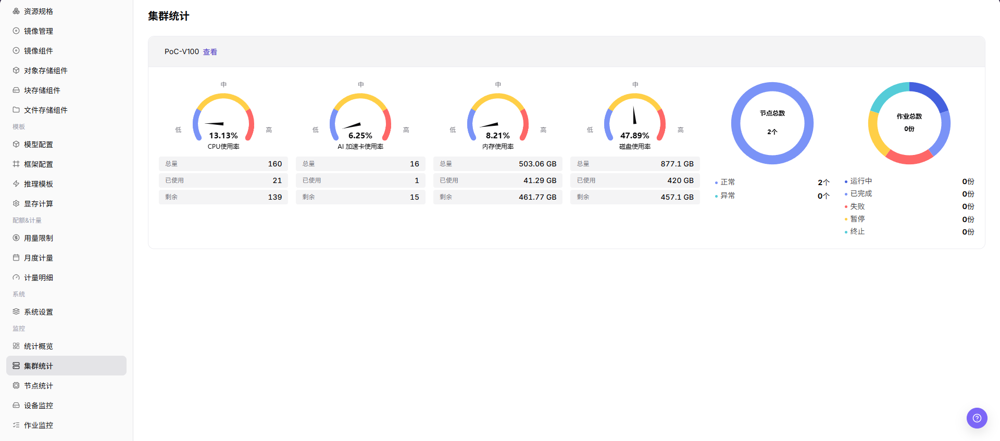

# 集群统计

::: info 文档信息
版本：v1.0
更新日期：2026-07-08
:::

## 功能概述

`集群统计` 用于查看 集群状态、资源容量、作业数量和地域/可用区归属，帮助运营方完成容量巡检、异常定位和资源调度判断。

| 项目 | 内容 |
| --- | --- |
| 适用角色 | 运营方 |
| 导航路径 | AI基础设施 > On-Prem > 监控 > 集群统计 |
| 页面路由 | `/powerone/monitor/cluster` |
| 管理对象 | 集群状态、资源容量、作业数量和地域/可用区归属 |
| 典型途径 | 按集群判断资源水位、健康状态和调度承载能力 |

#### 新手理解

集群统计像每个机房的体检表，用来比较不同集群的容量、健康状态和资源水位，判断问题是局部集群还是全局资源不足。

#### 术语速查

| 术语 | 说明 |
| --- | --- |
| 集群容量 | 集群可提供的 CPU、内存、GPU/NPU 等资源总量。 |
| 资源水位 | 资源已使用量和剩余量的比例。 |
| 健康状态 | 集群组件、节点和调度能力是否正常。 |
| 可调度资源 | 当前能够承载新作业的资源。 |

## 前提条件

1. 当前账号具备集群监控查看权限。
2. 目标集群已注册并处于可监控范围。
3. 集群容量、节点和加速卡指标已采集。
4. 已确认需要比较的地域或集群范围。

## 页面说明

集群统计用于比较不同地域或资源池中的集群容量、健康状态和资源水位。运营方可以通过集群维度判断是否存在整体容量不足、采集异常或单集群热点。

## 主要操作

### 查看集群统计

#### 操作步骤

1. 进入 `监控 > 集群统计`。
2. 确认右上角地域和页面筛选条件。
3. 查看列表、图表或统计卡片。
4. 重点关注异常状态、高水位、长时间未更新或与预期不一致的数据。
5. 集群水位异常时，进入集群详情、节点统计和作业监控确认具体节点与作业。

#### 查看集群统计

1. 进入 `AI Infra > On-Prem > 监控 > 集群统计`。
2. 查看集群列表和整体运行状态，确认集群名称、地域/可用区、节点数量、设备数量和资源水位。
3. 按页面提供的筛选条件选择地域、集群、资源类型或时间范围。
4. 查看 CPU、内存、加速卡、存储、节点状态和作业相关统计，判断是否存在资源不足、异常节点或设备不可用。
5. 如发现某个集群水位异常，继续进入节点统计、设备监控或作业监控页面排查。
6. 如仅学习或截图，只查看统计卡片、图表、筛选条件和列表，不修改任何配置。

#### 重点关注

- 集群状态是否可用。
- GPU、CPU、内存、磁盘使用率是否异常。
- 作业数量是否集中在少数集群。

## 参数说明

| 字段名称 | 是否必填 | 字段类型 | 示例 | 说明 |
| --- | --- | --- | --- | --- |
| 集群名称 | 必填 | 文本 | `cluster-prod-a` | 定位被监控的集群对象。 |
| 地域 / 可用区 | 条件必填 | 下拉选择 | `武汉 / 可用区 A` | 限定集群所属的资源位置。 |
| 节点数量 | 系统生成 | 数字 | `10` | 展示集群中纳入监控统计的节点数量。 |
| 设备数量 | 系统生成 | 数字 | `80` | 展示集群中纳入监控统计的加速卡或其他设备数量。 |
| CPU 使用率 | 系统生成 | 百分比 | `70%` | 展示集群 CPU 资源使用水位。 |
| 内存使用率 | 系统生成 | 百分比 | `68%` | 展示集群内存资源使用水位。 |
| 加速卡使用率 | 系统生成 | 百分比 | `65%` | 展示 GPU、NPU 等加速卡资源使用水位。 |
| 存储使用率 | 系统生成 | 百分比 | `72%` | 展示集群存储资源使用水位。 |
| 节点状态 | 系统生成 | 状态 | `正常` | 展示节点在线、异常或不可用状态。 |
| 作业数量 | 系统生成 | 数字 | `32` | 展示集群内运行、排队或异常作业数量。 |
| 时间范围 | 条件必填 | 日期范围 | `近 1 小时` | 控制统计卡片、趋势图和列表数据的查询窗口。 |
| 资源水位 | 系统生成 | 百分比 | `GPU 78%` | 展示 CPU、内存、GPU/NPU 等资源的使用比例。 |
| 健康状态 | 系统生成 | 状态 | `健康` | 展示集群是否存在不可用、告警或采集异常。 |
| GPU 使用率 | 系统生成 | 百分比 | `65%` | 判断加速卡资源是否接近瓶颈。 |
| 更新时间 | 系统生成 | 日期时间 | `2026-07-06 10:00` | 判断集群监控数据是否及时。 |

## 踩坑提示

- 集群水位正常不代表单个节点或设备一定可用。
- 跨集群对比时要统一时间范围和指标单位。
- 集群异常应继续下钻节点和设备监控。
- 集群统计可能有采集延迟，不能只凭单个瞬时指标判断故障。
- 集群水位异常需要结合节点、设备、作业和调度事件一起排查。
- 不在文档中写真实集群 ID、节点名、设备 ID、资源池 ID、租户信息、内部指标 key 或测试数据。

## 结果校验

| 检查项 | 成功表现 | 异常时处理 |
| --- | --- | --- |
| 集群列表展示健康状态、容量和更新 | 集群列表展示健康状态、容量和更新时间。 | 未达到时检查时间范围、集群、节点、设备、作业筛选条件和监控采集状态 |
| 资源水位能与节点、设备明细互相对 | 资源水位能与节点、设备明细互相对应。 | 未达到时检查时间范围、集群、节点、设备、作业筛选条件和监控采集状态 |
| 异常集群能定位到节点、设备或采集 | 异常集群能定位到节点、设备或采集链路。 | 未达到时检查时间范围、集群、节点、设备、作业筛选条件和监控采集状态 |

## 配置规则与影响

- **集群状态用于容量判断**：健康但水位高通常优先看扩容或调度，异常则优先排查集群接入和采集。
- **资源水位要分类型看**：CPU、内存、GPU/NPU、存储的瓶颈含义不同，不能只看单一总分。
- **跨集群比较要固定时间范围**：不同时间窗口会影响峰值、均值和异常统计。
- **不可用集群会影响实例创建**：用户创建失败时，应同步核对集群健康、规格关联和配额。

## 常见问题

#### 某个集群没有监控数据

**问题现象：**

集群列表中能看到集群，但监控页没有对应指标。

**可能原因：**

- 集群监控采集未上报或上报延迟。
- 筛选地域、可用区或状态不匹配。
- 集群处于接入中、不可用或维护状态。

**处理方式：**

1. 重置筛选条件。
2. 进入资源池集群管理核对集群状态。
3. 检查监控采集组件和集群网络连通性。

#### 页面列表为空

**问题现象：**

进入集群统计页面后，没有看到目标地域或目标集群的监控记录。

**可能原因：**

- 右上角地域筛选没有选到目标集群所在地域。
- 集群尚未在资源池完成接入，或接入状态仍为异常。
- 集群监控采集组件没有上报容量、健康状态或资源水位。
- 当前账号没有该地域或集群的监控查看权限。

**处理方式：**

1. 先确认右上角地域和可用区筛选正确。
2. 进入 `资源池 > 集群管理` 核对集群接入状态。
3. 检查监控采集组件、集群网络和最近更新时间。
4. 如集群存在但仍无数据，联系平台管理员核对地域权限和采集链路。

## 后续操作

1. 水位高时进入节点统计定位热点节点。
2. 加速卡紧张时进入设备监控确认型号和显存。
3. 集群不可用时回到资源池集群管理检查接入状态。

## 注意事项

- 集群健康不等于所有业务正常，需要结合实例和作业状态。
- 跨集群比较时固定时间范围。
- 不要暴露集群内部名称、API Server 或网络信息。
- 扩容、迁移或故障判断前，需要结合节点统计、设备监控、作业监控和调度事件交叉确认。
- 文档示例不得包含真实集群 ID、节点名、设备 ID、资源池 ID、租户信息、内部指标 key 或测试数据。
