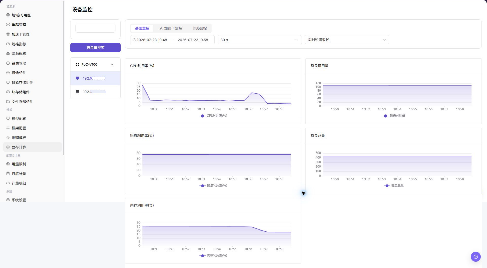

# 设备监控

::: info 文档信息
版本：v1.0
更新日期：2026-07-08
:::

## 功能概述

`设备监控` 用于查看 GPU/NPU 等加速卡设备、显存、利用率、温度和健康状态，帮助运营方完成容量巡检、异常定位和资源调度判断。

| 项目 | 内容 |
| --- | --- |
| 适用角色 | 运营方 |
| 导航路径 | AI基础设施 > On-Prem > 监控 > 设备监控 |
| 页面路由 | `/powerone/monitor/device` |
| 管理对象 | GPU/NPU 等加速卡设备、显存、利用率、温度和健康状态 |
| 典型途径 | 发现加速卡高负载、显存不足、掉卡和硬件健康问题 |

#### 新手理解

设备监控像加速卡仪表盘，用来观察 GPU/NPU 利用率、显存、温度和健康状态，判断算力卡是否可继续承载任务。

#### 术语速查

| 术语 | 说明 |
| --- | --- |
| 设备利用率 | GPU/NPU 当前计算使用率。 |
| 显存使用率 | 加速卡显存占用比例。 |
| 温度 | 设备运行温度。 |
| 健康状态 | 设备是否可被调度和正常运行。 |

## 前提条件

1. 当前账号具备设备监控查看权限。
2. 目标集群已部署设备插件并能上报 GPU/NPU 指标。
3. 设备型号、显存、温度和健康状态可采集。
4. 已确认需要关注的加速卡型号或作业范围。

## 页面说明

设备监控用于查看 GPU/NPU 利用率、显存、温度和健康状态。运营方可用它判断加速卡是否离线、过热、显存不足或被单个任务长期占用。

## 主要操作

### 查看设备监控

#### 操作步骤

1. 进入 `AI基础设施 > On-Prem > 监控 > 设备监控`。
2. 确认右上角地域和页面筛选条件。
3. 查看列表、图表或统计卡片。
4. 重点关注异常状态、高水位、长时间未更新或与预期不一致的数据。
5. 设备异常时，结合节点统计、作业监控和底层驱动状态判断是作业占用还是硬件问题。

#### 查看设备监控

1. 进入 `AI基础设施 > On-Prem > 监控 > 设备监控`。
2. 查看设备列表和整体运行状态，确认设备 ID、设备类型、所属节点、所属集群、地域/可用区和设备状态。
3. 按页面提供的筛选条件选择集群、节点、设备类型、设备状态或时间范围。
4. 查看加速卡使用率、显存使用率、温度、健康状态、绑定作业和异常信息，判断是否存在设备不可用、显存不足或硬件异常。
5. 如发现设备异常，继续进入节点统计或作业监控页面，并结合集群统计、节点日志和调度事件排查。
6. 如仅学习或截图，只查看统计卡片、图表、筛选条件和列表，不修改任何配置。

#### 重点关注

- 设备是否被识别并持续上报。
- 显存和利用率是否接近上限。
- 温度、错误计数或健康状态是否异常。

## 参数说明

| 字段名称 | 是否必填 | 字段类型 | 示例 | 说明 |
| --- | --- | --- | --- | --- |
| 设备 ID | 系统生成 | 文本 | `GPU-0` | 区分同一节点上的多张设备。 |
| 设备类型 | 必填 | 文本 | `NVIDIA A800` | 展示 GPU/NPU 或其他加速设备类型和型号。 |
| 所属节点 | 条件必填 | 文本 | `node-gpu-01` | 定位设备所在节点。 |
| 所属集群 | 条件必填 | 文本 | `cluster-prod-a` | 定位设备所属集群。 |
| 地域 / 可用区 | 条件必填 | 下拉选择 | `武汉 / 可用区 A` | 限定设备所属资源位置。 |
| 设备状态 | 系统生成 | 状态 | `正常` | 展示设备是否可用、告警或离线。 |
| 加速卡使用率 | 系统生成 | 百分比 | `92%` | 判断计算单元是否高负载。 |
| 显存使用率 | 系统生成 | 百分比 / 容量 | `62 GB / 80 GB` | 判断模型或作业是否占满显存。 |
| 温度 | 系统生成 | 数值 | `71°C` | 辅助判断散热和硬件健康。 |
| 健康状态 | 系统生成 | 状态 | `正常` | 展示设备是否可用、告警或离线。 |
| 绑定作业 | 系统生成 | 文本 / 数字 | `运行中作业` | 展示当前设备关联或占用的作业信息。 |
| 时间范围 | 条件必填 | 日期范围 | `近 1 小时` | 控制统计卡片、趋势图和列表数据的查询窗口。 |

## 踩坑提示

- 显存占满不一定代表算力满载，需要结合利用率判断。
- 温度异常应尽快联系运维检查硬件和散热。
- 设备不可见时先检查驱动、插件和节点状态。
- 设备监控可能存在采集延迟，不能只凭单个瞬时指标判断硬件故障。
- 设备异常需要结合节点状态、作业状态、调度事件、设备插件和节点日志一起排查。
- 显存水位高不一定代表设备故障，需结合绑定作业和模型规格判断。
- 不在文档中写真实设备 ID、节点名、节点 IP、集群 ID、资源池 ID、租户信息、内部指标 key 或测试数据。

## 结果校验

| 检查项 | 成功表现 | 异常时处理 |
| --- | --- | --- |
| 设备列表展示型号、节点、利用率、 | 设备列表展示型号、节点、利用率、显存、温度和健康状态。 | 未达到时检查时间范围、集群、节点、设备、作业筛选条件和监控采集状态 |
| 异常设备能对应到节点和受影响作业 | 异常设备能对应到节点和受影响作业。 | 未达到时检查时间范围、集群、节点、设备、作业筛选条件和监控采集状态 |
| 显存和利用率趋势与作业运行窗口一 | 显存和利用率趋势与作业运行窗口一致。 | 未达到时检查时间范围、集群、节点、设备、作业筛选条件和监控采集状态 |

## 配置规则与影响

- **显存水位直接影响模型启动**：显存不足时，即使集群总资源看起来充足，实例也可能创建失败。
- **温度和健康状态要一起看**：高温、掉卡或驱动异常都可能导致作业失败。
- **设备维度适合定位热点**：当集群水位正常但作业慢时，可用设备维度确认是否存在单卡热点。
- **型号差异影响可调度性**：同一规格可能要求特定 GPU/NPU 型号、驱动或算力能力。

## 常见问题

#### 设备数据为空

**问题现象：**

节点存在加速卡，但设备监控没有展示数据。

**可能原因：**

- 节点未安装或未启用对应设备采集组件。
- 驱动、设备插件或采集权限异常。
- 筛选条件没有覆盖目标集群或节点。

**处理方式：**

1. 确认目标节点具备加速卡。
2. 检查设备插件、驱动和监控采集状态。
3. 重置筛选条件后按集群和节点重新查看。

#### 页面列表为空

**问题现象：**

进入设备监控页面后，没有看到 GPU/NPU 设备或显存、温度、利用率指标。

**可能原因：**

- 目标节点没有上报 GPU/NPU 设备，或设备插件未正常运行。
- 地域、集群、节点或设备型号筛选过窄。
- 设备驱动、DCGM、NPU exporter 或采集组件异常。
- 温度、显存等字段暂未被当前设备型号或驱动版本支持。

**处理方式：**

1. 先清空设备型号和节点筛选，确认目标集群有加速卡节点。
2. 进入节点统计确认设备所在节点状态正常。
3. 检查 GPU/NPU 驱动、设备插件和监控 exporter。
4. 如只缺温度或显存字段，确认设备型号和采集组件是否支持该指标。

## 后续操作

1. 显存高位时进入作业监控定位占用任务。
2. 温度或健康异常时联系运维处理硬件或驱动。
3. 型号资源不足时复核加速卡配置和规格关联。

## 注意事项

- 设备序列号、节点位置和内部硬件编号应脱敏。
- 利用率为空不一定表示异常，需要结合任务时间范围。
- 设备健康异常优先按硬件流程处理。
- 设备故障判断前，需要结合节点状态、作业状态、调度事件、设备插件和节点日志交叉确认。
- 文档示例不得包含真实设备 ID、节点名、节点 IP、集群 ID、资源池 ID、租户信息、内部指标 key 或测试数据。
