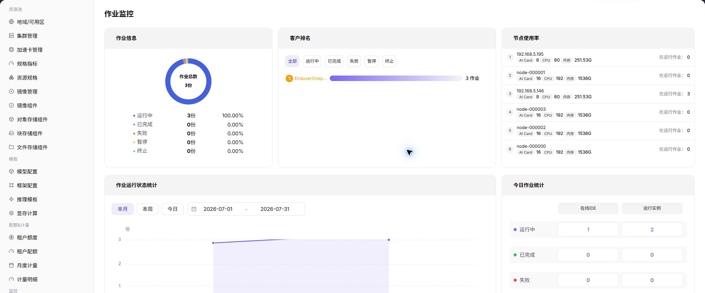

# 作业监控

:::: info 文档信息
版本：v1.0
更新日期：2026-07-08
::::

## 功能概述

`作业监控` 用于查看 模型实例、在线 IDE、运行实例、训练任务和历史作业，帮助运营方完成容量巡检、异常定位和资源调度判断。

| 项目 | 内容 |
| --- | --- |
| 适用角色 | 运营方 |
| 导航路径 | 监控 > 作业监控 |
| 页面路由 | `/powerone/monitor/jobs` |
| 管理对象 | 模型实例、在线 IDE、运行实例、训练任务和历史作业 |
| 典型用途 | 按作业定位排队、失败、高资源消耗和长时间运行问题 |

### 新手理解

作业监控像任务排队和执行清单，用来查看训练、推理或开发任务的状态、排队原因、运行时长和资源占用。

### 术语速查

| 术语 | 说明 |
| --- | --- |
| 作业状态 | 排队、运行、成功、失败或取消。 |
| 排队原因 | 资源不足、配额限制或调度约束导致无法启动的原因。 |
| 运行时长 | 作业从启动到当前的持续时间。 |
| 失败信息 | 作业失败时的错误摘要或事件。 |
## 前提条件

1. 当前账号具备作业监控查看权限。
2. 平台已采集作业状态、事件、排队和运行时长。
3. 目标租户、用户或集群范围已明确。
4. 需要排障时已准备作业 ID 或提交时间。

## 页面说明

作业监控用于查看作业排队、运行中、失败原因和资源占用。运营方可用它分析资源不足、镜像拉取失败、启动异常或长时间运行任务。

## 查看作业监控

### 操作步骤

1. 进入 `监控 > 作业监控`。
2. 确认右上角地域和页面筛选条件。
3. 查看列表、图表或统计卡片。
4. 重点关注异常状态、高水位、长时间未更新或与预期不一致的数据。
5. 作业异常时，进入实例详情查看日志、事件、镜像拉取、启动命令和存储挂载。

### 重点关注

- 失败和排队作业是否异常增多。
- 长时间运行作业是否占用关键资源。
- 作业所属租户、规格、镜像和集群是否符合预期。

### 参数说明

| 字段名称 | 是否必填 | 字段类型 | 示例 | 说明 |
| --- | --- | --- | --- | --- |
| 作业 ID | 是 | 文本 | `job-20260706-001` | 定位单个作业或任务实例。 |
| 作业状态 | 系统生成 | 状态 | `Running` | 展示作业处于排队、运行、成功或失败状态。 |
| 租户 / 用户 | 条件必填 | 文本 | `tenant-a` | 用于按租户或用户定位作业归属。 |
| 排队时长 | 系统生成 | 时长 | `18 分钟` | 判断调度是否存在等待或资源不足。 |
| 运行时长 | 系统生成 | 时长 | `2 小时 15 分钟` | 判断作业运行是否超出预期。 |
| GPU 占用 | 系统生成 | 数字 | `2 * A800` | 展示作业占用的加速卡规格和数量。 |
| 失败信息 | 系统生成 | 文本 | `ImagePullBackOff` | 辅助定位作业失败原因。 |

### 踩坑提示

- 作业排队不一定是故障，可能是资源或配额不足。
- 失败原因要结合事件、日志和镜像拉取状态判断。
- 长时间运行作业应关注资源占用和费用。
### 结果校验

1. 作业列表展示 ID、状态、排队时长、运行时长和资源占用。
2. 失败作业能看到错误摘要或事件入口。
3. 筛选租户、集群或时间范围后统计同步变化。

## 配置规则与影响

- **排队先看资源和调度条件**：排队不一定是平台故障，可能是规格、标签、配额或集群容量限制。
- **失败信息要结合事件**：错误码和事件能区分镜像、存储、启动命令、权限和资源不足问题。
- **运行时长用于发现卡死任务**：长时间运行应结合日志、资源利用率和业务预期判断。
- **资源占用会影响其他用户**：大作业集中提交时，应同步关注租户配额和集群水位。

## 常见问题

### 作业长时间排队

**问题现象：**

作业监控中看到任务一直处于排队或调度中。

**可能原因：**

- 目标规格资源不足。
- 配额不足或模板约束过严。
- 镜像拉取、存储挂载或节点调度条件不满足。

**处理方式：**

1. 查看作业详情和事件。
2. 检查集群、节点和设备剩余资源。
3. 核对租户配额、镜像地址和存储挂载。

### 页面列表为空

**问题现象：**

进入页面后没有看到监控记录或图表。

**可能原因：**

- 筛选条件限制了结果范围。
- 目标地域还没有相关资源或作业数据。
- 当前账号没有该监控对象的查看权限。
- 监控采集数据尚未上报。

**处理方式：**

1. 点击重置清空筛选条件。
2. 确认右上角地域是否正确。
3. 进入资源池或作业页面确认对象是否存在。
4. 联系平台管理员检查权限和采集链路。

## 后续操作

1. 排队问题核对配额、规格和集群容量。
2. 失败问题核对镜像、启动命令、存储和事件。
3. 长时间运行任务进入用量和监控页面评估消耗。

## 注意事项

- 作业名称、镜像地址、数据路径和日志内容可能含敏感信息。
- 终止作业前确认业务影响和输出文件保留策略。
- 高频失败作业应进入模板或镜像复盘。
