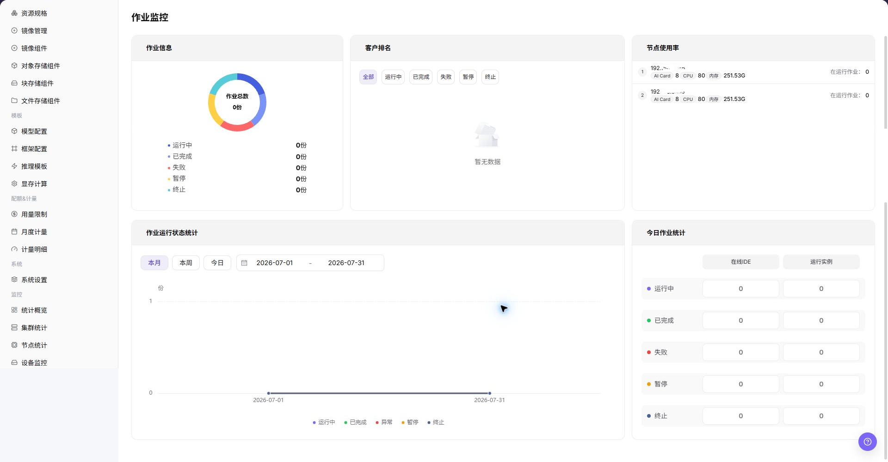
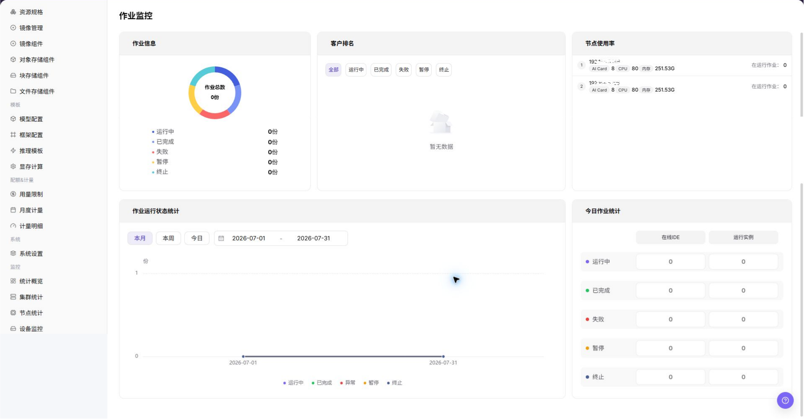

# 作业监控

::: info 文档信息
版本：v1.0
更新日期：2026-07-08
:::

## 功能概述

`作业监控` 用于查看 模型实例、在线 IDE、运行实例、训练任务和历史作业，帮助运营方完成容量巡检、异常定位和资源调度判断。

| 项目 | 内容 |
| --- | --- |
| 适用角色 | 运营方 |
| 导航路径 | AI基础设施 > On-Prem > 监控 > 作业监控 |
| 页面路由 | `/powerone/monitor/work` |
| 管理对象 | 模型实例、在线 IDE、运行实例、训练任务和历史作业 |
| 典型途径 | 按作业定位排队、失败、高资源消耗和长时间运行问题 |

#### 新手理解

作业监控像任务排队和执行清单，用来查看训练、推理或开发任务的状态、排队原因、运行时长和资源占用。

#### 术语速查

| 术语 | 说明 |
| --- | --- |
| 作业状态 | 排队、运行、成功、失败或取消。 |
| 排队原因 | 资源不足、配额限制或调度约束导致无法启动的原因。 |
| 运行时长 | 作业从启动到当前的持续时间。 |
| 失败信息 | 作业失败时的错误摘要或事件。 |

## 前提条件

1. 当前账号具备作业监控查看权限。
2. 平台已采集作业状态、事件、排队和运行时长。
3. 目标租户、用户或集群范围已明确。
4. 需要排障时已准备作业 ID 或提交时间。

## 页面说明

作业监控用于查看作业排队、运行中、失败原因和资源占用。运营方可用它分析资源不足、镜像拉取失败、启动异常或长时间运行任务。

## 主要操作

### 查看作业监控

#### 操作步骤

1. 进入 `AI基础设施 > On-Prem > 监控 > 作业监控`。
2. 确认右上角地域和页面筛选条件。
3. 查看列表、图表或统计卡片。
4. 重点关注异常状态、高水位、长时间未更新或与预期不一致的数据。
5. 作业异常时，进入实例详情查看日志、事件、镜像拉取、启动命令和存储挂载。

#### 查看作业监控

1. 进入 `AI基础设施 > On-Prem > 监控 > 作业监控`。
2. 查看作业列表和整体运行状态，确认作业 ID、作业名称、作业类型、作业状态、所属租户/用户、所属集群和资源占用。
3. 按页面提供的筛选条件选择作业状态、租户/用户、集群、资源类型或时间范围。
4. 查看排队时长、运行时长、GPU/加速卡占用、失败信息和事件入口，判断是否存在长时间排队、启动失败、资源不足或异常占用。
5. 如发现作业异常，继续进入作业详情，并结合事件、日志、镜像拉取、启动命令、存储挂载、节点状态和设备状态排查。
6. 如仅学习或截图，只查看统计卡片、图表、筛选条件和列表，不终止、不重启、不修改任何配置。

#### 重点关注

- 失败和排队作业是否异常增多。
- 长时间运行作业是否占用关键资源。
- 作业所属租户、规格、镜像和集群是否符合预期。

## 参数说明

| 字段名称 | 是否必填 | 字段类型 | 示例 | 说明 |
| --- | --- | --- | --- | --- |
| 作业 ID | 必填 | 文本 | `job-20260706-001` | 定位单个作业或任务实例。 |
| 作业名称 | 条件必填 | 文本 | `inference-job` | 辅助按业务名称定位作业。 |
| 作业类型 | 条件必填 | 枚举 | `运行实例` | 区分模型实例、在线 IDE、运行实例、训练任务或历史作业。 |
| 作业状态 | 系统生成 | 状态 | `Running` | 展示作业处于排队、运行、成功或失败状态。 |
| 所属租户 / 用户 | 条件必填 | 文本 | `tenant-a` | 用于按租户或用户定位作业归属。 |
| 所属集群 | 条件必填 | 文本 | `cluster-prod-a` | 定位作业运行或排队的集群。 |
| 节点 | 系统生成 | 文本 | `node-gpu-01` | 展示作业实际调度到的节点。 |
| 资源规格 | 系统生成 | 文本 | `2 * A800` | 展示作业申请或占用的资源规格。 |
| GPU / 加速卡占用 | 系统生成 | 数字 / 文本 | `2 * A800` | 展示作业占用的加速卡规格和数量。 |
| 排队时长 | 系统生成 | 时长 | `18 分钟` | 判断调度是否存在等待或资源不足。 |
| 运行时长 | 系统生成 | 时长 | `2 小时 15 分钟` | 判断作业运行是否超出预期。 |
| 失败信息 | 系统生成 | 文本 | `ImagePullBackOff` | 辅助定位作业失败原因。 |
| 时间范围 | 条件必填 | 日期范围 | `近 1 小时` | 控制统计卡片、趋势图和列表数据的查询窗口。 |

## 踩坑提示

- 作业排队不一定是故障，可能是资源或配额不足。
- 失败原因要结合事件、日志和镜像拉取状态判断。
- 长时间运行作业应关注资源占用和费用。
- 作业监控可能存在采集延迟，不能只凭单个瞬时状态判断故障。
- 作业异常需要结合事件、日志、镜像拉取、启动命令、存储挂载、节点状态和设备状态一起排查。
- 长时间运行或高资源占用不一定是异常，需要结合业务预期、租户配额和模型规格判断。
- 不在文档中写真实作业 ID、实例名称、镜像地址、数据路径、日志内容、租户信息、节点名、集群 ID、资源池 ID、内部指标 key 或测试数据。
- `终止`、`重启`、`删除` 等按钮属于高风险动作，学习或截图时不点击。

## 结果校验

| 检查项 | 成功表现 | 异常时处理 |
| --- | --- | --- |
| 作业列表展示 ID、状态、排队时 | 作业列表展示 ID、状态、排队时长、运行时长和资源占用。 | 未达到时检查时间范围、集群、节点、设备、作业筛选条件和监控采集状态 |
| 失败作业能看到错误摘要或事件入口 | 失败作业能看到错误摘要或事件入口。 | 未达到时检查时间范围、集群、节点、设备、作业筛选条件和监控采集状态 |
| 筛选租户、集群或时间范围后统计同 | 筛选租户、集群或时间范围后统计同步变化。 | 未达到时检查时间范围、集群、节点、设备、作业筛选条件和监控采集状态 |

## 配置规则与影响

- **排队先看资源和调度条件**：排队不一定是平台故障，可能是规格、标签、配额或集群容量限制。
- **失败信息要结合事件**：错误码和事件能区分镜像、存储、启动命令、权限和资源不足问题。
- **运行时长用于发现卡死任务**：长时间运行应结合日志、资源利用率和业务预期判断。
- **资源占用会影响其他用户**：大作业集中提交时，应同步关注租户配额和集群水位。

## 常见问题

#### 作业长时间排队

**问题现象：**

作业监控中看到任务一直处于排队或调度中。

**可能原因：**

- 目标规格资源不足。
- 配额不足或模板约束过严。
- 镜像拉取、存储挂载或节点调度条件不满足。

**处理方式：**

1. 查看作业详情和事件。
2. 检查集群、节点和设备剩余资源。
3. 核对租户配额、镜像地址和存储挂载。

#### 页面列表为空

**问题现象：**

进入作业监控页面后，没有看到目标作业、排队记录或历史运行记录。

**可能原因：**

- 作业状态、时间范围、租户或集群筛选没有覆盖目标作业。
- 目标作业已经结束且超过历史保留周期。
- 作业仍在提交队列中，尚未产生可展示的运行指标。
- 当前账号没有对应租户、队列或历史作业查看权限。

**处理方式：**

1. 放宽时间范围，清空状态、租户和集群筛选后重新查询。
2. 使用作业 ID、实例名称或提交时间定位目标记录。
3. 到对应业务页面确认作业是否已提交、取消或删除。
4. 如历史作业缺失，联系平台管理员确认保留周期和队列权限。

## 后续操作

1. 排队问题核对配额、规格和集群容量。
2. 失败问题核对镜像、启动命令、存储和事件。
3. 长时间运行任务进入用量和监控页面评估消耗。

## 注意事项

- 作业名称、镜像地址、数据路径和日志内容可能含敏感信息。
- 终止作业前确认业务影响和输出文件保留策略。
- 高频失败作业应进入模板或镜像复盘。
- `终止`、`重启`、`删除` 等按钮会影响真实作业，学习或截图时不点击。
- 文档示例不得包含真实作业 ID、实例名称、镜像地址、数据路径、日志内容、租户信息、节点名、集群 ID、资源池 ID、内部指标 key 或测试数据。
