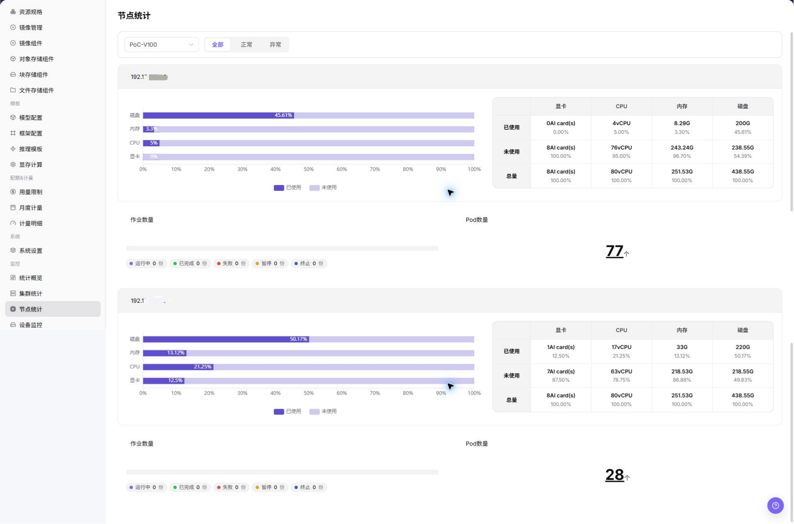

# 节点统计

::: info 文档信息
版本：v1.0
更新日期：2026-07-08
:::

## 功能概述

`节点统计` 用于查看 节点状态、节点角色、资源使用率、心跳和所在集群，帮助运营方完成容量巡检、异常定位和资源调度判断。

| 项目 | 内容 |
| --- | --- |
| 适用角色 | 运营方 |
| 导航路径 | AI基础设施 > On-Prem > 监控 > 节点统计 |
| 页面路由 | `/powerone/monitor/node` |
| 管理对象 | 节点状态、节点角色、资源使用率、心跳和所在集群 |
| 典型途径 | 按节点定位资源瓶颈、离线节点和异常作业分布 |

#### 新手理解

节点统计像服务器点检表，用来查看每台节点的 CPU、内存、磁盘和状态，帮助判断问题落在哪台机器上。

#### 术语速查

| 术语 | 说明 |
| --- | --- |
| 节点状态 | 节点是否 Ready、不可调度或异常。 |
| CPU 使用率 | 节点 CPU 当前负载。 |
| 内存使用率 | 节点内存占用情况。 |
| 磁盘水位 | 系统盘或数据盘空间使用情况。 |

## 前提条件

1. 当前账号具备节点监控查看权限。
2. 目标节点属于已接入集群。
3. 节点 CPU、内存、磁盘和状态指标正常上报。
4. 已明确排障时间范围或受影响任务。

## 页面说明

节点统计用于查看每台节点的 CPU、内存、磁盘和运行状态。运营方可用它定位 NotReady 节点、高水位节点或采集曲线中断的机器。

## 主要操作

### 查看节点统计

#### 操作步骤

1. 进入 `AI基础设施 > On-Prem > 监控 > 节点统计`。
2. 确认右上角地域和页面筛选条件。
3. 查看列表、图表或统计卡片。
4. 重点关注异常状态、高水位、长时间未更新或与预期不一致的数据。
5. 节点异常时，进入集群节点页查看标签、污点、硬件、运行时和作业信息。

#### 查看节点统计

1. 进入 `AI基础设施 > On-Prem > 监控 > 节点统计`。
2. 查看节点列表和整体运行状态，确认节点名称、所属集群、地域/可用区、节点状态和资源水位。
3. 按页面提供的筛选条件选择集群、节点、资源类型、状态或时间范围。
4. 查看 CPU、内存、加速卡、存储、网络和作业相关统计，判断是否存在节点负载过高、资源不足或状态异常。
5. 如发现节点异常，继续进入设备监控或作业监控页面，并结合集群统计和调度事件排查。
6. 如仅学习或截图，只查看统计卡片、图表、筛选条件和列表，不修改任何配置。

#### 重点关注

- 节点是否在线或 Ready。
- 单节点资源是否接近满载。
- 异常节点是否集中在同一集群或可用区。

## 参数说明

| 字段名称 | 是否必填 | 字段类型 | 示例 | 说明 |
| --- | --- | --- | --- | --- |
| 节点名称 | 必填 | 文本 | `node-gpu-01` | 定位具体计算节点。 |
| 所属集群 | 条件必填 | 下拉选择 | `cluster-prod-a` | 限定节点所属集群。 |
| 地域 / 可用区 | 条件必填 | 下拉选择 | `武汉 / 可用区 A` | 限定节点所属资源位置。 |
| 节点状态 | 系统生成 | 状态 | `Ready` | 展示节点是否可调度、不可用或存在告警。 |
| CPU 使用率 | 系统生成 | 百分比 | `72%` | 判断节点 CPU 是否接近瓶颈。 |
| 内存使用率 | 系统生成 | 百分比 | `81%` | 判断节点内存压力。 |
| 加速卡使用率 | 系统生成 | 百分比 | `65%` | 判断 GPU、NPU 等加速卡资源是否接近瓶颈。 |
| 存储使用率 | 系统生成 | 百分比 | `68%` | 判断系统盘、数据盘或挂载存储是否接近上限。 |
| 网络流量 | 系统生成 | 数值 / 趋势 | `入方向 / 出方向` | 辅助判断节点网络是否存在异常波动或瓶颈。 |
| 作业数量 | 系统生成 | 数字 | `12` | 展示节点上运行、排队或异常作业数量。 |
| 时间范围 | 条件必填 | 日期范围 | `近 1 小时` | 控制统计卡片、趋势图和列表数据的查询窗口。 |
| 更新时间 | 系统生成 | 日期时间 | `2026-07-06 10:00` | 判断节点指标是否为最新数据。 |

## 踩坑提示

- 节点 Ready 不代表设备插件一定正常。
- 磁盘水位高可能导致镜像拉取或日志写入失败。
- 排障时结合节点事件和作业日志判断。
- 节点统计可能有采集延迟，不能只凭单个瞬时指标判断故障。
- 节点异常需要结合集群、设备、作业、调度事件和节点日志一起排查。
- 不在文档中写真实节点名、节点 IP、设备 ID、集群 ID、资源池 ID、租户信息、内部指标 key 或测试数据。

## 结果校验

| 检查项 | 成功表现 | 异常时处理 |
| --- | --- | --- |
| 节点列表展示节点名、状态和关键资 | 节点列表展示节点名、状态和关键资源指标。 | 未达到时检查时间范围、集群、节点、设备、作业筛选条件和监控采集状态 |
| 节点状态能与集群健康和作业调度结 | 节点状态能与集群健康和作业调度结果对应。 | 未达到时检查时间范围、集群、节点、设备、作业筛选条件和监控采集状态 |
| 指标更新时间能说明采集是否延迟 | 指标更新时间能说明采集是否延迟。 | 未达到时检查时间范围、集群、节点、设备、作业筛选条件和监控采集状态 |

## 配置规则与影响

- **节点状态优先于资源水位**：节点 NotReady、不可调度或采集异常时，先处理状态问题。
- **磁盘压力会影响作业稳定性**：磁盘水位高可能导致镜像拉取、日志写入或临时文件创建失败。
- **单节点异常会造成局部排队**：调度失败不一定是集群整体容量不足，可能是目标节点标签或污点限制。
- **指标延迟要结合事件判断**：节点指标延迟时，应同时查看集群事件和作业失败原因。

## 常见问题

#### 节点状态异常

**问题现象：**

节点显示不可用、离线或资源数据长时间不更新。

**可能原因：**

- 节点 kubelet 或容器运行时异常。
- 节点到平台或监控采集链路不可达。
- 节点被维护、隔离或存在硬件故障。

**处理方式：**

1. 进入集群节点页查看节点详情。
2. 检查 kubelet、容器运行时和监控采集组件。
3. 确认节点是否处于维护或隔离状态。

#### 页面列表为空

**问题现象：**

进入节点统计页面后，没有看到目标节点或节点指标曲线。

**可能原因：**

- 地域、集群或节点状态筛选没有覆盖目标节点。
- 节点未加入目标集群，或节点处于 NotReady、维护、隔离状态。
- 节点 Agent、kubelet 或监控采集链路延迟上报。
- 当前账号没有目标集群节点监控查看权限。

**处理方式：**

1. 清空节点状态和关键字筛选后重新选择目标地域、集群。
2. 进入集群详情核对节点是否存在、是否 Ready。
3. 检查节点 Agent、kubelet 和采集更新时间。
4. 如节点存在但没有曲线，联系平台管理员排查节点采集和权限。

## 后续操作

1. 节点 NotReady 时检查集群事件和节点状态。
2. 资源高水位时定位占用资源的实例或作业。
3. 涉及加速卡时继续查看设备监控。

## 注意事项

- 节点名、IP、标签和机房信息应脱敏。
- 单点节点异常不一定代表集群整体不可用。
- 节点维护前应确认运行中任务和挂载存储影响。
- 故障判断前，需要结合集群统计、设备监控、作业监控、调度事件和节点日志交叉确认。
- 文档示例不得包含真实节点名、节点 IP、设备 ID、集群 ID、资源池 ID、租户信息、内部指标 key 或测试数据。
