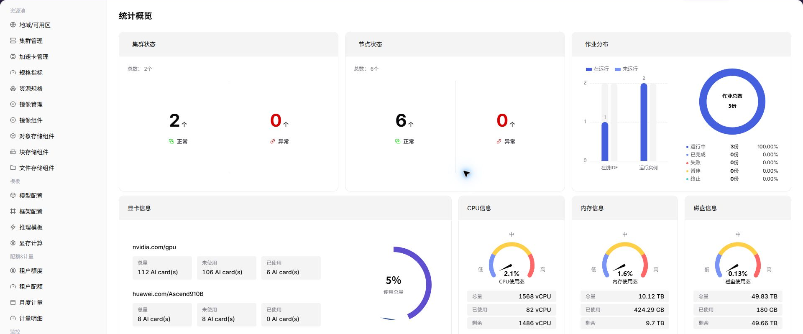

# 统计概览

::: info 文档信息
版本：v1.0
更新日期：2026-07-08
:::

## 功能概述

`统计概览` 用于查看 资源池总览、集群数量、节点状态、作业分布和资源容量，帮助运营方完成容量巡检、异常定位和资源调度判断。

| 项目 | 内容 |
| --- | --- |
| 适用角色 | 运营方 |
| 导航路径 | 监控 > 统计概览 |
| 页面路由 | `/powerone/monitor/overview` |
| 管理对象 | 资源池总览、集群数量、节点状态、作业分布和资源容量 |
| 典型用途 | 日常巡检、快速发现容量风险和进入下钻页面 |

### 新手理解

统计概览像资源池驾驶舱，先看整体水位、异常数量和更新时间，再决定下钻到集群、节点、设备或作业页面继续排查。

### 术语速查

| 术语 | 说明 |
| --- | --- |
| 全局水位 | 平台资源整体使用情况。 |
| 异常聚合 | 把集群、节点、设备和作业异常集中展示。 |
| 趋势入口 | 跳转到具体监控对象的分析入口。 |
| 更新时间 | 判断监控数据有无延迟的时间点。 |

## 前提条件

1. 当前账号具备运营方监控查看权限。
2. 目标地域、可用区和集群已完成资源接入。
3. 监控采集组件正常上报集群、节点、设备和作业数据。
4. 需要排障时，已明确时间范围和受影响资源类型。

## 页面说明

统计概览用于查看运营方视角的全局资源水位、异常聚合和趋势入口。页面重点帮助运营方先判断问题集中在集群、节点、设备还是作业，再进入对应监控页下钻。

## 主要操作

### 查看统计概览

#### 操作步骤

1. 进入 `监控 > 统计概览`。
2. 确认右上角地域和页面筛选条件。
3. 查看列表、图表或统计卡片。
4. 重点关注异常状态、高水位、长时间未更新或与预期不一致的数据。
5. 发现异常后，进入集群统计、节点统计、设备监控或作业监控继续定位。

#### 重点关注

- 集群和节点数量是否异常变化。
- GPU、CPU、内存和磁盘水位是否接近上限。
- 失败、排队或长时间运行作业是否增多。

#### 参数说明

| 字段名称 | 是否必填 | 字段类型 | 示例 | 说明 |
| --- | --- | --- | --- | --- |
| 时间范围 | 必填 | 日期范围 | `近 1 小时` | 控制总览卡片、趋势图和异常统计的查询窗口。 |
| 地域 | 条件必填 | 下拉选择 | `华中一区` | 限定统计概览覆盖的资源范围。 |
| 集群数量 | 系统生成 | 数字 | `12` | 展示当前地域纳入监控统计的集群总数。 |
| 异常数量 | 系统生成 | 数字 | `3` | 汇总集群、节点、设备或作业中的异常对象数量。 |
| 更新时间 | 系统生成 | 日期时间 | `2026-07-06 10:00` | 判断总览数据是否存在采集延迟。 |

#### 踩坑提示

- 总览只能帮助定位方向，不能替代具体对象详情。
- 水位升高要结合新增作业、扩容和排队情况判断。
- 截图前遮挡租户、节点名和业务标识。
#### 结果校验

| 检查项 | 成功表现 | 异常时处理 |
| --- | --- | --- |
| 总览卡片显示集群、节点、设备、作 | 总览卡片显示集群、节点、设备、作业和异常汇总。 | 未达到时检查时间范围、集群、节点、设备、作业筛选条件和监控采集状态 |
| 切换地域或时间范围后 | 切换地域或时间范围后，趋势和异常数量同步变化。 | 未达到时检查时间范围、集群、节点、设备、作业筛选条件和监控采集状态 |
| 下钻到明细页后 | 下钻到明细页后，对象范围与总览统计一致。 | 未达到时检查时间范围、集群、节点、设备、作业筛选条件和监控采集状态 |

## 配置规则与影响

- **总览用于先判方向**：先确认异常是否集中在某个地域、集群或资源类型，再进入下钻页面。
- **异常数量要结合时间范围**：时间窗口越长，历史异常越容易被纳入统计，排障时应固定时间范围。
- **更新时间决定可信度**：更新时间明显滞后时，先核对采集链路，再判断资源有无真实异常。
- **水位变化要看趋势**：瞬时高水位不一定是故障，应结合新增作业、扩容、维护窗口和历史趋势判断。

## 常见问题

### 监控数据延迟或采集缺失

**问题现象：**

统计概览中的资源、作业或节点状态与实际情况不一致。

**可能原因：**

- 监控采集存在延迟。
- 集群或节点采集组件异常。
- 筛选地域或时间范围不正确。

**处理方式：**

1. 确认页面更新时间和筛选条件。
2. 进入集群统计、节点统计和作业监控交叉验证。
3. 联系运维检查采集组件和上报链路。

### 概览资源水位突然升高

**问题现象：**

GPU、CPU、内存或磁盘水位突然接近上限。

**可能原因：**

- 有批量作业或大规格实例集中提交。
- 部分节点不可用导致可用容量下降。
- 统计口径变化或采集恢复后数据回补。

**处理方式：**

1. 进入作业监控定位高消耗作业。
2. 进入节点统计确认是否有节点异常。
3. 必要时扩容、迁移作业或调整租户配额。

### 概览看不到预期集群

**问题现象：**

资源池中已有集群，但统计概览没有显示对应数据。

**可能原因：**

- 集群未完成监控接入。
- 集群状态不可用或被筛选条件排除。
- 账号权限无法查看该集群监控。

**处理方式：**

1. 检查右上角地域和筛选条件。
2. 进入资源池集群管理确认集群状态。
3. 核对监控权限和采集配置。

## 后续操作

1. 异常集中在集群时进入集群统计。
2. 异常集中在节点或设备时进入对应监控页。
3. 作业失败或排队升高时进入作业监控并结合配额排查。

## 注意事项

- 总览用于发现方向，不作为事故定责唯一依据。
- 截图前遮挡租户、节点、IP 和业务标识。
- 水位异常需要结合历史趋势、业务窗口和作业变化判断。
