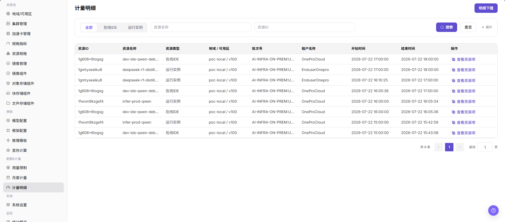
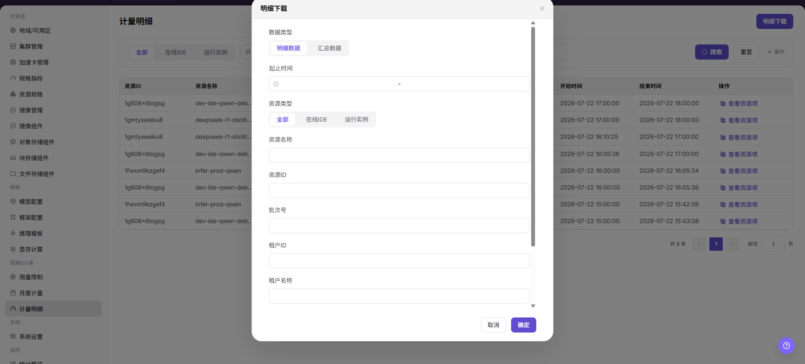

# 计量明细

::: info 文档信息
版本：v1.0
更新日期：2026-07-08
:::

## 功能概述

`计量明细` 用于查看资源级计量流水，支持按资源类型、地域、可用区、批次和企业筛选。

| 项目 | 内容 |
| --- | --- |
| 适用角色 | 运营方 |
| 导航路径 | AI基础设施 > On-Prem > 配额&计量 > 计量明细 |
| 页面路由 | `/powerone/quota-metric/resource` |
| 管理对象 | 资源 ID、资源名称、资源类型、地域、可用区、批次号、企业和起止时间 |
| 典型途径 | 核对月度计量、解释用户消费、下载明细 |

#### 新手理解

计量明细像资源消费流水，逐条记录租户在什么时间用了什么资源、用了多少以及折算了多少 Credits。

#### 查看流程

1. 进入 `配额&计量 > 计量明细`。
2. 按时间、状态、资源类型或关键字筛选。
3. 查看列表或图表结果。
4. 如发现异常，进入关联页面继续下钻。

#### 术语速查

| 术语 | 说明 |
| --- | --- |
| 资源类型 | 在线 IDE、运行实例等被计量对象类型。 |
| 批次号 | 计量任务或汇总批次标识。 |
| 明细下载 | 导出当前筛选范围内的明细。 |

## 前提条件

1. 当前账号具备运营方权限。
2. 目标地域已选择正确。
3. 相关资源、作业或计量任务已有数据上报。

## 页面说明

计量明细用于逐条核对租户、资源、计费周期、用量和 Credits 消耗。运营方可以按租户、资源名称或时间范围定位异常明细，并与月度计量汇总交叉验证。

下图展示计量明细页面。

## 主要操作

### 查看计量明细

#### 操作步骤

1. 进入 `AI基础设施 > On-Prem > 配额&计量 > 计量明细`。
2. 选择资源类型、地域、可用区或企业。
3. 点击 `搜索`。
4. 点击 `查看资源项` 或展开明细，查看资源起止时间。
5. 如需离线核对，点击 `明细下载`。

#### 明细下载

1. 进入 `AI基础设施 > On-Prem > 配额&计量 > 计量明细`。
2. 按需要选择资源类型筛选，例如 `全部`、`在线IDE` 或 `运行实例`。
3. 使用 `资源名称`、`资源ID` 等查询条件缩小明细范围。
4. 点击 `搜索`，确认列表中的资源 ID、资源名称、资源类型、地域/可用区、批次号、租户名称、开始时间和结束时间符合导出范围。
5. 点击 `明细下载` 前，再次确认筛选条件、账期范围和是否包含敏感租户或资源信息。
6. 下载完成后，将文件保存在受控目录，仅用于对账、计量复核或问题排查。
7. 如仅学习或截图，只查看按钮和筛选字段，不点击 `明细下载`。

## 参数说明

| 字段名称 | 是否必填 | 字段类型 | 示例 | 说明 |
| --- | --- | --- | --- | --- |
| 租户 | 必填 | 下拉选择 | `tenant-a` | 过滤需要查看的消费主体。 |
| 资源名称 | 条件必填 | 文本 | `inference-qwen` | 产生计量的实例、作业或存储资源。 |
| 计费周期 | 必填 | 日期范围 | `2026-07-01 至 2026-07-31` | 明细统计所属的结算周期。 |
| 用量 | 系统生成 | 数字 / 时长 | `12 卡时` | 资源实际使用量。 |
| Credits | 系统生成 | 数字 | `360` | 用量按计费规则折算后的消耗额度。 |
| 明细状态 | 系统生成 | 状态 | `已入账` | 展示明细是否完成统计、入账或修正。 |

## 踩坑提示

- 计量明细用于追溯单次资源消费，不适合直接替代月度账单结论。
- 核对异常时先统一租户、实例 ID、资源类型和起止时间，避免把不同周期的记录混在一起。
- 明细可能受采集延迟或补采任务影响，发现缺口时要记录采集时间和关联资源。
- `明细下载` 会导出计量明细，可能包含租户名称、资源 ID、资源名称、时间范围和用量信息。
- 下载文件只用于对账、计量复核和问题排查，不应外发到非授权渠道。
- 下载前必须确认筛选条件，避免导出过大范围或非目标租户数据。
- 不在文档中写真实租户名、资源 ID、批次号、下载文件名、内部路径或测试数据。

## 结果校验

| 检查项 | 成功表现 | 异常时处理 |
| --- | --- | --- |
| 筛选结果与条件一致 | 筛选结果与条件一致。 | 未达到时检查租户、账期、额度、用量记录和计量同步状态 |
| 明细起止时间和资源类型可解释月度 | 明细起止时间和资源类型可解释月度汇总。 | 未达到时检查租户、账期、额度、用量记录和计量同步状态 |
| 下载前筛选已生效 | 列表范围与筛选条件一致。 | 重新核对资源类型、资源名称、资源 ID、批次号、租户和地域条件 |
| 导出范围与搜索条件一致 | 下载范围与页面查询条件一致。 | 缩小筛选范围后重新搜索 |
| 文件保存范围受控 | 文件仅在授权目录内保存和传递。 | 删除非授权副本并按内部流程重新分发 |
| 学习场景未下载 | 学习或截图场景未点击 `明细下载`。 | 如误触下载，按敏感文件处理流程清理 |

## 配置规则与影响

- **下载前先筛选**：避免导出过大范围。
- **以明细解释汇总**：月度计量差异优先从明细合计排查。

## 常见问题

#### 计量明细查不到实例记录

**问题现象：**

已知用户创建过实例，但计量明细里查不到对应记录。

**可能原因：**

- 实例运行时间未落入筛选范围。
- 实例未进入计量状态或已被过滤。
- 租户、地域或规格筛选不匹配。

**处理方式：**

1. 扩大时间范围重新查询。
2. 按实例名称、租户和规格交叉筛选。
3. 确认实例状态和计量任务是否完成。

#### 计量明细金额或用量异常

**问题现象：**

单条计量记录的用量、时长或金额明显不符合预期。

**可能原因：**

- 规格单价或计量单位配置错误。
- 实例跨周期运行导致拆分计量。
- 资源释放延迟导致占用时间偏长。

**处理方式：**

1. 核对规格、单位和计量规则。
2. 检查实例生命周期和释放时间。
3. 对异常记录发起运营复核。

## 后续操作

1. 明细异常时，按租户、资源和时间范围缩小查询范围。
2. 与月度用量不一致时，确认是否存在延迟入账、修正记录或跨周期资源。
3. 导出明细前，对租户名称、资源名称、金额和内部单价做脱敏处理。
4. 需要解释费用时，结合资源规格、运行时长和计费规则给出租户可理解的口径。

## 注意事项

- 计量明细可能存在统计延迟，结算前应确认最终入账状态。
- 明细导出文件包含敏感经营数据，不应在公共渠道传播。
- 不要直接修改明细口径，应通过计费规则或修正流程处理。
- 下载明细前应确认筛选范围，并判断租户或资源标识是否需要脱敏。
