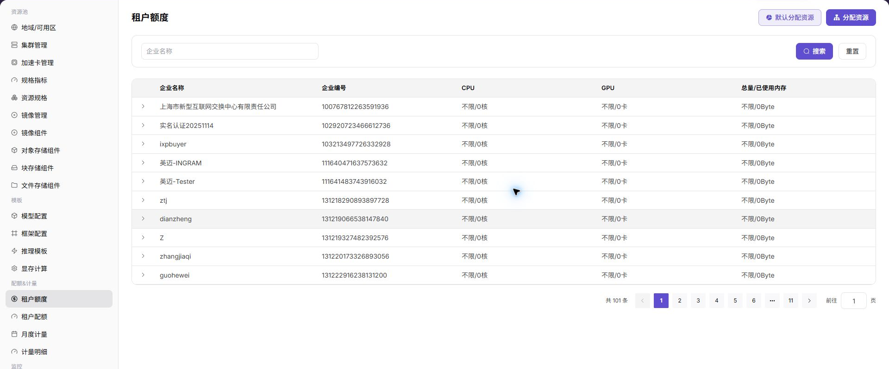
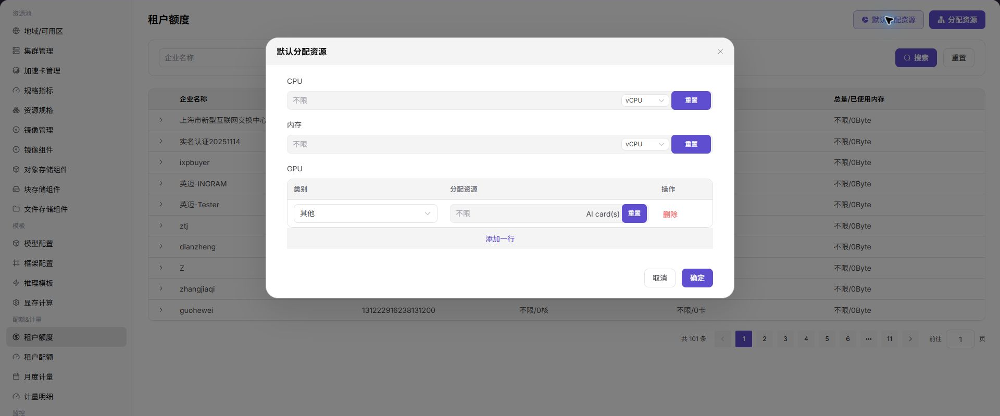
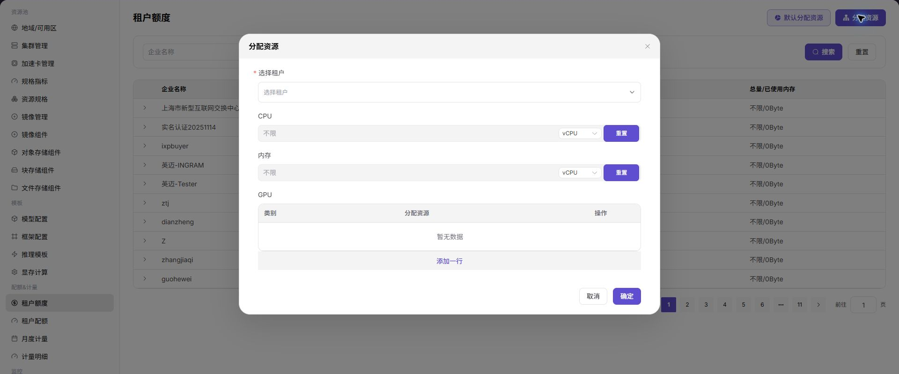

# 租户额度

::: info 文档信息
版本：v1.0
更新日期：2026-07-08
:::

## 功能概述

`租户额度` 用于运营方查看和分配租户在当前资源池中的 CPU、GPU 和内存资源额度。

| 项目 | 内容 |
| --- | --- |
| 适用角色 | 运营方 |
| 导航路径 | 配额&计量 > 租户额度 |
| 页面路由 | /powerone/quota-metric/credit |
| 管理对象 | 租户、企业编号、CPU 额度、GPU 额度、内存额度和已使用量 |
| 典型用途 | 设置默认分配资源、给指定租户分配资源、排查租户资源不足 |

### 新手理解

租户 Credits 像租户账户余额，用来控制可消费额度和欠费状态，帮助运营方判断是否允许继续创建资源。

### 维护流程

1. 确认租户资源需求。
2. 设置默认分配资源。
3. 按租户分配资源。
4. 查看已使用量。
5. 结合租户配额和计量明细排查消耗。

### 术语速查

| 术语 | 说明 |
| --- | --- |
| 额度 | 允许租户使用的资源上限。 |
| 已使用量 | 租户当前已经占用的资源。 |
| 不限 | 不按该维度限制资源额度。 |

## 前提条件

1. 当前账号具备租户额度管理权限。
2. 已确认租户名称或企业编号。
3. 调整额度前已确认业务影响。

## 页面说明

页面展示企业名称、企业编号、CPU、GPU 和内存总量/已使用量，可按企业名称搜索。

下图展示租户额度列表，可查看每个租户的资源总量和已使用量。

## 主要操作

### 设置默认分配资源

#### 适用场景

- 需要统一默认资源额度口径。

#### 操作前确认

1. 确认默认额度不会导致新租户过度占用资源。

#### 操作步骤

1. 进入 `配额&计量 > 租户额度`。
2. 点击 `默认分配资源`。
3. 设置 CPU、内存和 GPU 默认分配策略。
4. 点击 `确定` 保存。

下图展示默认分配资源入口，用于维护默认资源分配策略。

#### 结果校验

| 检查项 | 成功表现 | 异常时处理 |
| --- | --- | --- |
| 默认策略保存成功 | 默认策略保存成功。 | 未达到时检查租户、账期、额度、用量记录和计量同步状态 |
| 新租户或初始化流程按默认值带入 | 新租户或初始化流程按默认值带入。 | 未达到时检查租户、账期、额度、用量记录和计量同步状态 |

### 分配资源

#### 适用场景

- 需要给单个租户调整资源额度。

#### 操作前确认

1. 确认目标租户正确。
2. 确认调整后的额度能满足业务且不超过资源池规划。

#### 操作步骤

1. 点击 `分配资源`。
2. 选择租户。
3. 填写 CPU、内存和 GPU 额度。
4. 如需增加 GPU 分类，点击 `添加一行`。
5. 点击 `确定` 保存。

下图展示分配资源弹窗，可按租户维护 CPU、内存和 GPU 额度。

#### 参数说明

| 字段名称 | 是否必填 | 字段类型 | 示例 | 说明 |
| --- | --- | --- | --- | --- |
| 租户 | 必填 | 下拉选择 | `tenant-a` | 需要查看或调整 Credits 的租户。 |
| Credits 余额 | 系统生成 | 数字 | `12000` | 租户当前剩余可消费额度。 |
| 冻结额度 | 系统生成 | 数字 | `500` | 已被运行中资源或结算流程占用的额度。 |
| 调整类型 | 条件必填 | 枚举 | `充值` | 手动增加、扣减或冻结 Credits 的类型。 |
| 调整数量 | 条件必填 | 数字 | `2000` | 本次调整的 Credits 数量。 |
| 生效时间 | 系统生成 | 日期时间 | `2026-07-06 10:00` | 额度变更写入账户的时间。 |

#### 踩坑提示

- 额度变小前确认是否已有运行中作业超过新额度。

#### 结果校验

| 检查项 | 成功表现 | 异常时处理 |
| --- | --- | --- |
| 列表中目标租户额度更新 | 列表中目标租户额度更新。 | 未达到时检查租户、账期、额度、用量记录和计量同步状态 |
| 用户端创建作业时额度校验符合预期 | 用户端创建作业时额度校验符合预期。 | 未达到时检查租户、账期、额度、用量记录和计量同步状态 |

## 配置规则与影响

- **额度不等于计费**：额度控制资源上限，计量明细记录实际消耗。
- **调整前查已用**：避免把额度调低到低于已使用量。
- **租户要选准**：企业名称相近时优先核对企业编号。

## 常见问题

### 租户额度足够但规格仍不可用

**问题现象：**

租户额度页显示 CPU、内存或加速卡额度足够，但用户创建实例时规格不可选。

**可能原因：**

- 规格没有关联目标集群。
- 模板限制了可选规格。
- 地域或租户授权不包含该资源。

**处理方式：**

1. 检查集群已关联规格。
2. 核对模板规格范围。
3. 确认租户在目标地域具备资源授权。

### 默认额度没有生效

**问题现象：**

设置默认额度后，新租户或目标租户没有按预期获得额度。

**可能原因：**

- 默认额度只影响后续初始化流程。
- 目标租户已经有独立额度记录。
- 初始化客户额度尚未执行。

**处理方式：**

1. 确认默认额度适用范围。
2. 检查租户是否已有额度记录。
3. 执行或重新执行初始化客户额度。

### 额度扣减与实例状态不一致

**问题现象：**

实例已停止或失败，但租户额度仍显示占用。

**可能原因：**

- 资源释放和计量同步存在延迟。
- 实例仍有存储、镜像或后台任务占用。
- 计量周期尚未完成结算。

**处理方式：**

1. 查看计量明细和实例状态。
2. 确认关联资源是否已释放。
3. 等待同步或联系运营方检查计量任务。

## 后续操作

1. Credits 余额不足时，核对充值记录、扣费明细和欠费状态。
2. 手动调整后，进入计量明细确认变更是否被记录。
3. 对欠费租户恢复服务前，确认余额、配额和资源池容量均满足要求。
4. 定期导出余额和变更记录，作为运营结算和客户沟通依据。

## 注意事项

- Credits 涉及结算口径，截图和导出文件不要暴露真实租户名称、金额和内部折扣。
- 手动扣减或充值前应确认审批依据，避免与月度计量结果不一致。
- Credits 充足不代表资源一定可创建，还需同时满足配额和集群容量。
