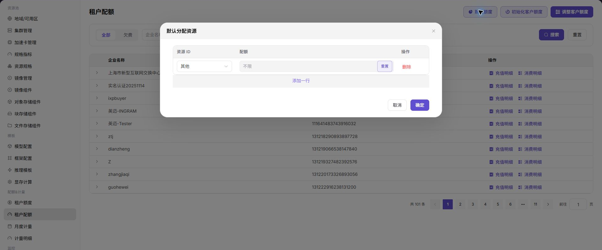
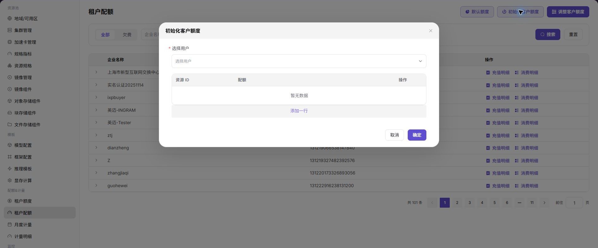

# 租户配额

## 功能概述

`租户配额` 用于维护租户账户额度、初始化客户额度、调整客户额度，并查看充值与消费明细。

| 项目 | 内容 |
| --- | --- |
| 适用角色 | 运营方 |
| 导航路径 | 配额&计量 > 租户配额 |
| 页面路由 | /powerone/quota-metric/tenant |
| 管理对象 | 租户、默认额度、客户额度、充值明细和消费明细 |
| 典型用途 | 初始化租户账户、调整客户额度、排查欠费和消费记录 |

### 新手理解

租户配额像每个租户的资源预算表，用来规定能用多少算力、存储和实例额度，避免单个租户占满公共资源。

### 配置流程

1. 设置默认额度。
2. 初始化客户额度。
3. 按需调整客户额度。
4. 通过充值明细和消费明细核对账务。
5. 与计量明细交叉验证异常。

### 术语速查

| 术语 | 说明 |
| --- | --- |
| 默认额度 | 新租户或初始化时使用的默认账户额度。 |
| 初始化客户额度 | 为客户生成初始额度记录。 |
| 调整客户额度 | 增加或减少客户账户额度。 |
| 消费明细 | 额度消耗记录。 |

## 前提条件

1. 当前账号具备租户配额管理权限。
2. 已确认调整对象和调整原因。
3. 涉及客户额度变更时已完成审批或内部确认。

## 页面说明

页面展示企业名称、企业编号和充值/消费明细入口，可筛选全部或欠费租户。

下图展示租户配额列表，可进入充值明细和消费明细。

## 设置默认额度

### 操作步骤

1. 进入 `配额&计量 > 租户配额`。
2. 点击 `默认额度`。
3. 填写默认额度策略。
4. 点击 `确定` 保存。

下图展示默认额度入口。

### 结果校验

1. 默认额度策略保存成功。

## 初始化客户额度

### 操作步骤

1. 点击 `初始化客户额度`。
2. 选择或确认需要初始化的客户。
3. 确认初始化额度。
4. 提交后查看列表和充值明细。

下图展示初始化客户额度入口。

### 结果校验

1. 客户出现在列表中。
2. 充值明细中有对应初始化记录。

## 调整客户额度

### 操作步骤

1. 点击 `调整客户额度`。
2. 选择目标客户。
3. 填写调整额度和原因。
4. 提交后查看充值明细和消费明细。

下图展示调整客户额度入口。

### 参数说明

| 字段名称 | 是否必填 | 字段类型 | 示例 | 说明 |
| --- | --- | --- | --- | --- |
| 租户 | 是 | 下拉选择 | `tenant-a` | 需要配置或查看配额的租户。 |
| 资源类型 | 是 | 枚举 | `GPU` | 配额约束的资源类别，如 GPU、CPU、内存、存储或实例数。 |
| 配额上限 | 是 | 数字 / 容量 | `8 卡` | 租户可使用的最大资源额度。 |
| 已用 | 系统生成 | 数字 / 容量 | `5 卡` | 租户当前已经占用的资源。 |
| 剩余 | 系统生成 | 数字 / 容量 | `3 卡` | 配额上限扣减已用后的可用额度。 |
| 调整原因 | 条件必填 | 文本 | `项目扩容` | 人工调整额度时记录的业务原因。 |

### 踩坑提示

- 不要把资源额度问题和账户额度问题混在一起，应分别排查。

### 结果校验

1. 目标客户额度变化符合预期。
2. 明细记录可追溯。

## 配置规则与影响

- **额度调整要留痕**：客户额度变更应能被明细追溯。
- **欠费先核对明细**：处理欠费前先看消费明细和计量明细。
- **企业编号优先**：同名或近似企业名按企业编号确认。

## 常见问题

### 配额显示正常但实例仍创建失败

**问题现象：**

租户配额页面看起来额度充足，但用户创建实例仍失败。

**可能原因：**

- 账户额度和资源配额不是同一概念。
- 目标规格的 CPU、内存或加速卡配额不足。
- 模板、地域或集群资源不满足创建条件。

**处理方式：**

1. 同时检查租户配额、租户额度和用户侧资源配额。
2. 查看实例失败事件，确认是额度、规格还是调度问题。
3. 必要时调整资源额度或更换规格。

### 客户额度调整后明细不一致

**问题现象：**

调整客户额度后，列表余额和充值/消费明细对不上。

**可能原因：**

- 明细存在刷新延迟。
- 查看了错误企业编号或时间范围。
- 调整额度和消费扣减同时发生。

**处理方式：**

1. 按企业编号重新筛选。
2. 核对充值明细、消费明细和计量明细。
3. 记录调整原因并保留审批依据。

### 欠费租户无法恢复创建能力

**问题现象：**

补充额度后，用户仍无法创建实例。

**可能原因：**

- 资源配额仍不足。
- 模板或地域权限未开放。
- 已有失败实例需要重新提交。

**处理方式：**

1. 检查租户额度和资源配额。
2. 确认模板、地域、规格和集群可用。
3. 让用户重新进入创建流程提交实例。

## 后续操作

1. 配额不足时，先核对租户业务需求、资源池容量和审批记录。
2. 配额调整后，进入实例创建或作业提交流程验证规格是否可选。
3. 定期对比配额、已用量和计量明细，发现长期闲置或异常占用的租户。
4. 涉及大幅调额时，同步评估集群容量和其他租户影响。

## 注意事项

- 配额不是资源预留，剩余额度充足仍可能因集群容量、规格关联或调度条件导致创建失败。
- 调整额度前应保留业务原因，避免后续计量和容量复盘无法追溯。
- 对外沟通时不要暴露租户真实名称、业务项目名或内部成本口径。
