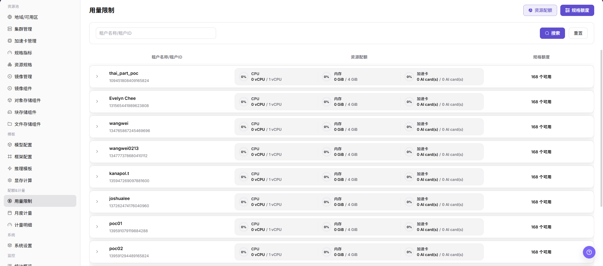
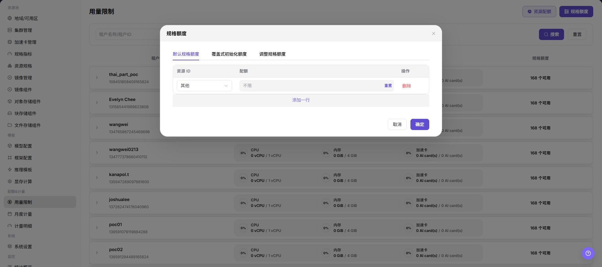

# 用量限制

::: info 文档信息
版本：v1.0
更新日期：2026-07-22
:::

## 功能概述

`用量限制` 用于按租户查看和维护资源配额与规格额度，帮助运营方控制租户可使用的 CPU、内存、加速卡和规格额度范围。

| 项目 | 内容 |
| --- | --- |
| 适用角色 | 运营方 |
| 导航路径 | AI基础设施 > On-Prem > 配额&计量 > 用量限制 |
| 页面路由 | `/powerone/quota-metric/credit` |
| 管理对象 | 租户、资源配额、规格额度、资源项、资源 ID 和额度配置 |
| 典型途径 | 查看租户资源使用边界、调整资源限制、核对规格额度和排查资源不可用问题 |

#### 新手理解

用量限制像租户的资源上限表。资源规格决定一次实例或作业使用多少资源，用量限制决定某个租户总体可以使用多少资源，以及某些规格或资源项是否有额度限制。

#### 术语速查

| 术语 | 说明 |
| --- | --- |
| 资源配额 | 按 CPU、内存、加速卡等资源类别限制租户可使用的总量。 |
| 规格额度 | 按资源 ID 或规格维度限制租户可使用的额度。 |
| 不限制 | 表示该资源项不设置固定额度上限，会扩大可用范围。 |
| 删除 | 移除当前配置项，可能导致对应资源或规格不再受该条配置控制。 |
| 确认 | 提交当前展开区中的调整，属于高风险最终动作。 |

## 前提条件

1. 当前账号具备运营方权限。
2. 已选择正确地域，例如页面顶部地域选择器显示目标地域且状态正常。
3. 已确认目标租户、资源类型和规格范围。
4. 如仅学习或截图，只查看字段、展开行和按钮，不点击最终 `确认`。

## 页面说明

进入 `配额&计量 > 用量限制` 后，页面顶部提供 `资源配额` 和 `规格额度` 两个切换入口。页面支持按 `租户名称/租户ID` 搜索，并在主表中展示 `租户名称/租户ID`、`资源配额` 和 `规格额度`。

展开租户行后，可以查看或维护对应的限制配置。`资源配额` 展开区用于维护资源类别和分配资源；`规格额度` 展开区用于维护资源 ID 和额度。展开区中出现的 `删除`、`不限制` 和 `确认` 会影响租户可用资源范围。

## 主要操作

### 查看和维护用量限制

#### 操作前确认

1. 确认当前地域为目标地域。
2. 确认目标租户、资源类型和额度调整范围已经过内部审批或验证。
3. 确认本次是查看、核对还是实际维护；学习或截图时只使用 `搜索`、`重置`、展开行和 `取消`。

#### 操作步骤

1. 进入 `AI Infra(On-Prem) > 配额&计量 > 用量限制`。
2. 根据核对目标点击 `资源配额` 或 `规格额度`。
3. 在搜索框输入 `租户名称/租户ID`，或保持为空查看列表。
4. 点击 `搜索` 查看匹配租户；如需恢复条件，点击 `重置`。
5. 展开目标租户行，查看当前资源配额或规格额度配置。
6. 在 `资源配额` 展开区查看 `类别`、`分配资源` 和 `操作`。
7. 在 `规格额度` 展开区查看 `资源ID`、`额度` 和 `操作`。

8. 如需要维护配置，先核对是否存在 `不限制`、`删除`、`新增行`、`取消`、`确认` 等动作。
9. 点击最终 `确认` 前，再次核对租户、资源类别、资源 ID、额度、是否不限制和删除影响。
10. 如仅学习或截图，展开后点击 `取消` 或收起行，不提交真实配置。

## 参数说明

| 字段名称 | 所在区域 | 类型 | 说明 |
| --- | --- | --- | --- |
| 租户名称/租户ID | 搜索框、主表 | 文本 / 系统生成 | 用于定位目标租户。文档中不要写真实租户名或租户 ID。 |
| 资源配额 | 顶部切换、主表 | 切换入口 / 汇总列 | 查看或维护租户在 CPU、内存、加速卡等资源类别上的限制。 |
| 规格额度 | 顶部切换、主表 | 切换入口 / 汇总列 | 查看或维护租户在资源 ID 或规格维度上的额度限制。 |
| 类别 | 资源配额展开区 | 系统字段 | 资源类别，例如 CPU、内存或加速卡类别。 |
| 分配资源 | 资源配额展开区 | 数量 / 容量 | 当前类别允许分配的资源额度。 |
| 资源ID | 规格额度展开区 | 系统字段 | 规格或资源项标识。文档中不要写真实资源 ID。 |
| 额度 | 规格额度展开区 | 数量 / 容量 | 当前资源 ID 对应的可用额度。 |
| 不限制 | 展开区动作 | 快捷动作 | 将对应资源项设置为不限制，可能扩大租户可用范围。 |
| 删除 | 展开区动作 | 高风险动作 | 删除当前配置项。 |
| 新增行 | 展开区动作 | 配置动作 | 添加新的资源项或额度配置行。 |
| 取消 | 展开区动作 | 安全退出 | 放弃当前展开区未提交修改。 |
| 确认 | 展开区动作 | 高风险最终动作 | 提交当前配置调整。 |

## 踩坑提示

- `确认` 是高风险最终动作，点击后可能立即改变租户可用资源范围。
- `删除` 会移除配置项，可能导致对应资源或规格限制缺失。
- `不限制` 会扩大资源可用范围，不能在未审批情况下用于真实租户。
- 资源配额充足不代表底层集群一定有空闲资源，还需要结合资源规格、集群容量和调度状态判断。
- 规格额度或资源 ID 配置错误，可能导致用户侧规格不可用或超出预期范围。
- 不写真实租户 ID、租户名、资源 ID、内部资源 key、账号、密钥、Token 或内部测试参数。

## 结果校验

| 检查项 | 成功表现 | 异常时处理 |
| --- | --- | --- |
| 页面可进入 | `用量限制` 页面正常打开，路由为 `/powerone/quota-metric/credit` | 检查账号权限、地域选择和左侧菜单入口 |
| 搜索可用 | 按 `租户名称/租户ID` 搜索后列表范围符合预期 | 检查租户名称、租户 ID 和地域 |
| 资源配额可查看 | 主表展示 `资源配额`，展开后可查看资源类别和分配资源 | 检查租户是否已有资源限制配置 |
| 规格额度可查看 | 主表展示 `规格额度`，展开后可查看资源 ID 和额度 | 检查资源 ID、规格配置和租户范围 |
| 仅学习未提交 | 展开后使用 `取消` 或收起行，没有点击 `确认` | 如误触高风险动作，按内部变更流程复核影响 |

## 常见问题

#### 用户侧仍然提示资源不足

**现象：**

用量限制看起来足够，但用户创建实例或作业时仍提示资源不足。

**可能原因：**

- 资源规格不可用或未关联目标集群。
- 底层集群实际容量不足。
- 规格额度和资源配额之一未覆盖目标规格。

**处理方式：**

1. 核对 `资源配额` 和 `规格额度` 是否都满足目标规格。
2. 检查资源规格、集群关联和集群剩余容量。
3. 结合 `计量明细` 和监控页面排查资源占用。

#### 展开区出现不限制是否可以直接确认

**现象：**

展开租户行后，某些资源项旁边显示 `不限制`。

**可能原因：**

- 当前资源项没有设置固定上限。
- 运维人员准备临时放开额度限制。

**处理方式：**

1. 先确认是否符合租户资源治理策略。
2. 核对是否会影响其他租户或资源池容量。
3. 学习或截图时不要点击 `确认`。

## 后续操作

1. 调整真实限制后，回到用户侧验证目标规格是否可选。
2. 结合 `计量明细` 查看后续资源使用是否符合预期。
3. 结合资源池、监控和作业页面排查资源不足或排队问题。
4. 将额度变更记录纳入内部变更或审计流程。

## 注意事项

- 用量限制直接影响租户可用资源范围，正式变更前必须确认租户、地域和资源范围。
- `确认`、`删除`、`不限制` 都需要重点提示风险。
- 不在文档、截图或工单中写真实租户 ID、租户名、资源 ID、内部资源 key、测试参数、账号、密钥或 Token。
- 导出或复制页面信息前，应对租户和资源标识做脱敏处理。
