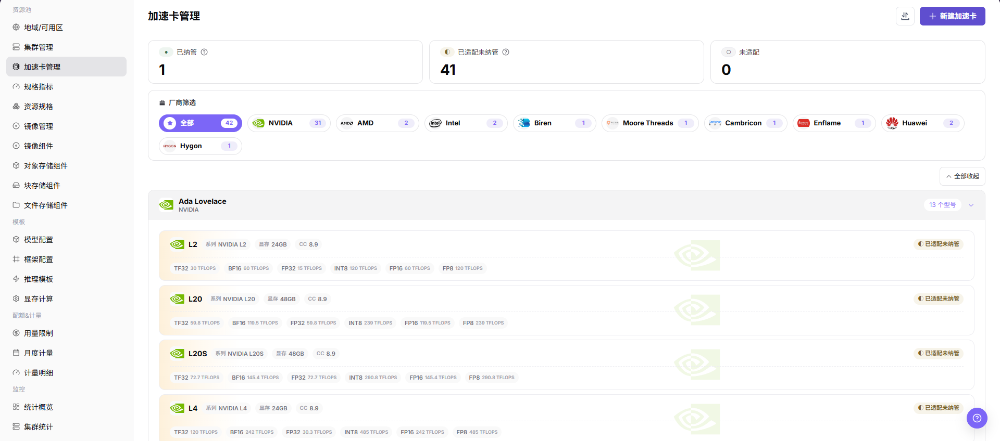

# 加速卡管理

::: info 文档信息
版本：v1.0
更新日期：2026-07-08
:::

## 功能概述

`加速卡管理` 用于维护平台可识别的 AI 加速卡厂商、型号、架构、系列、显存容量、算力信息、适配状态和规格指标关联。运营方维护加速卡后，资源规格、作业调度、监控展示和推理模板推荐才能使用统一的硬件口径。

| 项目 | 内容 |
| --- | --- |
| 适用角色 | 运营方 |
| 导航路径 | AI Infra > On-Prem > 资源池管理 > 加速卡管理 |
| 页面路由 | /powerone/resourcepool/accelerators |
| 管理对象 | AI 加速卡厂商、架构、系列、型号、显存、算力信息、规格指标和纳管状态 |
| 典型用途 | 统一加速卡字典、支撑规格指标、帮助资源规格和推理模板识别可用硬件 |

#### 新手理解

- **加速卡型号** 像硬件身份证，告诉平台这是 A100、H100、Ascend 910B 还是其他型号。
- **规格指标** 像调度标签，决定 Kubernetes 中使用哪个资源 key 申请对应加速卡。
- **selector-key** 用于辅助识别设备类型或节点标签，错误配置会影响调度和监控匹配。
- **已纳管** 表示平台已经可以把该型号纳入资源规格和作业调度口径。
- **未适配** 的型号可以先作为硬件信息维护，但不能直接作为稳定调度能力对外开放。

#### 首次维护流程

1. 确认集群中实际存在的加速卡厂商、型号、显存和 Kubernetes 资源 key。
2. 在 `资源池管理 > 规格指标` 中准备对应 AI 加速卡指标。
3. 进入 `资源池管理 > 加速卡管理` 新建或维护加速卡型号。
4. 把加速卡型号关联到正确的规格指标。
5. 在资源规格中引用该指标，并通过测试作业验证调度、监控和模板推荐结果。

#### 术语速查

| 术语 | 说明 |
| --- | --- |
| 加速卡厂商 | 加速卡生产厂商，例如 NVIDIA、Huawei、AMD、Intel。 |
| 型号 | 加速卡具体型号，例如 A100、H100、Ascend 910B。 |
| 架构 | 同一厂商下的硬件架构或代际，例如 Ampere、Hopper。 |
| 系列 | 同一厂商下的产品系列，用于归类展示和筛选。 |
| 显存容量 | 单卡可用显存容量，用于判断模型和推理模板是否能部署。 |
| 算力信息 | 不同精度模式下的峰值算力或计算能力。 |
| 规格指标 | 与资源规格关联的调度指标，通常包含 Kubernetes 资源 key。 |
| Kubernetes 资源 key | 集群中设备插件上报的资源名称，例如 `nvidia.com/gpu`。 |
| selector-key | 用于匹配设备、节点标签或监控识别的辅助字段。 |
| 适配状态 | 标记该型号是否已经完成平台适配和规格指标绑定。 |

## 前提条件

1. 当前账号具备运营方权限，并能进入 `AI Infra > On-Prem > 资源池管理 > 加速卡管理`。
2. 已确认目标加速卡厂商、型号、架构、系列、显存容量和算力信息。
3. 已确认 Kubernetes 资源 key、selector-key 或监控识别字段与集群实际上报信息一致。
4. 如需纳管到作业调度，已在 `资源池管理 > 规格指标` 中准备对应指标。
5. 学习或截图场景只查看页面字段和弹窗，不提交真实加速卡配置。

## 页面说明

页面按厂商和架构组织加速卡型号，顶部展示纳管状态统计，左侧可按厂商筛选，卡片中展示型号、显存、算力和适配状态。

下图展示加速卡管理列表，可按厂商和纳管状态查看硬件型号。

#### 厂商与状态筛选

| 区域 | 说明 |
| --- | --- |
| 状态统计 | 展示已纳管、已适配未纳管、未适配数量。 |
| 厂商筛选 | 按 NVIDIA、AMD、Intel、Huawei 等厂商缩小范围。 |
| 型号卡片 | 展示系列、型号、显存、计算能力和不同精度下的峰值算力。 |
| 操作入口 | 进入新建、编辑、查看或其他页面真实操作入口。 |

## 主要操作

### 新增加速卡

#### 适用场景

新增硬件型号接入平台前，需要先维护加速卡基础信息；已有加速卡型号需要补充适配状态或规格指标时，也可通过该入口维护。

#### 操作步骤

1. 进入 `AI Infra > On-Prem > 资源池管理 > 加速卡管理`。
2. 点击 `新建加速卡` 或页面真实新增入口。
3. 按页面字段填写加速卡厂商、型号、架构、系列、显存容量、算力信息和适配状态。
4. 根据页面要求选择或关联规格指标，核对 Kubernetes 资源 key、selector-key 或监控识别字段。
5. 点击最终 `保存`、`提交` 或 `确定` 前，再次核对硬件型号、资源指标和集群实际上报信息是否一致。
6. 如仅学习或验证页面，只查看字段和弹窗，不提交真实加速卡配置。

下图展示新建加速卡信息弹窗，重点填写硬件基础信息和规格指标关联。

## 参数说明

| 参数 | 是否必填 | 说明 | 配置要点 |
| --- | --- | --- | --- |
| 加速卡厂商 | 必填 | 加速设备厂商。 | 与硬件清单、驱动识别和页面筛选口径保持一致。 |
| 型号 | 必填 | 加速卡型号。 | 与真实硬件型号一致，避免把显示名称相近的卡型混用。 |
| 架构 | 条件必填 | 硬件架构或代际。 | 影响型号归类、模板推荐和维护识别。 |
| 系列 | 条件必填 | 产品系列或页面分类。 | 与厂商命名和采购口径保持一致。 |
| 显存容量 | 条件必填 | 单卡可用显存容量。 | 会影响推理模板推荐和显存测算。 |
| 算力信息 | 可选 | 不同精度下的峰值算力或计算能力。 | 按硬件资料或平台真实字段填写。 |
| 规格指标 | 条件必填 | 与资源规格关联的调度指标。 | 应指向已维护且可用的 AI 加速卡指标。 |
| Kubernetes 资源 key | 条件必填 | 集群设备插件上报的资源名称。 | 必须与集群实际上报一致，否则可能无法调度。 |
| selector-key | 条件必填 | 用于匹配设备、节点标签或监控识别的字段。 | 与规格指标、监控采集和节点标签配置保持一致。 |
| 适配状态 | 必填 | 标记该型号是否已完成平台适配。 | 未适配或未纳管时，不应作为稳定调度能力开放。 |
| 纳管状态 | 系统生成或可选 | 是否纳入平台资源规格和作业调度口径。 | 保存后回到列表确认状态统计变化。 |
| 操作 | 系统生成 | 页面提供的新建、编辑、查看等入口。 | 高风险最终动作前确认字段和影响范围。 |

## 踩坑提示

- 新增加速卡会影响资源规格、调度识别、监控展示和推理模板推荐。
- 型号、显存容量、资源 key 或 selector-key 配置错误，可能导致规格不可选、调度失败或监控无法匹配设备。
- 不要把显示名称相近但 Kubernetes 资源 key 不同的卡混成同一个型号。
- 显存容量会影响推理模板和显存测算结果，提交前应与硬件信息核对。
- `保存`、`提交`、`确定` 属于高风险最终动作，学习或截图时不要点击。

## 结果校验

| 检查项 | 成功表现 | 异常时处理 |
| --- | --- | --- |
| 页面可进入 | 能进入 `AI Infra > On-Prem > 资源池管理 > 加速卡管理`。 | 检查菜单配置和账号权限。 |
| 列表正常加载 | 加速卡列表、厂商筛选和状态统计正常显示。 | 刷新页面并检查服务状态或浏览器控制台错误。 |
| 新增入口可见 | 页面显示 `新建加速卡` 或真实新增入口。 | 检查运营方权限和页面状态。 |
| 新增弹窗可打开 | 点击新增入口后可打开新建加速卡弹窗或页面。 | 检查路由、权限和前端错误。 |
| 必填字段校验正常 | 缺少必填字段时页面显示校验提示。 | 按页面提示补齐字段，不使用真实内部参数做学习测试。 |
| 学习时未提交真实配置 | 仅查看字段和弹窗，没有点击最终 `保存`、`提交` 或 `确定`。 | 如误提交，立即通知平台管理员并按变更流程处理。 |
| 真实提交后记录可追踪 | 新型号出现在加速卡列表中，状态统计符合预期。 | 核对筛选条件、适配状态和提交结果。 |
| 规格指标可选择 | 资源规格创建页能够选择该加速卡对应指标。 | 检查规格指标状态、资源 key 和 selector-key。 |

## 配置规则与影响

- **资源 key 一致性**：加速卡指标中的 Kubernetes 资源 key 必须与集群实际上报的资源 key 一致。
- **selector-key 一致性**：selector-key 应与节点标签、规格指标或监控识别字段保持一致。
- **命名稳定性**：厂商、系列和型号应与硬件采购、驱动识别和监控采集口径一致。
- **纳管前验证**：纳管前先用测试作业验证资源申请、调度和监控展示。
- **模板影响**：显存容量、算力信息和适配状态会影响推理模板推荐和资源规格选择。

## 常见问题

#### 加速卡型号已维护但资源规格中不可选

**问题现象：**加速卡管理中能看到型号，但创建资源规格时没有对应指标。

**处理方式：**

1. 检查加速卡型号的适配状态和纳管状态。
2. 进入规格指标确认对应 Kubernetes 资源 key 和 selector-key。
3. 确认规格指标状态可用。
4. 完成纳管验证后再创建资源规格。

#### 显存容量影响模板推荐不准确

**问题现象：**推理模板推荐规格偏大或偏小，与实际加速卡能力不一致。

**处理方式：**

1. 核对硬件清单和驱动识别结果。
2. 修正单卡显存、型号、系列和架构信息。
3. 在显存测算配置中补充该型号测试数据。
4. 使用测试作业验证推荐结果是否符合预期。

#### 加速卡监控没有对应设备

**问题现象：**节点存在加速卡，但设备监控或资源规格无法识别。

**处理方式：**

1. 检查节点设备插件和资源上报。
2. 核对加速卡型号、Kubernetes 资源 key、selector-key 和规格指标。
3. 确认监控采集组件支持该型号。
4. 联系运维确认驱动、固件和监控采集适配情况。

## 后续操作

1. 进入 `资源池管理 > 规格指标` 维护或确认对应指标。
2. 进入 `资源池管理 > 资源规格` 创建包含该加速卡的规格。
3. 在推理模板或测试作业中验证该型号能被正确选择。
4. 回到加速卡管理列表，确认状态统计、厂商筛选和型号卡片信息符合预期。

## 注意事项

- 加速卡型号、厂商、架构、显存容量和算力信息应与硬件清单、驱动识别和监控采集保持一致。
- 型号纳管前要确认设备插件能上报资源，规格指标能识别资源 key，监控能采集利用率和显存。
- 不同驱动或固件版本可能影响资源识别和稳定性，生产接入前先提交测试作业验证。
- 不写真实内部资源 key 映射、节点标签、集群 ID、资源池 ID、内网地址、账号、密钥、Token、AK/SK 或内部测试参数。
