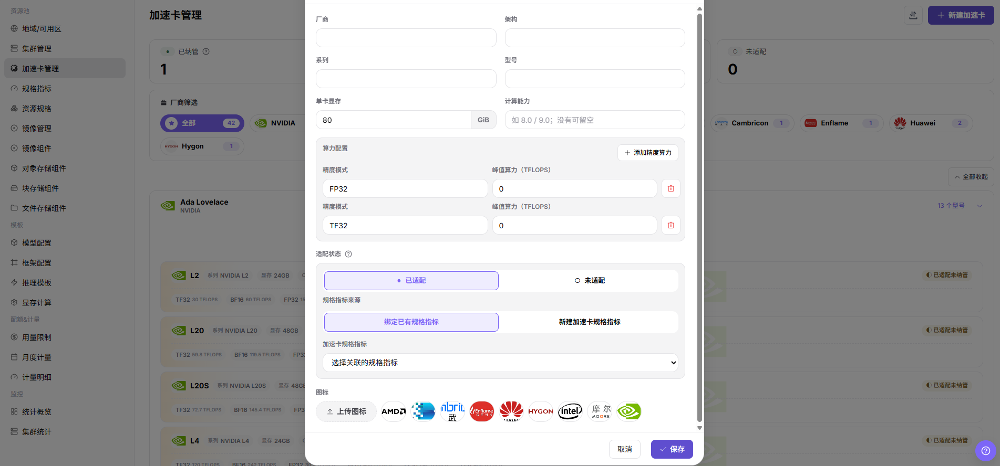

# 加速卡管理

:::: info 文档信息
版本：v1.0
更新日期：2026-07-06
::::

## 功能概述

`加速卡管理` 用于维护平台可识别的 AI 加速卡型号、厂商、架构、显存容量、计算能力和适配状态，并把加速卡型号与规格指标关联起来。

| 项目 | 内容 |
| --- | --- |
| 适用角色 | 运营方 |
| 导航路径 | 资源池 > 加速卡管理 |
| 页面路由 | /powerone/resourcepool/accelerators |
| 管理对象 | AI 加速卡厂商、架构、系列、型号、显存、算力指标和纳管状态 |
| 典型用途 | 统一加速卡字典、支撑规格指标、帮助资源规格和推理模板识别可用硬件 |

### 新手理解

- **加速卡型号** 像硬件身份证，告诉平台这是 A100、H100、Ascend 910B 还是其他型号。
- **规格指标** 像调度标签，决定 Kubernetes 中使用哪个资源 key 申请对应加速卡。
- **已纳管** 表示平台已经可以把该型号纳入资源规格和作业调度口径。
- **未适配** 的型号可以先作为硬件信息维护，但不能直接作为稳定调度能力对外开放。

### 首次维护流程

1. 确认集群中实际存在的加速卡厂商、型号和 Kubernetes 资源 key。
2. 在 `资源池 > 规格指标` 中准备对应 AI 加速卡指标。
3. 进入 `资源池 > 加速卡管理` 创建或维护加速卡型号。
4. 把加速卡型号关联到正确的规格指标。
5. 在资源规格中引用该指标，并通过测试作业验证调度结果。

### 术语速查

| 术语 | 说明 |
| --- | --- |
| 厂商 | 加速卡生产厂商，例如 NVIDIA、Huawei、AMD、Intel。 |
| 架构 | 同一厂商下的硬件架构或代际，例如 Ampere、Hopper。 |
| 显存 | 单卡可用显存容量，用于判断模型和推理模板是否能部署。 |
| 计算能力 | 硬件支持的计算能力或 Compute Capability，用于区分 CUDA 能力。 |
| 适配状态 | 标记该型号是否已经完成平台纳管和规格指标绑定。 |

## 前提条件

1. 当前账号具备运营方权限，并能进入 `资源池 > 加速卡管理`。
2. 已确认目标加速卡型号、显存容量、厂商、架构和 Kubernetes 资源 key。
3. 如需纳管到作业调度，已在 `资源池 > 规格指标` 中准备对应指标。

## 页面说明

页面按厂商和架构组织加速卡型号，顶部展示纳管状态统计，左侧可按厂商筛选，卡片中展示型号、显存、算力和适配状态。

下图展示加速卡管理列表，可按厂商和纳管状态查看硬件型号。

### 厂商与状态筛选

页面顶部和左侧筛选用于快速定位某类加速卡。

| 区域 | 说明 |
| --- | --- |
| 状态统计 | 展示已纳管、已适配未纳管、未适配数量。 |
| 厂商筛选 | 按 NVIDIA、AMD、Intel、Huawei 等厂商缩小范围。 |
| 型号卡片 | 展示系列、型号、显存、计算能力和不同精度下的峰值算力。 |

## 新建加速卡

### 适用场景

- 新增硬件型号接入平台前，需要先维护加速卡基础信息。
- 需要把已有加速卡型号补充为可纳管状态。

### 操作前确认

1. 确认厂商、架构、系列、型号和显存容量准确。
2. 确认规格指标来源选择正确，避免调度 key 与实际集群不一致。

### 操作步骤

1. 进入 `资源池 > 加速卡管理`。
2. 点击 `新建加速卡`。
3. 填写厂商、架构、系列、型号、单卡显存和计算能力。
4. 维护不同精度模式下的峰值算力。
5. 选择适配状态和规格指标来源。
6. 点击 `保存`。

下图展示新建加速卡信息弹窗，重点填写硬件基础信息和规格指标关联。

### 参数说明

| 字段名称 | 是否必填 | 字段类型 | 示例 | 说明 |
| --- | --- | --- | --- | --- |
| 加速卡厂商 | 是 | 文本 | `NVIDIA` | 加速设备厂商。 |
| 型号 | 是 | 文本 | `A100` | 加速卡型号。 |
| 资源名称 | 是 | 文本 | `nvidia.com/gpu` | Kubernetes 资源名称。 |
| 显存容量 | 否 | 文本 | `80GiB` | 单卡显存容量。 |
| 状态 | 系统生成 | 枚举 | `启用` | 是否允许被规格引用。 |
### 踩坑提示

- 不要把显示名称相近但资源 key 不同的卡混成同一个型号。
- 显存容量会影响推理模板和显存测算结果，提交前应与硬件信息核对。

### 结果校验

1. 加速卡列表中出现新型号。
2. 状态统计数量符合预期。
3. 资源规格创建页能够选择该加速卡对应指标。

## 配置规则与影响

- **资源 key 一致性**：加速卡指标中的 k8s-key 必须与集群实际上报的资源 key 一致。
- **命名稳定性**：厂商、系列和型号应与硬件采购或驱动识别口径一致。
- **纳管前验证**：纳管前先用测试作业验证资源申请、调度和监控展示。

## 常见问题

### 加速卡型号已维护但资源规格中不可选

**问题现象：**

加速卡管理中能看到型号，但创建资源规格时没有对应指标。

**可能原因：**

- 加速卡未关联规格指标。
- 规格指标状态不可用。
- 加速卡型号处于未适配或未纳管状态。

**处理方式：**

1. 检查加速卡型号的适配状态。
2. 进入规格指标确认对应 k8s-key 和 selector-key。
3. 完成纳管验证后再创建资源规格。

### 显存容量影响模板推荐不准确

**问题现象：**

推理模板推荐规格偏大或偏小，与实际加速卡能力不一致。

**可能原因：**

- 单卡显存填写错误。
- 型号、系列或架构与真实硬件不一致。
- 显存测算规则未覆盖该型号。

**处理方式：**

1. 核对硬件清单和驱动识别结果。
2. 修正单卡显存和型号信息。
3. 在显存测算配置中补充该型号测试数据。

### 加速卡监控没有对应设备

**问题现象：**

节点存在加速卡，但设备监控或资源规格无法识别。

**可能原因：**

- 设备插件未上报资源。
- 加速卡型号与 selector-key 不匹配。
- 监控采集组件不支持该型号。

**处理方式：**

1. 检查节点设备插件和资源上报。
2. 核对加速卡型号、selector-key 和规格指标。
3. 联系运维确认监控采集适配情况。

## 后续操作

1. 进入 `资源池 > 规格指标` 维护或确认对应指标。
2. 进入 `资源池 > 资源规格` 创建包含该加速卡的规格。
3. 在推理模板或测试作业中验证该型号能被正确选择。

## 注意事项

- 加速卡型号、厂商、架构和显存容量应与硬件清单、驱动识别和监控采集保持一致。
- 型号纳管前要确认设备插件能上报资源，规格指标能识别资源 key，监控能采集利用率和显存。
- 不同驱动或固件版本可能影响资源识别和稳定性，生产接入前先提交测试作业验证。
- 不要把显示名称相近但资源 key 不同的卡型混用。
