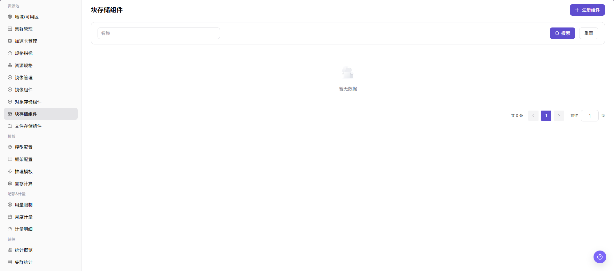
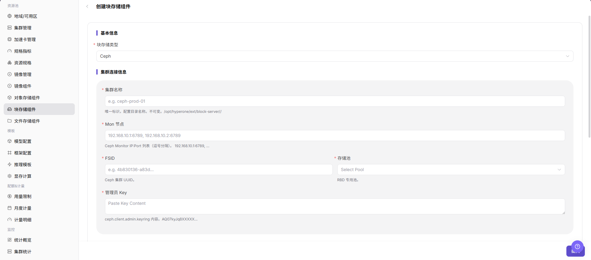

# 块存储组件

::: info 文档信息
版本：v1.0
更新日期：2026-07-08
:::

## 功能概述

`块存储组件` 用于接入面向卷的存储能力，常见实现包括 Ceph RBD。块存储适合为工作负载提供独立磁盘卷，满足需要持久化卷、低层块设备或特定性能特征的场景。

| 项目 | 内容 |
| --- | --- |
| 适用角色 | 运营方 |
| 导航路径 | AI Infra > On-Prem > 资源池管理 > 块存储组件 |
| 页面路由 | `/powerone/resourcepool/block-storage` |
| 管理对象 | Ceph 集群、Mon 地址、FSID、RBD Pool、StorageClass、容量、访问凭据、绑定地域和绑定集群 |
| 典型用途 | 为工作负载 PVC 创建、卷挂载、容量展示和资源调度提供持久化块设备能力 |

#### 新手理解

块存储组件像给实例挂载的独立硬盘供应入口，负责把 Ceph RBD 或兼容块设备能力接入平台。用户创建需要持久化卷的实例时，平台会按这里的 StorageClass、容量、访问模式和回收策略去申请并挂载块卷。

#### 术语速查

| 术语 | 说明 |
| --- | --- |
| Ceph | 分布式存储系统，可提供对象、块和文件能力。 |
| Mon 地址 | Ceph Monitor 地址，用于访问和发现 Ceph 集群状态。 |
| FSID | Ceph 集群唯一标识，用于区分不同 Ceph 集群。 |
| RBD Pool | Ceph 中承载 RBD 镜像的存储池。 |
| StorageClass | Kubernetes 中描述动态卷创建方式的资源。 |
| Keyring/Secret | 访问 Ceph 或 CSI 所需的认证材料，属于敏感信息。 |
| 回收策略 | PVC 删除后底层卷保留或删除的策略。 |

## 前提条件

1. Ceph 或等效块存储服务已部署完成。
2. 已准备 Endpoint、Mon 地址、FSID、RBD Pool、认证用户、Keyring 或 Secret 等连接材料。
3. 目标 Kubernetes 集群已具备对应 CSI 或卷插件能力。
4. 已确认 StorageClass、容量、性能、租户隔离和回收策略。
5. 学习或截图场景只查看字段和弹窗，不提交真实块存储组件配置。

## 页面说明

页面展示已接入的块存储组件、状态、容量、连接信息摘要和关联地域。

下图展示块存储组件列表，可查看组件状态、容量和连接信息摘要。

## 主要操作

### 创建块存储组件

#### 适用场景

当需要接入新的 Ceph RBD 或兼容块存储服务，并为工作负载提供 PVC 创建、卷挂载、容量展示和资源调度能力时，创建块存储组件。若真实 UI 显示 `注册` 或 `注册块存储组件`，正文保留真实入口文案。

#### 操作步骤

1. 进入 `AI Infra > On-Prem > 资源池管理 > 块存储组件`。
2. 点击 `创建块存储组件`、`新增`、`注册` 或页面真实创建入口。
3. 按页面字段填写组件名称、存储类型、访问协议、Endpoint、Mon 地址、FSID、RBD Pool 等连接信息。
4. 根据页面要求配置认证方式、认证用户、Keyring 或 Secret、绑定地域、绑定集群、容量信息和回收策略。
5. 如页面提供连接测试，先执行连接测试并确认返回结果。
6. 点击最终 `保存`、`提交` 或 `确定` 前，再次核对连接信息、凭据来源、绑定范围和容量影响。
7. 如仅学习或验证页面，只查看字段和弹窗，不提交真实块存储组件配置。

下图展示创建块存储组件表单，用于填写组件基础信息和连接参数。

## 参数说明

| 参数 | 是否必填 | 说明 | 配置建议 |
| --- | --- | --- | --- |
| 组件名称 | 必填 | 块存储组件展示名称。 | 建议体现存储类型、环境、地域或 Ceph 集群用途。 |
| 存储类型 | 必填 | 块存储后端类型。 | 按实际后端选择 Ceph RBD 或页面支持的其他类型。 |
| 访问协议 | 必填 | 块存储访问协议。 | 与底层存储和 CSI 能力一致。 |
| Endpoint | 条件必填 | 块存储或管理服务访问入口。 | 文档中不写真实 Endpoint；提交前确认平台和目标集群可访问。 |
| Mon 地址 | 必填 | Ceph Monitor 地址列表。 | 必须与底层 Ceph 集群一致，且目标节点网络可达。 |
| FSID | 必填 | Ceph 集群唯一标识。 | 从真实 Ceph 集群配置获取，不手工猜测。 |
| RBD Pool | 必填 | 承载 RBD 镜像的 Ceph Pool。 | 确认容量、配额、权限和回收策略。 |
| 认证方式 | 条件必填 | 访问块存储后端的认证方式。 | 按页面支持选择用户、Keyring、Secret 或其他方式。 |
| 认证用户 | 条件必填 | Ceph 或存储后端访问用户。 | 使用最小必要权限，不写真实账号。 |
| Keyring/Secret | 条件必填 | 访问 Ceph 或 CSI 的密钥材料。 | 只在系统表单或 Secret 中维护，不写入文档。 |
| StorageClass | 条件必填 | Kubernetes 动态卷创建配置。 | 与 CSI 驱动、Pool、访问模式和回收策略一致。 |
| 绑定地域 | 条件必填 | 块存储组件可绑定或可见的地域范围。 | 与资源池、可用区、集群和数据范围一致。 |
| 绑定集群 | 条件必填 | 可使用该块存储组件的集群。 | 绑定前确认集群 CSI、网络和节点插件状态。 |
| 容量信息 | 否 | 总容量、可用容量或配额信息。 | 与底层存储系统统计口径一致。 |
| 回收策略 | 条件必填 | PVC 删除后的卷处理策略。 | 生产环境谨慎选择删除策略，避免误删数据。 |
| 状态 | 系统生成 | 组件注册、连接测试和探测状态。 | 创建后关注状态、更新时间和错误提示。 |
| 操作 | 否 | 支持创建、编辑、启用、禁用、删除或测试连接等操作。 | 高风险操作前确认工作负载、PVC 和数据影响。 |

## 踩坑提示

- 创建块存储组件可能影响工作负载 PVC 创建、卷挂载、容量展示和资源调度。
- 错误的 Mon 地址、FSID、Pool、StorageClass、CSI 配置或 Keyring 可能导致卷创建失败、挂载失败或数据不可用。
- StorageClass、Pool 和访问模式要与目标集群 CSI 能力一致，否则卷能创建但可能挂载失败。
- 块卷扩容前先确认底层存储、文件系统和工作负载都支持在线扩容。
- 卸载或删除块卷前确认实例已经停止写入，避免文件系统损坏或数据丢失。
- `保存 / Save`、`提交 / Submit`、`确定 / OK` 属于高风险最终动作。
- 不写真实 Endpoint、Mon 地址、FSID、Pool 名称、Keyring、Secret、kubeconfig、集群 ID、资源池 ID、账号、密钥、Token 或内部测试参数。

## 结果校验

| 检查项 | 成功表现 | 异常时处理 |
| --- | --- | --- |
| 页面可进入 | 能进入 `AI Infra > On-Prem > 资源池管理 > 块存储组件`。 | 检查菜单配置和账号权限。 |
| 列表正常加载 | 块存储组件列表、状态、容量和连接信息摘要正常显示。 | 刷新页面并检查服务状态或浏览器控制台错误。 |
| 创建入口可见 | 页面显示 `创建块存储组件`、`新增`、`注册` 或真实创建入口。 | 检查运营方权限、License 和页面配置。 |
| 创建表单可打开 | 点击入口后可查看组件名称、访问协议、Endpoint、Mon 地址、FSID、RBD Pool 等字段。 | 检查路由、权限和前端错误。 |
| 必填字段校验正常 | 缺少组件名称、Mon 地址、FSID、Pool、认证信息或绑定范围时出现校验提示。 | 按页面提示补齐字段，不绕过校验。 |
| 仅学习时未提交 | 未触发真实保存、提交或确定动作。 | 如误提交，立即核对组件列表和绑定范围。 |
| 真实提交后状态可追踪 | 组件出现在列表中，状态符合预期。 | 核对连接信息、凭据、CSI 配置和连接测试结果。 |
| 绑定范围可验证 | 目标地域或集群可以绑定块存储能力。 | 检查组件状态、地域、集群和权限。 |
| 卷生命周期可验证 | 测试工作负载能创建、挂载、卸载并释放块卷。 | 检查 CSI 控制器、节点插件、StorageClass、Pool 和节点网络。 |
| 容量统计一致 | 页面容量统计与底层存储系统保持一致。 | 核对采集口径、配额和同步状态。 |

## 常见问题

#### 块卷创建失败

**问题现象：**

作业或实例申请块存储后，卷无法创建或一直处于等待状态。

**可能原因：**

- Ceph Mon、FSID、Pool 或认证信息配置错误。
- StorageClass 或 CSI 配置不匹配。
- 目标集群 CSI 驱动异常。
- 底层存储容量不足或 Pool 策略限制。

**处理方式：**

1. 检查块存储组件连接信息。
2. 检查 StorageClass、CSI 参数、FSID 和 Pool 配置。
3. 在目标集群检查 CSI 控制器和节点插件状态。
4. 确认 Pool 容量、配额和权限。

#### 块卷挂载失败

**问题现象：**

卷已创建，但容器启动时无法挂载。

**可能原因：**

- 节点侧 CSI 插件异常。
- 卷访问模式与工作负载不匹配。
- 节点到 Ceph Mon 或 OSD 网络不可达。
- Keyring、Secret 或认证用户权限不足。

**处理方式：**

1. 查看实例事件和节点日志。
2. 检查访问模式、StorageClass 和节点插件。
3. 确认节点到 Mon 和 OSD 网络连通性。
4. 核对 Keyring、Secret 和认证用户权限。

## 后续操作

1. 在地域或目标集群中绑定块存储组件。
2. 使用测试工作负载验证创建、挂载、卸载和容量释放。
3. 将 Ceph、RBD Pool、StorageClass、CSI 状态和回收策略纳入运维巡检。
4. 定期核对容量统计、Pool 配额和异常事件。

## 注意事项

- 创建块存储组件可能影响工作负载 PVC 创建、卷挂载、容量展示和资源调度。
- keyring、Ceph 用户密钥、Secret 和 kubeconfig 都属于敏感材料。
- 删除块存储组件前，先确认没有运行中实例、PVC、PV 或业务数据依赖。
- `保存 / Save`、`提交 / Submit`、`确定 / OK` 属于高风险最终动作，学习或截图时不要触发。
- 不写真实 Endpoint、Mon 地址、FSID、Pool 名称、Keyring、Secret、kubeconfig、集群 ID、资源池 ID、账号、密钥、Token 或内部测试参数。
