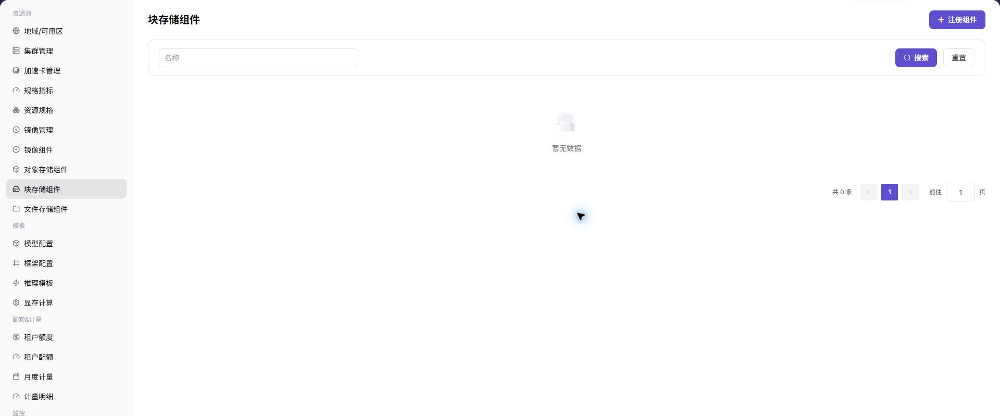
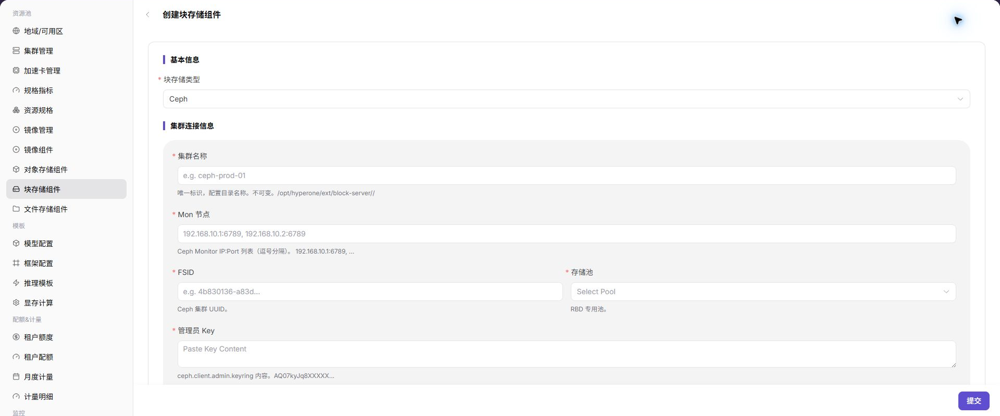

# 块存储组件

:::: info 文档信息
版本：v1.0
更新日期：2026-07-06
::::

## 功能概述

`块存储组件` 用于接入面向卷的存储能力，常见实现包括 Ceph RBD。块存储适合为工作负载提供独立磁盘卷，满足需要持久化卷、低层块设备或特定性能特征的场景。

| 项目 | 内容 |
| --- | --- |
| 适用角色 | 运营方 |
| 导航路径 | 资源池 > 块存储组件 |
| 页面路由 | `/powerone/resourcepool/block-storage` |
| 管理对象 | Ceph 集群、Mon 地址、FSID、RBD Pool、容量、访问凭据和关联地域 |
| 典型用途 | 为集群或作业提供持久化块设备能力 |

### 术语速查

| 术语 | 说明 |
| --- | --- |
| Ceph | 分布式存储系统，可提供对象、块和文件能力。 |
| Mon | Ceph Monitor，负责维护集群状态和成员信息。 |
| FSID | Ceph 集群唯一标识，用于区分不同 Ceph 集群。 |
| RBD | Ceph 的块设备能力，常用于 Kubernetes PersistentVolume。 |
| Pool | Ceph 中的存储池，用于组织 RBD 镜像和容量策略。 |
| StorageClass | Kubernetes 中描述动态卷创建方式的资源。 |

## 前提条件

1. Ceph 或等效块存储服务已部署完成。
2. 已准备 Mon 地址、FSID、Pool、认证用户和 keyring 等连接材料。
3. 目标 Kubernetes 集群已具备对应 CSI 或卷插件能力。
4. 已确认容量、性能、租户隔离和回收策略。

## 页面说明

页面展示已接入的块存储组件、状态、容量、连接信息摘要和关联地域。

## 注册块存储组件

### 操作前确认

1. Mon 地址可从平台和目标集群访问。
2. FSID、Pool、认证用户和 keyring 与底层 Ceph 集群一致。
3. 目标集群已安装并验证 CSI 驱动。
4. 容量、回收策略和权限边界已确认。

### 操作步骤

1. 进入 `资源池 > 块存储组件`。
2. 点击注册或新增入口。
3. 填写组件名称、Ceph 连接信息、容量信息和关联地域。
4. 如页面提供连接测试，先验证连接。
5. 提交后返回列表检查组件状态。

### 参数说明

| 字段名称 | 是否必填 | 字段类型 | 示例 | 说明 |
| --- | --- | --- | --- | --- |
| 组件名称 | 是 | 文本 | `ceph-rbd-prod` | 块存储组件展示名称。 |
| 访问协议 | 是 | 枚举 | `RBD` | 块存储访问协议。 |
| Endpoint | 是 | URL | `https://storage.example.com` | 组件访问入口，文档中使用占位符。 |
| 绑定集群 | 条件必填 | 多选 | `cluster-a` | 允许使用该组件的集群。 |
| 状态 | 系统生成 | 枚举 | `可用` | 组件注册和探测状态。 |
### 踩坑提示

- 资源池配置会影响作业调度，修改前先确认运行中实例。
- 下拉为空时先检查地域、权限和依赖组件状态。
- 删除或禁用资源前准备替代资源和回退方案。

### 结果校验

1. 组件出现在列表中且状态符合预期。
2. 目标地域可以绑定块存储能力。
3. 测试工作负载能创建、挂载、卸载并释放块卷。
4. 容量统计与底层存储系统保持一致。

## 常见问题

### 块卷创建失败

**问题现象：**

作业或实例申请块存储后，卷无法创建或一直处于等待状态。

**可能原因：**

- Ceph Mon、FSID、Pool 或认证信息配置错误。
- 目标集群 CSI 驱动异常。
- 底层存储容量不足或 Pool 策略限制。

**处理方式：**

1. 检查块存储组件连接信息。
2. 在目标集群检查 CSI 控制器和节点插件状态。
3. 确认 Pool 容量、配额和权限。

### 块卷挂载失败

**问题现象：**

卷已创建，但容器启动时无法挂载。

**可能原因：**

- 节点侧 CSI 插件异常。
- 卷访问模式与工作负载不匹配。
- 节点到 Ceph 网络不可达。

**处理方式：**

1. 查看实例事件和节点日志。
2. 检查访问模式、StorageClass 和节点插件。
3. 确认节点到 Mon 和 OSD 网络连通性。

## 后续操作

1. 在地域中绑定块存储组件。
2. 使用测试工作负载验证创建、挂载、卸载和容量释放。
3. 将 Ceph、RBD、Pool 和回收策略纳入运维巡检。

## 注意事项

- keyring、Ceph 用户密钥和 kubeconfig 都属于敏感材料。
- 删除块存储组件前，先确认没有运行中实例、PVC 或业务数据依赖。
