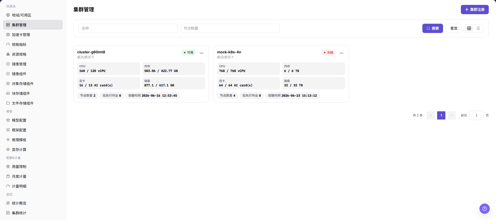
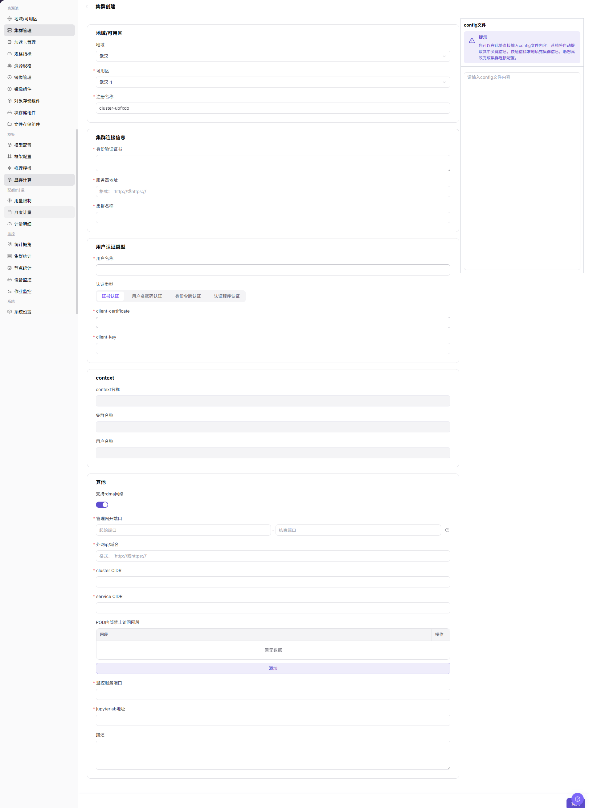

# 集群管理

::: info 文档信息
版本：v1.0
更新日期：2026-07-08
:::

## 功能概述

`集群管理` 用于将 Kubernetes 集群接入 AI Infra On-Prem 资源池，并让平台能够统一调度、监控和管理集群中的节点、规格、存储和作业。运营方完成集群创建后，平台才能在对应地域和可用区中承载开发、训练、推理等工作负载。

| 项目 | 内容 |
| --- | --- |
| 适用角色 | 运营方 |
| 导航路径 | AI基础设施 > On-Prem > 资源池 > 集群管理 |
| 页面路由 | `/powerone/resourcepool/cluster` |
| 管理对象 | Kubernetes 集群、地域、可用区、节点、规格、存储、作业和资源监控 |
| 典型途径 | 创建集群接入、查看集群状态、核对节点资源、维护规格和存储配置 |

#### 新手理解

可以把 On-Prem 资源池理解成一套本地算力管理体系：

- **地域/可用区** 表示算力资源所在的站点、机房或资源分组。
- **集群** 是真正提供算力的 Kubernetes 环境，平台通过集群接入后才能调度作业。
- **节点** 是集群中的具体服务器，提供 CPU、GPU、内存、磁盘等资源。
- **规格** 定义用户作业可申请的资源套餐。
- **存储** 为作业提供模型、数据集、代码仓库或输出目录。

集群创建的核心目的，是把真实 Kubernetes 集群纳入平台的调度、监控和资源管理范围。

#### 首次接入流程

首次接入集群建议按以下顺序执行：

1. 创建或确认目标地域和可用区。
2. 准备 kubeconfig、身份验证证书、服务器地址、认证方式和网络配置。
3. 在 `资源池管理 > 集群管理` 点击 `集群注册`，进入 `集群创建` 页面。
4. 粘贴或核对 kubeconfig 自动解析结果，补充地域、可用区、注册名称、认证和网络字段。
5. 提交后回到集群列表，确认状态、节点、资源用量和监控数据。
6. 按需关联规格、配置存储，并用测试作业验证调度和挂载结果。

#### 术语速查

| 术语 | 说明 |
| --- | --- |
| Kubernetes | 容器编排系统，用于管理计算节点、容器、服务发现和作业调度。 |
| kubeconfig | Kubernetes 连接配置文件，通常包含集群地址、证书、用户和认证信息。 |
| 服务器地址 | Kubernetes 控制入口，平台通过它读取节点、资源、作业和状态。 |
| 身份验证证书 | 用于校验 服务器地址 身份的证书，属于敏感材料。 |
| 认证类型 | 页面用于选择证书、用户名密码、身份令牌或认证程序等认证方式。 |
| context名称 | kubeconfig 中的连接上下文，用于关联集群、用户和命名空间等信息。 |
| cluster CIDR | Pod 网段规划，填写错误可能造成网络冲突。 |
| service CIDR | Service 网段规划，填写错误可能影响服务访问。 |
| NodePort | Kubernetes 暴露服务的端口范围。 |
| RDMA 网络 | 高速网络能力相关高级配置，仅在硬件、驱动和网络规划明确支持时开启。 |

## 前提条件

创建集群前，请确认以下条件已满足：

1. 当前账号具备运营方权限，并能进入 `AI Infra > On-Prem > 资源池管理 > 集群管理`。
2. 目标地域和可用区已在 `资源池管理 > 地域/可用区` 中创建。
3. Kubernetes 服务器地址 可从平台管理侧访问。
4. 已准备 kubeconfig、身份验证证书、服务器地址、集群名称和认证材料。
5. 已确认 cluster CIDR、service CIDR、NodePort 与现有网络不冲突。
6. 如需监控、JupyterLab 或 RDMA 能力，相关服务、端口、硬件和网络规划已提前确认。
7. 学习或截图场景不得提交真实 kubeconfig、证书、私钥、token、密码或内部地址。

## 页面说明

集群管理页面主要包含集群列表、集群详情和集群节点信息。

下图展示集群列表入口、集群卡片、资源用量和集群操作入口。

#### 集群列表

| 区域 | 说明 |
| --- | --- |
| 状态筛选 | 按 `全部`、`可用`、`不可用`、`接入中`、`失败`、`待审批` 等状态筛选集群。 |
| 地域/可用区筛选 | 按集群所属地域和可用区筛选。 |
| 搜索区 | 支持按集群名称、节点数量等条件搜索。 |
| 视图切换 | 支持网格视图和列表视图。 |
| 集群卡片 | 展示集群名称、状态、地域/可用区、规格、节点数量和资源用量。 |
| 操作入口 | 进入集群详情、集群节点，或执行禁用、启用等集群级操作。 |

#### 集群详情

集群详情用于查看单个集群的设备信息、基本信息、已关联规格和存储配置。排查集群状态、资源容量、规格可用性或存储挂载问题时，优先进入该区域确认。

#### 集群节点

集群节点页用于查看节点状态、资源用量、作业信息和节点详情。节点详情通常包含硬件、网络、运行时、标签、污点和监控图表。

## 主要操作

### 集群创建

#### 适用场景

当需要把新的 Kubernetes 集群纳入平台统一调度、监控和资源管理时，执行集群创建。常见场景包括首次接入算力资源、新增机房或资源组、扩容 GPU/CPU 节点，以及为后续作业提供可调度节点。

#### 操作前检查

1. 目标地域和可用区已创建并可用于集群接入。
2. kubeconfig 或等价认证材料来自可信集群管理员。
3. 服务器地址、证书、认证方式和 context名称已完成核对。
4. cluster CIDR、service CIDR、NodePort 已通过网络规划确认。
5. 监控服务、JupyterLab 地址、RDMA 等高级项已确认是否需要启用。
6. 学习或截图时只查看页面字段，不提交真实配置。

#### 操作步骤

1. 进入 `AI Infra > On-Prem > 资源池管理 > 集群管理`。
2. 点击页面右上角的 `集群注册`，进入 `集群创建` 页面。
3. 在 `config 文件` 区域粘贴 kubeconfig，或按页面要求核对自动解析出的连接信息。

下图展示 `集群创建` 页面，可用于定位 kubeconfig、地域/可用区、连接信息、认证类型、context 和高级配置区域。

4. 选择 `地域` 和 `可用区`，填写 `注册名称`。
5. 核对或填写 `身份验证证书`、`服务器地址` 和 `集群名称`。
6. 选择 `认证类型`，按页面字段填写对应认证材料，并核对 `context名称`。
7. 配置 `cluster CIDR`、`service CIDR`、`NodePort`、监控服务、JupyterLab 地址、`支持 RDMA 网络` 和描述等高级项。
8. 点击最终 `提交` 前，再次核对敏感信息、地域/可用区、网络配置和调度影响。
9. 如仅学习或验证页面，只查看字段和截图，不执行最终 `提交`、`确定` 或 `保存`。

### 关联规格

#### 适用场景

当目标集群需要承载特定 CPU、内存、GPU 或其他加速卡规格的作业时，为集群关联规格。关联后，用户创建作业时才可能在对应地域、可用区或集群范围内选择这些规格。

#### 操作步骤

1. 进入 `AI Infra > On-Prem > 资源池管理 > 集群管理`。
2. 在集群列表中找到目标集群，确认集群状态、地域、可用区和资源容量。
3. 点击目标集群操作区的 `...`，选择 `集群详情`。
4. 在弹出的 `集群详情` 页面左侧菜单中选择规格相关入口。
5. 点击 `关联规格` 或页面真实关联入口。
6. 选择需要关联到该集群的规格，核对规格名称、规格类型、CPU、内存、GPU 或其他加速卡配置。
7. 点击最终 `保存`、`提交` 或 `确定` 前，再次核对规格与集群资源能力是否匹配。
8. 如仅学习或验证页面，只查看字段和弹窗，不提交真实关联配置。

### 添加存储

#### 适用场景

当作业需要共享目录、模型仓库、本地 Git 仓库、NFS 目录或宿主机路径时，为集群添加存储。存储配置会影响作业启动、文件读写、模型加载和租户访问范围。

#### 操作步骤

1. 进入 `AI Infra > On-Prem > 资源池管理 > 集群管理`。
2. 在集群列表中找到目标集群，确认集群状态、地域、可用区和资源容量。
3. 点击目标集群操作区的 `...`，选择 `集群详情`。
4. 在弹出的 `集群详情` 页面左侧菜单中选择存储相关入口。
5. 点击 `添加存储` 或页面真实新增入口。
6. 按页面字段配置存储名称、存储类型、共享路径、容器挂载路径、访问模式、租户范围和描述。
7. 点击最终 `保存`、`提交` 或 `确定` 前，再次核对存储路径、挂载策略、权限范围和对运行中作业的影响。
8. 如仅学习或验证页面，只查看字段和弹窗，不提交真实存储配置。

## 参数说明

| 参数 | 是否必填 | 说明 | 配置要点 |
| --- | --- | --- | --- |
| 注册名称 | 必填 | 平台内识别该集群的名称。 | 建议体现环境、地域、用途和资源类型；创建后通常不建议变更。 |
| 地域 | 必填 | 集群所属地域。 | 必须选择已创建且可用的地域，影响资源池归属和调度范围。 |
| 可用区 | 必填 | 集群所属可用区。 | 必须与地域匹配，选错会影响节点归属和作业调度。 |
| config 文件 | 条件必填 | kubeconfig 内容或连接配置来源。 | 可用于自动填充部分字段，但必须人工核对解析结果。 |
| 身份验证证书 | 必填 | 校验 服务器地址 身份的证书。 | 属于敏感材料，不要写入文档或截图。 |
| 服务器地址 | 必填 | Kubernetes API 访问入口。 | 需从平台侧可达；不要在文档中记录真实地址。 |
| 集群名称 | 必填 | Kubernetes 集群名称或页面识别名称。 | 与 kubeconfig 或集群实际信息保持一致。 |
| 认证类型 | 必填 | 访问集群的认证方式。 | 按 kubeconfig 或管理员提供的材料选择，避免认证方式不一致。 |
| context名称 | 条件必填 | kubeconfig 中的连接上下文。 | 通常自动生成或自动带入，提交前仍需核对。 |
| cluster CIDR | 条件必填 | Pod 网段配置。 | 必须与网络规划一致，避免与平台、节点或其他集群冲突。 |
| service CIDR | 条件必填 | Service 网段配置。 | 必须与网络规划一致，避免影响服务访问。 |
| NodePort | 条件必填 | Kubernetes NodePort 端口范围。 | 按页面支持范围和网络策略填写。 |
| 监控服务端口 | 可选 | 集群资源监控服务配置。 | 需确认监控采集能力、端口和网络可达性。 |
| jupyterlab地址 | 可选 | 在线开发相关服务地址。 | 仅在需要在线 IDE 能力时配置。 |
| 支持rdma网络 | 可选 | 是否启用 RDMA 相关能力。 | 仅在硬件、驱动、网络和调度策略明确支持时开启。 |
| 规格名称 | 必填 | 需要关联到集群的规格名称。 | 应与集群实际 CPU、内存、GPU 或其他加速卡能力匹配。 |
| 规格类型 | 条件必填 | 规格所属资源类型或作业类型。 | 选择前确认该规格适用于目标集群和业务场景。 |
| CPU | 条件必填 | 规格中的 CPU 配置。 | 不能超过集群可承载能力或调度策略限制。 |
| 内存 | 条件必填 | 规格中的内存配置。 | 与 CPU、GPU 或加速卡配置一起核对。 |
| GPU/加速卡 | 条件必填 | 规格中的 GPU、NPU 或其他加速卡配置。 | 应与目标集群节点硬件和驱动能力一致。 |
| 启用状态 | 系统生成或可选 | 规格或存储配置是否可用。 | 未启用时，用户侧通常无法选择或使用。 |
| 关联状态 | 系统生成 | 规格是否已关联到目标集群。 | 保存后回到列表或详情页确认状态。 |
| 存储名称 | 必填 | 集群存储配置名称。 | 建议体现用途、环境和访问范围。 |
| 存储类型 | 必填 | 存储来源或挂载类型。 | 常见类型包括 `nfs`、`hostpath` 或页面实际支持类型。 |
| 共享路径 | 必填 | 宿主机或共享存储侧路径。 | 不在文档中记录真实路径；提交前确认路径存在且权限正确。 |
| 容器挂载路径 | 必填 | 作业容器内访问该存储的路径。 | 避免与系统目录、应用目录或其他挂载路径冲突。 |
| 访问模式 | 必填 | 存储读写权限或访问策略。 | 按最小权限原则配置，避免误授写权限。 |
| 租户范围 | 条件必填 | 存储对租户的可见或隔离范围。 | 避免多个租户误读写同一目录。 |
| 描述 | 可选 | 集群用途、边界或维护说明。 | 记录非敏感运维说明，不写内部测试参数。 |
| 操作 | 系统生成 | 页面提供的查看、编辑、禁用、启用等入口。 | 高风险操作前确认影响范围和回退方案。 |

## 踩坑提示

- 集群创建/注册会把真实 Kubernetes 集群接入平台调度、监控和资源管理，不能当作普通页面演示操作处理。
- kubeconfig、证书、私钥、token、密码都属于敏感材料，不能写入文档、截图、工单、提交记录或聊天消息。
- 服务器地址 不可达时，即使表单字段格式正确，平台也无法完成接入。
- 错误的地域/可用区会导致资源归属、规格关联、存储配置和作业调度异常。
- 错误的认证类型、CIDR 或 NodePort 可能导致接入失败、网络冲突或服务访问异常。
- 关联规格会影响用户创建作业时可选择的资源规格。错误规格关联可能导致作业调度失败、资源申请不匹配或容量误判。
- 添加存储会影响作业挂载路径、读写权限、数据访问范围和运行稳定性。错误共享路径、挂载路径或权限范围可能导致作业启动失败、数据不可访问或越权访问。
- `保存`、`提交`、`确定` 是高风险最终动作，学习或截图时不要点击。

## 结果校验

| 检查项 | 成功表现 | 异常时处理 |
| --- | --- | --- |
| 页面可进入 | 能进入 `AI Infra > On-Prem > 资源池管理 > 集群管理`。 | 检查菜单配置和账号权限。 |
| 集群列表正常加载 | 集群卡片、状态、地域/可用区和资源用量可见。 | 刷新页面并检查后端服务或浏览器控制台错误。 |
| 集群创建入口可见 | 页面显示 `集群注册` 入口。 | 检查运营方权限和页面状态。 |
| 集群创建页面可打开 | 点击 `集群注册` 后进入 `集群创建` 页面。 | 检查路由、权限和前端错误。 |
| 必填字段校验正常 | 缺少必填字段时页面显示校验提示。 | 按页面提示补齐字段，不使用真实敏感值做学习测试。 |
| 学习时未提交真实配置 | 仅查看字段、弹窗和截图，没有点击最终 `提交`、`确定` 或 `保存`。 | 如误提交，立即通知平台管理员并按安全流程处理。 |
| 真实提交后记录可追踪 | 新集群出现在列表中，状态进入 `接入中`、`可用` 或符合预期状态。 | 核对 服务器地址、认证材料、地域/可用区和网络配置。 |
| 节点与监控可验证 | 节点列表、资源用量和监控图表按预期展示。 | 检查 RBAC、采集组件、监控服务和时间范围。 |
| 规格关联可验证 | 目标规格出现在集群详情的规格列表中，用户侧可按权限选择。 | 检查规格状态、集群能力和关联范围。 |
| 存储配置可验证 | 新增存储出现在集群详情的存储列表中，挂载路径和访问模式与配置一致。 | 检查共享路径、容器挂载路径、权限和租户范围。 |

## 配置规则与影响

- **配置顺序**：先创建地域和可用区，再在对应可用区下创建集群。
- **接入依赖**：服务器地址 可达、认证材料有效、CIDR 和端口规划正确，是集群可接入的基础条件。
- **自动解析**：粘贴 kubeconfig 可提升填写效率，但自动解析结果仍需人工核对。
- **网络影响**：cluster CIDR、service CIDR 和 NodePort 会影响 Pod、Service 和平台访问路径。
- **调度影响**：集群创建后会进入平台调度范围，后续规格、存储和授权配置都会引用该集群。
- **规格影响**：关联规格会改变用户创建作业时可选择的资源规格，配置错误可能造成调度失败或资源申请不匹配。
- **存储影响**：添加存储会改变作业可挂载路径、读写权限和租户访问范围，配置错误可能造成数据不可访问或越权访问。
- **监控影响**：监控数据用于容量判断和排障，数据缺失时需同步检查采集组件、端口和时间范围。
- **运维影响**：禁用、启用或删除集群可能影响作业调度和业务可用性，需提前确认维护窗口和回退方案。

## 常见问题

#### 注册集群后，列表中看不到

**问题现象：**提交注册后，返回集群列表没有看到新集群。

**处理方式：**

1. 点击 `重置` 清空筛选条件。
2. 检查状态、地域或可用区筛选条件。
3. 使用注册名称关键字搜索。
4. 刷新页面后再次查看。
5. 如仍不可见，确认提交是否成功并查看页面错误提示或操作记录。

#### 集群注册失败

**问题现象：**提交注册后失败，或页面提示连接、认证、网络字段异常。

**处理方式：**

1. 检查 服务器地址 是否可从平台侧访问。
2. 与集群管理员核对 身份验证证书、认证类型和认证材料。
3. 检查 cluster CIDR、service CIDR 和 NodePort 是否符合网络规划。
4. 检查目标地域和可用区状态。
5. 根据页面错误提示定位具体字段后重新配置。

#### 集群状态不可用

**问题现象：**集群已出现在列表中，但状态不是可用，或资源信息无法正常加载。

**处理方式：**

1. 检查 Kubernetes 服务器地址 连通性。
2. 检查认证材料是否过期或权限不足。
3. 进入集群节点页，查看节点是否为 `Ready`。
4. 检查平台侧与集群侧网络连通性。
5. 查看监控或资源采集组件状态。

#### 节点列表为空

**问题现象：**进入 `集群节点` 后，节点信息列表没有数据。

**处理方式：**

1. 确认集群注册已完成，不处于接入中。
2. 检查认证账号是否具备读取节点权限。
3. 检查 Kubernetes 集群本身是否存在节点。
4. 刷新页面或重新打开集群节点页。
5. 如仍为空，联系集群管理员核对 服务器地址 和 RBAC 权限。

#### 规格无法选择

**问题现象：**用户创建作业时无法选择某个规格。

**处理方式：**

1. 打开集群详情，确认目标规格已关联。
2. 检查规格本身是否启用。
3. 检查作业选择的地域、可用区和集群范围是否与规格关联一致。
4. 保存规格关联后，重新进入作业创建流程确认规格是否出现。

#### 存储挂载异常

**问题现象：**作业启动后无法访问共享目录，或挂载路径读写失败。

**处理方式：**

1. 检查共享路径和容器内路径是否填写正确。
2. 对 `nfs` 类型，检查 NFS 服务地址、目录导出和网络连通性。
3. 对 `hostpath` 类型，检查目标节点本地路径是否存在且权限正确。
4. 检查租户范围和读写策略是否符合业务预期。
5. 使用测试作业验证目录是否可读写。

#### 资源监控无数据

**问题现象：**节点资源监控图表为空，或只有部分监控类型有数据。

**处理方式：**

1. 检查监控服务端口是否正确。
2. 检查节点监控采集组件是否运行。
3. 调整查询时间范围和采样间隔。
4. 检查目标节点是否在线。
5. 如只有 AI 加速卡监控为空，确认节点是否具备对应加速卡和采集能力。

#### 注册名称不规范，后续难以维护怎么办？

**问题现象：**集群已经注册，但注册名称含义不清，后续排查地域、环境、用途或容量归属时难以判断。

**处理方式：**

1. 新建集群时优先使用能体现环境、地域和用途的名称。
2. 推荐命名应体现环境、地域和资源类型。
3. 不推荐使用 `test1`、`aaa`、`cluster01` 这类临时或含义不清的名称。
4. 如页面未提供注册名称编辑入口，建议规划新集群接入和作业迁移方案。

#### 禁用集群失败或影响范围不确定

**问题现象：**点击禁用或启用后失败，或不确定禁用会影响哪些作业。

**处理方式：**

1. 进入 `集群节点 > 作业信息`，确认运行实例、在线 IDE 和在执行作业。
2. 确认是否有替代集群可以承接新作业调度。
3. 在维护窗口内执行禁用，并提前通知相关业务方。
4. 如禁用失败，按确认提示处理依赖资源或联系平台运维。

## 后续操作

1. 返回 `集群管理` 列表，确认集群状态、地域/可用区和资源用量。
2. 进入集群详情，确认设备信息、基本信息、已关联规格和存储配置。
3. 按需为集群关联规格，确保用户创建作业时能选择目标规格。
4. 按需配置共享存储，并使用测试作业验证挂载、读写和路径隔离。
5. 查看节点资源监控，确认监控数据、时间范围和监控类型可正常切换。

## 注意事项

- 集群创建/注册会把真实 Kubernetes 集群接入平台调度、监控和资源管理。
- kubeconfig、证书、私钥、token、密码属于敏感材料，不得写入文档、截图、工单或提交记录。
- 错误的地域/可用区、服务器地址、认证类型、CIDR、NodePort 可能导致接入失败、网络冲突或调度异常。
- 关联规格和添加存储会影响真实作业可选规格、挂载路径、读写权限和数据访问范围。
- `保存`、`提交`、`确定` 属于高风险最终动作。
- 不写真实 kubeconfig、证书、私钥、token、密码、共享路径、内网地址、服务器地址、账号、密钥、AK/SK、集群 ID、资源池 ID 或内部测试参数。
