# 集群管理

::: info 文档信息
版本：v1.0
更新日期：2026-07-08
:::

## 功能概述

`集群管理` 用于将 Kubernetes 集群（用于管理计算节点、容器和作业调度的容器编排系统）接入异构卡纳管资源池，并持续管理集群规格、共享存储、节点状态、作业分布和资源监控。运营方完成集群注册后，平台才能在对应地域和可用区中调度开发、训练、推理等作业。

| 项目 | 内容 |
| --- | --- |
| 适用角色 | 运营方 |
| 导航路径 | 资源池 > 集群管理 |
| 管理对象 | Kubernetes 集群、集群规格、集群存储、节点、作业和资源监控 |
| 典型用途 | 接入算力集群、查看资源容量、维护节点状态、配置作业可用规格和共享目录 |

### 新手理解

异构卡纳管资源池像一套办公资源体系：

- **地域/可用区** 像资源地图，告诉平台算力位于哪个城市、机房或资源分组。
- **集群** 像真正提供算力的服务器群组，平台只有注册集群后，才能把作业调度到这批机器上。
- **节点** 像服务器群组里的工位，每个节点提供 CPU、GPU、内存、磁盘等具体资源。
- **规格** 像配置套餐，定义作业能申请多少 CPU、内存、GPU 等资源。
- **存储** 像共享文件柜，让作业可以读取模型、数据集、代码仓库或输出结果。
- **作业** 像具体工作，提交后会被平台安排到满足地域、可用区、集群、规格和存储条件的资源上运行。

所以注册集群的核心目的在于把实际算力接入平台调度系统。没有完成集群注册，即使地域和可用区已经创建，平台也没有可调度的节点资源。

### 首次接入流程

首次接入集群建议按以下顺序执行：

1. 确认目标地域和可用区已创建，并且状态符合接入预期。
2. 准备 kubeconfig 或认证材料，包括 API Server 地址、CA 证书、认证方式和对应凭据。
3. 在 `资源池 > 集群管理` 注册集群，并核对自动填充的连接信息。
4. 为集群关联规格，确保后续作业能选择到合适的资源套餐。
5. 按业务需要添加共享存储，例如 NFS 或 hostpath。
6. 查看节点列表和资源监控，确认节点、资源用量和监控数据可见。
7. 创建一个测试作业，验证镜像拉取、资源调度、存储挂载和作业运行结果。

### 术语速查

| 术语 | 说明 |
| --- | --- |
| Kubernetes | 容器编排系统，用于管理计算节点、容器、服务发现和作业调度。 |
| kubeconfig | Kubernetes 连接配置文件，通常由集群管理员提供，包含集群地址、证书、用户和认证信息。 |
| API Server | Kubernetes 控制入口，平台通过它读取节点、资源和作业等信息。 |
| CA 证书 | 用于校验 API Server 身份的证书，防止连接到错误或不可信的集群入口。 |
| context | kubeconfig 中的连接配置组合，用来关联集群、用户和命名信息，页面通常会自动生成或带入。 |
| Pod | Kubernetes 中运行容器的最小调度单元，训练、推理或 IDE 作业最终会以 Pod 等形式运行。 |
| CIDR | IP 网段写法，例如 `172.20.0.0/16`，用于描述一段连续 IP 地址范围。 |
| NodePort | Kubernetes 暴露服务的一类端口范围，平台可能通过该范围访问集群侧服务。 |
| RDMA 网络 | 高速网络能力相关高级选项，仅在硬件、驱动和网络规划明确支持时开启。 |
| kubelet | 运行在节点上的 Kubernetes 组件，负责管理本节点容器和上报节点状态。 |
| kube-proxy | 运行在节点上的 Kubernetes 网络组件，负责服务访问和转发规则。 |
| 标签 | 节点或资源上的键值标记，用于筛选、分组和调度匹配。 |
| 污点 | 节点上的调度限制，用于阻止不符合条件的作业调度到该节点。 |
| el 表达式 | 存储租户范围的高级选项，用于按规则动态生成租户目录；一般场景不需要使用。 |

## 前提条件

注册或维护集群前，请确认以下条件已满足：

1. 当前账号具备运营方权限，并能进入 `资源池 > 集群管理`。
2. 目标地域和可用区已在 `资源池 > 地域/可用区` 中创建，并处于可用于接入集群的状态。
3. Kubernetes API Server 可从平台管理侧访问。
4. 已准备集群连接信息，包括 CA 证书、API Server 地址、集群名称和管理员认证材料。
5. 已与网络管理员确认 Pod CIDR、Service CIDR、NodePort 端口范围等网络配置不会与现有环境冲突。
6. 如需添加 NFS 存储，NFS 服务地址、共享路径和访问权限已提前准备。
7. 如需查看监控数据，集群节点侧的监控采集能力已完成部署并能上报数据。

## 页面说明

集群管理页面主要包含集群列表、集群详情抽屉、集群节点页和节点详情抽屉。

下图展示集群列表入口、集群卡片、资源用量和集群操作入口。

### 集群列表

集群列表用于查看已接入集群、筛选集群和进入集群操作入口。

| 区域 | 说明 |
| --- | --- |
| 状态筛选 | 按 `全部`、`可用`、`不可用`、`接入中`、`失败`、`待审批` 等状态筛选集群。 |
| 地域/可用区筛选 | 按集群所属地域和可用区筛选。 |
| 搜索区 | 支持按名称、节点数量等条件搜索。 |
| 视图切换 | 支持网格和列表视图，便于按不同密度查看集群。 |
| 集群卡片 | 展示集群名称、状态、所属地域/可用区、规格、节点数量和 GPU、CPU、MEM、DISK 用量。 |
| 更多操作 | 进入集群详情、集群节点，或执行禁用、启用等集群级操作。如页面提供删除入口，删除前应完成运行作业、存储数据和依赖关系确认。 |

### 集群详情

集群详情抽屉用于查看单个集群的资源概况和配置关系，包含设备信息、基本信息、已关联规格和存储。

### 集群节点

集群节点页用于查看节点列表、节点资源用量和作业信息。节点详情抽屉进一步展示硬件、网络、运行时、标签、污点和监控图表。

## 主要操作

### 注册集群

#### 适用场景

当需要将一个新的 Kubernetes 集群纳入平台统一调度、监控和资源管理时，执行集群注册。以下场景通常需要注册集群：

- 首次部署异构卡纳管资源池，并已完成地域和可用区配置。
- 新增机房、新购算力或新建 Kubernetes 集群后，需要让平台调度这批节点。
- 需要把不同环境、部门或租户的算力分组接入统一运营视图。
- 需要为后续作业提供可用节点、规格和共享存储。

#### 注册前必读

填写注册表单前，先理解以下关键字段：

- **kubeconfig**：通常由集群管理员提供，包含集群地址、CA 证书、用户和认证信息。粘贴 kubeconfig 后，页面会尝试自动填充部分字段，但仍需人工核对地域/可用区、服务器地址、认证方式和 context。
- **API Server**：Kubernetes 的控制入口。平台需要通过 API Server 读取节点、资源、作业和状态信息。
- **CA 证书**：用于校验 API Server 身份。证书内容不是账号密码，但仍属于敏感材料，不应外泄。
- **认证材料**：可能包含客户端证书/私钥、用户名密码、token 或 auth-provider 信息。不同认证方式需要填写的字段不同。
- **CIDR**：IP 网段写法。`cluster CIDR` 通常对应 Pod 地址范围，`service CIDR` 对应 Service 地址范围，需提前确认不与平台、节点、办公网或其他集群网段冲突。
- **NodePort**：Kubernetes 暴露服务的一类端口范围。当前页面端口输入框支持 `1-65535`，建议按集群和网络规划填写。
- **支持 RDMA 网络**：高级开关。不确定底层硬件、驱动和网络规划是否支持时，保持关闭并联系平台运维确认。

#### 操作前检查

注册前建议完成以下检查：

1. 目标 Kubernetes 集群 API Server 地址可从平台侧访问。
2. 认证材料有效，且具备读取节点、资源和作业所需权限。
3. 目标地域和可用区已存在，并且可用于注册集群。
4. 集群网络规划已确认，Pod CIDR、Service CIDR 和 NodePort 范围不与现有网络冲突。
5. 如启用 `支持 RDMA 网络`，已确认底层硬件、驱动、网络和调度规划支持。
6. 注册名称已按长期运维规划确定。建议使用小写字母、数字和连字符，体现环境、地域和用途，例如 `prod-wuhan-gpu-1`。

#### 操作步骤

1. 进入 `资源池 > 集群管理`。
2. 点击页面右上角的 `集群注册`，进入 `集群创建` 页面。
3. 如已准备 kubeconfig，可在右侧 `config 文件` 面板粘贴配置内容，系统会尝试自动提取并填充部分集群连接信息。

下图右侧为 kubeconfig 粘贴区，适合用来快速带入集群连接信息。

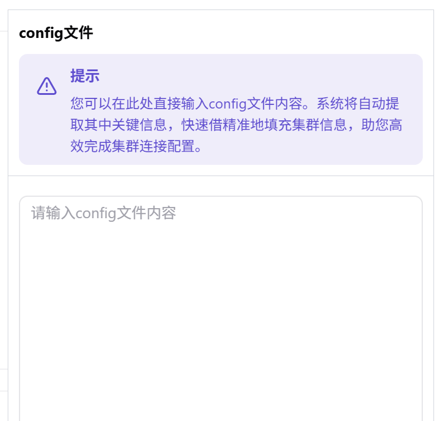

4. 在 `地域/可用区` 区块选择集群归属，并填写注册名称。

下图展示地域、可用区和注册名称填写区，注册名称会作为平台内识别该集群的重要标识。

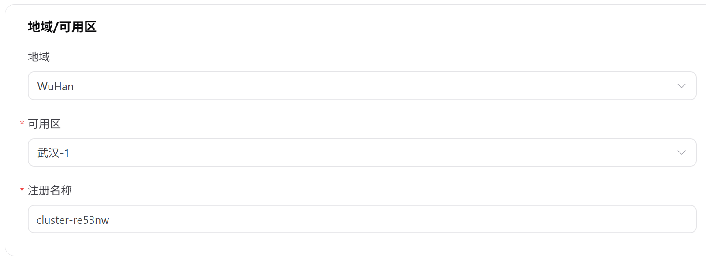

5. 在 `集群连接信息` 区块填写 CA 证书、API Server 地址和集群名称。

下图展示集群连接信息区，重点核对 CA 证书、服务器地址和集群名称。

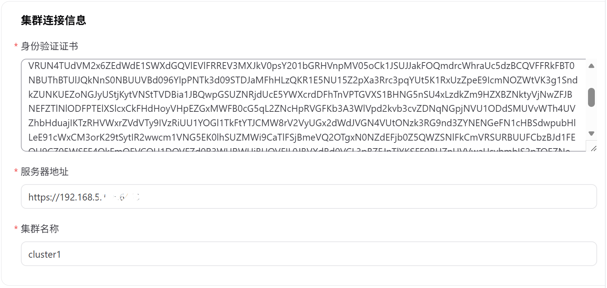

6. 在 `用户认证类型` 区块选择认证方式，并填写对应认证材料。

下图展示用户认证类型区，可选择证书、用户名密码、身份令牌或认证程序认证。

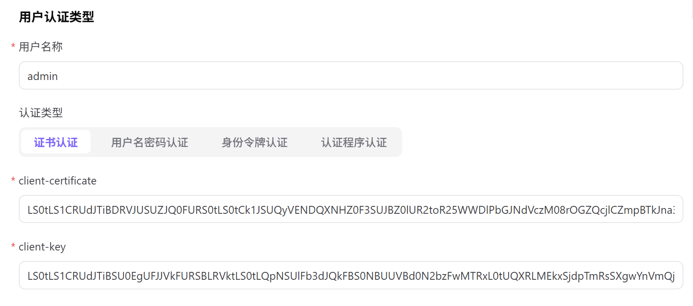

7. 在 `context` 区块检查系统自动生成的 context 信息。该区块通常自动填充，不需要手动编辑。

下图展示 context 自动生成信息，用于把集群、用户和连接配置关联起来。

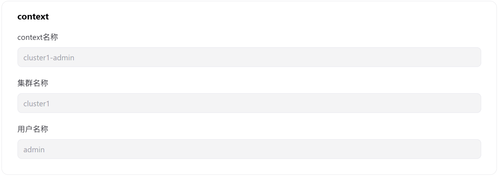

8. 在 `其他` 区块填写网络、端口、监控服务、JupyterLab 地址和描述等高级配置。

下图展示网络、端口、监控和描述等高级配置区。

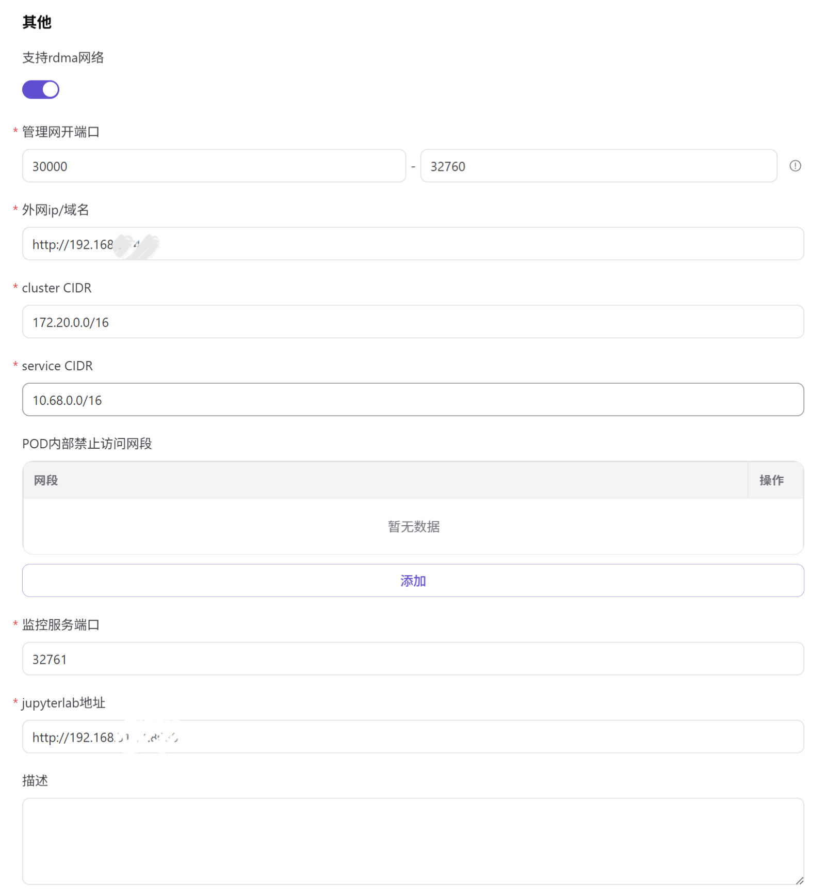

9. 确认所有配置无误后，点击 `提交`。

#### 参数说明

| 字段名称 | 是否必填 | 字段类型 | 示例 | 说明 |
| --- | --- | --- | --- | --- |
| 集群名称 | 必填 | 文本 | `cluster-prod-a` | 平台识别集群的名称，建议包含地域、环境和用途。 |
| 地域 / 可用区 | 必填 | 下拉选择 | `武汉 / wuhan-1` | 集群归属的资源位置，影响后续规格、存储和调度。 |
| API Server | 必填 | URL | `https://api.example.com:6443` | Kubernetes API 访问入口，需从平台侧可达。 |
| 节点数 | 系统生成 | 数字 | `32` | 集群接入后同步的节点数量。 |
| GPU/NPU | 系统生成 | 资源统计 | `A800 * 16` | 集群内可调度加速卡类型和数量。 |
| 接入状态 | 系统生成 | 枚举 | `可用` | 集群注册、认证、同步和监控采集状态。 |

#### 踩坑提示

- kubeconfig 自动填充能减少手工录入，但不能替代人工核对，尤其要检查地域/可用区、服务器地址、认证类型和 context。
- 证书、私钥、token、密码和完整 kubeconfig 都属于敏感材料，不要写入文档、截图、工单或提交记录。
- CIDR 填错或与现有网络冲突，可能导致 Pod、Service 或平台访问异常，提交前应与网络管理员确认。
- 认证方式选错会导致注册失败或节点读取失败，需与集群管理员提供的 kubeconfig 保持一致。
- API Server 不可达时，即使表单字段格式正确，平台也无法接入集群。
- 注册名称建议长期稳定，避免 `test1`、`aaa` 这类临时或无含义名称。

#### 结果校验

提交成功后，按以下方式确认集群已接入：

1. 回到 `集群管理` 列表，确认新集群已出现。
2. 确认集群状态进入 `接入中`、`可用` 或符合预期状态。
3. 打开集群详情，确认设备信息、基本信息和资源用量能正常展示。
4. 进入 `集群节点`，确认节点列表可见，节点状态为 `Ready` 或符合预期。
5. 如配置了监控，打开节点资源监控，确认图表可加载。
6. 如后续要创建作业，确认该集群已关联可用规格。

### 查看集群详情

当需要确认集群容量、基础信息、规格和存储配置时，查看集群详情。

#### 适用场景

当需要核对集群状态、资源容量、地域/可用区归属、已关联规格或存储配置时，查看集群详情。

1. 在集群列表中找到目标集群。
2. 点击目标集群卡片，或点击目标集群的 `...` 后选择 `集群详情`。
3. 在详情抽屉中查看设备信息、基本信息、已关联规格和存储配置。

#### 查看设备信息

设备信息用于快速查看集群整体资源容量和已使用情况，包括 CPU、显卡、在运行作业、内存和磁盘。

下图展示集群整体 CPU、显卡、作业、内存和磁盘容量概览。

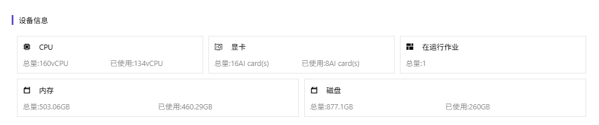

如果 CPU、内存、显卡或磁盘接近满载，应继续查看节点资源、作业分布和监控数据，判断是否需要扩容、迁移作业或下线异常节点。

#### 查看基本信息

基本信息用于确认集群 ID、名称、状态、地域/可用区和创建时间。

下图展示集群基础信息区，适合核对集群归属、名称和当前状态。

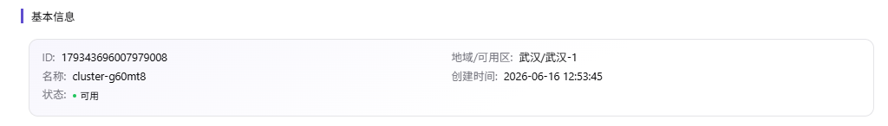

当集群状态异常时，应先确认 API Server 连通性、认证材料有效性、节点状态和平台侧监控采集是否正常。

#### 查看已关联规格

已关联规格决定该集群可承载哪些作业规格。

下图展示已关联规格列表，用户创建作业时只能选择满足关联关系的规格。

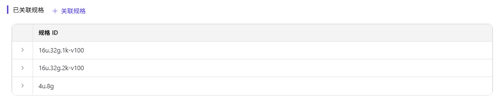

如果用户创建作业时无法选择某个规格，需检查该规格是否已关联到目标集群，以及规格自身是否可用。

#### 查看存储

存储区展示集群已配置的容器共享目录，包括类型、访问策略、共享路径、容器内路径、租户范围和操作入口。

下图展示集群存储列表，右侧可看到编辑和删除存储入口。

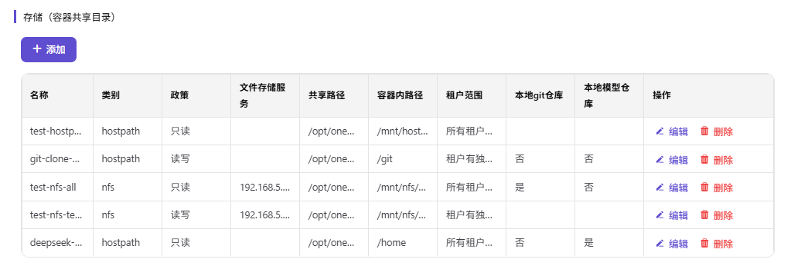

存储配置会影响作业的数据读写、模型权重加载和本地仓库路径。修改或删除前应确认没有运行中的作业依赖该目录。

### 管理集群规格

#### 关联规格

当某个集群需要承载特定 CPU、内存、显卡或规格组合的作业时，需要关联规格。

#### 适用场景

当作业需要使用特定 CPU、内存、GPU 或规格组合，但目标集群尚未开放该规格时，先为集群关联规格。

1. 打开目标集群的 `集群详情`。
2. 在 `已关联规格` 区块点击 `+ 关联规格`。
3. 在弹窗中选择一个或多个规格。
4. 点击 `确定` 保存。

下图展示关联规格弹窗，勾选规格后保存即可建立集群和规格的可用关系。

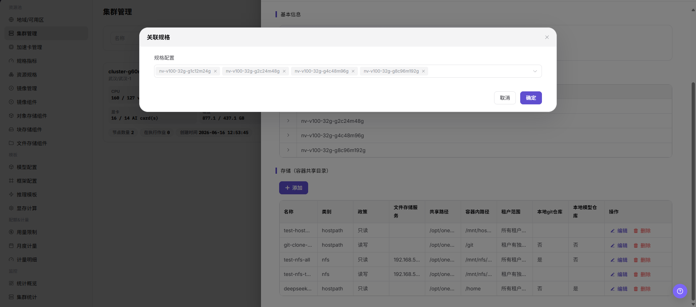

#### 结果校验

保存后，确认所选规格出现在 `已关联规格` 列表中。后续创建作业时，如选择该地域、可用区和集群资源范围，应能使用已关联规格。

### 管理集群存储

#### 添加存储

当作业需要共享目录、模型仓库、本地 Git 仓库或 NFS 目录时，可为集群添加存储。当前添加存储弹窗支持 `nfs` 和 `hostpath` 两类存储。

#### 添加前确认

添加存储前，建议先确认：

1. 共享路径已存在，或已按运维规范创建。
2. NFS 服务地址可从集群节点访问，且导出目录、读写权限和网络策略正确。
3. `hostpath` 路径在目标节点上存在，且不会依赖单个异常节点导致作业失败。
4. 容器内路径不会与系统目录、应用目录或其他挂载路径冲突。
5. 租户范围已规划清楚，避免多个租户误读写同一目录。
6. 是否需要作为本地 Git 仓库或本地模型仓库目录已经确认。

#### 操作步骤

1. 打开目标集群的 `集群详情`。
2. 在 `存储` 区块点击 `+ 添加`。
3. 填写存储名称、类型、访问策略、共享路径、容器内路径和租户范围。
4. 按需开启 `本地git仓库` 和 `本地模型仓库`。
5. 点击 `确定` 保存。

下图展示添加存储弹窗，可选择 `nfs` 或 `hostpath`，并设置策略、路径和租户范围。

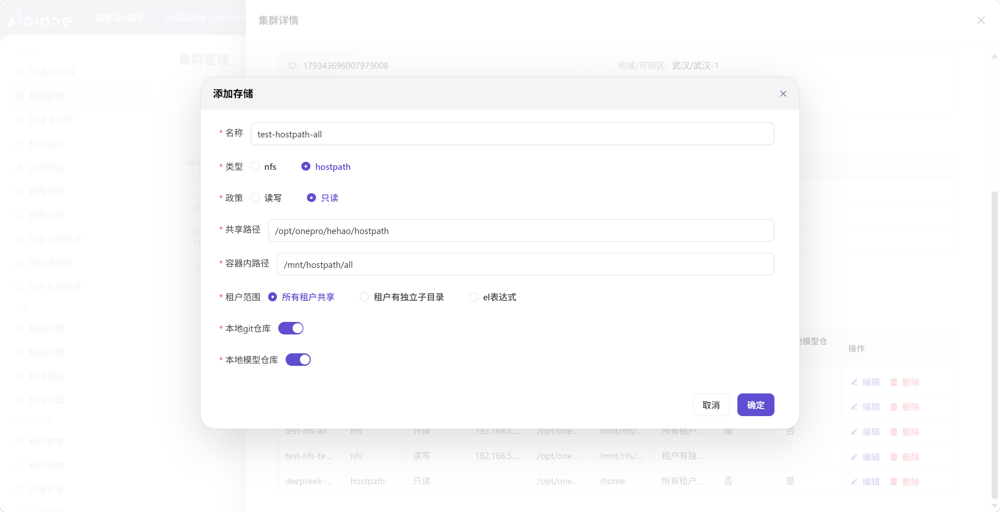

#### 参数说明

| 字段名称 | 是否必填 | 字段类型 | 示例 | 填写说明 |
| --- | --- | --- | --- | --- |
| 名称 | 必填 | 文本 | `prod-model-nfs` | 存储卷标识名称，建议能体现用途、环境和范围。 |
| 类型 | 必填 | 单选 | `nfs` / `hostpath` | `nfs` 适合网络共享目录；`hostpath` 适合挂载宿主机本地目录。 |
| 政策 | 必填 | 单选 | `读写` / `只读` | 存储访问权限。生产环境应按最小权限原则配置。 |
| 文件存储服务 | 条件必填 | 文本 | `nfs.example.local` | 选择 `nfs` 时填写 NFS 服务地址；选择 `hostpath` 时通常不需要。 |
| 共享路径 | 必填 | 文本 | `/data/models` | 宿主机或 NFS 服务端的共享目录。需确认路径存在且权限正确。 |
| 容器内路径 | 必填 | 文本 | `/mnt/models` | 作业容器内挂载路径。避免与系统目录或应用目录冲突。 |
| 租户范围 | 必填 | 单选 | `所有租户共享` / `租户有独立子目录` / `el表达式` | 控制不同租户访问同一存储时的隔离方式。`el表达式` 是高级选项，用于按规则动态生成租户目录，一般场景不需要使用。 |
| 本地git仓库 | 必填 | 开关 | 开启 / 关闭 | 是否作为本地 Git 仓库目录。 |
| 本地模型仓库 | 必填 | 开关 | 开启 / 关闭 | 是否作为本地模型仓库目录。 |

#### 编辑存储

当存储路径、访问策略或租户范围需要调整时，可编辑存储。

1. 打开目标集群的 `集群详情`。
2. 在 `存储` 列表中找到目标存储。
3. 点击 `编辑`。
4. 调整字段后点击 `确定`。

编辑前应确认有没有运行中的作业正在使用该存储。路径或权限变更可能导致作业读写失败。

#### 删除存储

当某个存储不再使用时，可删除存储配置。

> ⚠️ 风险提示
>
> 删除存储配置可能影响依赖该目录的作业、模型或仓库。操作前确认无运行中作业依赖、数据已备份、模型/仓库路径不再使用。

#### 删除前确认

删除存储前，建议先确认：

1. 没有运行中作业依赖该存储。
2. 需要保留的数据已经备份或迁移。
3. 模型仓库、本地 Git 仓库或业务脚本不再引用该路径。
4. 删除的是平台存储配置，不代表底层共享目录一定会被删除；底层数据处理需按运维流程确认。

#### 操作步骤

1. 打开目标集群的 `集群详情`。
2. 在 `存储` 列表中找到目标存储。
3. 点击 `删除`。
4. 阅读确认提示后提交。

### 查看集群节点与作业

#### 查看节点列表

节点列表用于查看集群节点状态、角色和节点级资源用量。

#### 适用场景

当需要确认节点是否在线、资源是否紧张、节点角色是否正确或作业是否可继续调度时，查看节点列表。

1. 在集群列表中找到目标集群。
2. 点击目标集群的 `...`。
3. 选择 `集群节点`。
4. 在 `节点信息` Tab 查看节点列表。

下图展示节点信息 Tab，可查看节点状态、资源用量和 Kubernetes 节点状态。

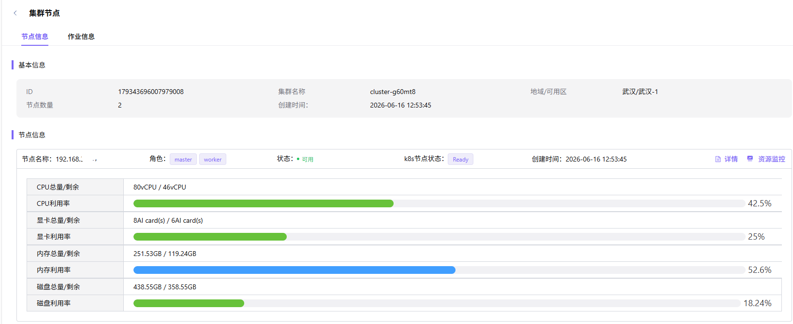

重点关注以下信息：

- 节点状态是否可用。
- Kubernetes 节点状态是否为 `Ready`。
- 节点角色是否符合预期，例如 `master`、`worker`。
- CPU、显卡、内存和磁盘利用率是否异常升高。

#### 查看作业信息

`作业信息` Tab 用于查看该集群承载的运行实例和在线 IDE 作业。

1. 进入目标集群的 `集群节点` 页面。
2. 切换到 `作业信息` Tab。
3. 按 `运行实例`、`在线IDE`、`在执行作业` 或 `历史作业` 查看作业。
4. 可按作业名称搜索目标作业。

下图展示作业信息 Tab，可按作业类型查看该集群上承载的任务。

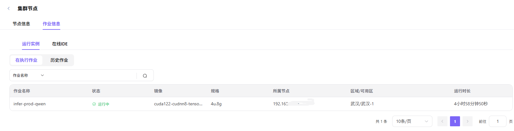

排查作业问题时，重点关注作业状态、镜像、规格、所属节点、区域/可用区和运行时长。

#### 查看节点详情

节点详情用于确认单个节点的硬件、网络、运行时、标签和污点。

1. 在 `集群节点 > 节点信息` 中找到目标节点。
2. 点击节点行右侧的 `详情`。
3. 在节点详情抽屉中查看各信息区块。

下图展示节点详情抽屉，可查看基本信息、硬件、网络、运行时、标签和污点。

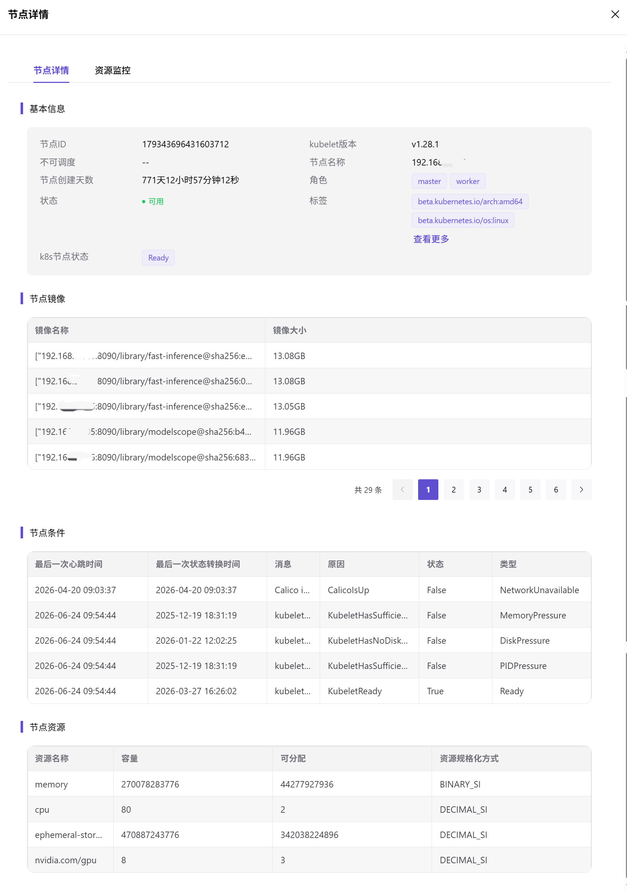

节点详情中常用的排查信息包括：

- 基本信息：节点名称、角色、状态、操作系统、内核版本和架构。
- 硬件信息：CPU、内存、磁盘和显卡配置，用于判断节点容量和硬件能力。
- 网络信息：内网 IP、外网 IP 和 Pod CIDR，用于判断节点网络归属和 Pod 地址范围。
- 运行时：`kubelet` 负责节点容器管理和状态上报；`kube-proxy` 负责服务转发规则；容器运行时负责实际拉起容器；心跳时间用于判断节点是否持续在线。
- 标签：用于调度筛选和资源分组，例如把 GPU 节点、CPU 节点或特定机房节点区分开。
- 污点：用于限制普通作业调度到特定节点，常见于专用节点、维护节点或特殊硬件节点。

#### 查看节点资源监控

资源监控用于观察节点在指定时间范围内的资源变化趋势。

1. 在 `集群节点 > 节点信息` 中找到目标节点。
2. 点击节点行右侧的 `资源监控`。
3. 在节点详情抽屉切换到 `资源监控` Tab。
4. 选择开始时间、结束时间、采样间隔和数据类型。
5. 按需切换 `基础监控`、`AI 加速卡监控`、`网络监控`。

下图展示节点资源监控 Tab，可按时间范围查看基础监控、AI 加速卡监控和网络监控。

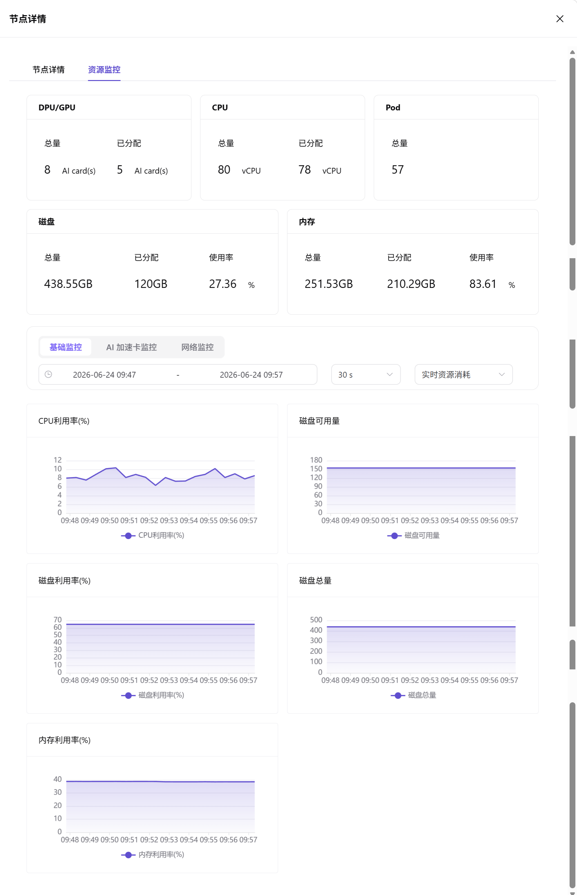

如果监控图表为空，优先检查监控服务端口、采集组件、节点连通性和查询时间范围。

### 管理集群状态

#### 搜索和筛选

| 操作 | 结果 |
| --- | --- |
| 按名称搜索 | 输入集群名称关键字后点击 `搜索`，定位目标集群。 |
| 按节点数量搜索 | 输入节点数量后点击 `搜索`，筛选符合条件的集群。 |
| 状态筛选 | 按可用、不可用、接入中、失败、待审批等状态缩小范围。 |
| 地域/可用区筛选 | 只查看指定地域或可用区下的集群。 |
| 重置筛选 | 清空当前筛选条件，恢复默认列表。 |

#### 切换视图

点击页面视图切换按钮，可在网格视图和列表视图之间切换。网格视图适合查看资源概况，列表视图适合批量扫描字段。

#### 禁用或启用集群

当集群需要维护、下线或暂停承载新作业时，可禁用集群；当集群恢复可用后，可按页面入口执行启用。

> ⚠️ 风险提示
>
> 禁用集群可能影响新作业调度；运行中作业的影响以页面确认提示和平台调度策略为准。操作前应确认维护窗口和替代资源。

#### 禁用前确认

禁用集群前，建议先确认：

1. 没有关键新作业依赖该集群。
2. 已确认现有运行作业、在线 IDE 或服务实例的影响范围。
3. 其他可用集群可以承接后续调度。
4. 已确认维护窗口、通知范围和回退方案。

#### 操作步骤

1. 在集群列表中找到目标集群。
2. 点击目标集群的 `...`。
3. 选择 `禁用集群` 或对应启用操作。
4. 阅读确认提示后提交。

#### 删除集群

如页面提供删除入口，删除前应完成运行作业、存储数据和依赖关系确认。没有删除入口时，不应通过绕过页面的方式直接清理集群记录。

> ⚠️ 风险提示
>
> 删除集群属于高风险操作，可能导致平台不再管理该集群及其节点资源。删除前必须确认作业、规格、存储和运维依赖均已处理。

#### 删除前确认

删除集群前，建议先确认：

1. 该集群没有运行中作业、在线 IDE 或需要保留的服务实例。
2. 节点不再承载平台调度任务。
3. 共享存储、模型仓库、Git 仓库和业务数据已迁移或备份。
4. 与该集群关联的规格和作业依赖已迁移到其他集群。
5. 运维、业务方和平台管理员已确认删除窗口和回退方案。

## 结果校验

- 当前页面的目标记录、状态、关联对象或统计结果与本次查看范围一致。
- 完成配置或查看后，返回列表确认页面能正常加载，筛选条件和目标对象仍可定位。
- 涉及资源、配额、监控或存储影响时，继续结合“配置规则与影响”和“注意事项”核对。

## 配置规则与影响

- **配置顺序**：必须先创建地域和可用区，再在对应可用区下注册集群。
- **集群接入依赖**：API Server 可达、认证材料有效、CIDR 和端口规划正确，属于集群可接入的基础条件。
- **kubeconfig 自动填充**：粘贴 kubeconfig 可提升填写效率，但仍需人工核对自动解析结果。
- **网络配置**：`cluster CIDR`、`service CIDR`、NodePort 范围应按网络规划填写，避免与平台、节点、服务网段冲突。
- **规格关联**：未关联规格的集群可能无法承载特定作业规格。
- **存储绑定**：`hostpath` 依赖节点本地路径，`nfs` 依赖网络共享路径。路径不存在、权限不足或服务不可达都会导致作业挂载失败。
- **节点状态**：节点 `Ready` 不等于资源充足，还需结合 CPU、显卡、内存、磁盘和作业分布判断。
- **监控数据**：监控图表用于趋势判断；如数据缺失，需要结合采集组件、端口和时间范围排查。
- **禁用影响**：禁用集群会影响新作业调度，操作前应确认运行中作业、替代资源和维护窗口。

## 常见问题

### 注册集群后，列表中看不到

**问题现象：**提交注册后，返回集群列表没有看到新集群。

**可能原因：**

- 当前筛选条件过滤了新集群。
- 集群仍处于接入中或注册结果尚未刷新。
- 注册名称与搜索条件不匹配。
- 注册请求失败，但未及时处理错误提示。

**处理方式：**

1. 点击 `重置` 清空筛选条件。
2. 检查是否按状态、地域或可用区过滤了列表。
3. 使用注册名称关键字搜索。
4. 刷新页面后再次查看。
5. 如仍不可见，回到注册页或操作记录中确认提交是否成功。

### 集群注册失败

**问题现象：**提交注册后失败，或页面提示连接、认证、网络字段异常。

**可能原因：**

- API Server 地址不可从平台侧访问。
- CA 证书、客户端证书、私钥、token 或密码无效。
- 认证方式与 kubeconfig 中的认证材料不一致。
- Pod CIDR、Service CIDR 或端口范围与网络规划冲突。
- 目标地域或可用区不可用于接入集群。

**处理方式：**

1. 检查 API Server 地址是否可从平台侧访问。
2. 与集群管理员核对 CA 证书、认证方式和认证材料。
3. 检查 Pod CIDR、Service CIDR 和端口范围是否符合网络规划。
4. 检查目标地域和可用区状态。
5. 根据页面错误提示定位具体字段后重新提交。

### 集群状态不可用

**问题现象：**集群已出现在列表中，但状态不是可用，或资源信息无法正常加载。

**可能原因：**

- Kubernetes API Server 不可访问。
- 认证材料过期或权限不足。
- 节点未处于 `Ready` 状态。
- 平台侧与集群侧网络连通性异常。
- 监控或资源采集组件未正常工作。

**处理方式：**

1. 检查 Kubernetes API Server 是否可访问。
2. 检查认证材料是否过期或权限不足。
3. 进入集群节点页，查看节点是否为 `Ready`。
4. 检查平台侧与集群侧网络连通性。
5. 查看节点资源监控或采集组件状态，确认数据是否正常上报。

### 节点列表为空

**问题现象：**进入 `集群节点` 后，节点信息列表没有数据。

**可能原因：**

- 集群注册尚未完成，仍处于接入中。
- 认证账号没有读取节点的权限。
- Kubernetes 集群本身没有可见节点。
- API Server 连接或权限校验异常。

**处理方式：**

1. 确认集群注册已完成，不处于接入中。
2. 检查认证账号是否具备读取节点权限。
3. 检查 Kubernetes 集群本身是否存在节点。
4. 刷新页面或重新打开集群节点页。
5. 如仍为空，联系集群管理员核对 API Server 和 RBAC 权限。

### 规格无法选择

**问题现象：**用户创建作业时无法选择某个规格，或规格列表中没有目标规格。

**可能原因：**

- 目标规格未关联到该集群。
- 规格本身未启用或不符合当前作业类型。
- 作业选择的地域、可用区或集群范围与规格关联不一致。

**处理方式：**

1. 打开集群详情，确认目标规格已关联。
2. 检查规格本身是否启用。
3. 检查作业选择的地域、可用区和集群范围是否与规格关联一致。
4. 保存规格关联后，重新进入作业创建流程确认规格是否出现。

### 存储挂载异常

**问题现象：**作业启动后无法访问共享目录，或挂载路径读写失败。

**可能原因：**

- 共享路径或容器内路径填写错误。
- `nfs` 服务地址不可达、目录未导出或权限不足。
- `hostpath` 目标节点本地路径不存在或权限不足。
- 租户范围或读写策略与业务预期不一致。
- 容器内路径与应用目录或系统目录冲突。

**处理方式：**

1. 检查共享路径和容器内路径是否填写正确。
2. 对 `nfs` 类型，检查 NFS 服务地址、目录导出和网络连通性。
3. 对 `hostpath` 类型，检查目标节点本地路径是否存在且权限正确。
4. 检查租户范围和读写策略是否符合业务预期。
5. 使用测试作业验证目录是否可读写。

### 资源监控无数据

**问题现象：**节点资源监控图表为空，或只有部分监控类型有数据。

**可能原因：**

- 监控服务端口填写错误或不可访问。
- 节点监控采集组件未运行。
- 查询时间范围没有数据点。
- 目标节点离线或状态异常。

**处理方式：**

1. 检查监控服务端口是否正确。
2. 检查节点监控采集组件是否运行。
3. 调整查询时间范围和采样间隔。
4. 检查目标节点是否在线。
5. 如只有 AI 加速卡监控为空，确认节点是否具备对应加速卡和采集能力。

### 注册名称不规范，后续难以维护怎么办？

**问题现象：**集群已经注册，但注册名称含义不清，后续排查地域、环境、用途或容量归属时难以判断。

**可能原因：**

- 使用了临时名称，例如 `test1`。
- 使用了无业务含义的名称，例如 `aaa`。
- 使用了缺少环境或地域信息的名称，例如 `cluster01`。
- 注册前没有统一命名规划。

**处理方式：**

1. 新建集群时优先使用能体现环境、地域和用途的名称。
2. 推荐命名：`wuhan-gpu-1`、`prod-wuhan-gpu-1`、`dev-shanghai-cpu-1`。
3. 不推荐命名：`test1`，原因是测试含义会随时间失效；`aaa`，原因是无法识别资源归属；`cluster01`，原因是缺少地域和用途信息。
4. 如页面未提供注册名称编辑入口，说明该名称会长期影响运维识别；若命名已经影响维护，建议规划新集群接入和作业迁移方案。

### 存储类型应该选择 nfs 还是 hostpath？

**问题现象：**添加存储时不确定应该选择 `nfs` 还是 `hostpath`。

**可能原因：**

- 没有区分网络共享目录和节点本地目录。
- 不清楚作业是否会跨节点调度。
- 不确定数据是否需要多节点共享。

**处理方式：**

1. 多节点共享、模型仓库或数据集共享优先考虑 `nfs`。
2. 只依赖单个节点本地目录、并且作业调度范围可控时，再考虑 `hostpath`。
3. 如果作业可能被调度到不同节点，不要随意使用只存在于单节点的 `hostpath`。
4. 生产环境添加前先用测试作业验证读写和挂载路径。

### 禁用集群失败或影响范围不确定

**问题现象：**点击禁用或启用后失败，或不确定禁用会影响哪些作业。

**可能原因：**

- 集群上仍有运行中作业或在线 IDE。
- 当前账号权限不足。
- 平台检测到资源依赖或状态不允许切换。
- 业务侧没有准备替代集群。

**处理方式：**

1. 进入 `集群节点 > 作业信息`，确认运行实例、在线 IDE 和在执行作业。
2. 确认是否有替代集群可以承接新作业调度。
3. 在维护窗口内执行禁用，并提前通知相关业务方。
4. 如禁用失败，按确认提示处理依赖资源或联系平台运维。

## 后续操作

完成集群注册和基础配置后，请继续检查以下事项：

1. 集群状态符合预期，且列表和详情页都能看到该集群。
2. 节点列表可见，关键节点状态为 `Ready` 或符合运维预期。
3. 必要规格已关联，用户创建作业时能选择到目标规格。
4. 必要存储已添加，并通过测试作业确认可挂载、可读写。
5. 节点资源监控有数据，时间范围、采样间隔和监控类型可正常切换。
6. 测试作业可运行，镜像可拉取、资源可调度、日志和结果符合预期。

## 注意事项

- 注册名称、集群名称、存储名称和规格关联都应按长期运维规划命名，避免临时命名。
- 截图前应检查页面中是否暴露证书、私钥、token、密码、AK/SK、完整 kubeconfig 或内部敏感数据。
- kubeconfig、证书和认证材料只用于集群接入，不应作为文档样例直接粘贴。
- 禁用、启用、删除存储或删除集群前，应先确认影响范围、业务窗口、替代资源和回退方案。
- 当前账号需要具备查看、注册、关联规格、管理存储和查看节点的权限；按钮不可见或下拉为空时，优先检查权限和资源状态。
