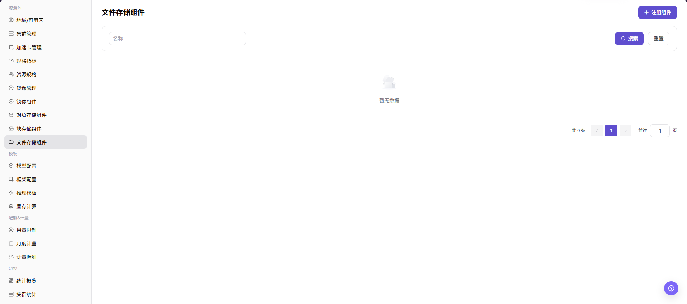
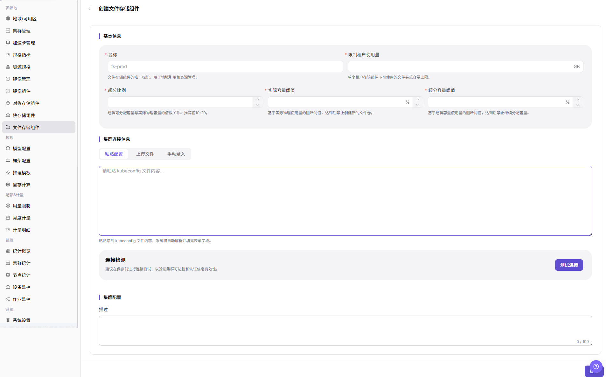

# 文件存储组件

::: info 文档信息
版本：v1.0
更新日期：2026-07-08
:::

## 功能概述

`文件存储组件` 用于接入共享目录和文件卷能力，常见实现包括 NFS 或平台支持的兼容文件存储。文件存储适合多个作业、多个节点或多个实例读写同一目录，例如共享数据集、模型仓库、代码目录和输出结果。

| 项目 | 内容 |
| --- | --- |
| 适用角色 | 运营方 |
| 导航路径 | AI Infra > On-Prem > 资源池管理 > 文件存储组件 |
| 页面路由 | /powerone/resourcepool/file |
| 管理对象 | NFS 服务、服务地址、共享路径、访问策略、容量、挂载路径、关联地域或集群 |
| 典型用途 | 创建文件存储组件，提供共享目录挂载、模型仓库、本地 Git 仓库或数据集目录 |

#### 新手理解

文件存储组件像平台里的共享文件柜，决定哪些集群能挂载共享目录。运营方先把 NFS 或兼容共享存储接入平台，用户侧实例和作业才能用同一目录读取数据、模型和输出文件。

#### 术语速查

| 术语 | 说明 |
| --- | --- |
| NFS | 网络文件系统，用于通过网络共享目录。 |
| 共享路径 | 文件存储服务端导出的目录路径。 |
| 挂载路径 | 容器或节点内挂载后的路径。 |
| kubeconfig | 用于连接并验证目标 Kubernetes 集群的配置文件内容。 |
| 租户隔离 | 避免不同租户误读写同一目录的权限边界。 |

## 前提条件

1. NFS 或等效文件存储服务已部署完成。
2. 共享路径已创建，访问权限、目录属主和网络策略已确认。
3. 目标集群节点可以访问文件存储服务地址和导出目录。
4. 已规划租户目录、读写策略、容量、超分比例和备份策略。
5. 如页面需要 `kubeconfig`，已准备脱敏后的验证材料；学习或截图时不要粘贴真实集群凭据。

## 页面说明

页面展示已接入的文件存储组件、状态、服务地址、共享路径、容量和关联地域或集群。

## 主要操作

### 创建文件存储组件

#### 操作前确认

1. 文件存储服务地址可从目标集群节点访问。
2. 共享路径已导出，权限符合读写策略。
3. 挂载路径不会与容器系统目录或应用目录冲突。
4. 已确认租户隔离方式、目录命名规则、容量上限和超分策略。

#### 操作步骤

1. 进入 `AI Infra > On-Prem > 资源池管理 > 文件存储组件`。
2. 点击 `创建文件存储组件`、`新增`、`注册` 或页面真实创建入口。
3. 按页面字段填写 `名称`、`限制租户使用量`、`超分比例`、`实际容量阈值` 和 `超分容量阈值`。
4. 在 `集群连接信息` 区域通过 `粘贴配置`、`上传文件` 或 `手动录入` 提供连接配置，并确认配置内容已脱敏。
5. 如页面提供 `测试连接`，先验证目标集群节点到文件存储服务的连通性。
6. 在 `集群配置` 区域填写 `描述`，并根据实际页面继续核对服务地址、共享路径、挂载路径、读写权限、绑定地域或绑定集群。
7. 点击最终 `保存`、`提交` 或 `确定` 前，再次核对服务地址、共享路径、权限范围和容量影响。
8. 如仅学习或验证页面，只查看字段和弹窗，不提交真实文件存储组件配置。

下图展示创建文件存储组件页面，用于填写基础策略、集群连接信息和集群配置。

## 参数说明

| 字段名称 | 是否必填 | 字段类型 | 说明 |
| --- | --- | --- | --- |
| 组件名称 | 必填 | 文本 | 文件存储组件展示名称或唯一标识，页面可能显示为 `名称`。 |
| 存储类型 | 条件必填 | 枚举 | 文件存储实现类型，例如 NFS 或页面支持的其他类型。 |
| 访问协议 | 条件必填 | 枚举 | 文件存储访问协议，例如 NFS。 |
| 服务地址 | 条件必填 | 文本 | 文件存储服务地址或访问入口，文档中不要写真实内网地址。 |
| 共享路径 | 条件必填 | 文本 | 服务端导出的共享目录路径，文档中只使用占位符。 |
| 挂载路径 | 条件必填 | 文本 | 作业、IDE 或模型服务挂载后的容器路径。 |
| 访问策略 | 条件必填 | 枚举 | 控制目录读写范围、可见范围或访问方式。 |
| 读写权限 | 条件必填 | 枚举 | 控制目录只读或读写权限。 |
| 限制租户使用量 | 条件必填 | 数值 | 单个租户可使用的文件卷总容量上限。 |
| 超分比例 | 条件必填 | 数值 | 逻辑可分配容量与实际物理容量的倍数关系。 |
| 实际容量阈值 | 条件必填 | 数值 | 基于实际物理使用量的阻断阈值。 |
| 超分容量阈值 | 条件必填 | 数值 | 基于逻辑容量使用量的阻断阈值。 |
| 绑定地域 | 条件必填 | 单选/多选 | 文件存储组件可被引用的地域范围。 |
| 绑定集群 | 条件必填 | 单选/多选 | 允许挂载共享目录的集群范围。 |
| 容量信息 | 条件必填 | 数值 | 文件存储总容量、可用容量或租户配额。 |
| 租户隔离 | 条件必填 | 配置项 | 控制不同租户目录、权限和访问边界。 |
| 状态 | 系统生成 | 枚举 | 组件创建、连接测试和挂载能力状态。 |
| 操作 | 可选 | 按钮/菜单 | 创建、编辑、测试连接、保存、提交、确定或删除等操作入口。 |

## 踩坑提示

- 创建文件存储组件可能影响作业、IDE、模型仓库或数据集目录的挂载和读写。
- 错误的服务地址、共享路径、导出权限、UID/GID 或读写策略可能导致挂载失败、无法写入或跨租户误访问。
- 容量阈值和超分比例配置不当，可能导致文件卷提前阻断创建，或容量展示与实际资源不一致。
- NFS 服务地址和挂载路径要从目标节点验证，不要只在平台管理侧验证。
- `保存 / Save`、`提交 / Submit`、`确定 / OK` 属于高风险最终动作。
- 不写真实 NFS 地址、内网路径、账号、密钥、Token、kubeconfig、集群 ID、资源池 ID、租户目录或内部测试参数。

## 结果校验

| 检查项 | 成功表现 | 异常时处理 |
| --- | --- | --- |
| 页面可进入 | 可以进入 `文件存储组件` 页面。 | 检查账号权限、菜单配置和页面路由。 |
| 组件列表正常加载 | 列表展示已接入的文件存储组件及状态。 | 检查依赖服务、筛选条件和接口返回。 |
| 创建入口可见 | 页面显示 `创建文件存储组件`、`新增`、`注册` 或真实创建入口。 | 检查运营方权限、License 和页面配置。 |
| 创建页面可打开 | 可以进入创建文件存储组件页面，基础策略和集群连接信息正常展示。 | 检查前端路由、表单配置和浏览器控制台报错。 |
| 必填字段校验正常 | 未填写必填字段时，页面显示校验提示。 | 按页面提示补齐名称、容量、连接配置或其他必填项。 |
| 测试连接可执行 | 如页面提供 `测试连接`，执行后返回明确结果。 | 检查网络连通性、kubeconfig、服务地址和访问权限。 |
| 高风险动作未误触 | 学习或截图时未点击最终保存、提交或确定。 | 若误触真实配置，立即按变更流程核对影响并回滚。 |
| 真实提交后状态正确 | 如执行真实创建，新组件出现在列表中且状态符合预期。 | 回到配置页面核对连接参数、绑定范围、容量阈值和后台日志。 |

## 常见问题

#### 文件存储挂载失败

**问题现象：**

作业启动时无法挂载共享目录，或挂载后目录不可见。

**可能原因：**

- 文件存储服务地址或共享路径填写错误。
- 目标节点到文件存储服务网络不可达。
- NFS 导出权限、目录属主或访问策略不正确。

**处理方式：**

1. 检查服务地址、共享路径和网络连通性。
2. 在目标节点验证文件存储挂载。
3. 调整导出权限、目录属主和读写策略。

#### 挂载后无法写入

**问题现象：**

容器内能看到目录，但写文件失败。

**可能原因：**

- 目录被配置为只读。
- 服务端权限或 UID/GID 不匹配。
- 租户目录隔离策略与实际路径不一致。

**处理方式：**

1. 确认访问策略是否需要读写。
2. 检查服务端目录属主、权限和导出配置。
3. 核对租户子目录规则和容器运行用户。

## 后续操作

1. 在地域或集群存储配置中引用文件存储组件。
2. 使用测试作业验证读写、并发和容量限制。
3. 将共享目录纳入备份、清理和权限审计。

## 注意事项

- 不要把共享目录配置成过大的公共读写范围。
- 删除或调整共享路径前，先确认没有运行中作业、IDE、模型仓库或数据集目录依赖。
- 文档、截图和示例中不要记录真实 NFS 地址、内网路径、kubeconfig、账号、密钥、Token、集群 ID、资源池 ID、租户目录或内部测试参数。
