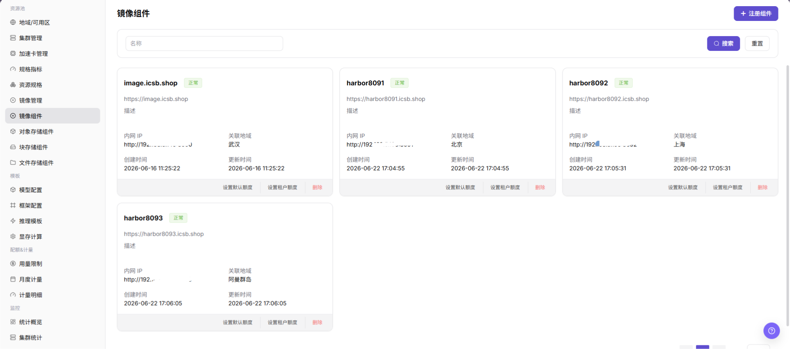
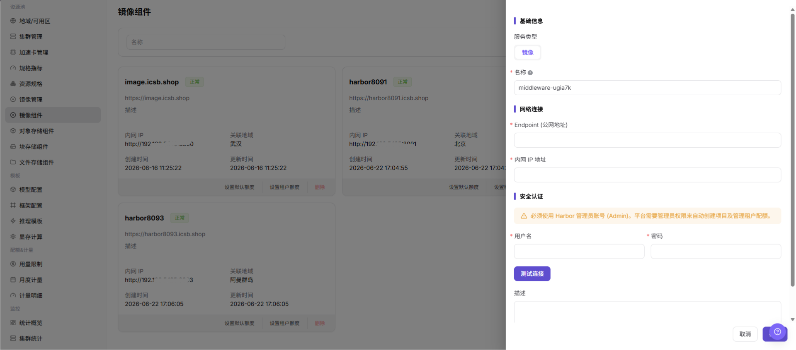

# 镜像组件

::: info 文档信息
版本：v1.0
更新日期：2026-07-08
:::

## 功能概述

`镜像组件` 用于接入 Harbor、Docker Registry 或兼容镜像仓库，为地域、集群、作业、在线 IDE 和模型实例提供镜像拉取能力。没有可用镜像组件时，后续镜像同步、镜像上传、作业启动和模型服务部署通常会受影响。

| 项目 | 内容 |
| --- | --- |
| 适用角色 | 运营方 |
| 导航路径 | AI基础设施 > On-Prem > 资源池 > 镜像组件 |
| 页面路由 | `/powerone/resourcepool/images` |
| 管理对象 | 服务类型、镜像、名称、Endpoint（公网地址）、内网 IP 地址、用户名、密码、描述和操作 |
| 典型途径 | 接入 Harbor/Registry，支撑公共镜像、自定义镜像、作业镜像拉取和用户侧镜像项目同步 |

#### 新手理解

镜像组件像平台里的镜像仓库接入卡，负责告诉平台去哪里拉取运行镜像、用什么凭据认证、哪些地域或集群可以使用。镜像组件配置不正确时，用户侧模型实例、在线 IDE、运行实例和作业通常会卡在镜像拉取阶段。

#### 术语速查

| 术语 | 说明 |
| --- | --- |
| Harbor | 常见企业级容器镜像仓库。 |
| Registry | 镜像仓库服务，用于存储和分发容器镜像。 |
| Endpoint | 平台或集群访问镜像仓库的服务地址。 |
| Robot 凭据 | 镜像仓库自动化账号和密码，属于敏感凭据。 |
| Image Pull Secret | Kubernetes 拉取私有镜像时使用的凭据。 |
| 项目同步范围 | 平台从镜像仓库同步项目、命名空间或镜像列表的范围。 |

## 前提条件

1. 镜像仓库已部署完成，并能从平台侧和目标集群访问。
2. 已准备仓库地址、Endpoint、认证方式、访问凭据和证书策略。
3. 目标集群能解析并访问镜像仓库地址。
4. 已确认关联地域、绑定集群、公共镜像、自定义镜像和租户项目权限边界。
5. 学习或截图场景只查看字段和表单，不提交真实镜像组件配置。

## 页面说明

页面展示已接入的镜像组件、状态、访问地址、项目数量、同步状态和关联地域。

下图展示镜像组件列表，可查看组件状态、Endpoint、同步状态和操作入口。

## 主要操作

### 注册镜像组件

#### 适用场景

当需要接入新的 Harbor、Docker Registry 或兼容镜像仓库，并让指定地域、集群或用户侧镜像服务使用该仓库时，注册镜像组件。

#### 操作步骤

1. 进入 `AI Infra > On-Prem > 资源池管理 > 镜像组件`。
2. 点击 `注册组件`。
3. 按页面字段填写 `服务类型`、`镜像`、`名称`、`Endpoint (公网地址)`、`内网 IP 地址`、`用户名`、`密码` 和 `描述`。
4. 如页面提供 `测试连接`，先执行只读连通性检查并确认返回结果。
5. 提交前确认仓库地址可从平台侧和目标集群访问，Robot 凭据或访问账号具备最小必要权限。
6. 点击最终 `保存`、`提交` 或 `确定` 前，再次核对仓库地址、凭据来源、证书策略和地域绑定范围。
7. 如仅学习或验证页面，只查看字段和表单，不提交真实镜像组件配置。

下图展示注册镜像组件表单，用于填写镜像服务连接信息和同步配置。

## 参数说明

| 参数 | 是否必填 | 说明 | 配置建议 |
| --- | --- | --- | --- |
| 服务类型 | 必填 | 当前组件所属服务类型。 | 镜像组件页面通常显示为 `镜像`。 |
| 镜像 | 必填 | 注册镜像组件时的服务类型取值。 | 与页面实际选项保持一致。 |
| 名称 | 必填 | 镜像组件展示名称。 | 使用能体现仓库用途、地域或环境的名称。 |
| Endpoint (公网地址) | 必填 | 平台或用户侧访问镜像仓库的公网入口。 | 文档只使用占位说明，不写真实地址。 |
| 内网 IP 地址 | 条件必填 | 集群或平台内网访问镜像仓库的地址。 | 与实际网络、DNS 和容器运行时配置一致。 |
| 用户名 | 条件必填 | 镜像仓库访问账号。 | 只在系统表单中填写，不写入文档、截图或工单。 |
| 密码 | 条件必填 | 镜像仓库访问密码。 | 属于敏感凭据，不写入文档、截图或工单。 |
| 描述 | 否 | 组件用途、边界或维护说明。 | 只记录非敏感说明。 |
| 操作 | 系统生成 | 注册组件、测试连接、取消、确定、编辑、删除等入口。 | `确定`、`删除` 属于高风险动作。 |

## 踩坑提示

- 注册镜像组件会影响地域、集群、作业、在线 IDE、模型实例的镜像拉取能力。
- 仓库地址、证书链、Robot 凭据或 Image Pull Secret 配置错误，可能导致 `ImagePullBackOff`。
- 镜像组件绑定错误地域，可能导致用户侧看不到镜像项目或作业无法拉取镜像。
- `保存 / Save`、`提交 / Submit`、`确定 / OK` 属于高风险最终动作。
- 不写真实仓库地址、Robot 密码、Image Pull Secret、Token、AK/SK、内网地址、集群 ID、资源池 ID 或内部测试参数。

## 结果校验

| 检查项 | 成功表现 | 异常时处理 |
| --- | --- | --- |
| 页面可进入 | 能进入 `AI Infra > On-Prem > 资源池管理 > 镜像组件`。 | 检查菜单配置和账号权限。 |
| 组件列表正常加载 | 组件名称、状态、访问地址、项目数量、同步状态和关联地域正常显示。 | 刷新页面并检查服务状态或浏览器控制台错误。 |
| 注册入口可见 | 页面显示 `注册组件` 入口。 | 检查运营方权限、License 和页面配置。 |
| 注册表单可打开 | 点击入口后可查看服务类型、名称、Endpoint (公网地址)、内网 IP 地址、用户名和密码字段。 | 检查路由、权限和前端错误。 |
| 必填字段校验正常 | 未填写名称、Endpoint、用户名或密码时出现校验提示。 | 按页面提示补齐字段，不绕过校验。 |
| 仅学习时未提交 | 未触发真实保存、提交或确定动作。 | 如误提交，立即核对组件列表和绑定范围。 |
| 真实提交后状态可追踪 | 新组件出现在列表中，状态和同步结果可见。 | 核对仓库连通性、凭据、证书和同步日志。 |
| 下游拉取可验证 | 测试作业、在线 IDE 或模型实例可正常拉取镜像。 | 检查 Image Pull Secret、地域绑定、DNS、网络和证书信任。 |

## 常见问题

#### 作业拉取镜像失败

**问题现象：**

实例事件或日志中出现镜像拉取失败、认证失败、镜像不存在或 `ImagePullBackOff`。

**可能原因：**

- 镜像地址、项目名或标签填写错误。
- Robot 凭据、Image Pull Secret 或仓库权限配置错误。
- 目标集群无法访问镜像仓库 Endpoint。
- 私有证书未被集群信任。
- 镜像组件未绑定到作业所在地域或集群。

**处理方式：**

1. 检查完整镜像地址、项目名和标签。
2. 核对镜像组件认证信息、Robot 凭据和用户侧项目权限。
3. 在目标节点验证仓库网络连通性和 DNS 解析。
4. 检查证书信任和容器运行时配置。
5. 核对地域、集群和镜像组件绑定关系。

#### 用户侧看不到镜像项目

**问题现象：**

普通用户进入镜像服务后，看不到自定义项目或公共镜像。

**可能原因：**

- 镜像组件没有绑定到用户选择的地域。
- 项目同步范围没有覆盖目标项目。
- 用户没有镜像服务权限。
- 镜像同步尚未完成或同步失败。

**处理方式：**

1. 检查地域与镜像组件绑定关系。
2. 核对项目同步范围、租户和账号权限。
3. 执行镜像同步或刷新页面。
4. 查看同步状态、更新时间和错误提示。

## 后续操作

1. 进入 [地域/可用区](../regions-zones/) 绑定或核对镜像组件。
2. 指导用户在 [镜像服务](../../../user/extensions/images/) 中创建项目并推送镜像。
3. 进入镜像管理或用户侧镜像服务页面确认项目、镜像和标签可见。
4. 使用测试作业、在线 IDE 或模型实例验证镜像拉取和启动。

## 注意事项

- 注册镜像组件会影响地域、集群、作业、在线 IDE、模型实例的镜像拉取能力。
- Robot 凭据、仓库密码、Image Pull Secret、Token 和证书材料都属于敏感信息。
- 仓库地址、证书链、Robot 凭据或 Image Pull Secret 配置错误，可能导致 `ImagePullBackOff`。
- 镜像组件绑定错误地域，可能导致用户侧看不到镜像项目或作业无法拉取镜像。
- 不建议在生产模板中长期使用 `latest` 标签，应使用明确版本标签。
- `保存 / Save`、`提交 / Submit`、`确定 / OK` 属于高风险最终动作，学习或截图时不要触发。
- 不写真实仓库地址、Robot 密码、Image Pull Secret、Token、AK/SK、内网地址、集群 ID、资源池 ID 或内部测试参数。
