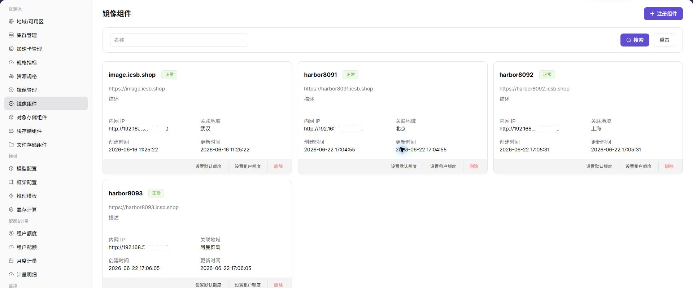
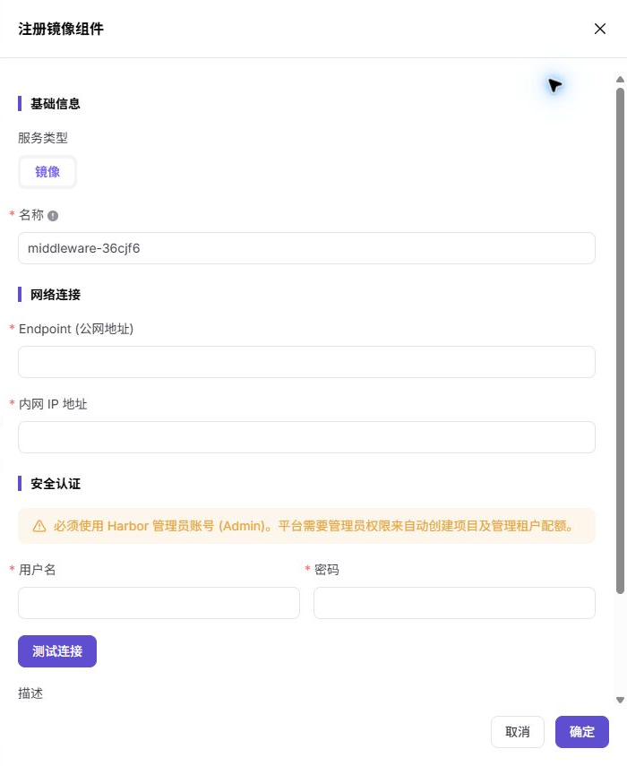

# 镜像组件

## 功能概述

`镜像组件` 用于接入 Harbor、Docker Registry 或兼容镜像仓库，为地域、集群和作业提供镜像拉取能力。没有可用镜像组件时，模型实例、在线 IDE 和运行实例通常无法拉取运行环境。

| 项目 | 内容 |
| --- | --- |
| 适用角色 | 运营方 |
| 导航路径 | 资源池 > 镜像组件 |
| 页面路由 | `/powerone/resourcepool/image-service` |
| 管理对象 | 镜像仓库、Endpoint、项目、访问凭据、同步状态和关联地域 |
| 典型用途 | 接入 Harbor/Registry，支撑公共镜像、自定义镜像和作业镜像拉取 |

### 术语速查

| 术语 | 说明 |
| --- | --- |
| Harbor | 常见企业级容器镜像仓库。 |
| Registry | 镜像仓库服务，用于存储和分发容器镜像。 |
| Project | Harbor 中的项目或命名空间。 |
| Robot 凭据 | 镜像仓库自动化账号和密码，属于敏感凭据。 |
| Image Pull Secret | Kubernetes 拉取私有镜像时使用的凭据。 |

## 前提条件

1. 镜像仓库已部署完成，并能从平台和目标集群访问。
2. 已准备仓库地址、项目规划、访问凭据和证书策略。
3. 目标集群能解析并访问镜像仓库地址。
4. 已确认公共镜像、自定义镜像和租户项目的权限边界。

## 页面说明

页面展示已接入的镜像组件、状态、访问地址、项目数量、同步状态和关联地域。

## 注册镜像组件

### 操作前确认

1. 仓库 Endpoint 可从平台和目标集群访问。
2. 证书、域名和镜像拉取策略已确认。
3. Robot 凭据或访问账号具备最小必要权限。
4. 目标地域需要绑定该镜像组件。

### 操作步骤

1. 进入 `资源池 > 镜像组件`。
2. 点击注册或新增入口。
3. 填写组件名称、仓库地址、认证信息和关联地域。
4. 如页面提供测试连接或同步功能，先验证可用性。
5. 提交后返回列表检查组件状态。

### 参数说明

| 字段名称 | 是否必填 | 字段类型 | 示例 | 说明 |
| --- | --- | --- | --- | --- |
| 组件名称 | 是 | 文本 | `harbor-prod` | 镜像组件展示名称。 |
| 仓库地址 | 是 | URL | `https://registry.example.com` | 镜像仓库入口，文档中使用占位符。 |
| 认证方式 | 条件必填 | 枚举 | `Robot Account` | 镜像拉取或推送认证方式。 |
| 绑定集群 | 条件必填 | 多选 | `cluster-a` | 可访问该镜像组件的集群。 |
| 同步状态 | 系统生成 | 枚举 | `正常` | 镜像组件同步或探测状态。 |
### 踩坑提示

- 资源池配置会影响作业调度，修改前先确认运行中实例。
- 下拉为空时先检查地域、权限和依赖组件状态。
- 删除或禁用资源前准备替代资源和回退方案。

### 结果校验

1. 组件出现在列表中且状态符合预期。
2. 在地域中可以绑定该镜像组件。
3. 用户侧镜像服务能看到公共镜像或自定义镜像项目。
4. 测试作业能正常拉取镜像。

## 常见问题

### 作业拉取镜像失败

**问题现象：**

实例事件或日志中出现镜像拉取失败、认证失败或镜像不存在。

**可能原因：**

- 镜像地址、项目名或标签填写错误。
- Robot 凭据、Image Pull Secret 或仓库权限配置错误。
- 目标集群无法访问镜像仓库。
- 私有证书未被集群信任。

**处理方式：**

1. 检查镜像完整地址和标签。
2. 核对镜像组件认证信息和用户侧项目权限。
3. 在目标节点验证仓库网络连通性。
4. 检查证书信任和容器运行时配置。

### 用户侧看不到镜像项目

**问题现象：**

普通用户进入镜像服务后，看不到自定义项目或公共镜像。

**可能原因：**

- 镜像组件没有绑定到用户选择的地域。
- 用户没有镜像服务权限。
- 镜像同步尚未完成。

**处理方式：**

1. 检查地域与镜像组件绑定关系。
2. 核对租户和账号权限。
3. 执行镜像同步或刷新页面。

## 后续操作

1. 进入 [地域/可用区](../regions-zones/) 绑定镜像组件。
2. 指导用户在 [镜像服务](../../../user/extensions/images/) 中创建项目并推送镜像。
3. 使用测试作业验证镜像拉取和启动。

## 注意事项

- Robot 凭据、仓库密码和 Image Pull Secret 都属于敏感信息。
- 不建议在生产模板中长期使用 `latest` 标签，应使用明确版本标签。
