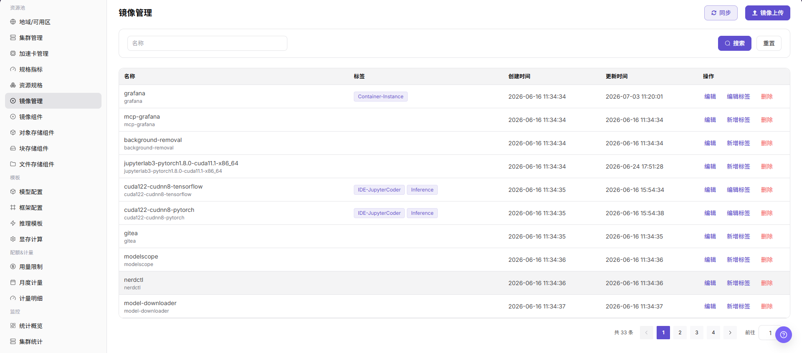
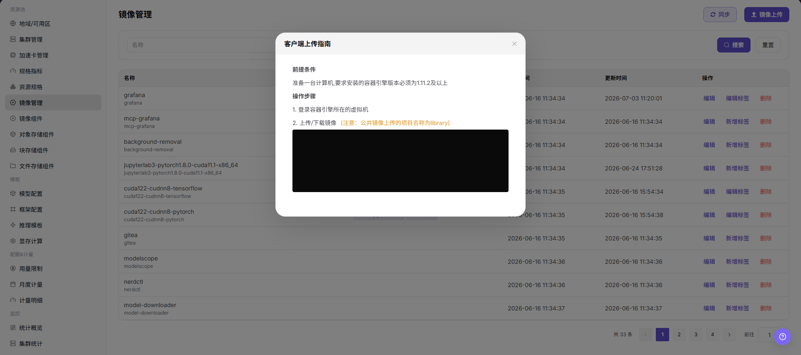

# 镜像管理

::: info 文档信息
版本：v1.0
更新日期：2026-07-08
:::

## 功能概述

`镜像管理` 用于管理镜像仓库中的镜像条目和标签，支撑作业、在线 IDE、推理服务和模板等运行环境选择。运营方可以查看镜像列表、维护标签、同步镜像，并按页面要求将客户端推送后的镜像纳入平台管理。

| 项目 | 内容 |
| --- | --- |
| 适用角色 | 运营方 |
| 导航路径 | AI基础设施 > On-Prem > 资源池 > 镜像管理 |
| 页面路由 | `/powerone/resourcepool/image` |
| 管理对象 | 客户端工具、镜像仓库、项目/命名空间、镜像名称、镜像标签、镜像地址、镜像类型、架构和同步状态 |
| 典型途径 | 同步镜像、维护镜像标签、记录客户端上传镜像、清理不再使用的镜像记录 |

#### 新手理解

镜像管理像平台里的运行环境货架。运营方先确保镜像仓库和镜像组件可用，再通过客户端构建、登录和推送镜像，最后回到平台页面同步或登记镜像信息，让作业、IDE、推理服务或模板可以选择正确版本。

#### 维护流程

1. 接入并验证可用镜像组件。
2. 在客户端准备 Docker、Podman 或页面支持的实际工具。
3. 使用占位格式标记镜像地址，例如 `<registry>/<project>/<image>:<tag>`。
4. 推送镜像后回到平台同步或登记镜像信息。
5. 为镜像维护清晰标签和用途。
6. 清理镜像前确认没有作业、模板或模型版本依赖。

#### 术语速查

| 术语 | 说明 |
| --- | --- |
| 客户端工具 | 本地用于构建、登录和推送镜像的工具，如 Docker、Podman 或页面支持的实际客户端。 |
| 镜像仓库 | 存放镜像的 registry 服务。 |
| 项目/命名空间 | 镜像仓库中的项目、组织或 namespace，用于隔离镜像。 |
| 镜像标签 | 用于描述镜像用途或版本的 tag。 |
| 同步状态 | 平台从镜像服务同步镜像后的可见和可用状态。 |

## 前提条件

1. 已接入镜像组件，镜像管理列表可正常加载。
2. 当前账号具备 `AI Infra > On-Prem > 资源池管理 > 镜像管理` 的查看和管理权限。
3. 本地客户端已准备 Docker、Podman 或页面支持的实际工具。
4. 镜像命名、标签语义、用途、架构和影响范围已规划。
5. 学习或截图场景只查看字段、弹窗和客户端命令格式，不推送真实镜像，不提交真实配置。

## 页面说明

页面以表格展示镜像名称、标签、创建时间、更新时间和操作入口。

下图展示镜像管理列表，可维护镜像标签并执行上传或同步。



## 主要操作

### 客户端上传指南

#### 适用场景

当需要将本地构建或已有的运行镜像推送到镜像仓库，并在平台侧纳入镜像管理范围时，参考客户端上传指南。

#### 操作步骤

1. 进入 `AI基础设施 > On-Prem > 资源池 > 镜像管理`，确认镜像组件已接入且镜像列表可正常加载。
2. 在本地客户端准备镜像构建、登录和推送环境，例如 Docker、Podman 或页面支持的实际客户端工具。
3. 构建或加载本地镜像，并使用占位格式标记镜像地址，例如 `<registry>/<project>/<image>:<tag>`。
4. 登录镜像仓库并推送镜像。学习或文档示例中只使用占位符，不写真实仓库地址、账号或密码。
5. 返回 `镜像管理` 页面，点击 `镜像上传`、`同步` 或页面真实入口，将镜像地址、标签、用途、架构等信息纳入平台管理。
6. 点击最终 `保存`、`提交` 或 `确定` 前，再次核对镜像来源、标签语义、用途和是否会影响已有作业。
7. 如仅学习或验证页面，只查看字段、弹窗和客户端命令格式，不推送真实镜像，不提交真实配置。

客户端命令仅使用占位格式示例：

```bash
docker tag <local-image>:<local-tag> <registry>/<project>/<image>:<tag>
docker login <registry>
docker push <registry>/<project>/<image>:<tag>
```

下图展示镜像上传入口，上传前应确认镜像来源、用途和标签。



## 参数说明

| 字段名称 | 是否必填 | 字段类型 | 示例 | 说明 |
| --- | --- | --- | --- | --- |
| 客户端工具 | 条件必填 | 文本 | `Docker` | 用于构建、登录和推送镜像的本地工具。 使用 Docker、Podman 或页面支持的实际客户端工具。 |
| 镜像仓库 | 必填 | 地址 / 路径 | `registry.example.com` | 镜像所在 registry。 文档示例只使用 `<registry>` 占位符，不写真实仓库地址。 |
| 项目/命名空间 | 必填 | 地址 / 路径 | `example-project` | 镜像仓库中的项目、组织或 namespace。 使用 `<project>` 占位符示例，实际配置按仓库权限填写。 |
| 镜像名称 | 必填 | 地址 / 路径 | `示例名称` | 镜像展示名称或仓库中的 image 名称。 名称应体现框架、用途或运行环境。 |
| 镜像标签 | 必填 | 文本 | `v1.0.0` | 镜像版本标签。 避免在生产场景只使用 `latest`。 |
| 镜像地址 | 必填 | 地址 / 路径 | `registry.example.com/example/vllm:v1.0.0` | 完整镜像地址，例如 `<registry>/<project>/<image>:<tag>`。 提交前核对 registry、project、image 和 tag。 |
| 镜像类型 | 否 | 下拉 / 枚举 | `推理` | 镜像用途类型，如开发、训练或推理。 与后续作业、IDE 或推理模板使用场景一致。 |
| 架构 | 否 | 数值 / 容量 | `Ampere` | 镜像 CPU 架构或硬件架构。 与目标集群节点架构匹配。 |
| 同步状态 | 系统生成 | 状态 | `已同步` | 平台同步镜像后的状态。 推送后回到平台刷新或同步检查。 |
| 操作 | 否 | 操作入口 | `编辑` | 支持镜像上传、同步、编辑标签、查看或删除等操作。 高风险操作前确认影响范围。 |

## 踩坑提示

- 客户端上传可能向真实镜像仓库写入镜像，影响后续作业、IDE、推理服务或模板选择。
- 镜像标签复用或覆盖可能导致已有任务拉取到非预期版本。
- 镜像中不能包含密钥、Token、AK/SK、账号密码、内部配置文件或测试数据。
- `docker login`、`podman login` 等命令不要在文档中写真实账号、密码或仓库地址。
- `保存 / Save`、`提交 / Submit`、`确定 / OK` 属于高风险最终动作。

## 结果校验

| 检查项 | 成功表现 | 异常时处理 |
| --- | --- | --- |
| 页面可进入 | 能进入 `AI Infra > On-Prem > 资源池管理 > 镜像管理`。 | 检查菜单配置和账号权限。 |
| 镜像列表正常加载 | 镜像名称、标签、创建时间、更新时间和操作入口正常显示。 | 刷新页面并检查镜像组件状态。 |
| 客户端命令格式可确认 | 示例命令只包含占位符，不暴露真实仓库或凭据。 | 替换文档中的真实敏感信息。 |
| 上传或同步入口可见 | 页面显示 `镜像上传`、`同步` 或真实入口。 | 检查运营方权限、镜像组件状态和页面配置。 |
| 上传弹窗可打开 | 点击入口后能查看镜像地址、标签、用途、架构等字段。 | 检查路由、权限和前端错误。 |
| 仅学习时未提交 | 未推送真实镜像，也未触发真实保存、提交或确定动作。 | 如误提交，立即核对镜像仓库和平台列表。 |
| 真实提交后记录可追踪 | 镜像出现在列表中，同步状态可见。 | 核对镜像地址、标签、同步状态和筛选条件。 |
| 下游页面可选择 | 作业、在线 IDE、推理服务或模板页面可以选择该镜像。 | 检查镜像类型、标签、架构、同步状态和权限范围。 |

## 配置规则与影响

- **镜像先于作业**：作业可运行前必须能从仓库拉取目标镜像。
- **标签要稳定**：标签用于筛选、推荐和部署复现，不建议随意改变语义。
- **地址要可拉取**：镜像地址、项目/命名空间和标签必须与仓库实际内容一致。
- **权限要最小化**：客户端登录凭据只用于推送或拉取所需范围，不写入文档。
- **删除需谨慎**：删除或下线镜像前确认没有作业、模板、模型版本、在线 IDE 或推理服务依赖。

## 常见问题

#### 页面列表为空

**问题现象：**

进入页面后没有看到镜像记录。

**可能原因：**

- 筛选条件、地域、权限或镜像组件状态与当前页面不匹配。
- 页面数据仍在同步，或镜像仓库中尚未推送可见镜像。
- 镜像已推送到仓库，但平台尚未同步或登记。

**处理方式：**

1. 点击 `重置` 清空筛选条件。
2. 确认右上角地域是否选择正确。
3. 检查镜像组件是否已接入且状态正常。
4. 检查镜像是否已按 `<registry>/<project>/<image>:<tag>` 推送到正确仓库。
5. 点击 `同步` 或按页面流程登记镜像信息。

#### 新增或注册按钮不可见

**问题现象：**

页面只显示列表，无法看到镜像上传、同步、新增、注册或创建入口。

**可能原因：**

- 当前账号不是运营方角色，或缺少镜像管理权限。
- 镜像组件未接入或状态异常。
- License、菜单权限或地域权限不完整。

**处理方式：**

1. 确认当前账号是运营方角色。
2. 检查 License、菜单权限和地域权限是否完整。
3. 确认镜像组件已接入并可用。
4. 刷新页面后再次进入目标导航。
5. 如仍不可见，联系平台管理员核对角色授权。

## 后续操作

1. 进入模型配置、框架配置、作业创建、在线 IDE 或推理服务流程验证镜像可选。
2. 按镜像用途维护标签、架构和描述，便于后续筛选。
3. 定期清理不再使用的镜像记录，清理前确认没有下游依赖。

## 注意事项

- 客户端上传可能向真实镜像仓库写入镜像，影响后续作业、IDE、推理服务或模板选择。
- 镜像标签复用或覆盖可能导致已有任务拉取到非预期版本。
- 镜像中不能包含密钥、Token、AK/SK、账号密码、内部配置文件或测试数据。
- `docker login`、`podman login` 等命令不要在文档中写真实账号、密码或仓库地址。
- `保存 / Save`、`提交 / Submit`、`确定 / OK` 属于高风险最终动作，学习或截图时不要触发。
