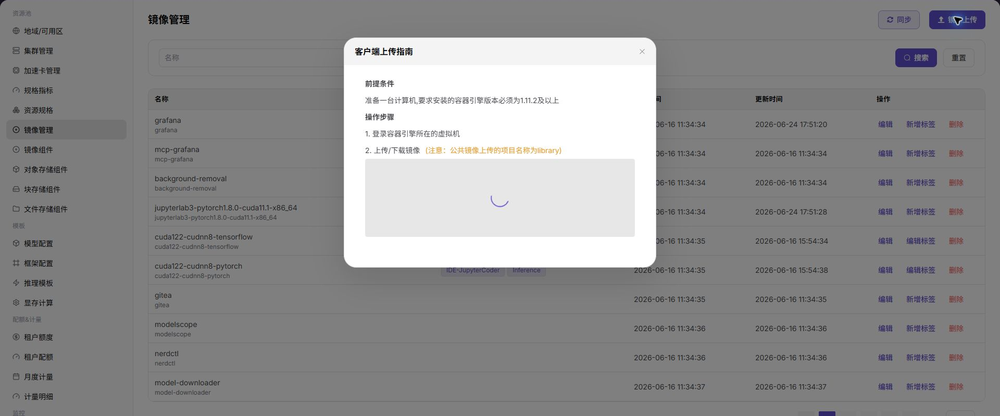

# 镜像管理

## 功能概述

`镜像管理` 用于管理镜像仓库中的镜像条目和标签，支撑作业、IDE、推理服务等运行环境选择。

| 项目 | 内容 |
| --- | --- |
| 适用角色 | 运营方 |
| 导航路径 | 资源池 > 镜像管理 |
| 页面路由 | /powerone/resourcepool/image |
| 管理对象 | 镜像名称、标签、创建时间、更新时间和镜像操作 |
| 典型用途 | 同步镜像、上传镜像、维护镜像标签、清理不再使用的镜像记录 |

### 新手理解

- **镜像** 是作业运行环境的基础，里面包含框架、依赖和启动脚本。
- **标签** 用来区分 IDE、推理、训练等用途。
- **同步** 用于从镜像组件刷新镜像列表。

### 维护流程

1. 先注册可用镜像组件。
2. 同步或上传镜像。
3. 为镜像维护清晰标签。
4. 在模型、框架或作业模板中引用镜像。
5. 清理镜像前确认没有作业依赖。

### 术语速查

| 术语 | 说明 |
| --- | --- |
| 镜像标签 | 用于描述镜像用途或版本的标记。 |
| 同步 | 从镜像服务拉取最新镜像列表。 |
| 镜像上传 | 把新的镜像包或镜像元数据加入平台管理范围。 |

## 前提条件

1. 已接入镜像组件。
2. 当前账号具备镜像管理权限。
3. 镜像命名、标签和用途已规划。

## 页面说明

页面以表格展示镜像名称、标签、创建时间、更新时间和操作入口。

下图展示镜像管理列表，可维护镜像标签并执行上传或同步。

## 上传镜像

### 适用场景

- 新增可供作业使用的运行镜像。

### 操作前确认

1. 确认镜像来源可信。
2. 确认镜像名称和标签符合命名规范。

### 操作步骤

1. 进入 `资源池 > 镜像管理`。
2. 点击 `镜像上传`。
3. 按页面要求填写镜像信息或选择上传文件。
4. 提交前确认不会覆盖正在使用的镜像。

下图展示镜像上传入口，上传前应确认镜像用途和标签。

### 参数说明

| 字段名称 | 是否必填 | 字段类型 | 示例 | 说明 |
| --- | --- | --- | --- | --- |
| 镜像名称 | 是 | 文本 | `pytorch-training` | 镜像展示名称。 |
| 镜像地址 | 是 | 文本 | `registry.example.com/ai/pytorch:2.3` | 镜像仓库地址，示例使用占位符。 |
| 镜像类型 | 否 | 枚举 | `训练` | 开发、训练或推理用途。 |
| 架构 | 否 | 枚举 | `amd64` | 镜像 CPU 架构。 |
| 状态 | 系统生成 | 枚举 | `可用` | 镜像同步和可选状态。 |
### 踩坑提示

- 不要上传来源不明或包含密钥的镜像。

### 结果校验

1. 镜像出现在列表中。
2. 作业或模板创建页可以选择该镜像。

## 配置规则与影响

- **镜像先于作业**：作业可运行前必须能拉取目标镜像。
- **标签要稳定**：标签用于筛选和推荐，不建议随意改变语义。
- **删除需谨慎**：删除镜像前确认没有作业、模板或模型版本依赖。

## 常见问题

### 页面列表为空

**问题现象：**进入页面后没有看到资源记录。

**可能原因：**

- 筛选条件、地域、权限或依赖资源状态与当前页面不匹配。
- 页面数据仍在同步，或对应资源尚未创建。

**处理方式：**

1. 点击 `重置` 清空筛选条件。
2. 确认右上角地域是否选择正确。
3. 检查资源是否已在当前地域接入或创建。
4. 确认当前账号具备该页面的查看权限。

### 新增或注册按钮不可见

**问题现象：**页面只显示列表，无法看到新增、注册或创建入口。

**可能原因：**

- 筛选条件、地域、权限或依赖资源状态与当前页面不匹配。
- 页面数据仍在同步，或对应资源尚未创建。

**处理方式：**

1. 确认当前账号是运营方角色。
2. 检查 License、菜单权限和地域权限是否完整。
3. 刷新页面后再次进入目标导航。
4. 如仍不可见，联系平台管理员核对角色授权。

## 后续操作

1. 进入模型配置、框架配置或作业创建流程验证镜像可选。

## 注意事项

- 镜像名称和标签应体现框架、版本、硬件环境和用途；生产环境避免只使用 `latest`。
- 不要在镜像描述、标签、截图或工单中暴露仓库凭据、robot 密码、Image Pull Secret 或内部仓库地址。
- 删除或下线镜像前，先确认没有模型配置、框架配置、运行实例、在线 IDE 或模板仍依赖该镜像。
- 镜像同步后应抽查用户侧是否可选，避免仓库已有镜像但平台列表未刷新。
